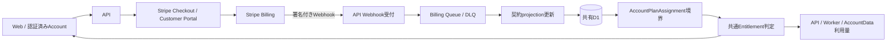
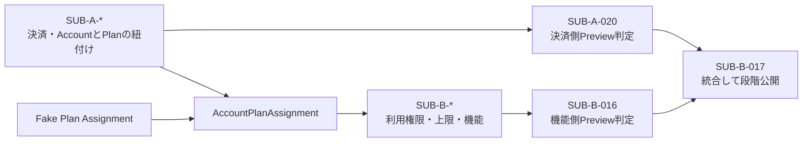
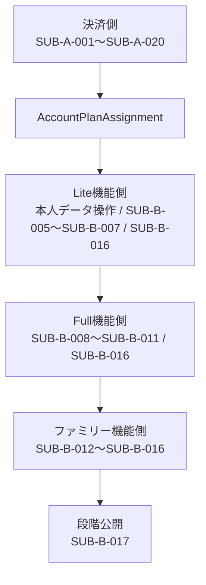

# サブスクリプション実装残タスク

## 1. 目的

この文書は、[サブスクリプション・料金プラン設計](../product/subscription-plan-design.md)を実装し、Free、Lite、Full、ファミリーパックを安全に一般提供するまでの残作業、依存順、各PRの完了条件を管理します。

### 所有する概念

- サブスクリプション実装の残タスクと着手順
- Stripeを利用する初期実装方針
- AccountとPlanを紐づけるブランチと、紐づいたPlanを利用するブランチの接続境界
- 1つのPRとしてレビューできる作業境界と完了条件
- Lite、Full、ファミリーパックそれぞれのリリースゲート

### 所有しない概念

- プラン名、価格、AI利用上限、トライアル、解約後の利用体験
- 日記チャット、関係性を考慮した質問、セルフケアの体験仕様
- Account、個人コンテンツ、複数Account間データの保存先
- 共通のログ、マイグレーション、デプロイ手順
- 法令の解釈、税務判断、会計処理

料金と利用権限は[サブスクリプション・料金プラン設計](../product/subscription-plan-design.md)、関係性を考慮した質問は[日記チャット体験設計](../product/diary-chat-experience.md)、保存先は[Accountデータ分離設計](../architecture/account-data-isolation.md)、ログは[アプリケーション運用ログ方針](operational-logging.md)、本番変更は[本番データベースマイグレーション運用](production-migration-operations.md)を正とします。

## 2. Stripe採用判断

初期の決済基盤にはStripeを採用します。Stripe Billingで月額・年額契約、Stripe Checkoutで支払情報の収集、Stripe Customer Portalで支払方法・請求履歴・プラン変更・解約、Stripe Webhookで非同期の契約状態変更を扱います。

Stripeは請求事実の正本とし、me-builder側は認証済みAccountへ紐づく契約projection、利用権限、AI利用量、ファミリー席を正本として持ちます。Stripe Customer ID、Subscription ID、Price IDなど運営に必要な識別子は共有D1へ保存し、カード番号や決済フォームの入力内容を保存しません。

初期提供ではStripe Entitlementsを利用可否判定の正本にしません。プラン別の数値上限、ファミリー参加者への権限付与、相性関係への利用権限割り当ては単純なfeature flagではないため、Stripeの契約状態をアプリ内の共通Entitlementへ変換します。すべての画面、API、Workerはこの共通判定を利用します。

StripeはWebhookの重複配信と順序逆転を前提としているため、必要なStripe objectを再取得して現在状態へ収束させます。Webhookは署名検証後にQueueへ渡して速やかに`2xx`を返し、契約projectionの更新を同期処理へ含めません。

採用判断は2026-08-15時点の次の公式情報を前提とします。外部サービスの料金、制約、API versionは変更されるため、`SUB-A-001`、`SUB-A-004`、`SUB-A-020`で再確認します。

- [Stripeの日本向け料金](https://stripe.com/jp/pricing)
- [サブスクリプションWebhook](https://docs.stripe.com/billing/subscriptions/webhooks)
- [Webhookのセキュリティと重複・順序の扱い](https://docs.stripe.com/webhooks)
- [Customer Portal](https://docs.stripe.com/customer-management)
- [Stripe Entitlements](https://docs.stripe.com/billing/entitlements)
- [消費者庁の通信販売における最終確認画面](https://www.caa.go.jp/policies/policy/consumer_transaction/amendment/2021/notice02/index.html)

## 3. 疎結合にする2つの枝

タスク番号は次の2系列に分けます。

| 系列 | 完了させる責務 | 扱ってよい情報 | 扱わない情報 |
| --- | --- | --- | --- |
| `SUB-A-*` | Stripeでの購入から、認証済みAccountへ現在Planを紐づけるまで | Stripe Customer / Subscription / Price、請求状態、Accountとの対応 | AI利用量、機能固有データ、プロンプト、Plan別UIの内部実装 |
| `SUB-B-*` | 紐づいたPlanを利用権限へ変換し、上限と機能へ適用する | provider非依存のPlan、適用期間、権限付与元、Account所有データ | Stripe Customer / Subscription / Price、カード・請求情報、Webhook payload |

両系列の接続点を`AccountPlanAssignment`と呼びます。これは具体的な型名を確定するものではなく、`SUB-A-002`で定義するprovider非依存の読み取り境界です。A系列はStripe状態をこの境界へ変換し、B系列はこの境界だけを読みます。

[本人入力データの訂正・削除](personal-data-api.md)と[本人データのエクスポート](personal-data-export.md)はPlanに依存しない本人データ機能です。Planに関係なく常に利用可能であることをB系列の認可testへ含めます。

- B系列はfakeの`AccountPlanAssignment`を使って、Stripe実装を待たずに開発・テストできる
- A系列はB系列の機能を呼ばず、Planの紐付けが正しいところまでを完了条件にする
- B系列はStripe ID、Stripe status、Webhook event typeを条件分岐へ利用しない
- A系列とB系列の統合は`SUB-A-020`と`SUB-B-016`を個別に確認した後、`SUB-B-017`で行う
- 境界を変更するPRはA・B双方のcontract testを更新するが、機能実装を同じPRへ含めない

## 4. PRの分割ルール

- 原則として、以下の1番号を1 PRとして実施する
- schema変更と、それを利用する大きな機能を同じPRへ詰め込まない
- API、Web、Workerをまたぐ項目は、利用者が確認できる小さな縦切りの場合だけ同じPRにする
- 外部I/Oはadapterを境界にし、Stripeへ接続しない自動テストを同じPRへ含める
- 後続タスクが前提にする契約や状態遷移を変える場合は、先に対応するSSoTを更新する

## 5. リリースゲート

決済側は`SUB-A-001`〜`SUB-A-020`で単独検証します。Liteは本人データの訂正・削除・エクスポート、`SUB-B-005`〜`SUB-B-007`、`SUB-B-016`、Fullはさらに`SUB-B-008`〜`SUB-B-011`、ファミリーパックはさらに`SUB-B-012`〜`SUB-B-015`を完了してから、`SUB-B-017`で決済側と統合します。未完了のPlanは購入対象へ出しません。

## 6. 並行して着手できる前提タスク

### SUB-A-001 商取引・税務・返金条件を確定する

依存: なし

- 税込表示、課税区分、適格請求書、請求時期、日割り、返金、支払失敗時の猶予を専門家と確認する
- 決済手段登録あり・なしのどちらで14日間トライアルを開始するか決める
- 最終確認画面、特定商取引法に基づく表示、規約、プライバシーポリシーの変更点を確定する

完了条件は、Checkoutと契約状態を実装するための商取引上の未決事項がなく、料金プランのSSoTへ反映されていることです。

### SUB-A-002 課金・利用権限の実装設計を追加する

依存: `SUB-A-001`

- Stripeと共有D1の正本境界、CustomerとAccount、ファミリー支払者の対応を設計する
- Stripeの契約状態からprovider非依存の`AccountPlanAssignment`へ変換する状態遷移と読み取り境界を定義する
- Webhook、Queue、共有D1、APIをまたぐ障害時の収束方法を定義する
- fake providerとcontract testを用意し、B系列がStripe実装を待たずに利用できるようにする

完了条件は、A系列がStripe状態を紐付け、B系列がStripeへ依存せず現在Planを読める境界と課金実装のSSoTがあることです。

### SUB-A-003 有料契約を復旧できる本人確認を設計する

依存: `SUB-A-001`

- LINE Accountを失った場合の本人確認、Identity追加、既存Accountへの再接続を設計する
- StripeのメールアドレスやCustomer IDだけをAccount所有の証明にしない
- 不正な乗っ取り、重複Account、復旧不能時の解約・問い合わせ経路を定義する

完了条件は、認可境界、監査対象、失敗時の安全な結果がSSoTで決まっていることです。

## 7. ブランチA: Stripe課金基盤

### SUB-A-004 Stripe sandboxと商品catalogを再現可能にする

依存: `SUB-A-001`, `SUB-A-002`

- Local・Preview用sandboxとProductionを分離し、月額・年額Product / Priceを`lookup_key`から冪等に作成する
- Checkout、Customer Portal、必要なWebhook eventだけを環境ごとに設定する
- Secretを安全に配布し、Stripe SDKとAPI versionを固定して更新手順を記載する

完了条件は、秘密値を出力せず、空のsandboxへ同じcatalogとWebhook設定を再現できることです。

### SUB-A-005 Stripe adapterとエラー契約を追加する

依存: `SUB-A-002`

- Cloudflare Workers用Stripe clientと、Checkout、Portal、Customer、Subscriptionの最小interfaceを追加する
- timeout、network retry、idempotency key、Stripe固有エラーの原因分類を共通化する
- Customer ID、支払情報、秘密値をログへ出さず、fake adapterの単体テストを追加する

完了条件は、呼び出し側がStripe SDKのobjectや例外へ直接依存しないことです。

### SUB-A-006 共有D1へ課金projectionを追加する

依存: `SUB-A-002`

- AccountとCustomerの一意な対応、契約projection、Plan、有効期限、解約予約、最終同期情報を追加する
- 処理済みeventと古いeventによる巻き戻しを防ぐ比較情報を保存する
- 個人コンテンツを保存せず、forward-only migrationと別Accountのnegative testを追加する

完了条件は、主要なStripe契約状態を共有D1へ安全にprojectionできることです。

### SUB-A-007 Billing QueueとDLQを環境へ追加する

依存: `SUB-A-002`

- Billing Queue / DLQ、API producer、Worker consumerのbindingを追加する
- Local、Preview、Productionの作成・削除・デプロイ順へ組み込む
- retry、DLQ、message version、後方互換を既存Queue規則に合わせる

完了条件は、各環境でeventをconsumerへ配送でき、最終失敗をDLQで識別できることです。

### SUB-A-008 Stripe Webhook受付を実装する

依存: `SUB-A-005`, `SUB-A-007`

- raw bodyと`Stripe-Signature`で署名を検証し、許可したeventだけをQueueへ渡す
- 不正署名、壊れたpayload、未対応eventを安全に扱う
- 複雑な処理を待たず`2xx`を返し、payload全文をログへ出さない

完了条件は、成功・改ざん・再送をfixtureでテストし、同期的にprojectionを更新していないことです。

### SUB-A-009 Webhookから契約projectionを収束させる

依存: `SUB-A-005`〜`SUB-A-008`

- event IDと対象object / event typeで重複を防ぐ
- 到着順へ依存せず、Stripe APIから現在状態を取得してprojectionを更新する
- 作成、更新、支払成功・失敗、trial終了、解約を変換し、再配送を冪等に扱う

完了条件は、順序逆転、重複、event欠落を含むテストで同じ最終状態へ収束することです。

### SUB-A-010 Stripeと共有D1の再照合を実装する

依存: `SUB-A-009`

- Customerを指定して現在の契約を再取得する管理用actionを追加する
- Webhook欠落、DLQ、手動変更による差分をdry-runで検出し、明示操作で修復する
- 再照合から課金作成・返金・解約を勝手に実行せず、結果を監査できるようにする

完了条件は、意図的に古くしたPreview projectionを修復し、再実行で差分0になることです。

## 8. ブランチA: 購入・契約管理

### SUB-A-011 Checkout Session作成APIを実装する

依存: `SUB-A-004`〜`SUB-A-006`

- 認証済みAccountと選択したPlan / 請求間隔からSessionを作成する
- Customerを一意に再利用し、クライアント指定のCustomer IDやPrice IDを信用しない
- 二重送信、既存契約、購入不可状態、不正なreturn URLを拒否する

完了条件は、sandboxでSessionを作成し、別Account・不正Plan・二重送信を防げることです。

### SUB-A-012 プラン選択と購入復帰画面を実装する

依存: `SUB-A-011`

- 提供中のPlanだけを価格、トライアル、更新、解約条件とともに表示する
- 申込み前に継続契約と支払総額・時期・方法・解約方法を確認できるようにする
- Checkout復帰時はqueryだけで成功にせず、projectionの反映待ちを扱う

完了条件は、購入開始から契約反映までをWeb E2Eで確認できることです。

### SUB-A-013 Customer Portal導線を実装する

依存: `SUB-A-004`〜`SUB-A-006`

- 本人だけが自分のCustomerに対する短命なPortal Sessionを作れるAPIを追加する
- 支払方法、請求履歴、Plan変更、期間末解約を決定事項どおり設定する
- Stripe CustomerとAccountの対応がない利用者にはPortalを開かせず、反映待ちを扱う

完了条件は、別AccountのCustomerへ到達できず、本人が支払方法更新と解約予約を完了できることです。

### SUB-A-014 14日間トライアルを1回だけ開始できるようにする

依存: `SUB-A-001`, `SUB-A-006`, `SUB-A-009`, `SUB-A-011`

- Accountごとの使用済み状態をCustomer再作成やPlan付与元の変更で回避できない形で保存する
- 開始前に終了日時、終了後の価格、自動更新の有無を表示する
- 終了予告、終了、課金成功・失敗をWebhookから反映し、日時境界をテストする

完了条件は、使用済み・終了直前・終了後・Plan付与元変更で2回目を防げることです。

### SUB-A-015 Plan変更と請求失敗の状態遷移を完成させる

依存: `SUB-A-009`, `SUB-A-013`, `SUB-A-014`

- upgrade、downgrade予約、月額・年額変更、解約取消、再開を扱う
- `past_due`、`unpaid`、`paused`、`canceled`の利用権限と猶予を実装する
- 返金・chargebackで本人データを削除せず、同じ通知を重複送信しない

完了条件は、主要な契約状態をsandboxとtable-driven testで再現できることです。

### SUB-A-016 有料契約のAccount復旧フローを実装する

依存: `SUB-A-003`, `SUB-A-006`

- 設計済みの本人確認とIdentity再接続をAPIとWebへ実装する
- 復旧後も同じAccount IDと`AccountPlanAssignment`へ接続する
- 他Accountへの誤接続と再送による二重統合をnegative testで防ぐ

完了条件は、LINE Account喪失を想定したE2Eで、有料契約を復旧または解約できることです。

## 9. ブランチB: 利用権限と上限

### SUB-B-005 利用権限を機能と画面へ接続する

依存: 共通Entitlement判定、AI利用量ledger

- AI返信、まとめ生成、検索期間などを共通Entitlementで制御し、API / Workerを最終境界にする
- 契約状態、更新日、Plan、上限、残量を本人へ表示する
- downgrade後の閲覧を維持し、削除、エクスポート、安全案内、共有停止を制限しない

完了条件は、全PlanをE2Eで確認し、URL直打ちでも上位機能を実行できないことです。

## 10. ブランチB: Lite・Fullの継続価値

### SUB-B-006 Liteの週次振り返りを実装する

依存: `SUB-B-005`

- 確認済みの診断と日記から週1回の振り返りを生成・保存・表示する
- 同じ週の重複生成、AI失敗、再試行、通知停止を扱う
- Freeでは既存結果を閲覧できるが、新しい生成を開始できないようにする

完了条件は、Liteの主な継続価値を本番相当経路で利用できることです。

### SUB-B-007 Free・Liteの関係性を考慮した質問を実装する

依存: `SUB-B-005`

- 相手とRelationship Categoryを確認し、1 turnに1問まで質問する
- Freeは現在の発言、Liteは現在Sessionと本人の関連診断だけを参照する
- 第三者の非共有情報をContext Packageへ含めないnegative testを追加する

完了条件は、日記チャット体験設計の質問順、安全性、Plan差を会話testで再現できることです。

### SUB-B-008 Fullの確認済み過去情報を関係性質問へ接続する

依存: `SUB-B-007`

- 確認済みRelationship Style、出来事、Goalを現在の話題に限定して検索する
- Access Labelの再認可を行い、同名別人、古い情報、削除済み情報を除外する
- 利用した本人側の根拠を確認できるようにする

完了条件は、Fullだけが確認済み過去情報を利用し、第三者側の情報を取得しないことです。

### SUB-B-009 Fullの月ごとの変化を実装する

依存: `SUB-B-005`, `SUB-B-006`

- 月単位の変化、継続中Goal、根拠を版付きで生成・表示する
- Liteの短い表示とFullの横断表示を同じ生成規則から分岐する
- downgrade後も生成済み結果を閲覧できるようにする

完了条件は、2か月以上のfixtureでPlan差と根拠の一致を確認できることです。

### SUB-B-010 Fullの行動フォローアップを実装する

依存: `SUB-B-005`, `SUB-B-008`

- 本人が合意したGoalと次の一歩だけを継続対象にする
- Liteは1件、Fullは複数Goalから現在の話題に関係する1件を扱う
- 完了、停止、訂正を本人が操作でき、未実行を人物評価にしない

完了条件は、会話をまたぐフォローアップが本人の合意範囲で動作することです。

### SUB-B-011 Fullの個別化セルフケアを実装する

依存: `SUB-B-005`, `SUB-B-008`

- 確認済みの合った・合わなかった対処と最近の状態だけを相談へ利用する
- Free、Lite、Fullの差を共通の安全判定へ接続する
- 危機表現ではPlanや上限に関係なく安全案内へ切り替える

完了条件は、安全評価datasetでPlan差より安全切り替えが優先されることです。

## 11. ブランチB: ファミリーパック

### SUB-B-012 ファミリー席のドメインと永続化を追加する

依存: `SUB-A-002`で定義した境界、共通Entitlement判定、Full一般提供

- 支払者、最大4席、招待中、参加中、退出、取消、契約終了を設計・保存する
- 共有D1へ課金membershipだけを保存し、個人コンテンツを保存しない
- 同じパックを相性共有やRelationship Categoryの同意として扱わない

完了条件は、並行操作でも席数とAccount所属が一意に保たれることです。

### SUB-B-013 ファミリー招待・席管理APIを実装する

依存: `SUB-B-012`

- 招待、取消、席から外す、承諾、辞退、退出APIを追加する
- 招待tokenの期限、1回限り利用、別Accountでの再利用拒否を実装する
- 支払者へ席状態だけを返し、参加者の個人内容を返さない

完了条件は、支払者・参加者・第三者の操作範囲が認可testで固定されていることです。

### SUB-B-014 ファミリー席管理画面を実装する

依存: `SUB-B-013`

- 支払者へ席数、招待状態、更新日、解約時の影響を表示する
- 参加者へ付与元、退出操作、退出後Freeへ戻ることを表示する
- 支払者が個人内容を閲覧できず、相性共有は別同意であることを明示する

完了条件は、招待から参加・退出までをWeb E2Eで確認できることです。

### SUB-B-015 ファミリー権限付与とプライバシー境界を検証する

依存: `SUB-B-012`〜`SUB-B-014`

- 参加中AccountへFullを付与し、契約終了または退出時にFreeへ戻す
- 支払者のAPI、画面、ログ、エクスポート、Portalから参加者の個人内容を取得できないことを確認する
- 4 Account、並行操作、Plan紐付けの反映遅延と失効をfake providerで再現するE2Eを追加する

完了条件は、ファミリー境界をnegative testとPreview確認の両方で証明できることです。

## 12. 各枝の検証と統合リリース

### SUB-A-017 公開ページ・規約・通知を課金へ対応させる

依存: `SUB-A-001`, `SUB-A-015`

- 公開ページ、最終確認表示、特定商取引法に基づく表示、規約、プライバシーポリシーを更新する
- 価格、税、請求時期、自動更新、trial、解約、返金、問い合わせ先を一致させる
- 契約開始、trial終了予告、更新、支払失敗、Plan変更、解約の通知を用意する

完了条件は、公開情報とStripe設定に矛盾がなく、法務・税務確認を完了していることです。

### SUB-A-018 Stripe契約ライフサイクルの自動E2Eを追加する

依存: `SUB-A-011`〜`SUB-A-015`

- 購入、trial、更新、upgrade、downgrade、支払失敗、回復、解約を自動化する
- Test Clockで期間境界、Webhookの重複・順序逆転・欠落・DLQ再処理を再現する
- 通常CIの外部接続なしtestと、手動・定期sandbox E2Eを分ける

完了条件は、外部障害で通常PRのCIを不安定にせず主要状態を回帰できることです。

### SUB-A-019 課金の監視・サポート・復旧手順を追加する

依存: `SUB-A-009`, `SUB-A-010`, `SUB-A-015`

- Webhook、Queue / DLQ、projection遅延、再照合差分、支払失敗を監視する
- 売上、返金、手数料、有料Account、Plan紐付け失敗を個人内容なしで確認できるようにする
- 二重請求疑い、誤Plan、解約不能、Account復旧、Secret rotationのrunbookを追加する

完了条件は、代表的な問い合わせと障害を検知・判断・復旧できることです。

### SUB-A-020 PreviewでAccountとPlanの紐付けを検証する

依存: `SUB-A-001`〜`SUB-A-019`

- Stripeの最新料金、Portal制約、API version、Webhook eventを公式情報で再確認する
- 購入、更新、支払失敗、解約、購入復元から`AccountPlanAssignment`更新までをPreviewで確認する
- Account復旧後も同じPlanへ到達し、別Accountや古いWebhookで紐付けが変わらないことを確認する
- B系列のAI利用量や機能実装をこの判定条件へ含めない

完了条件は、B系列が未完成でも、Stripeの契約状態とAccountのPlan紐付けが正しく収束することを証明できることです。

### SUB-B-016 PreviewでPlan紐付け後の機能を検証する

依存: 本人データの訂正・削除・エクスポート、提供するPlanに必要なB系列タスク

- fakeまたは運営用の`AccountPlanAssignment`からPlan、適用期間、付与元を切り替える
- 訂正、削除、エクスポート、利用上限、downgrade後の閲覧、安全案内を確認する
- 提供するLite、Full、ファミリーパックの機能とプライバシー境界を確認する
- Stripe Customer、Subscription、Price、Webhookを用いずに検証する

完了条件は、A系列が未完成でも、Plan紐付け後の利用権限と機能をPlanごとに判定できることです。

### SUB-B-017 Productionを段階的に公開して価格を検証する

依存: `SUB-A-020`, `SUB-B-016`

- 運営Account、少数招待、一般提供の順に購入対象を広げる
- 最初の実取引で金額、税表示、入金、請求書、解約、返金手順を確認する
- 継続率、Plan変更、支払失敗、AI変動費、不快評価を監視し、新規購入だけを停止できるようにする

完了条件は、課金を安全に停止・再開でき、30日・90日の価格検証指標を取得できることです。

## 13. 更新ルール

- 未完了の番号だけを残し、完了したタスクは削除する
- 実装を始めたタスクはIssueまたはPRへ移し、この文書にはリンクと未完了条件だけを残す
- 1番号が大きすぎる場合は、既存番号を変えず`SUB-A-009A`または`SUB-B-009A`のような枝番で分割する
- 新しい作業は責務に応じてA・Bどちらかの末尾へ追加し、既存番号を振り直さない
- 料金、利用権限、解約後の体験を変える場合は、先に料金プランのSSoTを更新する
- すべて完了したら、この文書とドキュメントマップのリンクを同じ変更で削除する
