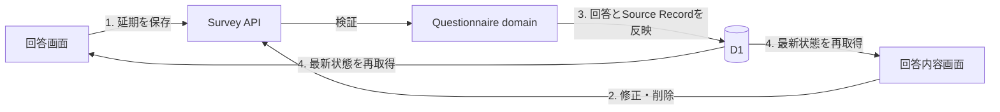

# Survey実装計画

## 1. この文書の目的

この文書は、アンケートの一覧表示、回答実行、回答保存を実際に利用できる縦切りにするための、現在の実装状況、残作業、実装順序を所有します。

画面と遷移の正は[Phase 1 アンケート体験設計](../questionnaire/questionnaire-experience.md)、集約と不変条件の正は[Phase 1 アンケートドメイン設計](../questionnaire/questionnaire-domain-design.md)、HTTP契約の正は[アンケートAPI契約](questionnaire-api.md)、D1への写像の正は[`packages/lib`のschema](../../packages/lib/src/d1/schema/questionnaire.ts)です。この文書は、それらの定義や具体的なAPIスキーマを所有しません。

## 2. 現在地

2026-08-05時点では、一覧・質問詳細・回答保存・回答内容取得がWebからD1まで接続済みです。保存済み回答を読み込み、回答途中のアンケートを最初の未回答から再開できます。

| 利用者の操作 | 現在の状態 | 主な根拠 |
| --- | --- | --- |
| 一覧を見る | 接続済み | Webの`fetchSurveyList`、`GET /api/surveys`、D1の`listVisibleSurveys` |
| 未回答のアンケートを開く | 接続済み | 詳細APIが返す質問とChoiceを回答画面へ表示する |
| 質問へ回答する | 接続済み | `SwipeSurvey`の操作を1問単位で回答保存APIへ送る |
| あとで回答する | ブラウザ内だけで動作 | 延期操作はメモリ上だけで、再読み込みすると失われる |
| 回答を保存する | 接続済み | 回答APIがAnswerとSource RecordをD1へ原子的に保存する |
| 回答途中から再開する | 接続済み | 質問詳細と現在回答を取得し、保存済みの質問を除いて再開する |
| 回答内容を見る | 接続済み | 保存済み回答を取得し、同じ設定版で傾向を再計算する |

すでに再利用できる土台として、Questionnaireの純粋なドメイン操作、D1 schemaとmigration、2件の公開Survey seed、本人確認、一覧APIとE2Eテストがあります。

## 3. 残る縦切り

### 3.1 「あとで回答」の保存

- 「あとで回答」の作成と解消を扱うD1 actionを追加する
- 延期APIを追加し、回答APIと同じLIFF本人確認と受付状態の検証を行う
- 保存成功後は一覧へ戻し、再開時は延期した質問を最初の未回答として表示する
- 保存失敗時は操作を失わず、再試行または一覧へ戻れるようにする

現在の「あとで回答」はブラウザ内の状態だけを更新するため、再読み込みすると失われます。

### 3.2 回答の修正・削除

- 異なるChoiceへの変更をSource Recordの改訂として保存する
- 回答削除時に現在有効なAnswerを外し、対応するSource Recordの削除を反映する
- 修正・削除後の回答状態と進捗を再計算する
- 回答内容画面から確認付きで操作できるようにする

Source Recordの改訂・削除規則は[Source Recordのライフサイクル設計](../domain/source/source-record-lifecycle-design.md)を正とします。

### 3.3 回答画面の操作を完成させる

- 直前の質問へ戻り、保存済み回答を修正できるようにする
- 端末の戻る操作でも保存済み進捗を失わず一覧へ戻れるようにする
- 未保存の選択がある場合は破棄確認を表示する

### 3.4 縦切りの検証

- 延期・修正・削除のAPI controller、logic、D1 actionを層ごとにテストする
- Miniflare D1へmigrationとseedを適用し、延期、修正、削除と再開をE2Eで確認する
- Webでは延期後の復帰、修正、削除、戻る操作をテストする
- `task ci`でリポジトリ全体を検証する

## 4. 推奨する実装順序

1. [アンケートAPI契約](questionnaire-api.md)へ延期の契約とエラーを追加する
2. 延期のD1 actionとAPIを実装し、Webの「あとで回答」を接続する
3. 回答修正・削除の契約、D1 action、APIを追加する
4. 回答内容画面と回答画面へ修正・削除・戻る操作を接続する
5. [Phase 1の完了条件](../questionnaire/questionnaire-experience.md#9-実際にアンケートできる状態の完了条件)を通しで検証する

LINE通知とリッチメニューはPhase 1全体の完了には必要ですが、延期・修正・削除の縦切りとは分けて進められます。

## 5. 完了した最短縦切り

- [x] seed済みのSurveyが本人の回答状態付きで一覧表示される
- [x] 一覧から開いた質問とChoiceがD1の公開済みQuestion Versionに由来する
- [x] 1問回答した直後にD1へAnswerとSource Recordが保存される
- [x] 同じ回答の再送で新しいSource Recordが増えない
- [x] 再読み込み後に回答途中として表示され、最初の未回答から再開できる
- [x] 全問保存後に一覧が回答済みへ変わる
- [x] 認証失敗、受付終了、保存失敗で白画面にならず、再試行または一覧へ戻れる
