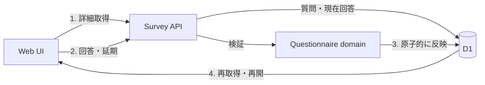

# Survey実装計画

## 1. この文書の目的

この文書は、アンケートの一覧表示、回答実行、回答保存を実際に利用できる縦切りにするための、現在の実装状況、残作業、実装順序を所有します。

画面と遷移の正は[Phase 1 アンケート体験設計](../questionnaire/questionnaire-experience.md)、集約と不変条件の正は[Phase 1 アンケートドメイン設計](../questionnaire/questionnaire-domain-design.md)、HTTP契約の正は[アンケートAPI契約](questionnaire-api.md)、D1への写像の正は[`packages/lib`のschema](../../packages/lib/src/d1/schema/questionnaire.ts)です。この文書は、それらの定義や具体的なAPIスキーマを所有しません。

## 2. 現在地

2026-08-05時点では、一覧・質問詳細・回答保存・回答内容取得がWebからD1まで接続済みです。保存済み回答を読み込み、回答途中のアンケートを最初の未回答から再開できます。

| 利用者の操作 | 現在の状態 | 主な根拠 |
| --- | --- | --- |
| 一覧を見る | 接続済み | Webの`fetchSurveyList`、`GET /api/surveys`、D1の`listVisibleSurveys` |
| 未回答のアンケートを開く | 接続済み | 詳細APIが返す質問とChoiceを回答画面へ表示する |
| 質問へ回答する | 接続済み | `SwipeSurvey`の操作を1問単位で回答保存APIへ送る |
| あとで回答する | ブラウザ内だけで動作 | 延期操作はメモリ上だけで、再読み込みすると失われる |
| 回答を保存する | 接続済み | 回答APIがAnswerとSource RecordをD1へ原子的に保存する |
| 回答途中から再開する | 接続済み | 質問詳細と現在回答を取得し、保存済みの質問を除いて再開する |
| 回答内容を見る | 接続済み | 保存済み回答を取得し、同じ設定版で傾向を再計算する |

すでに再利用できる土台として、Questionnaireの純粋なドメイン操作、D1 schemaとmigration、2件の公開Survey seed、本人確認、一覧APIとE2Eテストがあります。

## 3. 残る縦切り

### 3.1 Survey詳細の読み取り

- D1からSurvey、順序付きのQuestion Version、Choice、本人の現在回答と延期状態を取得するactionを追加する
- 本人確認済みAccountに対するSurvey詳細APIを追加する
- 公開前、公開停止、受付終了、存在しないSurveyを区別し、直接リンクでも案内画面へ戻せるようにする
- Webの質問元を`local-definitions.ts`から詳細APIへ切り替える
- 最初の未回答を求め、回答途中から再開できるようにする

この段階で「実行」はD1に公開された質問を正として動きます。ローカル定義は採点設定など、サーバー保存の対象ではない表示ロジックに限定します。

### 3.2 回答と延期の保存

- 回答の新規作成・同一回答の再送・選択変更を扱うD1 actionを追加する
- 「あとで回答」の作成と解消を扱うD1 actionを追加する
- SurveyResponse、Answer、Source Record、改訂エッジを1回の操作として原子的に反映する
- Account、受付状態、Survey Question、Question Version、Choiceをサーバー側で検証する
- 回答APIと延期APIを追加し、すべてのリクエストで現在と同じLIFF本人確認を行う
- 二重タップと通信再送でSource Recordを重複作成しないことを保証する

### 3.3 Webの保存状態と復帰

- `SwipeSurvey`を「ローカル配列へ追加」から「1問ごとに保存成功後に進む」制御へ変更する
- 保存中は操作を無効化し、保存失敗時は選択を保持したまま再試行できるようにする
- 「あとで回答」の保存成功後は一覧へ戻し、次回は未回答から再開する
- 最後の回答が保存された後に一覧を再取得し、`answered`へ変わったことを表示する
- 再読み込み後も詳細APIの現在回答から同じ進捗を復元する

### 3.4 縦切りの検証

- APIのcontroller、logic、D1 actionを層ごとにテストする
- Miniflare D1へmigrationとseedを適用し、詳細取得、1問保存、再送、修正、延期、再開をE2Eで確認する
- Webでは保存中、保存失敗、再試行、途中再開、完了後の一覧更新をテストする
- `task ci`でリポジトリ全体を検証する

## 4. 推奨する実装順序

1. [アンケートAPI契約](questionnaire-api.md)へ詳細取得、回答、延期の契約とエラーを定義する
2. D1の詳細read modelを追加し、詳細APIまで接続する
3. D1の回答・延期write modelを追加し、APIまで接続する
4. Webを詳細APIと保存APIへ接続し、途中再開まで完成させる
5. 修正・削除と回答内容画面を追加し、[Phase 1の完了条件](../questionnaire/questionnaire-experience.md#9-実際にアンケートできる状態の完了条件)へ広げる

一覧表示、実行、保存だけを最短で成立させる範囲は1〜4です。回答内容の修正・削除、LINE通知、リッチメニューはPhase 1全体の完了には必要ですが、この最短縦切りとは分けて進められます。

## 5. 最短縦切りの完了条件

- seed済みのSurveyが本人の回答状態付きで一覧表示される
- 一覧から開いた質問とChoiceがD1の公開済みQuestion Versionに由来する
- 1問回答した直後にD1へAnswerとSource Recordが保存される
- 同じ回答の再送で新しいSource Recordが増えない
- 再読み込み後に回答途中として表示され、最初の未回答から再開できる
- 全問保存後に一覧が回答済みへ変わる
- 認証失敗、受付終了、保存失敗で白画面にならず、再試行または一覧へ戻れる
