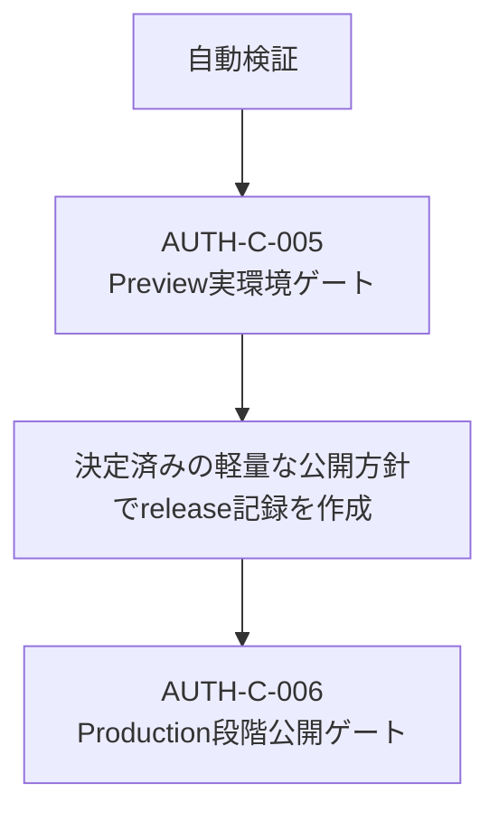

# Web認証・SSO実装残タスク

## 1. 目的

この文書は、[Web認証・アプリケーションセッション設計](../architecture/web-authentication-design.md)に基づく実装のうち、実環境でなければ完了できないリリースゲートを管理します。完了済みの実装PRやmerge待ち状態は管理しません。

### 所有する概念

- Preview実IdP／実ブラウザ検証の未完了条件
- 個人運営を前提にしたProduction段階公開の方針
- リリースゲートの依存順と完了判定

### 所有しない概念

- LIFF／SSO、Identity、Account、アプリケーションセッションの責務とセキュリティ原則
- PreviewとProductionで実施する個別手順と証跡形式
- 各releaseの実施日時、担当者、対象Account、確認結果
- 完了済み実装のPR履歴

認証境界は[Web認証・SSO設計](../architecture/web-authentication-design.md)、Previewの手順は[SSO Preview検証Runbook](sso-preview-verification.md)、Productionの手順は[SSO Production段階公開Runbook](sso-production-rollout.md)を正とします。

## 2. 現在の境界

provider非依存application session、LIFF移行、同じbrowser内で完結するSSO Identity追加、LIFFから外部browserへ渡して元のLIFFで確定するIdentity追加、外部ブラウザ入口、匿名運用ログ、server-side rollout gateは実装済みです。次の先行検証も外部IdPやProduction設定へ依存せず自動実行できます。

- SSO transactionを共有D1の単一consumeで競合させ、同じstateの同時callbackを一度だけ処理する
- 期限切れstate、callback再送、開始元と別ブラウザのcallback、logout後の旧画面相当を拒否する
- ID tokenのemail claimを検証済みIdentityへ引き継がず、`providerKey + subject`が未知ならAccountを解決しない
- rollout停止中もLIFF交換と既存application sessionを継続し、再開時の0%では管理者だけを許可する
- session issuer障害時にcookieを発行せず、消費済みcallbackの再送を拒否する
- LIFFの外部browser callbackではIdentityをpendingに留め、元のLIFF Account、CSRF、確認secretを検証した単一consumeの確定後だけIdentityを追加する

自動検証の成功は実IdP、実cookie、実端末、Production運用の完了を意味しません。残るゲートは次の2件です。

## 3. 決定済みの運用方針

本サービスは個人がゆるく運営する小規模サービスとして扱います。企業向けSLO、固定割合、最低100試行、専用metrics基盤をProduction公開の必須条件にはしません。一方、Account境界と個人情報の安全条件は利用規模にかかわらず緩和しません。

| 項目 | 決定 |
| --- | --- |
| 公開順 | 管理者だけで確認し、次に少数のlink済み協力者、最後にlink済み対象者全体へ公開する |
| 対象 | 有効かつSSO Identityを追加済みのAccount。Identity未追加または削除済みAccountは対象外とする |
| 割合 | `10%`、`25%`、`50%`の固定段階やallowlistは必須にしない。管理者確認は`0%`、link済み協力者以降は対象Identityを限定したうえで`100%`を使用できる |
| 観測 | 各段階で実際のログインを複数回試し、Workers Logsを手動確認する。固定試行数、固定観測日数、成功率SLOは置かない |
| 進行停止 | 再現する認証失敗、同一原因の繰り返し、未解決の5xxがあれば次段階へ進めず調査する |
| 即時停止 | Account誤連携、個人情報漏えい、不正ログインの疑いが1件でもあれば`disabled`へ戻す |
| 権限 | 当面は同じサービス管理者が公開、監視、問い合わせ、最終承認を兼任できる。Production変更権限を持つ人は安全上の停止条件で事前承認なく停止でき、再開は最終承認者が承認する |
| 利用者案内 | 少数公開の対象者へ事前案内し、少数公開中は全体告知しない。全体公開時に利用方法、LIFFを継続利用できること、問い合わせ先を案内する |
| 障害案内 | 影響対象を特定できれば対象者へ、特定できなければ全体へ案内する。tokenや内部識別子は案内へ含めない |
| metrics | 既存の構造化Workers Logsを使う。Analytics Engine、自動集計、自動停止は利用者や運用負荷が増えた時点で再検討する |

固定数値を置かないことは、未検討を意味しません。小さい母数では1件の失敗で割合が大きく変動するため、公開中の可用性は件数と再現性をサービス管理者が判断し、安全事故だけを絶対停止条件にします。

## 4. AUTH-C-005 Preview実環境ゲート

次をすべて満たすまで完了にしません。

- 同じstackのPreview Web、API、D1、session storeをdeployし、[LIFF交換・アプリケーションセッション境界検証Runbook](application-session-boundary-verification.md)を完了する
- 開発用GCP projectのIdentity PlatformとGoogle providerを使い、普段使うスマートフォンのLINE内ブラウザと外部ブラウザ、PCの主要ブラウザ1つで確認する
- 各環境でlogin、cancel、logout、`SSO_ROLLOUT_MODE=disabled`への停止後もLIFFが使えることを確認する
- LIFFプロフィールから外部browserへGoogle認証を渡し、LIFFへ戻って明示的に確定した後だけIdentityが追加されることを確認する
- 代表ブラウザでnegative、同時callback、別ブラウザ、期限切れ、Identity解除を確認する
- 未linkのGoogleアカウントが表示名やemailで既存Accountへ統合されず`identity_unlinked`になることを確認する
- token、Cookie、state、code、subject、Account ID、email、個人内容を証跡へ残さない

iPhone、Android、Chrome、Safariの全組み合わせは必須にしません。利用できる端末が増えたときに追加確認します。実IdP、実cookie、実端末を使っていない自動テスト結果だけで、このゲートを完了扱いにしません。

## 5. AUTH-C-006 Production段階公開ゲート

依存: `AUTH-C-005`

[SSO Production段階公開Runbook](sso-production-rollout.md)に従い、次をすべて実施するまで完了にしません。

- `disabled`／0%から開始する
- 管理者、少数のlink済み協力者、link済み対象者全体の順で公開する
- 各段階で実ブラウザの確認結果とWorkers Logsに未解決の安全問題がないことを確認する
- Account誤連携、個人情報漏えい、不正ログインの疑いでは即時停止する
- 原因修正をPreviewで再検証し、管理者確認から再開する。停止前の段階へ直接戻さない
- 既存LIFFとapplication sessionを継続できることを確認する
- 全体公開時の案内と問い合わせ手順を更新する

ProductionのGCP project、実データ、サービス管理者を使った結果がない状態で、このゲートを完了扱いにしません。

## 6. 更新ルール

- 実環境ゲートの証跡が揃ったときだけ該当ゲートを削除する
- 完了済みPR、merge待ち、過去の実装分割はこの文書へ戻さない
- 運営規模が増え、手動確認が負担または判断不能になった場合は、数値SLO、Analytics Engine、自動通知を新しい検討事項として追加する
- 運用方針を変更したときはProduction Runbookも同じ変更で更新する
- 両ゲートが完了したら、この文書とドキュメントマップのリンクを同じ変更で削除する
