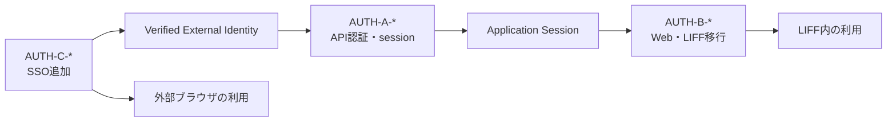
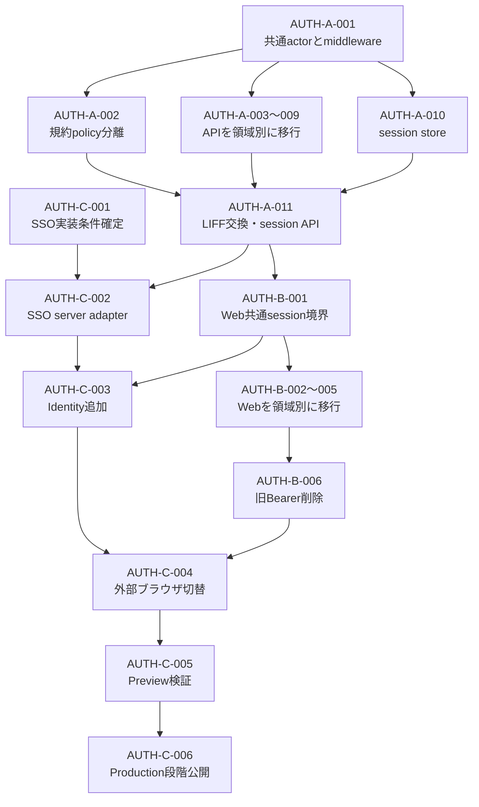

# Web認証・SSO実装残タスク

## 1. 目的

この文書は、[Web認証・アプリケーションセッション設計](../architecture/web-authentication-design.md)を実装し、LIFF内ではLIFF、外部ブラウザではSSOを使って同じAccountへ安全に到達できるようにするまでの残作業、依存順、各PRの完了条件を管理します。

### 所有する概念

- Web認証・SSO実装の残タスクと着手順
- provider非依存の認証境界、LIFF移行、SSO追加の接続点
- 1つのPRとしてレビューできる作業境界と完了条件
- LIFF、外部ブラウザ、Preview、Productionのリリースゲート

### 所有しない概念

- LIFF／SSO、Identity、Account、アプリケーションセッションの責務とセキュリティ原則
- Phase 1で提供するログイン手段と、LINE内・外部ブラウザの役割
- Account復旧の本人確認とIdentity再接続
- 個別機能のAPI、画面、データモデル
- 共通のログ、マイグレーション、デプロイ手順

認証境界は[Web認証・アプリケーションセッション設計](../architecture/web-authentication-design.md)、Phase 1のログイン手段は[プロジェクト概要](../product/project-overview.md)、認証後の画面復帰は[全体画面遷移設計](../product/screen-navigation.md)、復旧は[Account復旧設計](../architecture/account-recovery-design.md)、ログは[アプリケーション運用ログ方針](operational-logging.md)、本番変更は[本番データベースマイグレーション運用](production-migration-operations.md)を正とします。

## 2. 3つの系列と接続点

タスク番号を次の3系列に分けます。

| 系列 | 完了させる責務 | 扱ってよい情報 | 扱わない情報 |
| --- | --- | --- | --- |
| `AUTH-A-*` | APIのprovider非依存認証、policy、アプリケーションセッション | 検証済みIdentity、Account ID、session、CSRF、認証時刻 | 画面状態、SSO製品固有UI |
| `AUTH-B-*` | Web UIのprovider非依存認証とLIFF移行 | `AuthState`、表示用プロフィール、要求path、LIFF capability | Account ID、外部subject、session cookieの値 |
| `AUTH-C-*` | SSO Identity追加、外部ブラウザ切替、段階公開 | SSO transaction、検証済みIdentity、link policy | feature固有データ、email一致によるAccount統合 |

系列間の接続点は、API側の`AuthenticatedActor`とWeb側のアプリケーションセッションです。A系列は外部credentialをAccountへ解決してsessionを発行し、B系列はsessionの有無と表示可能な情報だけを使います。C系列はSSO固有の認証結果をA系列の共通境界へ渡し、feature APIを直接変更しません。

## 3. PRの分割ルール

- 原則として、以下の1番号を1 PRとして実施する
- 共通境界の追加と全featureの移行を同じPRへ入れない
- APIの移行はcontroller領域単位、Webの移行は利用者が確認できるfeature単位で分ける
- D1 migration、KV binding、認証API、Web切替を1つのPRへ詰め込まない
- 一時的な旧LIFF Bearerとの互換期間を設けるが、新旧どちらで認証したかをfeatureの条件分岐に使わない
- 外部I/Oはadapterを境界にし、LINEやSSO IdPへ接続しない自動テストを同じPRへ含める
- 各PRは後続PRが未導入でも安全にデプロイでき、featureを認証なしで公開しない
- 認証やAccount統合の規則を変える場合は、先に設計SSoTを更新する

## 4. 依存関係とリリース順

`AUTH-A-003`〜`AUTH-A-010`は、`AUTH-A-001`完了後に並行着手できます。`AUTH-B-002`〜`AUTH-B-005`も`AUTH-B-001`完了後に並行着手できます。並行PRが同じ共通interfaceを独自拡張せず、不足があれば先に共通境界の追補PRを行います。

## 5. 系列A: APIのprovider非依存認証

### AUTH-A-001 `AuthenticatedActor`と認証middlewareを追加する

依存: なし

- `AuthenticatedActor`、認証失敗理由、credential verifierの共通契約を追加する
- 現在のLIFF IDトークン検証を最初のverifier adapterとして接続する
- Hono middlewareが認証結果をContextへ設定し、未認証requestを共通結果へ変換できるようにする
- feature logicと既存routeの呼び出し方はまだ変更せず、fake verifierによるmiddleware testを追加する

完了条件は、LINE固有情報を持たないactorを1 requestにつき1回解決でき、既存featureの挙動を変えずに共通認証境界を利用できることです。

### AUTH-A-002 利用規約同意を認証から分離する

依存: `AUTH-A-001`

- `resolveLiffSession`と`createLiffSession`に分かれている本人確認と同意確認を、authenticationとterms policyへ分ける
- 規約取得・同意・同意履歴APIは認証済みactorだけを要求する
- その他の本人機能へ適用できる現行規約policyを共通化する
- 未認証、未同意、設定不足を区別するlogicとcontroller testを追加する

完了条件は、規約へ未同意の本人が規約取得・同意APIを利用でき、未同意を未認証として扱わないことです。

### AUTH-A-003 診断APIを共通actorへ移行する

依存: `AUTH-A-001`, `AUTH-A-002`

- 診断一覧、詳細、回答内容、回答保存、後回しAPIから`idToken`と`lineLoginChannelId`を除く
- controllerがmiddlewareのactorをlogicへ渡し、AccountDataをactorのAccount IDから選ぶ
- 現行規約policyをrouteへ適用し、既存の公開状態・回答状態の判定は変更しない
- 別Account、未認証、未同意のnegative testを維持する

完了条件は、診断logicが`createLiffSession`へ依存せず、既存の診断contractと認可結果を維持することです。

### AUTH-A-004 プロフィール基本APIを共通actorへ移行する

依存: `AUTH-A-001`, `AUTH-A-002`

- 本人プロフィール、アバター、進行度、Entitlement APIを共通actorへ移行する
- LINE画像等に必要な表示用情報は認証交換またはプロフィールadapterから受け取り、feature logicへprovider tokenを渡さない
- Private R2とAccountDataの所有権判定はactorのAccount IDを正とする
- 画像response、Plan縮退、別Accountのnegative testを維持する

完了条件は、プロフィール基本logicがLINE tokenを知らず、本人のプロフィールと画像だけを返すことです。

### AUTH-A-005 本人向け生成・セルフケアAPIを共通actorへ移行する

依存: `AUTH-A-001`, `AUTH-A-002`

- わたしのまとめ、週次振り返り、目標フォローアップ、セルフケアAPIを共通actorへ移行する
- Queueへ渡すAccount IDはactorからだけ取得する
- Plan、生成中状態、安全上の認可は既存logicを維持する
- 別Accountの生成jobや確認履歴へ到達できないtestを維持する

完了条件は、本人向け生成・セルフケアlogicが認証providerに依存せず、既存の非同期処理境界を変更しないことです。

### AUTH-A-006 本人データ・開発用APIを共通actorへ移行する

依存: `AUTH-A-001`, `AUTH-A-002`

- 本人入力データ、エクスポート、Brain開発表示、Vector同期job、開発用Accountリセットを共通actorへ移行する
- Account IDをpath、query、bodyから本人指定として追加しない
- 開発環境限定判定と、Planに依存しない本人データ操作を維持する
- export downloadと開発用routeの別Account・Production negative testを維持する

完了条件は、機微な本人データを扱うlogicがprovider tokenを知らず、環境境界とAccount所有権を維持することです。

### AUTH-A-007 相性APIを共通actorへ移行する

依存: `AUTH-A-001`, `AUTH-A-002`

- 招待、承諾、一覧、共有同意、共有内容、関係終了、アバターAPIを共通actorへ移行する
- Account IDはactorとrelationship contextからだけ解決する
- 双方の同意、期限、終了状態、画像認可の判定は変更しない
- 招待者・受信者・第三者のnegative testを維持する

完了条件は、相性logicが認証providerに依存せず、関係に参加しないAccountへ情報を返さないことです。

### AUTH-A-008 課金・ファミリー・Account復旧APIを共通actorへ移行する

依存: `AUTH-A-001`, `AUTH-A-002`

- Checkout、Portal、ファミリー席、復旧コード発行・完了APIを共通actorへ移行する
- Customer、family、復旧対象Accountをクライアント入力のAccount IDから解決しない
- Account復旧完了時に旧sessionを失効させるためのhook境界を追加するが、session store実装を先取りしない
- 別Account、再送、使用済み復旧コードのnegative testを維持する

完了条件は、課金・家族・復旧logicが認証providerを知らず、既存のAccount境界と冪等性を維持することです。

### AUTH-A-009 管理者APIを共通actorへ移行する

依存: `AUTH-A-001`, `AUTH-A-002`

- Account一覧、統計、課金health、再照合APIを共通actorへ移行する
- admin判定は共有D1の現在roleを正とし、LIFFまたは将来のSSO claimを根拠にしない
- 一般利用者、停止Account、古いroleを持つsessionのnegative testを追加する
- 管理者APIから個人コンテンツへ到達できない既存境界を維持する

完了条件は、管理者logicがproviderに依存せず、requestごとに現在roleを認可することです。

### AUTH-A-010 session storeと失効基盤を追加する

依存: `AUTH-A-001`

- Cloudflare KV binding、session record、絶対期限、idle期限、rotation、logoutを実装する
- Account停止、Identity解除、復旧完了の即時失効を担う共有D1のsession versionを追加する
- session参照はhash等の安全な形式で扱い、token、subject、cookie値をログへ出さない
- Local、Preview、Productionのresource、migration、Secret配布、失効testを追加する

完了条件は、sessionの発行、検証、rotation、失効が再現でき、KVの反映遅延だけに安全上必要な失効を任せないことです。

### AUTH-A-011 LIFF認証交換とapplication session APIを追加する

依存: `AUTH-A-002`〜`AUTH-A-010`

- LIFF credential交換、session確認、logout、CSRF検証を追加する
- LIFF IDトークンを認証交換以外の新しい経路へ渡さない
- middlewareは移行期間だけapplication sessionと旧LIFF Bearerの両方を受け入れる
- credential付きCORSを許可済みWeb originへ限定し、cookie属性とCSRF / Origin検証をtestする
- OpenAPIへprovider非依存sessionと認証交換の境界を追加する

完了条件は、LIFF IDトークンを一度交換した後、同じAccountの機能APIをHttpOnly session cookieで利用できることです。

## 6. 系列B: Web UIとLIFFの移行

### AUTH-B-001 `AuthSessionProvider`と共通HTTP認証を追加する

依存: `AUTH-A-011`

- provider非依存の`AuthState`、`AuthSessionProvider`、session確認・交換adapterを追加する
- 共通HTTP clientへ`credentials: include`、CSRF header、401時のsession再確認を集約する
- 現在の`LiffSessionProvider`を内側で利用する互換adapterを用意し、既存featureはまだ変更しない
- 同時初期化、Abort、期限切れ、認証遷移中、再試行のhook testを追加する

完了条件は、Web共通境界がprovider tokenをfeatureへ公開せず、既存画面を段階移行できることです。

### AUTH-B-002 共通shell・規約・診断画面をapplication sessionへ移行する

依存: `AUTH-B-001`, `AUTH-A-003`

- App共通shell、利用規約gate、診断一覧・回答画面から`acquireIdToken`を削除する
- 認証前に要求された診断pathをsession確立後に復元する
- 初回同意、回答保存、再読み込み、session期限切れを画面testへ追加する
- LIFF内の表示と外部ブラウザの現行LINE Login導線を維持する

完了条件は、規約と診断画面がLIFF tokenを扱わず、application sessionだけで同じ操作を完了できることです。

### AUTH-B-003 プロフィール・本人データ画面をapplication sessionへ移行する

依存: `AUTH-B-001`, `AUTH-A-004`〜`AUTH-A-006`

- プロフィール、アバター、わたしのまとめ、週次振り返り、セルフケア、Brain開発表示、本人データ画面を移行する
- API adapterとhookのtoken引数、および`getLiffIdToken()`の直接呼び出しを削除する
- session切替時に以前のAccountの取得済みデータ、画像Object URL、戻る履歴を破棄する
- 読み込み、更新、生成、download、session期限切れの画面testを維持する

完了条件は、プロフィール・本人データ領域が認証providerを知らず、Account切替後に以前の内容を表示しないことです。

### AUTH-B-004 相性画面をapplication sessionへ移行する

依存: `AUTH-B-001`, `AUTH-A-007`

- 相性一覧、招待、承諾、共有内容、結果画面からtoken引数を削除する
- 認証前の招待pathをsession確立後に復元し、有効性と参加者を再判定する
- 認証付き画像取得を共通HTTP clientへ寄せ、tokenを画像URLへ含めない
- sender、recipient、第三者、期限切れ、session切替の画面testを維持する

完了条件は、相性画面がapplication sessionだけを使い、別Accountの招待や画像を表示しないことです。

### AUTH-B-005 課金・ファミリー・管理者・復旧画面をapplication sessionへ移行する

依存: `AUTH-B-001`, `AUTH-A-008`, `AUTH-A-009`

- Checkout、Portal、ファミリー席、管理者、Account復旧画面からtoken引数を削除する
- 管理者導線の表示用roleはsession情報を使えるが、API認可は共有D1の現在roleを正とする
- session切替、権限不足、復旧完了後の旧session、別Accountのnegative testを追加する
- 課金・復旧識別子をURLまたは画面ログへ追加しない

完了条件は、残る本人向け画面がapplication sessionへ移行し、表示上のroleでAPI認可を省略しないことです。

### AUTH-B-006 旧LIFF Bearer境界を削除する

依存: `AUTH-B-002`〜`AUTH-B-005`

- Webの`acquireIdToken`、feature APIのtoken引数、直接Bearer header生成を削除する
- API feature routeで旧LIFF Bearerの受け入れを停止する
- `createLiffSession`とfeature logicのLINE Loginチャネル設定依存を削除する
- OpenAPI、生成型、API契約文書、test fixtureをapplication sessionへ更新する
- LIFF SDKには認証交換と`shareTargetPicker`等のcapabilityだけを残す

完了条件は、LIFF IDトークンが認証交換以外のAPIへ送られず、リポジトリにfeature向け`liffIdToken` security schemeが残らないことです。

## 7. 系列C: SSO追加と外部ブラウザ切替

### AUTH-C-001 SSO実装条件と運用設定を確定する

依存: なし

- 採用するSSO製品、OIDC issuer、client、redirect URI、scope、Secret配布を決定する
- subjectの安定性、provider key、link-only期間、session期限、local / IdP logoutの範囲を確定する
- PreviewとProductionのtenant、callback、許可origin、段階公開flagを分離する
- 公式情報でAuthorization Code Flow、PKCE、state、nonce、logout制約を確認して設計SSoTを更新する

完了条件は、製品固有の未決事項がなく、Secret値を文書へ記載せずLocalとPreviewの設定を再現できることです。

### AUTH-C-002 SSO server adapterと認証transactionを追加する

依存: `AUTH-C-001`, `AUTH-A-011`

- SSO開始、callback、token交換、issuer・audience・署名・期限検証をadapterへ実装する
- state、nonce、PKCE verifier、要求pathを短命な認証transactionへ保存して一度だけ消費する
- callbackで`VerifiedExternalIdentity`を生成し、共通Account resolverとsession issuerへ渡す
- 未知Identityは`link-only`結果として拒否し、Accountを自動作成しない
- IdPへ接続しないfake / fixture testで改ざん、再送、期限切れ、open redirectを拒否する

完了条件は、SSO固有情報がadapter外へ漏れず、既知Identityだけがapplication sessionを取得できることです。

### AUTH-C-003 既存AccountへSSO Identityを追加する

依存: `AUTH-C-002`, `AUTH-B-001`

- LIFFまたは既存sessionで認証済みの本人がSSO追加を開始できるAPIと設定画面を追加する
- SSO側の新しい認証成功と元sessionのAccountを同じ短命transactionで結び、`linkIdentity`を使う
- emailや表示名の一致でlinkせず、別Accountへ接続済みのIdentityは自動統合しない
- 成功、キャンセル、再送、別Account、最後のIdentity解除防止をE2E相当testへ含める

完了条件は、既存Account IDと本人データを変えずにSSO Identityを追加でき、別Account同士を自動統合しないことです。

### AUTH-C-004 LIFF内と外部ブラウザの認証入口を切り替える

依存: `AUTH-C-003`, `AUTH-B-006`

- `AuthGate`がLIFF SDKで実行環境を確認し、LIFF内はLIFF adapter、外部ブラウザはSSO adapterを選ぶ
- LIFF内では既存SSO sessionがあってもLIFF Identityを確認し、別AccountならUI cacheを破棄してLIFF側sessionへ切り替える
- LIFF失敗時にSSOへ自動fallbackせず、外部ブラウザで開く案内を表示する
- 外部ブラウザから`liff.login()`を呼ばず、要求された相対pathをSSO callback後に復元する
- 段階公開flagが無効な環境では外部ブラウザの現行LINE Login adapterへ戻せるようにする

完了条件は、実行環境ごとに認証入口が一意に決まり、別Accountのsessionや画面内容を引き継がないことです。

### AUTH-C-005 PreviewでLIFFとSSOを通しで検証する

依存: `AUTH-C-004`

- LIFF実端末、外部ブラウザ、直接リンク、相性招待、管理者URLで認証と要求画面復帰を確認する
- 同じAccountへlinkしたLIFFとSSOが同じプロフィール・診断・相性へ到達することを確認する
- 別Account cookie、期限切れ、IdP拒否、LIFF初期化失敗、CSRF、logout、復旧後の旧sessionを確認する
- token、subject、Account ID、個人内容をログやチケットへ残さず結果を追跡できることを確認する
- SSO開始、callback失敗、session発行・失効を機微情報なしで判断できる運用ログとrunbookを追加する

完了条件は、Previewで主要な成功・失敗経路を再現し、問題時にSSO経路だけを停止してLIFF利用を継続できることです。

### AUTH-C-006 ProductionへSSOを段階公開する

依存: `AUTH-C-005`

- 運営Account、SSO link済みの少数Account、対象利用者全体の順に外部ブラウザSSOを有効化する
- 認証成功率、callback失敗、Account未解決、session失効、LIFFへの影響を個人識別子なしで確認する
- SSO経路だけを即時停止できることと、停止中もLIFF内の本人機能を利用できることを確認する
- 外部ブラウザの旧LINE Loginを終了する時点で、公開案内とサポート手順を更新する

完了条件は、ProductionでLIFF内の利用を維持したまま外部ブラウザSSOを安全に停止・再開でき、対象利用者へ段階公開できることです。

## 8. リリースゲート

| ゲート | 必須タスク | 公開できる範囲 |
| --- | --- | --- |
| API共通認証 | `AUTH-A-001`〜`AUTH-A-011` | 旧Webを維持したままapplication sessionを併用できる |
| LIFF session移行 | `AUTH-B-001`〜`AUTH-B-006` | LIFF内と外部LINE Loginを共通sessionで利用できる |
| SSO限定公開 | `AUTH-C-001`〜`AUTH-C-005` | link済みAccountだけ外部ブラウザSSOを利用できる |
| SSO一般公開 | `AUTH-C-006` | 対象利用者へ外部ブラウザSSOを段階公開できる |

未完了のゲートを前提に旧認証経路を削除しません。ただし、旧LIFF Bearerをfeature APIへ残したままSSOを一般公開せず、`AUTH-B-006`をSSO切替の必須条件にします。

## 9. 更新ルール

- 未完了の番号だけを残し、完了したタスクは削除する
- 実装を始めたタスクはIssueまたはPRへ移し、この文書にはリンクと未完了条件だけを残す
- 1番号が大きすぎる場合は、既存番号を変えず`AUTH-A-003A`のような枝番で分割する
- 新しい作業は責務に応じてA・B・Cいずれかの末尾へ追加し、既存番号を振り直さない
- 認証境界、Identity link、不一致時のAccount切替を変更する場合は、先に設計SSoTを更新する
- すべて完了したら、この文書とドキュメントマップのリンクを同じ変更で削除する
