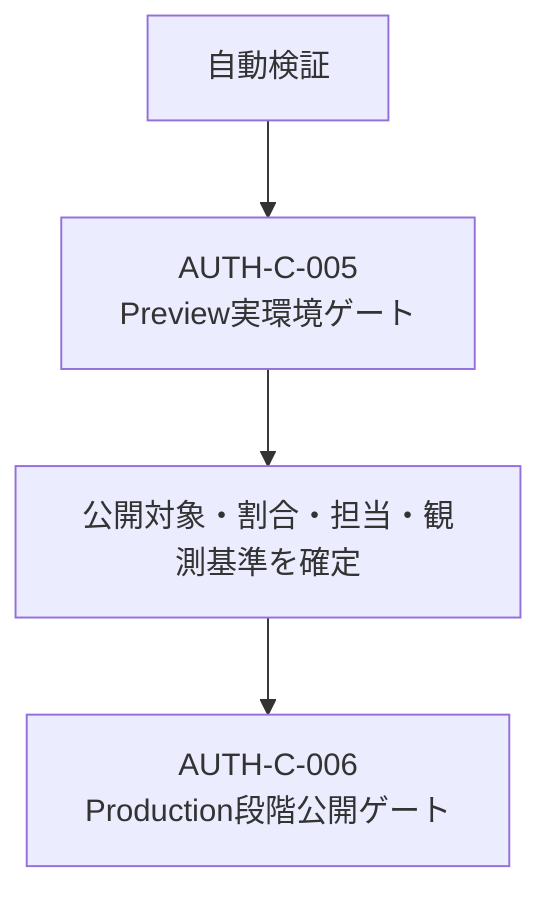

# Web認証・SSO実装残タスク

## 1. 目的

この文書は、[Web認証・アプリケーションセッション設計](../architecture/web-authentication-design.md)に基づく実装のうち、実環境または運用判断がなければ完了できないリリースゲートだけを管理します。完了済みの実装PRやmerge待ち状態は管理しません。

### 所有する概念

- Preview実IdP／実ブラウザ検証の未完了条件
- Production段階公開の未完了条件
- リリースゲートの依存順と完了判定

### 所有しない概念

- LIFF／SSO、Identity、Account、アプリケーションセッションの責務とセキュリティ原則
- PreviewとProductionで実施する個別シナリオと証跡形式
- 公開対象、割合、観測期間、承認者の具体値
- 完了済み実装のPR履歴

認証境界は[Web認証・アプリケーションセッション設計](../architecture/web-authentication-design.md)、Previewの手順は[SSO Preview検証Runbook](sso-preview-verification.md)、Productionの手順は[SSO Production段階公開Runbook](sso-production-rollout.md)を正とします。

## 2. 現在の境界

provider非依存application session、LIFF移行、SSO Identity追加、外部ブラウザ入口、匿名運用ログ、server-side rollout gateは実装済みです。次の先行検証も外部IdPやProduction設定へ依存せず自動実行できます。

- SSO transactionを共有D1の単一consumeで競合させ、同じstateの同時callbackを一度だけ処理する
- 期限切れstate、callback再送、開始元と別ブラウザのcallback、logout後の旧画面相当を拒否する
- ID tokenのemail claimを検証済みIdentityへ引き継がず、`providerKey + subject`が未知ならAccountを解決しない
- rollout停止中もLIFF交換と既存application sessionを継続し、再開時の0%では管理者だけを許可する
- session issuer障害時にcookieを発行せず、消費済みcallbackの再送を拒否する

自動検証の成功は実IdP、実cookie、実端末、Production運用の完了を意味しません。残るゲートは次の2件です。

## 3. AUTH-C-005 Preview実環境ゲート

次をすべて満たすまで完了にしません。

- 同じstackのPreview Web、API、D1、session storeをdeployし、[LIFF交換・アプリケーションセッション境界検証Runbook](application-session-boundary-verification.md)を完了する
- Auth0 Preview tenantと実ブラウザで[SSO Preview検証Runbook](sso-preview-verification.md)の成功、negative、同時callback、別ブラウザ、rollbackシナリオをすべて実施する
- 同じemailを返す異なるAuth0 subjectを用意し、未linkのsubjectが既存Accountへ統合されず`identity_unlinked`になることを確認する
- transaction期限切れ、logout後の戻る操作、Identity解除後の旧sessionが、個人内容を再表示せず拒否されることを確認する
- `SSO_ROLLOUT_MODE=disabled`への停止後もLIFF交換と既存application sessionが継続する証跡を残す
- token、Cookie、state、code、subject、Account ID、email、個人内容を証跡へ残さない

実IdP、実cookie、実端末を使っていない自動テスト結果だけで、このゲートを完了扱いにしません。

## 4. AUTH-C-006 Production段階公開ゲート

依存: `AUTH-C-005`

公開前に、公開対象、各phaseの割合、最低試行数、観測時間、停止基準、公開担当、監視担当、rollback担当、問い合わせ担当、承認者をrelease記録で確定します。この文書では具体値を決めません。

確定後も、[SSO Production段階公開Runbook](sso-production-rollout.md)に従って次をすべて実施するまで完了にしません。

- `disabled`／0%の基準状態から開始する
- 管理者、link済みAccountの少数割合、対象全体の順で公開する
- 各phaseで事前に確定した観測基準を満たす
- `disabled`への即時停止後もLIFFと既存application sessionが継続することを確認する
- 原因修正をPreviewで再検証し、`linked-login`／0%から再開する。停止前の割合へ直接戻さない
- session issuer障害時に新しいSSO sessionを発行せず、LIFFへの影響と固定error codeを確認する
- 100% phase、公開案内、サポート手順まで完了する

Production tenant、実データ、運用担当者、承認者を使った結果がない状態で、このゲートを完了扱いにしません。

## 5. 更新ルール

- 実環境ゲートの証跡が揃ったときだけ該当ゲートを削除する
- 完了済みPR、merge待ち、過去の実装分割はこの文書へ戻さない
- 未決定の公開対象、割合、期間、担当、承認者を確定値として記載しない
- 両ゲートが完了したら、この文書とドキュメントマップのリンクを同じ変更で削除する
