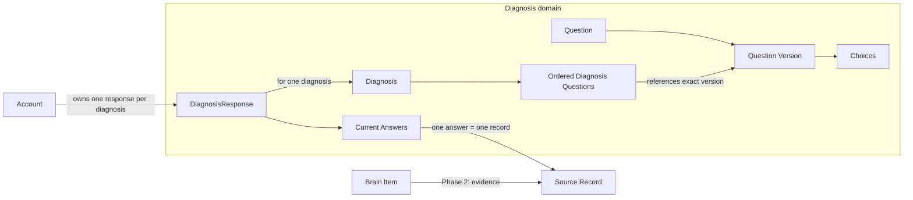
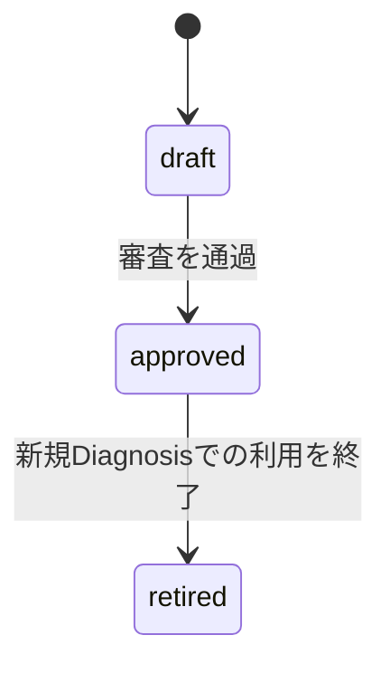
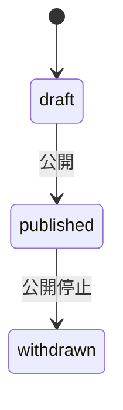

# Phase 1 診断ドメイン設計

## 1. この文書の目的

この文書は、Phase 1の診断を公開し、本人の回答を継続的に保存するためのDiagnosis domainを定義します。質問と版、診断、回答進捗の集約境界、状態遷移、不変条件、およびAccount / Source domainとの関係を所有します。

画面と遷移は[Phase 1 診断体験設計](diagnosis-experience.md)、Account / Brain / Sourceの境界は[ドメイン設計](../domain/domain-design.md)、Source Recordの改訂関係は[根拠・反証・改訂のエッジ設計](../domain/brain/evidence-edge-design.md)、原本の不変性と訂正・削除の波及は[Source Recordのライフサイクル設計](../domain/source/source-record-lifecycle-design.md)を正とします。

この文書では、テーブル、カラム、インデックス、APIスキーマ、セッションの実装方式を定義しません。ここで定義する論理モデルを永続化設計とAPI設計の入力とし、現在の写像は公開定義が[`packages/lib`のcatalog schema](../../packages/lib/src/d1/shared/schema/catalog.ts)、回答が[diagnosis schema](../../packages/lib/src/do/account/schema/diagnosis.ts)を正とします。

## 2. 結論

Diagnosis domainは次の3集約で構成します。

| 集約 | 担当すること |
| --- | --- |
| `Question` | 質問の同一性、内容の版、選択肢、審査状態を守る |
| `Diagnosis` | 回答してもらう質問の組み合わせ、順序、受付期間、公開状態を守る |
| `DiagnosisResponse` | 1つのAccountによる1つのDiagnosisへの現在の回答と進捗を守る |

1問の回答はDiagnosis domain上の`Answer`であると同時に、Source domain上では1件の`Source Record`です。`Answer`を独立した集約にはせず、`DiagnosisResponse`が現在有効な回答と対応するSource Recordを管理します。

「あとで回答」は回答内容ではありません。本人についての新しい命題を持たないためSource Recordを作らず、DiagnosisResponseの進捗として記録します。

## 3. ドメインの責務と境界

### Diagnosis domainが担当すること

- 運営が質問を作成、審査、改訂する
- 公開済みの質問内容と選択肢を不変にする
- 質問の特定の版を並べてDiagnosisを構成する
- Diagnosisの公開と受付期間を管理する
- 本人が選んだ選択肢を質問の版に対して検証する
- Accountごとの回答進捗と現在有効な回答を管理する
- 回答の新規作成、修正、削除をSource domainへ依頼する

### Diagnosis domainが担当しないこと

| 関心事 | 担当 |
| --- | --- |
| 本人確認、Accountの有効性 | Account domain |
| 回答原本の保持、改訂、削除、Access Label | Source domain |
| 回答からプロフィールや好みを導出すること | Brain domain |
| LINE通知とリッチメニュー | 配信・UI層 |
| スワイプ、ボタン、画面上の進捗表示 | UI層 |

Diagnosis domainは「誰が回答したか」をクライアントから受け取りません。操作主体は、サーバーが検証した本人性からAccount domainを通じて解決します。

## 4. 全体像

DiagnosisはQuestionそのものではなく、必ず特定のQuestion Versionを参照します。これにより質問が改訂されても、公開済みDiagnosisと既存回答の意味が変わりません。

## 5. `Question` aggregate

### 構成

`Question`は質問としての同一性を表す集約ルートです。改訂しても同じ問いとして追跡したい範囲を1つのQuestionとします。

Questionは1件以上の`Question Version`を持ちます。Question Versionは次を持つ論理モデルです。

- Question内で一意な版
- 質問文
- 任意の補足文
- 回答形式
- 選択肢
- 審査状態

Phase 1の回答形式は`single_choice`だけとし、スワイプ診断では選択肢を2件に限定します。各選択肢は版の中で一意な`Choice ID`、表示文言、任意の表示用メタデータを持ちます。

回答が参照するのは表示文言、配列位置、左右の方向ではなくChoice IDです。スワイプ方向はUI上の操作であり、本人が選んだ内容そのものではないため回答へ保存しません。

### Question Versionの状態

- `draft`は編集できる
- `approved`へ移した内容は不変とする
- `approved`だけをDiagnosisの公開内容として確定できる
- 訂正は既存版の変更ではなく新しい版の追加で行う
- `retired`は新しいDiagnosisへ追加できないが、既存Diagnosisと回答から参照できる

### 不変条件

- 版はQuestion内で重複しない
- Phase 1のQuestion VersionはChoiceをちょうど2件持つ
- Choice IDはQuestion Version内で重複しない
- approved以降の質問文、補足、回答形式、Choiceを変更しない
- 既存回答が参照するQuestion Versionを削除しない

アイコンや色などの表示用メタデータは回答の意味ではありません。ただし公開済み画面の再現性を保つため、Question Versionの一部として同じく不変にします。

## 6. `Diagnosis` aggregate

### 構成

`Diagnosis`は、ユーザーへ1回の回答単位として提示する質問セットです。次を持つ論理モデルです。

- タイトル
- 一覧で内容を伝える短い説明
- 回答で前提にする相手とのRelationship Category
- 回答受付の開始時点と終了時点
- 公開状態
- 順序づけられた`Diagnosis Question`

Diagnosis QuestionはDiagnosis内の項目であり、特定のQuestion Versionへの参照と表示順を持ちます。将来同じQuestion Versionを別のDiagnosisで再利用しても、回答がどのDiagnosis上の項目に対するものかを区別できます。

Relationship Categoryは回答時に利用者が選ぶ設定ではなく、運営がDiagnosisを作る段階で質問内容と一緒に固定します。相手によって回答が変わり得るため、異なるカテゴリで同じテーマを扱う場合はカテゴリごとにDiagnosisを分けます。

| 値 | 利用者向けラベル | 用途 |
| --- | --- | --- |
| `partner` | パートナー | 恋人、配偶者などとの関係を前提にする |
| `family` | 家族 | 親、子、きょうだいなどとの関係を前提にする |
| `friend` | 友達 | 友人との関係を前提にする |
| `work` | 仕事 | 同僚、上司、部下、取引先などとの関係を前提にする |
| `other` | その他 | 上記へ当てはまらない特定の関係を前提にする |
| `general` | 人間関係全般 | 特定の関係によらない質問だけで構成する |

### 公開状態と受付可否

`published`のDiagnosisについて、現在時刻と受付期間から次の可用状態を導出します。

| 可用状態 | 条件 | 新規回答・修正 |
| --- | --- | --- |
| 公開前 | 受付開始前 | 不可 |
| 受付中 | 受付期間内 | 可 |
| 受付終了 | 受付終了後 | 不可 |
| 公開停止 | withdrawn | 不可 |

受付終了や公開停止の後も、既に回答した本人は回答内容を確認できます。公開停止は誤ったDiagnosisを緊急停止するための状態であり、内容を変更して再公開する操作には使いません。

### 不変条件

- Diagnosisは1件以上のDiagnosis Questionを持つ
- DiagnosisはRelationship Categoryを1つ持つ
- 同じQuestionを1つのDiagnosisへ重複して含めない
- Diagnosis公開時点で、すべてのDiagnosis QuestionがapprovedのQuestion Versionを参照している
- 受付終了時点がある場合、受付開始時点より後にする
- published以降はタイトル、短い説明、Relationship Category、受付期間、質問の組み合わせ、参照する版、順序を変更しない
- 公開内容の訂正が必要な場合は新しいDiagnosisを作成する

Phase 1では公開中のDiagnosisをすべての有効なAccountが回答できます。対象者のセグメント、招待制、質問のランダム化は後続設計へ延期します。

## 7. `DiagnosisResponse` aggregate

### 構成と同一性

`DiagnosisResponse`は、1つのAccountによる1つのDiagnosisへの回答全体を表す集約ルートです。同じAccountとDiagnosisの組み合わせに複数のDiagnosisResponseを作りません。回答のやり直しは別Responseの追加ではなく、現在の回答の修正として扱います。

DiagnosisResponseは次を管理します。

- 対象のAccountとDiagnosis
- Diagnosis Questionごとの現在有効なAnswer
- 「あとで回答」を選んだDiagnosis Questionとその操作時点
- 回答進捗

DiagnosisResponseは最初の回答または「あとで回答」の操作時に作成します。一覧を表示しただけでは作成しません。

### 回答状態

回答状態は現在有効なAnswerの件数から導出し、独立した真実として重複管理しません。Phase 1ではDiagnosis内の全問を回答対象とします。

| 状態 | 条件 |
| --- | --- |
| 未回答 | 現在有効なAnswerが0件 |
| 回答途中 | 1件以上あるが全問分はない |
| 回答済み | 全Diagnosis Questionに現在有効なAnswerがある |

「あとで回答」の記録は、まだ表示していない質問と本人が延期した質問を区別するために使いますが、Answerの件数には含めません。全問を表示しても未回答が残っていれば回答済みにはしません。

回答削除により、回答済みから回答途中または未回答へ戻ることを許容します。

### Answer

Answerは次の意味を持ちます。

- どのDiagnosis Questionに答えたか
- そのDiagnosis Questionが参照するどのQuestion Versionか
- どのChoice IDを選んだか
- サーバーが受け付けた時点
- 対応するSource Record

クライアント時刻は表示や診断の参考にはできますが、回答時点の正にはしません。Question VersionとChoice IDがDiagnosisに含まれる組み合わせかをサーバー側で検証します。

### 操作

#### 新規回答

1. Accountが有効でDiagnosisが受付中であることを確認する
2. Diagnosis Question、Question Version、Choice IDの組み合わせを検証する
3. 本人入力のSource Recordを1件作る
4. DiagnosisResponseの現在有効なAnswerとして対応づける

同じ操作が通信再送や二重タップで繰り返されても、同じ内容のSource Recordを重複して増やしません。

#### 回答修正

選択内容が変わる修正は新しい命題内容を持ち込むため、新しいSource Recordを作ります。旧Answerを上書きせず、新しいAnswerを現在有効として対応づけ、Source Record間に改訂関係を作ります。

現在と同じChoice IDを再送した場合は変更なしとして扱い、新しいSource Recordを作りません。受付終了後の修正は許可しません。

#### 回答削除

削除したDiagnosis QuestionのAnswerを現在有効な回答から外し、Source domainへ対応するSource Recordの削除を依頼します。DiagnosisResponseの回答状態は残ったAnswerから再計算します。

Source Recordの削除後に残すtombstoneと改訂された旧版の扱いは[Source Recordのライフサイクル設計](../domain/source/source-record-lifecycle-design.md)を正とします。物理的な消去時期は未決であり、この文書では決めません。

#### あとで回答

「あとで回答」はDiagnosisResponseへ延期の事実だけを記録し、AnswerおよびSource Recordを作りません。後から回答した時点で延期状態を解消します。

### 不変条件

- AccountとDiagnosisの組み合わせにDiagnosisResponseは最大1件
- Diagnosis Questionごとに現在有効なAnswerは最大1件
- Answerが参照するQuestion VersionはDiagnosis Questionが固定した版と一致する
- Answerが参照するChoice IDはそのQuestion Versionに存在する
- Answerは必ず同じAccountに属するSource Recordと対応する
- 新規回答と修正はDiagnosisの受付中だけ許可する。削除は受付終了後も許可する
- 回答主体は検証済みAccountから解決し、クライアント指定のAccount IDを使わない

## 8. Source domainとの関係

1問の回答を1件のSource Recordとする粒度は[ドメイン設計 §5](../domain/domain-design.md#source-recordの粒度)を正とします。

Diagnosis domainから作るSource Recordには、少なくとも次の意味を再現できる情報が必要です。

- 回答時点のDiagnosis Question
- 回答時点のQuestion Version
- 選択したChoice ID
- サーバーが回答を受け付けた時点

質問文や選択肢の表示文言は不変なQuestion Versionから復元できます。Source Recordへ同じ文言を独立した正として複製しません。ただしエクスポートや長期保持でDiagnosis domainから独立したスナップショットが必要かは、物理データ設計時に判断します。

回答のSource Recordは次の既存ルールに従います。

- 所有者は回答したAccount
- kindは本人入力
- 既定Access Labelは`private`
- Phase 1ではBrain Itemがなくてもよい
- 修正時はSource Record間の改訂関係を作る
- 削除時はSource Recordのライフサイクル規則に従う

DiagnosisResponseの更新とSource Recordの作成に片方だけ成功した状態を正常とはみなしません。どのトランザクション境界や再試行方式で一貫性を守るかは永続化設計で決めます。

## 9. Account domainとの関係

- 回答できるのは有効なAccountだけ
- DiagnosisResponseと回答Source Recordの所有者は同じAccount
- LIFFまたはLINE Loginの検証結果からAccountを解決する
- 一覧、回答、修正、削除のすべてで同じ本人性の規則を使う
- Accountが見つからない場合はDiagnosisResponseやSource Recordを作らない

現在のLIFFセッション解決はAccountの存在確認までを行います。継続するAPI呼び出しで本人性を安全に再利用するセッション方式は、診断API実装前に決める必要があります。

## 10. 採らなかった代替案

### 公開済みQuestion Versionを上書きする

過去の回答が別の質問文へ付け替わり、回答の意味を再現できないため採りません。

### DiagnosisがQuestionだけを参照し、表示時に最新版を選ぶ

公開後に質問の最新版が増えるだけでDiagnosisの内容が変わるため採りません。Diagnosisは必ず版を固定します。

### AnswerをDiagnosis domainだけに保存する

診断回答もBrain Itemの根拠になり得る生データであり、Source Recordの粒度として既に確定しているため採りません。

### スキップをAnswerとして保存する

スキップは本人についての命題内容を持たず、Brain Itemの根拠になりません。Source Recordを作ると「未回答」という操作と本人の回答内容が同じデータ集合へ混ざるため採りません。

### 回答のたびに新しいDiagnosisResponseを作る

一覧上の現在状態と回答途中からの再開を一意に決められず、重複送信でもResponseが増えるため採りません。

## 11. 次に決めること

この論理モデルのD1テーブル、制約、インデックス、マイグレーションは具体化済みです。残る項目を次の順序で具体化します。

1. サーバー発行セッションによる継続リクエストの本人確認
2. 質問取得、回答保存、修正、削除のAPI契約
3. Source Record作成とDiagnosisResponse更新の一貫性、再送、競合制御
4. 運営がQuestion VersionとDiagnosisを登録・公開する手順

対象者セグメント、複数選択、自由記述、画像回答、質問のランダム化、回答期限後の修正受付、回答途中Diagnosisの自動失効は後続で設計します。
