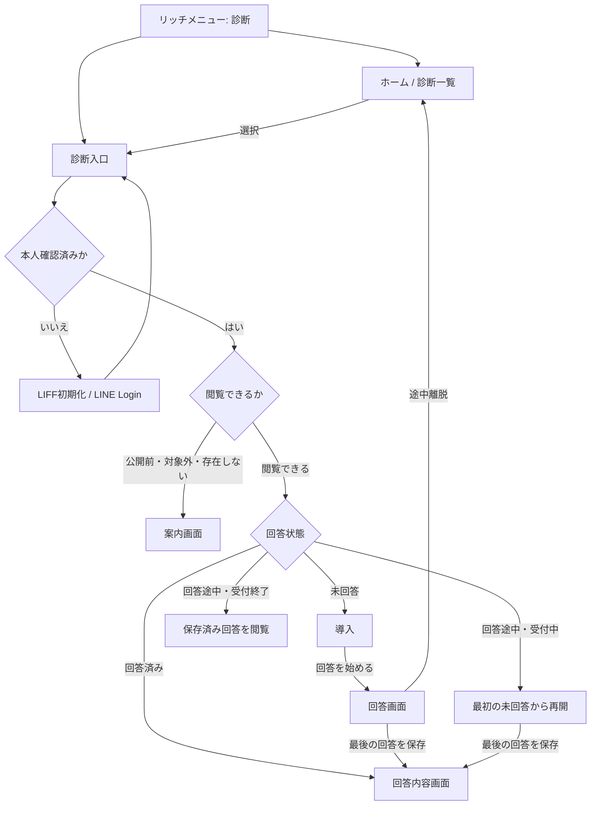
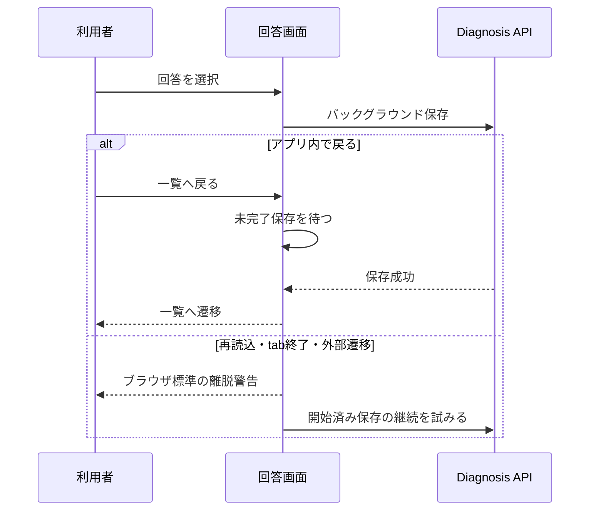

# Phase 1 診断体験設計

## 1. この文書の目的

この文書は、Phase 1でユーザーがLINEから診断を見つけ、LIFF上で回答し、回答内容を確認できるまでのUIと画面遷移を定義します。診断一覧、LINE通知、リッチメニューからの導線、および回答時の例外状態を所有します。

質問の作成主体と版管理、LINEとWebの役割、本人識別の原則は[プロジェクト概要](../product/project-overview.md#4-想定する利用体験)、共通のプロフィール入口と表示テーマは[プロフィール設定体験設計](../product/profile-settings-experience.md)を正とします。Question、Diagnosis、DiagnosisResponseの集約と状態は[Phase 1 診断ドメイン設計](diagnosis-domain-design.md)を正とします。データベース、APIスキーマ、配信基盤の実装方式はこの文書では定義しません。

## 2. 結論

一覧、通知、リッチメニューの3導線に加え、実際に回答できる状態には次のUIが必要です。

- ホーム（診断一覧）
- 診断を始める前の導入
- 1問1画面の回答画面
- 回答内容画面
- 対象外・公開前・受付終了を示す案内画面
- 認証中、読み込み中、通信失敗、データなしの各状態

「結果画面」という名称はAI分析や他ユーザーとの比較が表示されると誤解されるため、Phase 1では画面見出しを「回答結果」、回答の内訳を「回答内容」と呼びます。表示するのは本人が回答した質問、選択肢、回答日時と、版管理された決定的な計算規則による現在の傾向です。傾向の計算方法は[診断回答のパラメータ変換設計](scoring/parameter-scoring-design.md)を正とします。

スワイプは回答操作の演出として利用できますが、スワイプだけを入力手段にはしません。選択肢をタップできる操作を必ず用意し、誤操作とアクセシビリティ上の問題を避けます。

## 3. 画面と責務

| 画面 | 主な表示 | 主な操作 |
| --- | --- | --- |
| ホーム（診断一覧） | Relationship Categoryと回答状態が分かる画像サムネイル付き2列カード一覧、カテゴリ絞り込み、回答途中の進捗 | カテゴリを絞り込む、診断を選択する、回答済み一覧を開閉する |
| 導入 | 診断の画像、Relationship Category、診断名、診断の対象、回答時に思い浮かべる関係や場面、問数 | 回答を始める、一覧へ戻る |
| 回答 | Relationship Category、質問、選択肢、進捗、あとで回答 | 選択する、次へ進む、回答を完了する |
| 回答結果 | Relationship Category、回答から見える現在の傾向、回答時点の質問文と選択肢、回答日時 | 一覧または「わたしのまとめ」へ戻る |
| 案内 | 開けない理由と次の行動 | 一覧またはホームへ戻る、再読み込みする |

ホームはリッチメニューの「ホーム」の遷移先を曖昧にしないために必要です。上部ラベルを「私をひもとく」、見出しを「わたしの診断」とします。Phase 1では回答できる診断を画像サムネイル付きカード形式の2列で一覧表示し、プロフィール分析などを置きません。各カードには[診断ドメイン設計で定義するRelationship Category](diagnosis-domain-design.md#構成)のラベルを表示します。

未回答の診断を選択した場合は、質問の前に導入を表示します。一覧と同じ診断画像を大きく使い、診断が扱う対象を短く説明したうえで、Relationship Categoryに応じて「パートナーとの関係」「家族との関係」「友達との関係」「仕事で関わる人との関係」「普段の自分」のどれを思い浮かべて答えるかを伝えます。回答を特定の傾向へ誘導しないよう、採点軸、結果の両端を表すラベル、望ましい回答は導入に表示しません。回答途中では導入を挟まず、最初の未回答から再開します。

### 3.1 全画面共通の配色テーマ

診断一覧、回答、回答結果、案内、読み込みなどにも、プロフィールで選択したライトまたはダークテーマを適用します。選択、保存、復元、アクセシビリティは[プロフィール設定体験設計 §7](../product/profile-settings-experience.md#7-ライトダークテーマ)を正とし、この文書では診断固有の配色規則を重複して定義しません。

データ取得中のSkeleton UIは遷移先の配置に合わせます。診断一覧では画像サムネイル付き2列カード、導入では画像と説明カード、回答画面では進捗・質問カード・選択肢、回答結果では結果見出し・傾向の軸・回答内容の配置を示し、導入、回答画面、回答結果へ遷移している間に診断一覧のカードを表示しません。

一覧は「回答途中」「未回答」「回答済み」の順にセクションを分け、対象がないセクションは表示しません。「回答済み」は初期状態で折りたたみ、見出しから件数を確認して開閉できるようにします。各セクション内の順序は次のとおりです。

一覧上部にはタブで画面を分断せず、「全部」「パートナー」「家族」「友達」「仕事」「自分自身」の絞り込みチップを置きます。通常の初期状態は「全部」とします。`category`クエリで遷移した場合は、`partner`、`family`、`friend`、`work`、`general`のうち指定されたカテゴリを初期選択します。未指定または無効な値は「全部」として扱います。選択中のカテゴリはカテゴリごとの色と`aria-pressed`で伝えます。カード、回答画面、回答結果でも同じカテゴリ色のラベルを使います。ただし色だけで区別せず、カテゴリ名を常に表示します。絞り込み後も回答状態によるセクション分けと並び順は維持し、該当する診断がない場合は空であることを表示します。

一覧から診断を開いて戻った場合は、選択中のカテゴリ、回答済みセクションの開閉状態、一覧のスクロール位置を復元します。復元対象の位置がない初回表示では先頭を表示します。

| セクション | 並び順 |
| --- | --- |
| 回答途中 | 回答数の降順 |
| 未回答 | 運営がDiagnosisへ設定した表示順の昇順 |
| 回答済み | 最後に回答した日時の降順 |

同順位では表示順の昇順、さらに同じ場合はDiagnosis IDの昇順とし、表示が読み込みのたびに変わらないようにします。

一覧は少なくとも次の状態を区別します。

| 状態 | 一覧での表示 | 選択後 |
| --- | --- | --- |
| 未回答 | カード内に状態ラベルと問数を表示しない | 導入 |
| 回答途中 | カード内に回答数／全問数だけを「x/x」形式で表示する | 最初の未回答の質問 |
| 回答済み | カード内に状態ラベルと問数を表示しない | 回答内容画面 |
| 受付終了 | 「受付終了」 | 保存済み回答があれば閲覧専用の回答内容、なければ案内画面 |
| 公開停止 | 本人に回答履歴がある場合だけ「受付終了」として表示 | 保存済み回答があれば閲覧専用の回答内容、なければ案内画面 |

公開前、対象外、本人に回答履歴がない公開停止の診断は一覧へ表示しません。通知などの古い直接リンクから開かれた場合だけ、理由を過度に詳しく明かさない案内画面を表示します。

一覧全体のSkeletonは、表示できる既存データがない初回取得に限って表示します。開発用の回答データ全削除など、既存データへの操作中は一覧を維持し、操作箇所のSpinnerで処理中と伝えます。操作完了後の再取得でも一覧をSkeletonへ戻しません。

## 4. 入口を共通化した遷移

診断一覧とリッチメニューは、どちらも診断を識別する同じ入口へ遷移させます。定期的なLINE通知は送りません。入口で本人の回答状態と受付状態を確認し、表示先を決めます。リンク自体に本人性を示す情報は含めません。

受付終了または公開停止の後も、1件以上を保存したユーザーは自分の保存済み回答を確認できます。回答途中でも閲覧できますが、追加入力、再開、結果生成はできません。回答がないユーザーには新しい回答を許可しません。

## 5. 回答画面の振る舞い

- 質問は1問ずつ表示する
- Diagnosisへ固定されたRelationship Categoryのラベルを表示する
- 現在位置と全体の問数を表示する
- 回答数が全体の半分に達したときと、残りが全体の2割以下になったときは、それぞれの段階用に用意した文言から1つをランダムに選んで進捗の近くへ表示し、その質問への回答後に消す
- 全問への回答後は、完了用に用意した労いの文言から1つをランダムに選んで表示する
- 選択肢は質問カード内にタップ可能なボタンとして表示し、ボタン上を含むカード全体のスワイプ操作も同じ選択処理へ接続する
- 「普段の行動」と「大切にしたいこと」を対にした質問では、表面に普段の行動、裏面に大切にしたいことを表示し、2つのラベルと現在の面をカード上で常に確認できるようにする
- 表面の回答時はカードを画面外へ退場させず、選んだ左右の方向から回転して裏面を表示する。裏面の回答時は通常の質問と同じく選んだ方向へカードを退場させ、次の質問へ進む
- 裏面のない質問は、従来どおり1回の回答でカードを退場させる。タップと左右キーでも、各面のスワイプと同じ反転または退場を行う
- 選択後はサーバー保存の完了を待たずにカードを退場させ、次の質問へ進む。各問の保存はバックグラウンドで行い、成功後に進捗を更新する
- 選択はタップまたはスワイプ解放時に即時確定し、前の質問へ戻る操作、確認、undoを設けない
- バックグラウンド保存の通信失敗時も選択内容を保持し、全問の操作後に同じ内容で再試行できるようにする
- 「あとで回答」で一覧へ戻り、次回は最初の未回答から再開する
- 全問の操作後に未完了のバックグラウンド保存があれば待機画面を表示し、最後の回答が保存された後だけ「回答済み」として回答内容画面へ移動する
- 一覧の「回答済み」から開いた場合は、サーバーへ保存された回答内容を取得し、同じ設定版で傾向を再計算して表示する
- 受付終了または公開停止の後は、保存済み回答があれば閲覧専用で表示し、回答途中では傾向を生成しない
- 回答結果画面では傾向を1枚のカードにまとめて先に表示する。各傾向は中央を基準とし、左右どちらへ寄っているかを示す軸で表現する
- 質問ごとの回答内容は初期状態で折りたたむ
- 回答完了後は「一覧へ」だけを回答内容のカード外に表示し、「もう一度」を設けない
- 回答内容のカードは、表示する結果項目の数に応じて高さを広げ、項目をカード外へはみ出させない
- 二重タップや再送で同じ回答が重複しないようにする

診断回答の個別の修正・削除は提供しません。公開後に質問が改訂されても既存回答の意味を別の質問文へ付け替えず、回答時点の質問の版を表示します。2択はタップ、左右スワイプ、左右キー、5段階は常時表示する5ボタンのタップまたはkeyboard focusとEnterで回答し、5段階へスワイプを割り当てません。詳細は[診断回答形式の実装境界](../development/diagnosis-format-remaining-tasks.md)を正とします。

## 6. LINE通知

通知は「診断へ来てもらう」役割だけを持ち、トーク上で回答を取得しません。

- 診断名または短いテーマを表示する
- 回答期限がある場合は表示する
- CTAは「診断に答える」とする
- CTAは対象診断のLIFF URLへ遷移する
- URLには診断を識別する情報だけを含め、Account IDや認証トークンを含めない
- 配信後に回答済みとなった場合でも、クリック時の入口判定により回答内容画面を表示する
- 公開停止や期限切れとなった場合は案内画面を表示する

未回答者だけへの絞り込みは通知量を減らすために有効ですが、配信判定とクリックの間で状態は変わり得ます。最終判断は必ずクリック後の入口で行います。

## 7. リッチメニュー

リッチメニューは左右を同じ幅のタップ領域に分け、本人向け情報と診断の入口を常に並べます。

| 項目 | 遷移先 | 役割 |
| --- | --- | --- |
| 私を知る | LIFFの「わたしのまとめ」 | これまでの診断と日記を横断したまとめを振り返る |
| 診断を行う | LIFFのホーム（診断一覧） | 過去・現在の診断を探す |

左の「私を知る」は「わたしのまとめ」へ、右の「診断を行う」は診断一覧へ直接遷移させます。「診断を行う」を今日の診断へ直接遷移させると、回答済みの内容や過去の回答を探せません。そのため診断側は一覧を表示するホームへ遷移させ、LINE通知を今日の診断への最短導線にします。

## 8. 共通状態と復帰先

| 状態 | 表示と復帰方法 |
| --- | --- |
| LIFF初期化・本人確認中 | ローディングを表示し、完了後に元のURLの判定を再開する |
| 友だち追加が必要 | 必要性を説明し、追加後に再試行できるようにする |
| 通信失敗 | エラー内容を簡潔に示し、同じ操作を再試行できるようにする |
| 一覧が空 | ホームに「回答できる診断はありません」と表示する |
| 直接リンクの対象が無効 | 回答できない旨を示し、一覧への導線を表示する |
| 保存中 | 回答中は次の質問の操作を続ける。アプリ内で一覧へ戻る場合と全問の操作後は未完了の保存を待ち、各質問への重複送信は防ぐ |
| 保存失敗 | 選択を保持して再試行を表示する。アプリ内では保存成功まで一覧へ遷移しない |

アプリ内の戻る操作では、一覧から開いた場合と回答画面の直接リンクから開いた場合のどちらも未完了の回答保存を待ち、保存成功後だけ履歴上の遷移先へ移動します。保存中に戻る操作が続いた場合も最新の遷移先を保存完了まで表示せず、保存に失敗した場合は回答画面に留まり、保持した同じ回答を再試行できる状態にします。

ページ再読込、tab終了、外部サイトへの遷移では、未完了または保存失敗の回答がある間だけブラウザ標準の離脱警告を表示し、利用者が離脱を取り消せるようにします。離脱が続行された場合も開始済みの保存を可能な範囲で継続しますが、ブラウザやOSによる強制終了、LINE内WebViewの強制終了、通信断、端末の電源断では処理時間を確保できません。このため、最後の回答が必ず保存されるという絶対保証は行いません。

## 9. 実際に診断できる状態の完了条件

UIを表示できるだけでは完了としません。Phase 1の縦切りは次を満たした状態です。

- 運営が審査済みの質問と選択肢を公開できる
- 本人確認済みのユーザーごとに一覧と回答状態を取得できる
- 一覧・通知のどちらからでも同じ診断入口を開ける
- 1問以上へ回答し、再読み込み後も回答内容を確認できる
- 途中離脱後に続きから再開できる
- 未回答、回答途中、回答済み、受付終了の遷移を確認できる
- LINEへ対象診断の通知を配信できる
- リッチメニューの「私を知る」と「診断を行う」が、それぞれ正しいLIFF画面を開く
- 認証失敗、保存失敗、無効な直接リンクで白画面にならない

質問を作るための管理画面は、この完了条件には必須としません。Phase 1では安全な設定ファイルや運営用スクリプトでも構いませんが、公開前の審査と公開済み質問の版を保つ手順は必要です。

## 10. この設計で決めないこと

- Question、Diagnosis、DiagnosisResponseの物理データモデル
- APIのパス、リクエスト、レスポンスの具体形
- LINE通知の配信時刻と頻度の最適化
- 回答の集計結果を他ユーザーと比較する相性体験（[相性診断・うつし共有体験設計](../product/compatibility-experience.md)を正とする）
- 回答から生成する性格分析やプロフィール要約
- 複数選択、自由記述、画像回答の個別UI
- 保存済み診断回答の確認UIの視覚的な詳細

複数選択、自由記述、画像回答は必要性を改めて判断するまで追加しません。診断回答の訂正・削除UIは将来対象にも含めません。
