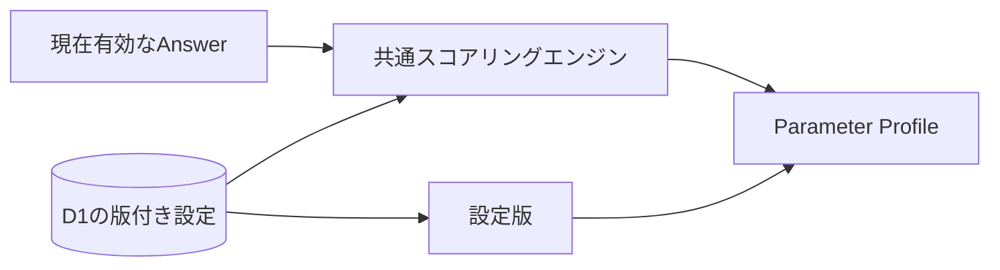
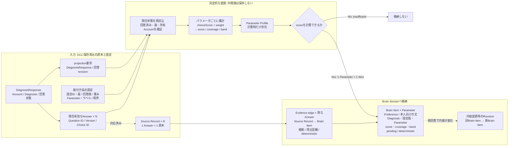
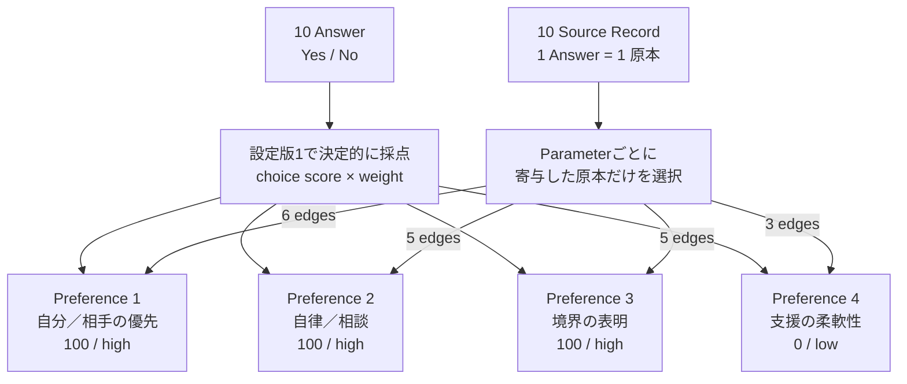
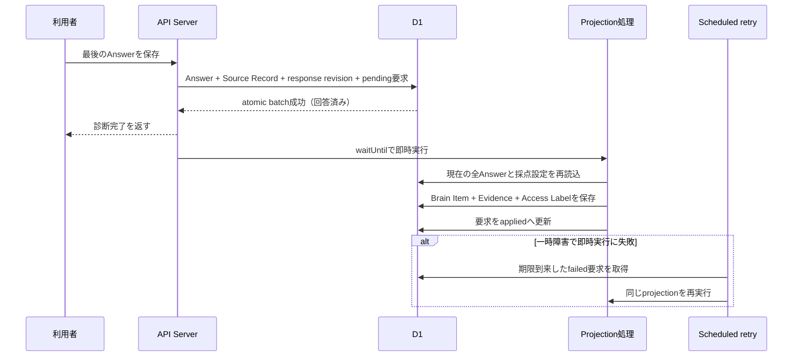

# 診断回答のパラメータ変換設計

## 1. この文書の目的

この文書は、診断回答を複数のパラメータへ決定的に変換する共通方式を定義します。診断ごとに与える設定、共通の計算手順、入力の検証、出力、版管理を所有します。

最初の診断固有のパラメータと重みは[「自分と相手の優先・境界線」パラメータ変換設計](relationship-priority-parameter-design.md)を正とします。Question / Diagnosis / Answerは[Phase 1 診断ドメイン設計](../diagnosis-domain-design.md)、Brain Itemの分類と`Confidence`は[Brain内部情報の分類](../../domain/brain/brain-content-taxonomy.md)を正とします。

## 2. 結論

計算処理はすべての診断で共通にし、違いを設定として渡します。

実行時の版付き採点設定はD1、共通計算はAPI Serverが所有し、保存済み回答の取得時に計算済み結果を返します。Diagnosisは公開時に採点設定IDを固定します。Web UIは質問・採点設定・診断IDの対応表を保持せず、診断詳細APIの質問と回答内容APIの計算結果を表示します。



診断固有の設定が持つものは次のとおりです。

| 設定 | 役割 |
| --- | --- |
| `version` | 使用した変換規則を識別する |
| `parameters` | パラメータID、表示名、低い側・高い側のラベル |
| `choiceScores` | 回答値を-1〜1へ変換する |
| `questions` | Question ID、Question Version、パラメータごとの重み |
| `minimumCoverage` | スコアを表示できる最低回答充足率 |
| `lowMaximum` | 低い側と中央の境界 |
| `highMinimum` | 中央と高い側の境界 |
| `balancedLabel` | 中央帯の表示名 |

質問文、選択肢、重み、パラメータの意味は診断固有です。回答の検証、集計、正規化、回答不足判定、帯域判定は共通です。

## 3. 設定形式

設定は次の形で与えます。例は説明用であり、特定診断のSSoTではありません。

```ts
{
  version: 1,
  parameters: [
    {
      id: "planning",
      label: "計画性",
      lowLabel: "即興を好む",
      highLabel: "計画を好む",
    },
  ],
  choiceScores: { yes: 1, no: -1 },
  questions: {
    "question-id": {
      questionVersion: 1,
      weights: { planning: 0.5 },
    },
  },
  minimumCoverage: 0.6,
  lowMaximum: 35,
  highMinimum: 65,
  balancedLabel: "状況による",
}
```

`choiceScores`はYes／Noに限定しません。たとえば`agree: 1`、`neutral: 0`、`disagree: -1`を設定すれば、同じ計算処理で3択を扱えます。

1問は複数のパラメータへ寄与できます。重みが正なら回答値の正方向、負なら逆方向へ動かします。重みを持たないパラメータには寄与しません。

## 4. 共通の計算手順

パラメータごとに次を計算します。

```text
加重和 = Σ（choiceScores[回答値] × 質問の重み）
回答済み重み = Σ（abs（質問の重み）× 最大回答値）
生スコア = 加重和 ÷ 回答済み重み
表示スコア = round（50 + 50 × 生スコア）
coverage = 回答済み重み ÷ そのパラメータの全重み
```

`最大回答値`は、`choiceScores`の絶対値の最大です。これにより、重みと回答尺度が変わっても0〜100へ正規化できます。

処理順は次のとおりです。

1. 同じQuestion IDへ複数回答があれば、最後の回答を現在値とする
2. スキップ、未知のQuestion ID、未知の回答値を除外する
3. 設定のQuestion Versionと一致しない回答を除外する
4. パラメータごとに加重和、回答済み重み、`coverage`を計算する
5. `coverage`が`minimumCoverage`未満なら、スコアを`null`にする
6. それ以外は0〜100へ正規化し、低・中央・高の帯域を決める

## 5. 不変条件

設定を外部ファイルやDBから受け取る場合は、次の不変条件を共通スキーマで検証してから計算します。コード内の設定は型検査と単体テストで同じ条件を保証し、保存済み回答のQuestion VersionやChoice IDが設定と一致しない場合は採点対象から除外します。

- 設定版は1以上の整数とする
- Parameter IDは設定内で重複させない
- 各Parameter IDには、少なくとも1問の0以外の有限な重みを割り当てる
- `choiceScores`は1件以上を持ち、すべて-1〜1の有限値とする
- Question Versionは1以上とする
- 質問定義とスコアリング設定のQuestion IDは過不足なく一致させる
- 同じQuestion IDのQuestion Versionは質問定義とスコアリング設定で一致させる
- 質問が持つ選択値は`choiceScores`に定義する
- `minimumCoverage`は0〜1とする
- 帯域境界は0〜100に置き、`lowMaximum < highMinimum`とする
- 同じ入力回答と同じ設定版からは、常に同じ出力を返す
- スコアの向きに良し悪しを持たせない
- `coverage`を統計的な`Confidence`として扱わない

## 6. 版管理

結果は少なくとも、使用したQuestion ID、Question Version、選択値、設定版から再現できる必要があります。

質問文・選択肢を変更する場合はQuestion Versionを追加します。パラメータ、重み、回答値の変換、表示境界を変更する場合は設定版を追加します。過去の回答結果を、新しい設定版で暗黙に読み替えません。

## 7. 新しい診断を追加する手順

1. 質問と選択肢を審査し、Question IDとQuestion Versionを確定する
2. 独立して表示したいパラメータと両端の意味を決める
3. 選択値のスコアを決める
4. 各質問が各パラメータへ与える重みを設定する
5. 最低回答充足率と表示境界を設定する
6. D1の版付き採点設定へ重みを追加し、Diagnosisから参照する
7. 本人による評価と再回答データで、質問と重みの妥当性を検証する

新しい計算関数は作りません。新しい設定と、その設定を検証するテストだけを追加します。

## 8. Brain Itemへのprojection

全問へ回答して`DiagnosisResponse`が回答済みになったとき、Parameter ProfileをBrain domainへprojectionします。DiagnosisのAnswerとSource Recordは原本であり、Brain Itemはそれらから再生成できる派生情報です。Brain Itemの分類と共通属性は[Brain内部情報の分類](../../domain/brain/brain-content-taxonomy.md)、根拠エッジの属性は[根拠・反証・改訂のエッジ設計](../../domain/brain/evidence-edge-design.md)を正とします。



実線の入力・出力は保存する概念です。`Parameter Profile`は変換中だけの値であり、そのまま保存しません。Answerに対応するSource Recordはprojection時に作るのではなく、回答保存時点ですでに原本として存在します。

### 8.1 作成単位と内容

計算可能なパラメータ1件につき、Brain Itemを1件作ります。診断全体を1件へまとめると、パラメータごとに異なる根拠、確認、改訂を扱えないためです。

| 格納先と要素 | 診断結果から設定する値 |
| --- | --- |
| Brain Item: 分類 | `Preference` |
| Brain Item: 本人が確認できる文 | `{パラメータ表示名}は「{帯域の表示名}」の傾向がある` |
| Brain Item: 分類固有属性 | Diagnosis ID、採点設定IDと版、Parameter ID、score、coverage、band |
| Brain Item: Derivation | `deterministic` |
| Brain Item: Confirmation | `pending` |
| Brain Item: Confidence | `uncomputed` |
| Brain Item: Stability | 変化しやすい |
| Brain Item: Access Label | `unclassified` |
| Brain Item: 状態 | `active` |
| Evidence edge: 接続先 | 採点へ寄与したAnswerに対応するSource Record → Brain Item |
| Evidence edge: 属性 | 根拠、導出契機、`deterministic`、生成時点 |
| Revision: 接続先 | 内容が変わった場合のみ、旧Brain Item → 新Brain Item |

帯域の表示名は、`low`では`lowLabel`、`balanced`では`balancedLabel`、`high`では`highLabel`を使用します。`score = null`または`band = insufficient`のパラメータはBrain Itemにしません。`coverage`は計算の充足率であり、Brain ItemのConfidenceへ転用しません。

診断への回答は本人の入力ですが、Parameter Profileはその回答から導出した命題です。結果画面などで本人が明示的に承認するまでは`pending`とし、助言、Vectorize、MCP提供には使用しません。

### 8.2 Evidence

各Brain Itemには、そのパラメータの0以外の重みを持つQuestionへ現在有効なAnswerが対応づけているSource Recordを、導出契機の根拠として結びます。エッジのrelationは根拠、evidence roleは導出契機、derivation methodは`deterministic`です。

採点に寄与しないQuestionのSource Recordを根拠へ含めません。Brain ItemとEvidenceの所有Accountが一致しない場合はprojectionを行いません。

### 8.3 冪等性と再計算

同じAccount、Diagnosis、採点設定版、Parameter IDの組み合わせは、同じprojection単位として扱います。通信再送や処理再試行で同じBrain ItemとEvidenceを増やしません。

回答修正または削除後に再び回答済みになった場合は、現在有効なAnswerだけで再計算します。内容が変わる場合は既存Brain Itemを上書きせず、新しいBrain Itemを作って改訂関係を結びます。内容が同じ場合は新しい版を作りません。根拠がなくなったItemの利用可否は[Source Recordのライフサイクル設計](../../domain/source/source-record-lifecycle-design.md)に従います。

### 8.4 実行境界

Answer保存と同じ原子的な処理へ、冪等なprojection要求を登録します。projection処理は要求を受け取った時点のD1を読み直し、全問回答済みであることを確認してから計算・保存します。最後の回答リクエストが完了を推測して直接Itemを作る方式にはしません。並行して別のQuestionへ回答された場合や一時障害時にも、再実行によって収束させるためです。

projection要求の再配送では現在状態を再評価します。回答途中なら正常終了し、回答済みなら同じ冪等キーで保存します。採点設定がない、または設定検証に失敗したDiagnosisではBrain Itemを作りません。

### 8.5 具体例: 「自分と相手の優先・境界線」

以下は、設定版1の10問すべてへ回答した場合に、どのデータがどのBrain Itemへ変換されるかを示す具体例です。パラメータ、重み、両端の意味は[診断固有の設計](relationship-priority-parameter-design.md)を正とし、ここではprojectionの結果だけを説明します。

#### 入力例

| Question | 回答 | 回答時に作成済みの原本 |
| --- | --- | --- |
| 1 | Yes | `source-q1` |
| 2 | No | `source-q2` |
| 3 | No | `source-q3` |
| 4 | No | `source-q4` |
| 5 | Yes | `source-q5` |
| 6 | No | `source-q6` |
| 7 | No | `source-q7` |
| 8 | Yes | `source-q8` |
| 9 | No | `source-q9` |
| 10 | Yes | `source-q10` |

1つのAnswerごとに1つのSource Recordがすでに存在します。projectionはこの10件をコピーせず、現在有効なAnswerと対応するSource Record IDを読み取ります。

#### 変換結果

この入力から、診断全体を要約した1件ではなく、計算可能な4パラメータに対応する4件のBrain Itemを保存します。

| Parameter ID | score / band | 保存するstatement | EvidenceにするSource Record |
| --- | --- | --- | --- |
| `priority-balance` | `100 / high` | 自分／相手の優先は「自分の余裕を優先しやすい」の傾向がある | `source-q1`, `source-q2`, `source-q3`, `source-q7`, `source-q9`, `source-q10` |
| `autonomy` | `100 / high` | 自律／相談は「個人の判断を尊重」の傾向がある | `source-q4`, `source-q5`, `source-q6`, `source-q8`, `source-q10` |
| `boundary-expression` | `100 / high` | 境界の表明は「境界を伝えやすい」の傾向がある | `source-q1`, `source-q3`, `source-q7`, `source-q8`, `source-q10` |
| `support-flexibility` | `0 / low` | 支援の柔軟性は「自分の予定を守りやすい」の傾向がある | `source-q2`, `source-q9`, `source-q10` |

あるパラメータの重みを持たないQuestionは、そのBrain ItemのEvidenceに含めません。同じSource Recordが複数のパラメータへ寄与する場合は、複数のBrain Itemと結ばれます。



#### 1件の保存内容

`priority-balance`から作るBrain Itemは、概念上は次の内容です。IDと日時は実行時に決まります。

```yaml
brain_item:
  id: <generated-brain-item-id>
  category: preference
  statement: 自分／相手の優先は「自分の余裕を優先しやすい」の傾向がある
  attributes:
    diagnosisId: relationship-priority
    scoringConfigId: relationship-priority-v1
    scoringVersion: 1
    parameterId: priority-balance
    score: 100
    coverage: 100
    band: high
  derivation: deterministic
  confirmation: pending
  confidence:
    state: uncomputed
  stability: changeable
  sensitivity: normal
  externallyShareable: false
  status: active
  validFrom: <projection日時>

access_label:
  label: unclassified
  confirmation: pending
  assignedBy: system
```

このBrain Itemには、表に挙げた6件のSource RecordそれぞれからEvidence edgeを1件ずつ張ります。各edgeは`relation = supports`、`isDerivationTrigger = true`、`derivationMethod = deterministic`を持ちます。

`pending`と`unclassified`で保存するため、診断完了だけで本人確認済みになったり、外部共有可能になったりはしません。また、Answer本文、診断全体を断定する人物像、相性や良し悪しはBrain Itemへ保存しません。

#### 再回答時

再回答によって`priority-balance`のstatementまたはattributesが変わる場合、旧Brain Itemを上書きしません。旧Itemを`superseded`、新Itemを`active`として保存し、旧Itemから新ItemへRevisionを結びます。再計算後もstatementとattributesが同じならItemを増やさず、新しく根拠になったSource RecordとのEvidenceだけを補います。

### 8.6 診断完了直後の実行

利用者から見た動作は診断完了直後の生成です。外部Queueは使用しません。D1のprojection要求は、回答保存とBrain Item保存を疎結合にし、一時障害時にも処理を失わないための内部レコードです。



## 9. 現在の実装境界

`diagnosis_scoring_configs`が設定版と設定JSONを保持し、公開済みDiagnosisの`scoring_config_id`は変更しません。API ServerはDBから取得した設定をValibotで検証し、AnswerのQuestion ID、Question Version、Choice IDから表示のたびに結果を再計算します。

クライアントの算出値は正として扱いません。Brain Item projectionはサーバー側で同じ共通スコアリングエンジンと版付き採点設定を使用します。採点設定を持たないDiagnosisでは回答内容だけを返し、Brain Itemを生成しません。
