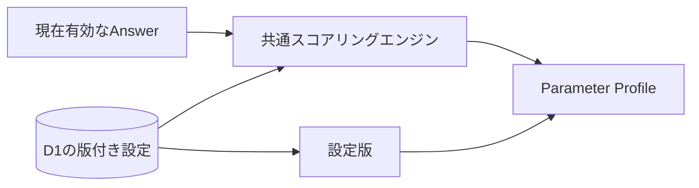

# 診断回答のパラメータ変換設計

## 1. この文書の目的

この文書は、診断回答を複数のパラメータへ決定的に変換する共通方式を定義します。診断ごとに与える設定、共通の計算手順、入力の検証、出力、版管理を所有します。

最初の診断固有のパラメータと重みは[「自分と相手の優先・境界線」パラメータ変換設計](relationship-priority-parameter-design.md)を正とします。Question / Diagnosis / Answerは[Phase 1 診断ドメイン設計](../diagnosis-domain-design.md)、Brain Itemの分類と`Confidence`は[Brain内部情報の分類](../../domain/brain/brain-content-taxonomy.md)を正とします。

## 2. 結論

計算処理はすべての診断で共通にし、違いを設定として渡します。

実行時の版付き採点設定はD1、共通計算はAPI Serverが所有し、保存済み回答の取得時に計算済み結果を返します。Diagnosisは公開時に採点設定IDを固定します。Web UIは質問・採点設定・診断IDの対応表を保持せず、診断詳細APIの質問と回答内容APIの計算結果を表示します。



診断固有の設定が持つものは次のとおりです。

| 設定 | 役割 |
| --- | --- |
| `version` | 使用した変換規則を識別する |
| `parameters` | パラメータID、表示名、低い側・高い側のラベル、任意の審査済み関わり方文 |
| `choiceScores` | 回答値を-1〜1へ変換する |
| `questions` | Question ID、Question Version、パラメータごとの重み |
| `minimumCoverage` | スコアを表示できる最低回答充足率 |
| `lowMaximum` | 低い側と中央の境界 |
| `highMinimum` | 中央と高い側の境界 |
| `balancedLabel` | 中央帯の表示名 |

質問文、選択肢、重み、パラメータの意味は診断固有です。回答の検証、集計、正規化、回答不足判定、帯域判定は共通です。

## 3. 設定形式

設定は次の形で与えます。例は説明用であり、特定診断のSSoTではありません。

```ts
{
  version: 1,
  parameters: [
    {
      id: "planning",
      label: "計画性",
      lowLabel: "即興を好む",
      highLabel: "計画を好む",
      relationshipRequests: {
        high: "予定を早めに相談してもらえるとうれしいです。",
      },
    },
  ],
  choiceScores: { yes: 1, no: -1 },
  questions: {
    "question-id": {
      questionVersion: 1,
      weights: { planning: 0.5 },
    },
  },
  minimumCoverage: 0.6,
  lowMaximum: 35,
  highMinimum: 65,
  balancedLabel: "状況による",
}
```

`choiceScores`はYes／Noに限定しません。たとえば`agree: 1`、`neutral: 0`、`disagree: -1`を設定すれば、同じ計算処理で3択を扱えます。

1問は複数のパラメータへ寄与できます。重みが正なら回答値の正方向、負なら逆方向へ動かします。重みを持たないパラメータには寄与しません。

`relationshipRequests`は相性共有で「こうしてもらえるとうれしい」と表示する、審査済みの一人称の定型文です。`low`、`balanced`、`high`のうち文を用意した帯域だけを設定し、設定がない帯域では関わり方を推測・表示しません。診断結果画面やBrain Itemの本文には表示せず、相性共有専用の表示へだけ渡します。

## 4. 共通の計算手順

パラメータごとに次を計算します。

```text
加重和 = Σ（choiceScores[回答値] × 質問の重み）
回答済み重み = Σ（abs（質問の重み）× 最大回答値）
生スコア = 加重和 ÷ 回答済み重み
表示スコア = round（50 + 50 × 生スコア）
coverage = 回答済み重み ÷ そのパラメータの全重み
```

`最大回答値`は、`choiceScores`の絶対値の最大です。これにより、重みと回答尺度が変わっても0〜100へ正規化できます。

処理順は次のとおりです。

1. 同じQuestion IDへ複数回答があれば、最後の回答を現在値とする
2. スキップ、未知のQuestion ID、未知の回答値を除外する
3. 設定のQuestion Versionと一致しない回答を除外する
4. パラメータごとに加重和、回答済み重み、`coverage`を計算する
5. `coverage`が`minimumCoverage`未満なら、スコアを`null`にする
6. それ以外は0〜100へ正規化し、低・中央・高の帯域を決める

## 5. 不変条件

設定を外部ファイルやDBから受け取る場合は、次の不変条件を共通スキーマで検証してから計算します。コード内の設定は型検査と単体テストで同じ条件を保証し、保存済み回答のQuestion VersionやChoice IDが設定と一致しない場合は採点対象から除外します。

- 設定版は1以上の整数とする
- Parameter IDは設定内で重複させない
- 各Parameter IDには、少なくとも1問の0以外の有限な重みを割り当てる
- `choiceScores`は1件以上を持ち、すべて-1〜1の有限値とする
- Question Versionは1以上とする
- 質問定義とスコアリング設定のQuestion IDは過不足なく一致させる
- 同じQuestion IDのQuestion Versionは質問定義とスコアリング設定で一致させる
- 質問が持つ選択値は`choiceScores`に定義する
- `minimumCoverage`は0〜1とする
- 帯域境界は0〜100に置き、`lowMaximum < highMinimum`とする
- 同じ入力回答と同じ設定版からは、常に同じ出力を返す
- `relationshipRequests`を設定する場合は、低・中央・高のうち1つ以上に空でない審査済み文を持たせる
- スコアの向きに良し悪しを持たせない
- `coverage`を統計的な`Confidence`として扱わない

## 6. 版管理

結果は少なくとも、使用したQuestion ID、Question Version、選択値、設定版から再現できる必要があります。

質問文・選択肢を変更する場合はQuestion Versionを追加します。パラメータ、重み、回答値の変換、表示境界を変更する場合は設定版を追加します。既に設定済みの`relationshipRequests`を改訂する場合も設定版を追加し、過去の回答結果を新しい設定版で暗黙に読み替えません。

`relationshipRequests`の初回導入に限り、採点値へ影響せず、かつ対象プロパティが未設定の既存採点設定へ審査済み文を条件付きで補完できます。この互換補完では設定版を変えず、診断catalog versionを上げてAccountDataのsnapshotを再同期します。補完済みの文は上書きしません。具体的なseed手順と制約は[診断seed運用 §3](../../development/diagnosis-seed.md#3-seedの原則)を正とします。

## 7. 新しい診断を追加する手順

1. 質問と選択肢を審査し、Question IDとQuestion Versionを確定する
2. 独立して表示したいパラメータと両端の意味を決める
3. 選択値のスコアを決める
4. 各質問が各パラメータへ与える重みを設定する
5. 最低回答充足率と表示境界を設定する
6. D1の版付き採点設定へ重みを追加し、Diagnosisから参照する
7. 本人による評価と再回答データで、質問と重みの妥当性を検証する

新しい計算関数は作りません。新しい設定と、その設定を検証するテストだけを追加します。

## 8. Brain Itemへのprojection

全問へ回答して`DiagnosisResponse`が回答済みになった後、Parameter ProfileをBrain domainへprojectionします。診断と日記に共通する生成入出力、診断projectionが作るBrain ItemとEvidence、登録タイミング、再回答時の改訂は[Brain Item生成設計 §6](../../domain/brain/brain-item-generation-design.md#6-診断回答からの生成)を正とします。

この文書が所有するのは、projectionの入力となるParameter Profileの計算方式です。Parameter Profileは変換中だけの値であり、独立したレコードとして保存しません。

## 9. 現在の実装境界

`diagnosis_scoring_configs`が設定版と設定JSONを保持し、公開済みDiagnosisの`scoring_config_id`は変更しません。初回導入時の未設定`relationshipRequests`だけは前節の条件で補完しますが、採点パラメータ、重み、境界、設定版は変更しません。API ServerはDBから取得した設定をValibotで検証し、AnswerのQuestion ID、Question Version、Choice IDから表示のたびに結果を再計算します。

クライアントの算出値は正として扱いません。Brain Item projectionはサーバー側で同じ共通スコアリングエンジンと版付き採点設定を使用します。採点設定を持たないDiagnosisでは回答内容だけを返し、Brain Itemを生成しません。

`likert_5`は表示順に`-1 / -0.5 / 0 / 0.5 / 1`へ固定し、AIはこの決定論的scoreを再解釈しません。比較できるのは同じDiagnosis、Question Version、scoring configの回答だけです。本人が選んだChoiceとscoreは原本から再現し、AIによる説明は推定として分離します。
