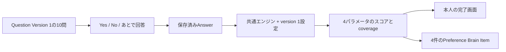

# 「自分と相手の優先・境界線」パラメータ変換設計

## 1. この文書の目的

この文書は、最初の診断「自分と相手の優先・境界線」に固有のパラメータ、質問ごとの重み、表示設定、現在の実装範囲を所有します。

共通の設定形式と計算手順は[診断回答のパラメータ変換設計](parameter-scoring-design.md)、質問文は[人間関係の価値観 Yes／No質問集 §3.1](../content/relationship-values-yes-no-question-bank.md#31-自分と相手の優先境界線)、Question / Diagnosis / Answerの責務は[Phase 1 診断ドメイン設計](../diagnosis-domain-design.md)を正とします。他の話題の設定、統計的な学習、Brain Itemとしての永続化、Brainの`Confidence`算出はこの文書では定義しません。

## 2. 結論

機械学習は使用せず、[共通スコアリングエンジン](parameter-scoring-design.md)へ版管理した設定を渡します。10問の組み合わせを個別のパターンへ分類せず、各回答を次の4軸へ加算します。

| パラメータ | 低い側 | 高い側 | 表すもの |
| --- | --- | --- | --- |
| 自分／相手の優先 | 相手を優先しやすい | 自分の余裕を優先しやすい | 要求が競合したときの優先傾向 |
| 自律／相談 | 相談・共有を重視 | 個人の判断を尊重 | 決定や説明をどの程度共有するか |
| 境界の表明 | 内側で調整しやすい | 境界を伝えやすい | 断ることや責任範囲を表明できるか |
| 支援の柔軟性 | 自分の予定を守りやすい | 相手のために調整しやすい | 相手が困ったとき予定を変えられるか |

軸の両側に優劣はありません。たとえば「自分の余裕を優先」と「相手のために調整」は別の軸なので、同時に高くなることがあります。

## 3. 質問と重みの対応

Yesを`+1`、Noを`-1`へ変換します。表の重みが正ならYesがパラメータの高い側、負ならYesが低い側へ寄与します。`—`の質問はそのパラメータへ使用しません。

これは、version 1では各文への不同意を反対方向の弱い証拠として扱うという仮定です。実際のNoには「場合による」「質問の前提に同意できない」も含まれ得ます。利用データの検証でこの仮定が合わない質問は、Noを計算対象外にするか質問文を新しい版へ改訂します。

| 質問 | 自分／相手の優先 | 自律／相談 | 境界の表明 | 支援の柔軟性 |
| --- | --- | --- | --- | --- |
| 1 | 1 | — | 1 | — |
| 2 | -1 | — | — | 1 |
| 3 | -1 | — | -1 | — |
| 4 | — | -1 | — | — |
| 5 | — | 1 | — | — |
| 6 | — | -1 | — | — |
| 7 | -1 | — | -1 | — |
| 8 | — | 1 | 1 | — |
| 9 | -1 | — | — | 1 |
| 10 | 1 | 0.5 | 1 | -1 |

質問番号だけでなく、実装ではQuestion IDとQuestion Versionに対応させます。公開後に質問文や重みを変更する場合は、質問版と変換規則の版を更新し、過去の結果を別の規則で読み替えません。

## 4. 共通エンジンへ渡す設定値

計算式と入力の扱いは[共通の計算手順](parameter-scoring-design.md#4-共通の計算手順)に従います。この診断固有の設定は次のとおりです。

| 設定 | 値 |
| --- | --- |
| 設定版 | 1 |
| Yesの回答値 | 1 |
| Noの回答値 | -1 |
| 最低回答充足率 | 60% |
| 低い側 | 0〜35 |
| 中央 | 36〜64 |
| 高い側 | 65〜100 |
| 中央の表示名 | 状況に応じて調整 |

### 表示条件

| 条件 | 表示 |
| --- | --- |
| `coverage < 60%` | 回答不足。数値と傾向ラベルを表示しない |
| `coverage >= 60%`かつスコアが0〜35 | 低い側の傾向 |
| `coverage >= 60%`かつスコアが36〜64 | バランス型・状況による |
| `coverage >= 60%`かつスコアが65〜100 | 高い側の傾向 |

`coverage`は、その軸に必要な回答がどれだけ揃ったかを示す値です。統計的な確信度やBrain Itemの`Confidence`ではありません。すべて回答しても、質問自体の妥当性が証明されたことにはなりません。

## 5. 算出例

質問1へYes、質問2へNo、質問3へNo、質問7へNo、質問9へNo、質問10へYesと答えた場合、「自分／相手の優先」ではすべて高い側へ寄与します。

```text
加重和 = 6
回答済み重み = 6
表示スコア = 50 + 50 × (6 ÷ 6) = 100
coverage = 6 ÷ 6 = 100%
```

表示は「自分の余裕を優先しやすい 100」とします。これは回答の組み合わせを要約したもので、相手を大切にしないという評価ではありません。「支援の柔軟性」は別に算出します。

## 6. 実装境界

現在は、Web UIが回答内容APIから取得した保存済み回答を使い、回答完了画面と回答内容画面で結果を表示します。回答済みになったDiagnosisResponseは、[共通のBrain Item生成](../../domain/brain/brain-item-generation-design.md#6-診断回答からの生成)によって4パラメータを4件の`Preference`へ変換します。



- Answerはサーバーへ保存し、回答画面向けのParameter Profileは取得時に再計算する
- Parameter Profileを独立したレコードとしては保存せず、パラメータごとの命題をBrain Itemとして保存する
- 相性、人物の良し悪し、安全性を判定しない
- 結果には「回答から見える現在の傾向」であることを表示する
- 再回答時は、現在の回答だけから再計算する

## 7. 機械学習へ移行する条件

最初の版では、教師となる正解データがないため学習モデルを使いません。次が揃った後に、固定重みとの比較対象として線形モデルや項目反応理論を検討します。

- 十分な人数の回答
- 本人による各パラメータの自己評価
- 時間を空けた再回答による安定性の確認
- 質問ごとの識別力と偏りの検証
- 学習用と評価用を分けた精度評価

学習後も、入力した回答、使用したモデル版、出力したパラメータを追跡できることを必須とします。
