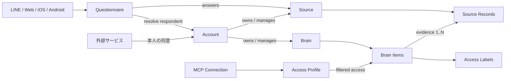

# me-builder ドメイン設計

## 1. この文書の目的

me-builderの中核となる`Account`、`Brain`、`Source`の責務、境界、関係と、Phase 1の入力を担う`Questionnaire`の位置づけを整理します。

Questionnaireの詳細な論理モデルは[Phase 1 アンケートドメイン設計](questionnaire-domain-design.md)を正とします。データベース、API、認証製品、LLM、MCPの具体的な実装方式はこの文書では決定しません。

## 2. 中核となる3つのドメイン

| Domain | 担当する問い |
| --- | --- |
| Account | 誰がサービスを利用し、何を所有・許可できるか |
| Brain | その人らしさを構成する情報を、どのように保持・利用するか |
| Source | その人に関する生のデータを、どこから、どの単位で取り込み、原本として保持するか |

`Account`はログインする利用主体です。`Brain`は分身を構成する頭脳です。`Source`はBrainの材料になる生データの取り込み元と原本です。この3つを同一の概念にはしません。

`Source`を`Brain`から分ける理由は、Brainが担当する問いが「その人らしさを構成する情報」だからです。交通系ICカードの乗車履歴や購買明細そのものは、その人らしさを構成する情報ではありません。そこから導出されたBehavior PatternやPreferenceがBrainの中身になります。日記やアンケートの回答も同じく、Brain Itemそのものではなく、Brain Itemの元になるデータとして扱います。

`Questionnaire`はこの3つと同列の中核データドメインではなく、Phase 1で質問を公開し回答をSourceへ取り込むための支援ドメインです。質問、アンケート、回答進捗の責務と集約は[Phase 1 アンケートドメイン設計](questionnaire-domain-design.md)で定義します。

Brain ItemからSource Recordへ向かう矢印は、参照の向きを表します。SourceはBrainを参照しません（[§6](#6-ドメイン間の関係)）。

## 3. Account domain

### 責務

Account domainは「誰が操作できるか」を担当します。

- Accountの登録、利用停止、退会
- LINE、Apple、Googleなど複数ログイン手段への対応
- ログイン手段の追加・解除
- アカウント復旧
- 利用規約やプライバシーポリシーへの同意
- Brainの所有・管理
- Sourceの所有・管理
- MCP接続の許可、変更、解除
- 外部サービスからの取り込みに対する同意（本人が許可したという事実）

OAuth通信、パスワード検証、トークン発行などは認証基盤の責務であり、Account domainの業務ルールとは分けます。

### Accountが守るルール

- 有効なAccountだけがBrainを操作できる
- 同じ外部ログインIDを複数の有効なAccountへ重複して紐づけない
- 復旧手段がなくなる状態で最後のログイン手段を解除しない
- 必要な同意がない機能を利用させない
- MCP接続の権限拡大は本人へ明示する
- MCP接続はいつでも解除できる
- 本人の同意がない取り込み元からデータを取り込まない

### 現時点で決めないこと

- 内部ユーザーIDの形式
- セッションとトークンの管理に利用する製品・実装方式
- 複数ログイン手段の統合方式
- Phase 2以降にログイン手段を追加した場合のアカウント復旧の具体的な手順
- 1つのAccountが複数Brainを管理する機能の提供時期
- 取り込みの同意を取得・撤回するUIと同意の記録方式

Phase 1で提供するログイン手段と復旧方針は[プロジェクト概要 §5](project-overview.md#5-アカウントと本人識別)で決定しています。

## 4. Brain domain

### 責務

Brain domainは「その人らしさを何で構成し、どの用途へ提供できるか」を担当します。

- 1人分のBrainを作成・管理する
- 記憶、価値観、判断基準などをBrain内部で分類する
- Brain Itemの根拠（どのSource Recordに基づくか）と導出方法（AIか決定的な変換か）を区別する
- 情報が変化した時点や一時的な状態を区別する
- 情報へ用途別のAccess Labelを付ける
- MCP接続へ提供できる情報をAccess Profileで制限する
- 情報の修正、非公開、削除を可能にする

画像・動画・音声のファイル保存、AIモデルの呼び出し、検索エンジンはBrain domainの外側にある技術的な仕組みとして扱います。生データの取り込みと原本の保持は[Source domain](#5-source-domain)の責務です。

### Brain内部の大分類

Brainの中身をすべてMemoryへ入れず、役割に応じて分類します。分類名、定義、具体例、分類とは別に持つ共通属性、意思決定での利用方法は、SSoTである[Brain内部情報の分類](brain-content-taxonomy.md)で定義します。この文書では分類を重複して定義しません。

### Brainが守るルール

- Brainの入力入口は仕事・恋愛・プライベートごとに分けない
- 同じ情報を用途ごとに複製しない
- 検索用のTopic Labelをアクセス許可に使わない
- `work`、`relationship`、`private`などのAccess Labelで用途を分ける
- 用途が未分類の情報を外部MCPへ提供しない
- AIの判断だけで公開範囲を広げない
- 非公開情報を、許可されていないMCP接続の検索対象にしない
- 一時的な状態を恒久的な性格や好みとして扱わない
- 根拠となるSource Recordを持たないBrain Itemを作らない（[§6](#source-recordとbrain-itemの対応)）

### 現時点で決めないこと

- Brain Item自体の内部構造と集約の境界
- Brain Itemの物理的な保存構造
- 検索、Embedding、要約の実装方式
- AIによる分類・推定の具体的な処理
- 矛盾した情報の統合方法

## 5. Source domain

### 責務

Source domainは「その人に関する生のデータを、どこから、どの単位で取り込み、原本としてどう保持するか」を担当します。主エンティティはSource Recordです。

- 取り込み元（Source Connector）を登録・停止する
- 取り込んだ生データをSource Recordとして記録する
- 原本を保持し、本人が一覧・訂正・削除できるようにする
- 複数件をまとめた取り込み単位（Import / Batch）を表現する
- Source Recordへ既定のAccess Labelを付ける

Source Recordから何を導き、どう分類し、どの用途へ提供するかは[Brain domain](#4-brain-domain)の責務です。R2やD1などの保存技術、外部サービスのAPI通信は、Source domainの外側にある技術的な仕組みとして扱います。

### Source Recordの粒度

**確定**: 取り込み元が自然に区切る単位を、1件のSource Recordとします。

| 取り込み元 | 1件のSource Record |
| --- | --- |
| 日記（LINE） | 日記1通 |
| スワイプアンケート（Web） | 回答1問 |
| 交通系ICカードの履歴 | 乗車1件 |
| 購買履歴 | 取引1件 |
| 本人の直接記述 | 1回の保存操作 |

複数件をまとめた単位（1回のインポート、1日分のバッチ）は、Source Recordの粒度を変えずにImport / Batchとして別に表現します。

根拠:

- 取り込み元の区切りより粗くすると、どの記述が根拠なのかを示せなくなる
- 取り込み元の区切りより細かくすると、取り込み元が持っていた意味の単位を壊す

### Source Recordのkind

kindは「どこから来たデータか」だけを表します。「そのデータからどうやってBrain Itemを導いたか」はkindではなく、Brain Item側の導出方法が持ちます（[Brain内部情報の分類 §4](brain-content-taxonomy.md#4-分類とは別に持つ共通属性)）。

| kind | 内容 |
| --- | --- |
| 本人入力 | 本人がme-builderへ直接入力したもの（日記、アンケートの回答、Brain Itemの新規記述・訂正） |
| インポート | 本人の同意に基づき外部サービスから取り込んだもの（購買履歴、移動履歴など） |

どのサービスから取り込んだかは、kindではなくSource Connectorが識別します。取り込み元が増えてもkindはこの2つで足ります。AI推定はkindに含めません。

### Sourceが守るルール

- Source Recordは必ず1つのAccountに属する
- Source Recordの既定Access Labelは`private`とする（[Brainのラベル・アクセス制御設計 §6](brain-access-label-design.md#6-ラベル付与)）
- Brain Itemを持たないSource Recordを許容する
- SourceはBrainを参照しない
- 本人の同意があるSource Connectorだけが外部サービスから取り込む

### 現時点で決めないこと

- Source Connectorごとの具体的なモデルと外部サービスの認証方式
- 原本の不変性、および原本の訂正・削除が派生したBrain Itemへ及ぼす影響
- Import / Batchの具体的な属性
- Source Recordの物理的な保存構造とメディア原本の参照方式
- 外部連携時のAccess Label既定値の詳細

## 6. ドメイン間の関係

### AccountとBrain

MVPでは、1つのAccountが1つのBrainを利用する体験を基本とします。ただし、AccountとBrainは別の概念として扱います。

分離する理由:

- ログイン情報と、その人らしさを表す情報を分けられる
- Accountの停止とBrainの削除・移行を別に考えられる
- 将来、家族や組織による代理管理を検討できる
- 将来、Brainのエクスポートや移行を検討できる

複数Brainや共同管理をMVPで実装することは意味しません。

### Sourceの所有者と依存方向

**確定**: Source Recordの所有者はAccountです。Brainには属しません。

根拠:

- 取り込みの同意はAccountが持つ（[§3](#3-account-domain)のMCP接続の許可・変更・解除と同じ位置づけ）
- Brain Itemを1つも持たないSource Recordが存在しうるため、Brainを経由しない所有関係が必要になる

**確定**: 依存方向はBrain → Sourceの単方向とします。SourceはBrainを知りません。

根拠: 多重度が非対称だからです。Source Recordから見たBrain Itemは0..N件、Brain Itemから見たSource Recordは1..N件なので、必ず存在する側から参照すれば、参照を一方向に一本化できます。

外部コネクタの担当は次のように分けます。

| Domain | 担当 |
| --- | --- |
| Account | 本人が取り込みを許可したという事実（同意） |
| Source | コネクタの実体と、実際の取り込み処理・原本の保持 |

### Source RecordとBrain Itemの対応

**確定**: Source RecordとBrain Itemの対応はM:Nです。

根拠: 複数の日記から1つのValueを導出する必要があり、[Brain内部情報の分類 §4](brain-content-taxonomy.md#4-分類とは別に持つ共通属性)のConfidenceは「いくつの、どの根拠に基づくか」に依存します。1つのSource Recordから複数のBrain Itemが導かれることもあります。

**確定**: すべてのBrain Itemは、1件以上のSource Recordを根拠として持ちます。由来のないBrain Itemを作りません。

根拠:

- [Brain内部情報の分類 §4](brain-content-taxonomy.md#4-分類とは別に持つ共通属性)は共通属性として由来を必須とし、「由来なし」という値をどこにも用意していない
- [プロジェクト概要 §13](project-overview.md#13-現時点のプロダクト原則)の原則2「本人の回答とAIの推定を混同しない」を満たすには、両方が同じ軸に載っている必要がある
- [プロジェクト概要 §3.2](project-overview.md#32-mcpでエージェントへ提供する)の`get_evidence`は、由来を持たないBrain Itemがあると全域で定義されない

**確定**: Brain Itemを持たないSource Recordを許容します。Phase 1は入力から蓄積までにAIを使わないため、これが既定の状態です。

| 方向 | 多重度 |
| --- | --- |
| Source Record → Brain Item | 0..N |
| Brain Item → Source Record | 1..N |

導出されたBrain Itemの既定Access Labelは`unclassified`です（[Brainのラベル・アクセス制御設計 §6](brain-access-label-design.md#6-ラベル付与)）。

### 本人の操作とSource Recordの発生

本人がBrain Itemへ行う操作は、Source Recordを生むものと生まないものに分かれます。判定基準は「新しい命題内容を持ち込むか」です。

| 操作 | Source Record | Brain Itemへの影響 |
| --- | --- | --- |
| 新規記述 | 生む | 新しいBrain Itemの根拠になる |
| 訂正 | 生む | 訂正後の内容の根拠になる |
| 承認 | 生まない | Confirmationを更新する |
| 却下 | 生まない | Confirmationを更新する |

根拠:

- [Brain内部情報の分類 §4](brain-content-taxonomy.md#4-分類とは別に持つ共通属性)はConfirmationを「本人が確認・却下したかを示す」と主体つきで定義している。承認・却下は既存の命題に対する本人の態度であり、新しい内容ではない
- [Brainのラベル・アクセス制御設計 §8](brain-access-label-design.md#8-派生情報の扱い)は「機微な元情報から安全な表現を作る場合は、新しいBrain Itemとして本人が承認する」としている。内容が変わるときは新しいBrain Itemを作り、確認だけならConfirmationを更新する、という同じ切り分けになっている

### 根拠を表現するエッジ

**確定**: この対応を実際に表現するエッジは、根拠、反証、改訂の3関係です。エッジの種類、属性、外部への開示範囲、改訂された旧版の扱いは[根拠・反証・改訂のエッジ設計](evidence-edge-design.md)をSSoTとします。この文書では定義を重複させません。

### この関係で決めていないこと

- 原本と派生の区別（原本の不変性、原本の訂正・削除が派生したBrain Itemへ及ぼす影響）
- 外部連携時のAccess Label既定値の詳細
- Confidenceの具体的な算出方法と、本人の認識との乖離をどう見せるか（エッジ集合からの派生値であることと、開示した値を記録することは[根拠・反証・改訂のエッジ設計 §5](evidence-edge-design.md#5-confidenceとエッジの関係)で確定）

## 7. ラベルによる用途分離

仕事、恋愛、プライベートは別々のBrainや入口ではなく、Brain Itemへ付けるAccess Labelとして扱います。

| 種類 | 目的 | 認可への利用 |
| --- | --- | --- |
| Topic Label | 内容の検索・整理 | 利用しない |
| Access Label | 利用可能な用途の指定 | 利用する |
| Access Profile | MCP接続が利用できるAccess Labelの指定 | 利用する |

たとえば仕事用MCPにはWork Access Profileを適用し、`work`が明示された情報だけを検索対象にします。

詳細は[Brainのラベル・アクセス制御設計](brain-access-label-design.md)で扱います。Source Recordへ付けるAccess Labelも同じ文書で扱います。

## 8. MCP利用時の原則

MCPの具体的な接続モデルやツール設計は後続で検討します。現在は次の原則だけを定めます。

1. MCP接続には目的と権限を設定する
2. 接続ごとにAccess Profileを適用する
3. 許可されたAccess Labelの情報だけを検索する
4. 機微情報と外部提供不可の情報を追加で除外する
5. 取得された情報を監査できるようにする
6. ユーザーが権限変更と接続解除を行えるようにする

## 9. 設計順序と進捗

| Step | 内容 | 状態 |
| --- | --- | --- |
| 1 | AccountとBrainの利用体験を確定する | 完了（Phase 1の範囲） |
| 2 | Brain内部の分類とAccess Labelの初期セットを検証する | 完了 |
| 3 | Sourceドメインを設計し、Brain Itemの由来を確定する | 一部完了（ドメイン境界、由来の必須性、根拠のエッジまで） |
| 3.1 | Phase 1のQuestionnaireドメインを設計する | 完了（論理モデル） |
| 4 | AIによる推定と本人確認の流れを設計する | 未着手 |
| 5 | MCP接続、権限、監査の詳細を設計する | 未着手 |
| 6 | 永続化と検索方式を選定する | 一部（利用する基盤のみ確定） |

step 1は、Phase 1に必要な範囲（対応チャネルと入力形式、チャネルの役割分担、ログイン手段と復旧方針、質問の作成主体と版管理）を確定させたことで完了とみなします。詳細は[プロジェクト概要 §4](project-overview.md#4-想定する利用体験)と[§5](project-overview.md#5-アカウントと本人識別)にあります。

step 3は当初「質問・回答のドメインを設計する」としていましたが、日記とアンケートの回答に加えて購買履歴や移動履歴も取り込む前提が加わったため、取り込み元を限定しないSourceドメインの設計へ置き換えました。この文書の[§5](#5-source-domain)と[§6](#6-ドメイン間の関係)で、Source domainの責務、Source Recordの粒度とkind、Brain Itemとの多重度、由来の必須性、本人の操作の切り分けを確定しています。根拠を表現するエッジは[根拠・反証・改訂のエッジ設計](evidence-edge-design.md)で確定しました。原本と派生の区別、外部連携時のAccess Label既定値は未決のため、一部完了とします。

step 3.1では、Phase 1の質問配信と回答保存に必要なQuestion、Survey、SurveyResponseの集約、状態、不変条件、Account / Sourceとの関係を[Phase 1 アンケートドメイン設計](questionnaire-domain-design.md)で確定しました。D1の物理モデルとAPI契約はstep 6の後続作業です。

step 6は、利用するCloudflareコンポーネントの選定だけが[インフラ・システム構成](infrastructure-architecture.md)で確定しています。テーブル定義、Embeddingのインデックス構成、メディアの参照方式は未設計です。
