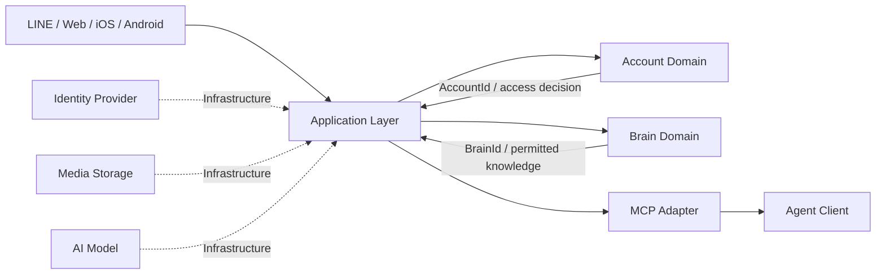
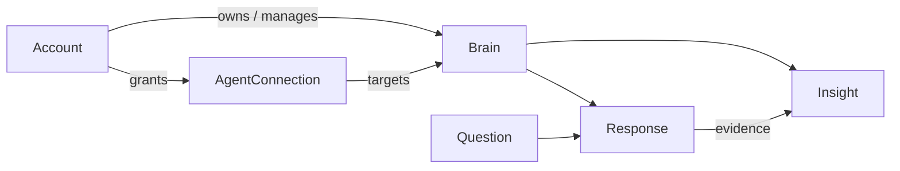

# me-builder ドメイン設計

## 1. この文書の目的

me-builderの中核となる `Account` と `Brain` の責務、境界、関係を定義します。この段階では、データベースの種類、テーブル、API、認証製品、LLM、MCPの実装方式は決定しません。

本設計では、次の2つを明確に分離します。

- **Account domain**: 誰がサービスを利用し、何を所有・許可できるか
- **Brain domain**: 分身が誰を表現し、何を根拠として知っているか

## 2. 用語

| 用語 | 意味 |
| --- | --- |
| Account | サービスを操作する主体。ログイン、状態、規約同意、接続許可を管理する |
| Identity | LINE、Apple、Googleなど、Accountへログインするための外部ID |
| Brain | ある人物を表現する分身の頭脳。回答、好み、知識、推定結果を束ねる |
| Subject | Brainが表現する対象人物 |
| Question | Subjectを理解するために提示する問い |
| Response | Subjectについてユーザーが入力した回答 |
| Insight | Responseなどの根拠からAIまたはルールが導いた推定情報 |
| Evidence | Insightや生成回答の根拠となったResponse |
| Agent Client | MCPを通じてBrainの情報を利用するエージェント |

`Account` は人そのものではなく、サービス上の利用主体です。`Brain` もLLMそのものではなく、分身を構成する情報とルールを表すドメイン概念です。

## 3. 全体の境界

アプリケーション層が2つのドメインを調整します。Account domainからBrain domainを直接操作したり、Brain domainが認証プロバイダーやAIモデルを直接呼び出したりしません。

## 4. Account domain

### 4.1 責務

Account domainは「誰が操作できるか」を管理します。

- Accountの登録、利用停止、退会
- 複数のログイン手段の追加・解除
- アカウント復旧
- 利用規約やプライバシーポリシーへの同意
- Agent Clientとの接続許可、解除、有効期限

パスワード検証、OAuth通信、トークン発行などの認証処理そのものは、Account domainの外側にある認証基盤が担当します。

### 4.2 集約

#### Account

Account domainの集約ルートです。

主な概念上の属性:

- `AccountId`
- 状態: `pending` / `active` / `suspended` / `closed`
- ログインに利用できるIdentity
- 規約同意の記録

主な操作:

- Accountを有効化する
- Identityを追加・解除する
- 規約へ同意する
- 利用を停止・再開する
- Accountを閉鎖する

守るべきルール:

- 有効なAccountだけがBrainを操作できる
- 同じ外部Identityを複数の有効なAccountへ同時に紐づけない
- 最後のログイン手段は、別の復旧方法なしに解除できない
- 規約への必要な同意がない操作は許可しない
- 閉鎖したAccountを通常操作で再利用しない

#### AgentConnection

Agent Clientに対する接続許可を表す集約です。Accountとライフサイクルや変更頻度が異なるため、Account集約の内部へ抱え込まず、独立した集約として扱います。

主な概念上の属性:

- `AgentConnectionId`
- 許可した`AccountId`
- 対象となる`BrainId`
- 接続先を識別する`ClientId`
- 許可したScope
- 状態: `active` / `revoked` / `expired`
- 有効期限

主な操作:

- 接続を許可する
- Scopeや有効期限を変更する
- 接続を取り消す
- 接続が現在有効か判定する

守るべきルール:

- 有効なAccountだけが接続を許可できる
- Scopeと有効期限を明示せずに接続を有効化しない
- 取り消された接続は再利用できない
- 許可されていないScopeへ権限を拡大しない

Accountが対象Brainを管理できるかどうかは、アプリケーション層がBrain domainへ問い合わせてから接続を作成します。

### 4.3 値オブジェクト候補

- `AccountId`
- `ExternalIdentity`（providerとprovider側subjectの組）
- `AccountStatus`
- `Consent`（対象文書、バージョン、同意日時）
- `ClientId`
- `PermissionScope`
- `Expiration`

### 4.4 ドメインイベント候補

- `AccountRegistered`
- `AccountActivated`
- `IdentityLinked`
- `IdentityUnlinked`
- `AccountSuspended`
- `AccountClosed`
- `AgentConnectionGranted`
- `AgentConnectionScopeChanged`
- `AgentConnectionRevoked`
- `AgentConnectionExpired`

## 5. Brain domain

### 5.1 責務

Brain domainは「分身が何を根拠として知っているか」を管理します。

- Brainの作成、編集、利用停止
- Brainが表現するSubjectの定義
- Questionの提示可否
- テキスト、選択肢、画像、動画、音声によるResponse
- Responseの修正、撤回、公開範囲
- Responseを根拠としたInsightの生成・確認・却下
- MCPやチャットに提供できる情報の判定
- 本人入力とAI推定の区別

画像・動画・音声のバイナリ保存、AIモデルの呼び出し、ベクトル検索はインフラストラクチャの責務です。Brain domainは、それらを参照してどのような意味や状態を持つかだけを扱います。

### 5.2 集約

#### Brain

分身の識別情報とライフサイクルを管理する集約ルートです。

主な概念上の属性:

- `BrainId`
- 管理主体を示す`OwnerAccountId`
- Subjectの表示名と説明
- 状態: `draft` / `active` / `archived`

主な操作:

- Brainを作成・有効化する
- Subjectの説明を更新する
- Brainをアーカイブする

守るべきルール:

- Brainには必ず管理主体が存在する
- アーカイブしたBrainへ新しいResponseを追加しない
- Brainを実在する本人として公開する場合は、必要な確認を満たす

#### Question

質問内容と回答方法を定義する集約です。Questionは多数のBrainから利用されるため、Brain集約には含めません。

主な概念上の属性:

- `QuestionId`
- 質問内容
- 質問に使用するメディア参照
- 許可する回答形式
- 状態: `draft` / `published` / `retired`

守るべきルール:

- 公開済みQuestionの意味を破壊的に変更しない
- 回答形式はサービスが対応する形式に限定する
- 廃止したQuestionへの新規回答は受け付けない

#### Response

1つのBrainによる1つのQuestionへの回答を表す集約です。回答数が増えてもBrain集約が肥大化しないよう独立させます。

主な概念上の属性:

- `ResponseId`
- `BrainId`
- `QuestionId`
- 回答内容またはメディア参照
- 回答の由来: `subject_input` / `proxy_input`
- 公開範囲
- 状態: `active` / `withdrawn`
- 改訂情報

主な操作:

- 回答する
- 回答を修正する
- 公開範囲を変更する
- 回答を撤回する

守るべきルール:

- Questionが許可している形式でのみ回答できる
- 回答の入力者・由来を失わない
- 修正前の回答と修正後の回答を区別できる
- 撤回した回答を新しい生成やInsightの根拠に使用しない
- 公開範囲を超えて情報を提供しない

#### Insight

Responseなどから導かれた好み、価値観、性格傾向、要約を表す集約です。本人の回答とAIの推定を混同しないため、Responseとは分離します。

主な概念上の属性:

- `InsightId`
- `BrainId`
- 推定内容と種類
- EvidenceとなるResponseへの参照
- 生成元
- 状態: `proposed` / `confirmed` / `rejected` / `stale`

主な操作:

- Insightを提案する
- 根拠を追加・削除する
- 本人が確認・却下する
- 根拠の変更により古くなったことを示す

守るべきルール:

- EvidenceがないInsightを確定情報として扱わない
- `proposed`のInsightはAIによる推定であることを明示する
- Evidenceが撤回・非公開になった場合は再評価する
- `rejected`のInsightを生成回答の根拠として使用しない

### 5.3 値オブジェクト候補

- `BrainId`
- `SubjectProfile`
- `QuestionId`
- `ResponseId`
- `ResponseContent`
- `AnswerFormat`
- `MediaReference`
- `Visibility`
- `Revision`
- `InsightId`
- `EvidenceReference`
- `InsightStatus`

### 5.4 ドメインサービス候補

#### QuestionEligibilityService

Brainの状態、過去の回答、質問の対象条件から、次に提示できるQuestionを判定します。

#### DisclosurePolicy

ResponseやInsightの公開範囲と要求されたScopeを照合し、提供可能な情報だけを返します。Account domainによる接続許可を通過した後に適用します。

#### InsightEvidencePolicy

Insightを提示するために十分なEvidenceがあるか、Evidenceが現在も有効かを判定します。

### 5.5 ドメインイベント候補

- `BrainCreated`
- `BrainActivated`
- `BrainArchived`
- `QuestionPublished`
- `QuestionRetired`
- `ResponseSubmitted`
- `ResponseRevised`
- `ResponseVisibilityChanged`
- `ResponseWithdrawn`
- `InsightProposed`
- `InsightConfirmed`
- `InsightRejected`
- `InsightBecameStale`

## 6. AccountとBrainの関係

MVPでは、1つのAccountが1つのBrainを所有する利用体験を基本とします。ただし、ドメイン上は同一概念として統合せず、`AccountId`と`BrainId`を別の識別子として扱います。

分離する理由:

- Accountを閉鎖・停止する処理と、Brainの情報を削除・移行する処理を区別できる
- 将来、1つのAccountが複数のBrainを管理する可能性を残せる
- 将来、家族や組織による代理管理へ拡張できる
- 認証情報をBrainの内容から分離できる
- Brainのエクスポートや移行を検討しやすい

複数Brainや共同管理をMVPで実装することは意味しません。MVPでは機能を1対1に制限し、必要性が確認された時点で拡張します。

## 7. MCP利用時の責務分担

MCPからBrainの情報を取得する場合、次の順序で判定します。

1. 認証基盤がAgent Clientを識別する
2. Account domainがAgentConnectionの有効性とScopeを判定する
3. アプリケーション層が対象Brainへの管理権限を確認する
4. Brain domainのDisclosurePolicyが各Response・Insightの公開可否を判定する
5. 許可された情報だけをMCPアダプターが整形して返す
6. アクセス結果を監査用途に記録する

Account domainの許可だけでBrain内のすべての情報を返してはいけません。接続単位のScopeと、情報単位の公開範囲の両方を満たす必要があります。

## 8. 代表的なユースケース

### Accountを作成してBrainを始める

1. 外部認証でIdentityを確認する
2. Accountを登録し、必要な規約同意を得る
3. アプリケーション層がBrainを作成する
4. AccountにBrainの管理権限がある状態にする

AccountとBrainは別々に作成されます。一方が失敗した場合の再試行や取り消しは、アプリケーション層が調整します。

### 質問へ回答する

1. 提示可能なQuestionを選ぶ
2. 入力形式がQuestionの定義に適合するか検証する
3. Brainに紐づくResponseを作成する
4. 既存のInsightへ影響する場合は、再評価対象として通知する

### Agent Clientを接続する

1. ユーザーへ接続先、目的、Scope、有効期限を表示する
2. Account domainでAgentConnectionを作成する
3. MCPアクセス時にAgentConnectionとDisclosurePolicyを評価する
4. ユーザーはいつでも接続を取り消せる

## 9. 依存関係のルール

- Account domainはBrainの回答内容を知らない
- Brain domainはLINEやAppleなどの認証方式を知らない
- Brain domainはAgentConnectionの有効性を判断しない
- Account domainは個別のResponseやInsightの公開可否を判断しない
- UI、MCP、データベース、AIモデル固有の型をドメインへ持ち込まない
- ドメイン間では内部オブジェクトを共有せず、識別子と明示的な結果だけを受け渡す
- 複数集約にまたがる処理はアプリケーション層で調整する

## 10. 現時点で決めないこと

- データベース、テーブル、コレクション、検索エンジン
- Event Sourcingを採用するか
- AccountとBrainの物理的な保存場所
- メディアファイルの保存サービス
- 認証・認可製品
- LLM、Embeddingモデル、ベクトルデータベース
- MCPのトランスポートと具体的なツールスキーマ
- 複数Brain、共同所有、代理管理の提供時期

## 11. 今後決める必要があること

1. MVPでAccountとBrainを常に1対1として見せるか
2. Subjectは常にAccount本人に限定するか
3. Questionを運営だけが作るか、ユーザーや外部提供者も作れるか
4. Responseの修正履歴をユーザーへどのように見せるか
5. `Visibility`をどの粒度で設定するか
6. AgentConnectionのScopeをどの粒度で定義するか
7. Insightの本人確認を必須にする範囲
8. Brainのエクスポート、移行、削除時の期待動作
