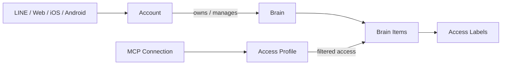

# me-builder ドメイン設計

## 1. この文書の目的

me-builderの中核となる`Account`と`Brain`の責務、境界、関係を整理します。

現在は構想段階のため、質問・回答・推定処理などの詳細なモデルには踏み込みません。データベース、API、認証製品、LLM、MCPの具体的な実装方式も決定しません。

## 2. 中核となる2つのドメイン

| Domain | 担当する問い |
| --- | --- |
| Account | 誰がサービスを利用し、何を所有・許可できるか |
| Brain | その人らしさを構成する情報を、どのように保持・利用するか |

`Account`はログインする利用主体です。`Brain`は分身を構成する頭脳です。この2つを同一の概念にはしません。

## 3. Account domain

### 責務

Account domainは「誰が操作できるか」を担当します。

- Accountの登録、利用停止、退会
- LINE、Apple、Googleなど複数ログイン手段への対応
- ログイン手段の追加・解除
- アカウント復旧
- 利用規約やプライバシーポリシーへの同意
- Brainの所有・管理
- MCP接続の許可、変更、解除

OAuth通信、パスワード検証、トークン発行などは認証基盤の責務であり、Account domainの業務ルールとは分けます。

### Accountが守るルール

- 有効なAccountだけがBrainを操作できる
- 同じ外部ログインIDを複数の有効なAccountへ重複して紐づけない
- 復旧手段がなくなる状態で最後のログイン手段を解除しない
- 必要な同意がない機能を利用させない
- MCP接続の権限拡大は本人へ明示する
- MCP接続はいつでも解除できる

### 現時点で決めないこと

- 内部ユーザーIDの形式
- 利用する認証サービス
- 複数ログイン手段の統合方式
- アカウント復旧の具体的な手順
- 1つのAccountが複数Brainを管理する機能の提供時期

## 4. Brain domain

### 責務

Brain domainは「その人らしさを何で構成し、どの用途へ提供できるか」を担当します。

- 1人分のBrainを作成・管理する
- 記憶、価値観、判断基準などをBrain内部で分類する
- 本人が入力した内容とAIが推定した内容を区別する
- 情報が変化した時点や一時的な状態を区別する
- 情報へ用途別のAccess Labelを付ける
- MCP接続へ提供できる情報をAccess Profileで制限する
- 情報の修正、非公開、削除を可能にする

画像・動画・音声のファイル保存、AIモデルの呼び出し、検索エンジンはBrain domainの外側にある技術的な仕組みとして扱います。

### Brain内部の大分類

Brainの中身をすべてMemoryへ入れず、役割に応じて分類します。

| 分類 | 答える問い |
| --- | --- |
| Identity | 自分は誰か |
| Memory | 何があった・何を覚えているか |
| Belief | 何が正しい・事実だと思うか |
| Value | 何を大切にするか |
| Preference | 何を好む・避けるか |
| Goal | 何を実現したいか |
| Decision System | どのように選ぶか |
| Capability | 何ができるか |
| Behavior Style | どのように行動・表現するか |
| Current State | 今どういう状態か |

詳細は[Brain内部情報の分類](brain-content-taxonomy.md)で扱います。

### Brainが守るルール

- Brainの入力入口は仕事・恋愛・プライベートごとに分けない
- 同じ情報を用途ごとに複製しない
- 検索用のTopic Labelをアクセス許可に使わない
- `work`、`relationship`、`private`などのAccess Labelで用途を分ける
- 用途が未分類の情報を外部MCPへ提供しない
- AIの判断だけで公開範囲を広げない
- 非公開情報を、許可されていないMCP接続の検索対象にしない
- 一時的な状態を恒久的な性格や好みとして扱わない

### 現時点で決めないこと

- Brain内部の具体的なエンティティや集約
- Brain Itemの物理的な保存構造
- 検索、Embedding、要約の実装方式
- AIによる分類・推定の具体的な処理
- 質問と回答をどの単位で保持するか
- 矛盾した情報の統合方法

## 5. AccountとBrainの関係

MVPでは、1つのAccountが1つのBrainを利用する体験を基本とします。ただし、AccountとBrainは別の概念として扱います。

分離する理由:

- ログイン情報と、その人らしさを表す情報を分けられる
- Accountの停止とBrainの削除・移行を別に考えられる
- 将来、家族や組織による代理管理を検討できる
- 将来、Brainのエクスポートや移行を検討できる

複数Brainや共同管理をMVPで実装することは意味しません。

## 6. ラベルによる用途分離

仕事、恋愛、プライベートは別々のBrainや入口ではなく、Brain Itemへ付けるAccess Labelとして扱います。

| 種類 | 目的 | 認可への利用 |
| --- | --- | --- |
| Topic Label | 内容の検索・整理 | 利用しない |
| Access Label | 利用可能な用途の指定 | 利用する |
| Access Profile | MCP接続が利用できるAccess Labelの指定 | 利用する |

たとえば仕事用MCPにはWork Access Profileを適用し、`work`が明示された情報だけを検索対象にします。

詳細は[Brainのラベル・アクセス制御設計](brain-access-label-design.md)で扱います。

## 7. MCP利用時の原則

MCPの具体的な接続モデルやツール設計は後続で検討します。現在は次の原則だけを定めます。

1. MCP接続には目的と権限を設定する
2. 接続ごとにAccess Profileを適用する
3. 許可されたAccess Labelの情報だけを検索する
4. 機微情報と外部提供不可の情報を追加で除外する
5. 取得された情報を監査できるようにする
6. ユーザーが権限変更と接続解除を行えるようにする

## 8. 今後の設計順序

1. AccountとBrainの利用体験を確定する
2. Brain内部の分類とAccess Labelの初期セットを検証する
3. 質問・回答のドメインを設計する
4. AIによる推定と本人確認の流れを設計する
5. MCP接続、権限、監査の詳細を設計する
6. 永続化と検索方式を選定する
