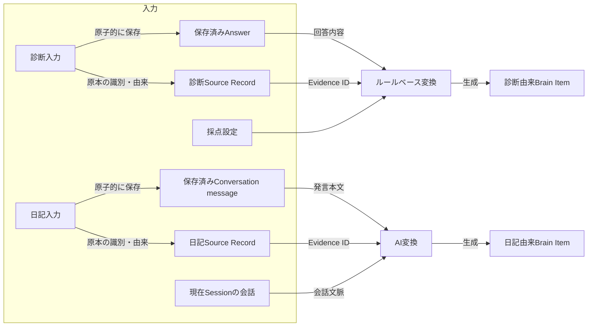
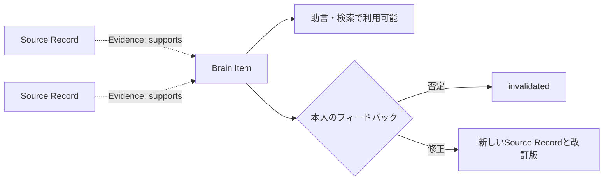
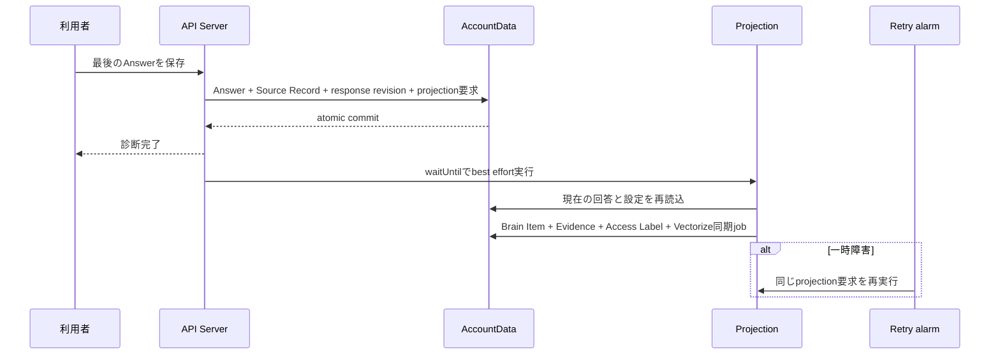
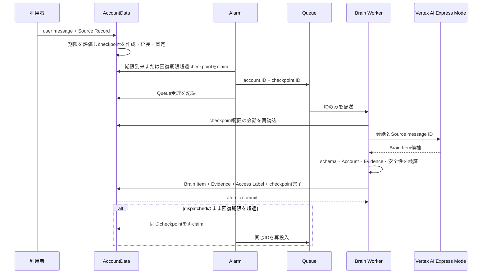

# Brain Item生成設計

## 1. この文書の目的

この文書は、保存済みのSource RecordからBrain Itemを生成する共通方式と、入力元ごとの差分を定義します。最初の入力元として、診断回答と日記チャットを扱います。

この文書が所有する概念:

- Brain Item生成処理の共通入力と共通出力
- 診断回答と日記チャットの変換差分
- Source Record、Brain Item、Evidence edgeを作るタイミング
- 生成したBrain Itemを本人が否定、修正する流れ
- 冪等性、重複、改訂の共通規則

この文書が所有しない概念:

| 概念 | SSoT |
| --- | --- |
| Brain Itemの分類と共通属性 | [Brain内部情報の分類](brain-content-taxonomy.md) |
| 根拠、反証、改訂のエッジ | [根拠・反証・改訂のエッジ設計](evidence-edge-design.md) |
| Access Labelと外部提供 | [Brainのラベル・アクセス制御設計](brain-access-label-design.md) |
| Source Recordの不変性、訂正、削除、撤回 | [Source Recordのライフサイクル設計](../source/source-record-lifecycle-design.md) |
| 診断の採点式と設定形式 | [診断回答のパラメータ変換設計](../../diagnosis/scoring/parameter-scoring-design.md) |
| 日記の会話体験、質問、Session境界 | [日記チャット体験設計](../../product/diary-chat-experience.md) |
| 日記チャットのQueue、AI、配送、物理モデル | [日記チャット実装設計](../../architecture/diary-chat-implementation-design.md) |

## 2. 結論

診断と日記は、原本を先にSource Recordとして保存し、その内容を変換してBrain Itemを生成する点が共通です。違いは変換方法と生成を開始する条件です。

変換処理と保存後の依存関係は別の概念です。次の図の実線はデータを読み取って結果を生成する処理フローを表します。



変換後は、Brain ItemがどのSource Recordに依存しているかをEvidence edgeとして保存します。次の破線は処理順ではなく、永続化した根拠関係を表します。



Evidence edgeは変換器ではありません。Source Recordは原本の識別子と由来を持ち、本文そのものは`originalRef`で対応づくAnswerやConversation messageにあります。変換器はその原本、診断の版付き設定、または日記の会話文脈を読み、Brain Itemを作ります。Evidence edgeはその結果に対して「このBrain ItemはこのSource Recordが指す原本を根拠としている」という依存関係を記録します。`derivationMethod`は、その依存関係を作った変換方法の監査情報であり、Evidence edge自身が変換を行うという意味ではありません。

登録には次の2つの時点があります。

| 時点 | 診断 | 日記 |
| --- | --- | --- |
| 原本の登録 | Answer保存と同じ原子的処理 | LINE eventのingest時 |
| Brain Itemの登録・利用可能化 | 回答済みを検出したprojection処理 | 会話チェックポイントの非同期projection処理 |

Brain Itemは生成時点から`active`であり、本人の同意を利用開始の条件にしません。助言、Vectorize検索、MCP提供に使えるかは、Evidence、Derivation、Confidence、Access Policy、削除・撤回状態から用途ごとに評価します。AI推定は本人の事実として断定せず、利用時にも推定であることを区別します。

## 3. 共通の入力

生成処理はクライアントが組み立てたBrain Itemを受け取りません。AccountDataに保存済みの情報を、認証で解決したAccountの所有範囲内で読み直します。

```ts
type BrainItemGenerationInput = {
  accountId: string
  trigger: {
    kind: "diagnosis_completed" | "diary_brain_checkpoint_due"
    id: string
    revision: number
  }
  sourceRecords: Array<{
    id: string
    kind: string
    createdAt: string
    accessLabel: string
    originalRef: string
  }>
  originals: Array<{
    sourceRecordId: string
    kind: "diagnosis_answer" | "conversation_message"
    payload: unknown
  }>
  transform:
    | {
        method: "deterministic"
        definitionId: string
        definitionVersion: number
      }
    | {
        method: "ai"
        promptVersion: string
        model: string
      }
}
```

`originals`はAccountDataが`originalRef`から読み直した原本です。`payload`は`kind`ごとのschemaで検証してから変換器へ渡します。これは論理的な入力契約であり、診断と日記で同じHTTP APIやQueue messageを使うことは意味しません。

共通して次を検証します。

- Source Recordが1件以上ある
- 各Source Recordの`originalRef`が、同じAccountのAnswerまたはConversation messageへ解決できる
- すべてのSource Recordと生成先Brain ItemのAccountが一致する
- 削除、撤回されたSource Recordを導出契機にしない
- 入力元の現在revisionとtriggerのrevisionが一致する
- 変換方法とEvidence edgeの`derivationMethod`が一致する
- 同じtriggerの再実行で同じ論理結果へ収束する

## 4. 共通の出力

変換が成立した場合、1件のBrain Itemにつき次のデータを同じAccountData transactionで作ります。

```yaml
brain_item:
  id: <generated-id>
  accountId: <authenticated-account-id>
  category: <Brain Item category>
  statement: <根拠をたどれる命題>
  attributes: <分類・入力元固有の属性>
  derivation: deterministic | ai
  status: active
  validFrom: <命題が有効になった時点>
  stability: temporary | changeable | stable
  sensitivity: normal | sensitive
  externallyShareable: false
  confidence:
    state: uncomputed

evidence_edges:
  - sourceRecordId: <根拠のSource Record ID>
    relation: supports
    isDerivationTrigger: true
    derivationMethod: deterministic | ai
    generatedAt: <生成時刻>

access_label:
  label: unclassified
  assignedBy: system
```

Brain Itemの`derivation`は導出契機になったEvidence edgeから集計します。診断は`deterministic`、日記の解釈は`ai`です。

生成時のAccess Labelは入力元によらず`unclassified`です。Source Recordの`private`をそのままコピーせず、外部提供可否が未分類の初期状態として`unclassified`を使います。機微度と外部提供可否は安全側へ設定し、AIだけで公開範囲を広げません。これはBrain Itemの内部利用を止める状態ではありません。

## 5. 入力元ごとの比較

| 観点 | 診断回答 | 日記チャット |
| --- | --- | --- |
| 原本の単位 | 1 Answer = 1 Source Record | 1 user発言 = 1 Source Record |
| 生成開始条件 | `DiagnosisResponse`が回答済み | 10分無操作、最初の未処理発言から30分、または明示終了 |
| 変換方法 | 版付き設定によるルールベース計算 | 構造化出力を使うAI抽出 |
| 主な追加入力 | Question、Choice、採点設定 | 未処理チェックポイント範囲の会話 |
| 作成単位 | 計算可能なParameterごとに1件 | 意味的に独立した命題ごとに1件、1チェックポイント最大3件 |
| 分類 | 最初は`Preference` | 本人が明言した`Memory`、`Behavior Pattern`、`Value / Motivation`、`Decision System`、`Preference`、`Goal` |
| Derivation | `deterministic` | `ai` |
| Evidence | Parameterへ寄与したAnswerのSource Record | 候補が参照したuser messageのSource Record |
| 利用開始 | 生成時点 | 生成時点。ただしAI推定として区別する |
| 登録失敗時 | projection要求から再試行 | チェックポイントを未処理のままQueueから再試行 |

## 6. 診断回答からの生成

### 6.1 入力

診断projectionは次をAccountDataから読み直します。

- `DiagnosisResponse`: Account、Diagnosis、状態、回答revision
- 現在有効なAnswer: Question ID、Question Version、Choice ID、Source Record ID
- 公開時に固定した採点設定: 設定ID、版、Parameter、Choice score、重み、coverage境界、band表示
- Answer保存と同じ原子的処理で作成したprojection要求

Parameter Profileの計算方法は[診断回答のパラメータ変換設計](../../diagnosis/scoring/parameter-scoring-design.md)を正とします。Parameter Profileは変換中だけの値であり、独立したレコードとして保存しません。

### 6.2 出力

`score`を計算できるParameter 1件につき、`Preference` Brain Itemを1件作ります。

| 出力 | 値 |
| --- | --- |
| `statement` | `{Parameter表示名}は「{bandの表示名}」の傾向がある` |
| `attributes` | Diagnosis ID、採点設定ID・版、Parameter ID、score、coverage、band |
| `derivation` | `deterministic` |
| Evidence | そのParameterの0以外の重みへ寄与した現在有効なAnswerのSource Record |

`score = null`または`band = insufficient`ならBrain Itemを作りません。`coverage`は回答充足率であり、Confidenceへ転用しません。

### 6.3 登録タイミング



利用者から見ると診断完了直後に登録します。回答保存transaction内でBrain Itemまで作らず、失敗しても残るprojection要求を登録します。

同じAccount、Diagnosis、採点設定版、Parameter IDを同じprojection単位とします。再回答で内容が変われば旧Itemを`superseded`にし、新ItemとのRevisionを作ります。内容が同じならItemを増やしません。

## 7. 日記チャットからの生成

### 7.1 入力

AIへ渡す入力は、AccountDataから取得した次の情報です。

- 未処理チェックポイントの範囲に含まれる、削除・撤回されていないuser message
- 各user messageのmessage ID。Source Record IDはモデルへ渡さず、保存時にAccountDataが解決する
- Brain Item抽出専用のprompt versionと事前安全分類

Source Record本文はモデルへの入力には含めますが、モデルの出力をそのまま保存命令として信用しません。モデルが返したSource message IDを、アプリケーションが現在AccountのConversation messageとSource Recordへ解決します。

### 7.2 AIの候補出力

AIは会話応答とは独立して、本人が明示した命題を1チェックポイント最大3件提案します。日記から生成する分類は`Memory`、`Behavior Pattern`、`Value / Motivation`、`Decision System`、`Preference`、`Goal`です。いずれも`is_inference = false`であり、`statement`がすべての根拠user message本文にそのまま含まれる候補だけを受け付けます。自由な言い換えを許すと、構造検証だけでは発言にない内容を除外できないため、連続した原文の抜き出しに限定します。本人が明言していない動機や安定した傾向は生成しません。上限は1回の構造化出力と保存負荷を制限するための安全弁です。

```json
{
  "brain_item_candidates": [
    {
      "category": "goal",
      "statement": "来月までに転職先を決めたい",
      "source_message_ids": ["message-1"],
      "is_inference": false
    }
  ]
}
```

候補には、独立した1つの命題と根拠message IDだけを含めます。Access Label、Confidence、Evidence edgeの属性をモデルに決めさせず、アプリケーションが共通規則で設定します。

次の候補は破棄します。

- 現在AccountでSource Recordへ解決できないmessage IDを含む
- 根拠が0件
- safety routeが候補生成を禁止する
- 発言にない内容を事実として追加している
- 本人が明言していない性格、価値観、好み、動機、意図、安定した行動パターンを推定している
- 空のstatement、未定義分類、上限を超えた候補

分類境界は[Brain内部情報の分類](brain-content-taxonomy.md)を正とします。具体的な出来事・経験は`memory`、明示された反復行動は`behavior_pattern`、明示された行動理由は`value_motivation`、選択基準は`decision_system`、具体的な好き嫌いは`preference`、未来の達成意図は`goal`にします。1回の行動だけから反復傾向や動機を推定しません。

`statement`に「今日」「昨日」「来月」「来年」などの相対日付がある場合、AIとAccountDataはBrain Itemの命題を原文のまま保存します。AccountDataは根拠Source Recordの受信日時を基準に`Asia/Tokyo`の絶対日付を決定的に解決し、原文、基準日、timezone、解決対応を`attributes.temporalContext`へ分離して保存します。たとえば2026年8月11日の「来月までに転職先を決めたい」は、`statement`を変えず、`来月 = 2026年9月`を時点情報に持ちます。EvidenceのSource Record原文も変更しません。

Vectorizeへ渡すembeddingテキストと検索queryには、原文の後ろへ`時点情報: 来月 = 2026年9月`のような補足だけを追加します。相対日付らしい文字列を単純置換せず、語末、句読点、助詞、数字など日付表現として自然な右境界を持つ場合だけ解決します。そのため「明日香」「今日子」のような固有名詞は時点情報へ変換しません。判定に迷う表現は時点情報を付けない側へ倒し、Brain Itemの原文を壊さないことを優先します。Account単位のtimezoneを持つまでは日本時間を明示的な既定とし、timezone対応は後続課題とします。

検証を通過した日記候補は、共通出力へ次のように写します。

| 出力 | 値 |
| --- | --- |
| `category` | 検証済み候補の`memory` / `behavior_pattern` / `value_motivation` / `decision_system` / `preference` / `goal` |
| `statement` | 候補のstatement。相対日付を含む場合も原文の命題 |
| `attributes` | `sourceKind = diary`、Session ID、checkpoint ID、prompt version、`isInference = false`。相対日付を解決した場合は`temporalContext` |
| `derivation` | `ai` |
| `validFrom` | 根拠になった発言の時点。複数ある場合は候補が表す期間に合わせる |
| Evidence | `source_message_ids`から解決したSource Record |

`stability`と`sensitivity`はモデルの自由記述を保存せず、分類と安全判定に対するレビュー済みのアプリケーション規則から設定します。日記由来では`memory`を`stable`、`goal`を`temporary`、その他の4分類を`changeable`として保存します。

### 7.3 登録タイミング

Brain Item生成はTurnごとの返信経路から分離します。未処理のuser発言を最初に受け付けるとチェックポイントを作り、同じSessionに発言が続く間はその範囲を延長します。次のいずれかを満たした時点で生成を起動します。

- 最後の未処理user発言から10分間、新しい発言がない
- 最初の未処理user発言から30分経過した
- assistant応答が`end_session = true`で明示終了を決めた

実行時刻は「最初の未処理発言 + 30分」と「最後の未処理発言 + 10分」の早い方です。AccountDataはAlarmだけに期限判定を依存せず、新着取込時にも各発言の受信時刻と現在の期限を比較します。期限以後の発言は新しいチェックポイントへ入れるため、Alarmが遅延した場合や1つの取込batchが複数の期限をまたぐ場合も、10分・30分の境界は後ろへ伸びません。

1チェックポイントはuser messageを最大10件、1messageを最大5,000文字とします。新しいuser発言を加えると件数上限を超える場合は既存範囲をその時点で固定し、その発言から次のチェックポイントを開始します。文字数上限を超える原文はSource Recordとして保持しますが、このAI変換の入力とEvidence候補から除外します。Brain Item候補はuser原文から直接抜き出すため、assistant本文も入力へ含めません。これにより削除・撤回済みuser発言の内容がassistant応答を経由して再流入することも防ぎます。時間だけで区切ると短時間の大量連投が無制限なAI入力になるため、件数と文字数の両方で入力を有界にします。

6時間無操作と24時間上限はConversation Sessionを閉じる境界であり、Brain Item生成を待つための時間ではありません。Session境界には、会話文脈・順序・返信率の集計範囲を限定し、無期限に会話を伸ばさない役割があります。Brain Item生成はより短いチェックポイントで進むため、一覧など後続UIから早い段階で利用できます。



Queueには本文を含めず、Account IDとcheckpoint IDだけを渡します。Queueが受理した後はQueue自身の再配送を優先し、`dispatched`のまま回復期限を超えた場合だけAlarmが同じIDを再投入します。回復期限と配送状態の物理的な規則は[日記チャット実装設計 §4.6](../../architecture/diary-chat-implementation-design.md#46-diary_brain_checkpoints)を正とします。DLQへ到達した場合やQueue処理が失われた場合も、チェックポイントを恒久的に欠落させません。

WorkerはAccountDataから会話を読み直し、Brain Item、Evidence edge、Access Label、チェックポイントと実際に保存したItemの対応、チェックポイント完了を同じtransactionで保存します。AccountDataはalarm、user message取込、Queueからの適用をAccount単位で直列化します。回復再投入と元のQueue messageが競合しても、先に`applied`へ進めた処理だけがItem一式を確定し、後続処理は完了済みチェックポイントとしてスキップするため二重適用しません。

AI生成、JSON parse、出力envelope検証が失敗した場合はQueue messageをackせず再試行します。envelope内の個別候補だけがschema、Evidence、候補間重複の検証に失敗した場合は、その候補の位置と理由コードだけをerror logへ残し、日記本文、statement、Account ID、Evidence IDをlogへ含めずに候補単位で除外します。残った候補だけを適用し、すべて除外された場合は0件でチェックポイントを完了します。AI設定がない場合に0件を正常扱いできるのはlocal / test環境だけで、本番相当環境では失敗として再試行します。安全経路へ切り替えた場合、またはAIが有効な候補なしと正常に判断した場合も0件でチェックポイントを完了します。いずれの場合もSource Recordと通常の会話応答は保持され、会話返信の成功・配送状態はBrain Itemの登録条件にしません。

チェックポイントの処理状態はBrain Itemの状態ではありません。生成されたBrain Itemは本人確認を待たず最初から`active`です。dev / development / local環境だけは、AI候補ではなく実際に保存したItemとEvidence message ID（0件なら追加なし）を確認用LINE Pushで通知します。適用後にPushだけ失敗した場合は保存済みの対応から同じ通知を再構築し、同じretry keyで再送します。本番の会話にはこの通知を出しません。物理的な状態遷移は[日記チャット実装設計 §4.6](../../architecture/diary-chat-implementation-design.md#46-diary_brain_checkpoints)を正とします。

### 7.4 本人の訂正・否定

生成後のBrain Itemに対する本人操作は次のように扱います。

| 本人の応答 | Source Record | Brain Item |
| --- | --- | --- |
| 同意 | 作らない | 状態を変更しない。必要ならフィードバック操作だけ記録する |
| 否定 | 作らない | `invalidated`にして以後の利用対象から外す |
| 保留・無応答 | 作らない | 状態を変更しない |
| 文言や内容の修正 | 修正文を新規Source Recordにする | 旧Itemを置き換える新ItemとRevisionを作る |
| 新しい出来事や理由を追加 | 追加内容を新規Source Recordにする | 必要ならEvidence追加または新Item生成 |

「そう」「違う」「あとで」のような純粋なフィードバック操作は新しい命題内容を持たないため、Source Recordを作りません。ただし会話の順序と監査に必要な操作記録は保持します。否定がどのBrain Itemを指すか解決できない場合は自動的に無効化せず、対象を聞き返します。現在の会話保存経路はすべてのuser messageをSource Recordにするため、日記Brain Item実装時にフィードバック操作を区別できるよう変更が必要です。

複数のBrain Itemが対象になり得る場合、否定や修正がどのItemを指すか一意に解決できなければ一括変更しません。対象を1つだけ聞き返すか、Itemごとに本人が選べるUIを使います。

### 7.5 声かけコンテキストへの拡張

曜日と本人の情報から日々の声かけを個別化する体験は、[日記チャット体験設計 §3](../../product/diary-chat-experience.md#3-日々の入口)を正とします。この用途でも、声かけ専用の原本や巨大なプロフィールItemを作らず、本人が独立して訂正できる命題ごとにBrain Itemを生成します。

現在の日記候補6分類に`identity`を追加し、本人が明言した職業、所属上の役割、生活上の立場を扱えるようにします。「看護師なの」は`identity`ですが、そこから雇用形態、勤務先、勤務時間、休日を推定しません。週間リズムや曜日別予定は、本人が別に明言した発言から`behavior_pattern`または内容に合う既存分類として生成します。

候補には、`statement`とは別に声かけ用途の構造化属性を付けられるようにします。`statement`は従来どおり根拠user message本文に含まれる連続した原文だけを許可し、構造化属性は職業、週間リズム、定期予定、一息つく区切り、聞かれ方のどれに使えるかを表します。曜日、変動シフト、時間帯などの値もEvidence本文で裏づけられる場合だけ受け付けます。

たとえば「看護師なの」と「休みはシフトで変わる」は、同じSessionで続けて得られても、次の2件として分けます。

| statement | category | 声かけ用途 | Evidence |
| --- | --- | --- | --- |
| 看護師なの | `identity` | occupation | 「看護師なの」を含むSource Record |
| 休みはシフトで変わる | `behavior_pattern` | weekly_rhythm / variable_shift | 「休みはシフトで変わる」を含むSource Record |

職業だけから2件目を作ることは禁止します。構造化属性のschema、保存先、現行実装との差分は[日記チャット実装設計 §4.7](../../architecture/diary-chat-implementation-design.md#47-brain-item関連)を正とします。

## 8. 重複、Evidence追加、改訂

生成前に、同じAccountのactiveなBrain Itemから同義候補を探します。

| 状況 | 処理 |
| --- | --- |
| 同じ命題で新しい根拠が増えた | 新規Itemを作らずEvidenceを追加する |
| 内容が具体化・修正された | 新しいItemを作りRevisionで結ぶ |
| 既存Itemを否定する発言がある | 反証edge候補として扱う。自動確定は後続設計 |
| 同じtriggerの再配送 | ItemもEvidenceも増やさない |
| Source Recordが削除・撤回された | Source Recordライフサイクル設計に従って利用停止・再導出する |

AIの意味的重複判定だけで既存Itemを上書きしません。同義判定が不確かな場合は別Itemとして保存し、後から統合できるようにします。

日記候補ごとに、原文と解決済み時点情報を検索queryとして同じAccountのVectorizeを検索します。Vector scoreは比較対象を絞るためだけに使い、score単独では統合しません。Vectorizeで見つかったItemとVector同期前の直近active ItemをAccountDataで再認可し、同じcategoryの候補だけを専用の意味的重複判定promptへまとめて渡します。候補上限に達してもVector同期前Itemを比較対象へ含められるよう、直近active Item用の候補枠を確保します。同じcheckpoint内の新規候補同士も比較し、同じ命題なら代表候補へEvidenceを集約してItemを1件だけ作ります。統合後もEvidenceごとに抽出時のstatementを保持し、NFKCと空白を正規化した原文にそのstatementが含まれることを保存直前に再検証します。表現が異なっても、条件・対象・時点を含め相互に言い換えられる`same_proposition`だけを統合します。関連しているだけ、具体性・強さ・時点が異なる、または判断が不確かな場合は新規Itemにします。

判定モデルが返せる既存Item IDは検索候補のallowlistに限定し、AccountDataは保存直前にAccount所有、`active`、category、`isInference = false`、相対日付の解決結果を再検証します。判定済みの既存Itemを再検証できない場合は、完全一致検索や新規Item作成へ縮退せずQueueを再試行します。同一命題なら既存Itemのstatementや属性を変更せず、新しいSource Recordとの`supports` Evidence edgeだけを追加します。この事後の裏付けはItemを作った入力ではないため、Evidence edgeの`isDerivationTrigger`は`false`にします。既存ItemのVectorはstatementが変わらないため再登録しません。checkpointとの対応には、新規作成かEvidence追加か、完全一致か意味的判定か、意味的判定のprompt versionを保存します。同じcheckpoint内の候補同士を統合して新規Itemを作る場合も、統合に使った判定方法と意味的判定のprompt versionを保存します。AI判定全体が不正、候補外IDを返す、または依存サービスが一時失敗した場合も新規Itemへ縮退せずQueueを再試行し、重複データの確定を避けます。

同じ命題へEvidenceが増えても、Brain Itemの`createdAt`は最初にItemを作った時点として保持し、最新日時で上書きしません。「最初に本人から得た時点」と「最後に本人から得た時点」は、activeな`supports` Evidenceが参照するSource Recordの記録時点から、それぞれ`firstObservedAt`と`lastObservedAt`として導出します。通常チャットのContext Packageと本人向け一覧は両方を明示し、一覧は`lastObservedAt`の新しい順にします。statementが変わらないEvidence追加ではVectorを再登録しません。

## 9. 実装境界

診断回答からBrain ItemとEvidence edgeを作るprojectionは実装済みです。旧設計の`confirmation`列・index・保存入力は削除し、診断と日記のどちらも生成時から`active`に統一しています。

日記チャットで実装済みの範囲:

- 10分無操作、30分上限、明示終了によるチェックポイント作成・延長・範囲固定・起動
- AccountData alarmからIDのみを渡すQueue処理
- 抽出専用`brain_item_candidates`出力schema
- 通常安全route、許可した6分類、非推定、1チェックポイント最大3件への制限
- NFKCと空白の差を正規化した原文中の連続した文言だけを受け付ける根拠検証と、user message 10件・1件5,000文字の入力上限
- 相対日付を含むstatementの原文を保持し、Source Record受信時点の日本時間で解決した時点情報をattributesへ分離して保存
- 候補のAccount・チェックポイント範囲・Evidence・安全性検証
- Brain Item、Evidence、Access Label、チェックポイント完了を一括保存するAccountData action
- Brain ItemとAccess LabelからConfirmationを除くschema migrationと既存projectionの追従
- Account単位の直列化とcheckpoint状態によって、Queueの並行・再配送時にBrain Itemを重複作成しない冪等性
- Account内のVector候補と直近Itemを専用AIで比較し、同一命題なら新規Itemを作らずEvidenceだけを追加する意味的重複判定
- dev / development / local環境の処理後Pushに、実際に追加したItemとEvidence message ID、または追加なしを表示し、Push失敗だけを再送
- dev / development / local / preview / test環境の「わたしのまとめ」に、本人のactive ItemとEvidenceを新しい順で表示する確認一覧

次は未実装です。

- Itemと否定・修正操作の対応づけ
- 否定による無効化、修正、改訂
- 本人が明言していない内容をAIが推定する分類
- 日記候補の`identity`分類と、声かけ用途の構造化属性

会話チェックポイントから本人が明言した6分類のBrain Itemを最大3件生成し、Evidence付きで保存し、意味的に同じ既存ItemにはEvidenceだけを追加し、active ItemをVectorizeへ同期して通常チャットで利用するところまでを実装しています。相対日付は原文と時点情報を分離して保存し、Vectorize登録と検索queryで併記します。否定・修正・改訂、本人が明言していない内容のAI推定は後続です。

## 10. 後続で決めること

- Confidenceの具体的な算出方法
- 声かけ用途以外の分類固有`attributes` schema
- 意味的重複判定の評価dataset、誤統合率の監視、prompt version更新基準
- 複数Itemを訂正・否定するLINE / Web UI
- 反証候補を自動的にedgeへする条件
