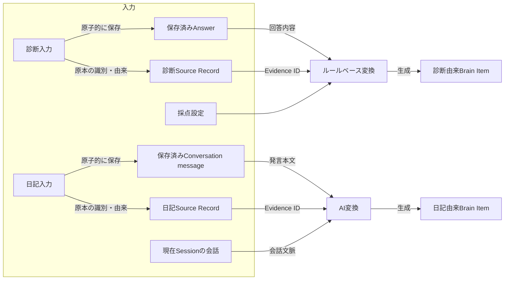
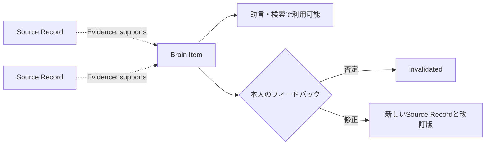
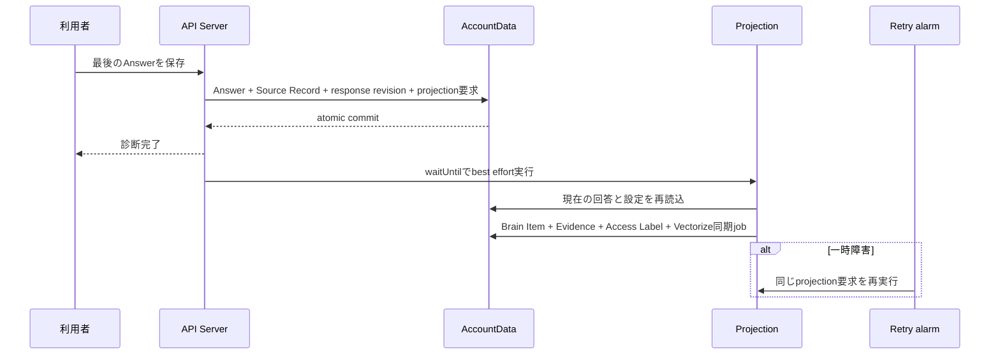
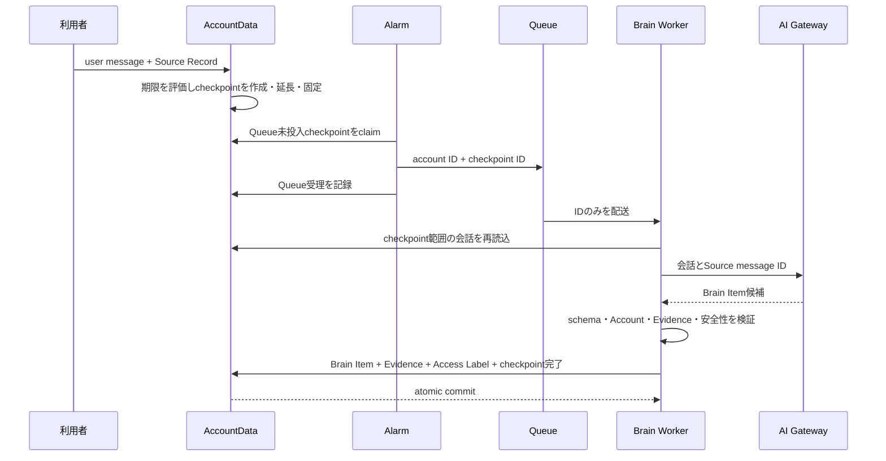

# Brain Item生成設計

## 1. この文書の目的

この文書は、保存済みのSource RecordからBrain Itemを生成する共通方式と、入力元ごとの差分を定義します。最初の入力元として、診断回答と日記チャットを扱います。

この文書が所有する概念:

- Brain Item生成処理の共通入力と共通出力
- 診断回答と日記チャットの変換差分
- Source Record、Brain Item、Evidence edgeを作るタイミング
- 生成したBrain Itemを本人が否定、修正する流れ
- 冪等性、重複、改訂の共通規則

この文書が所有しない概念:

| 概念 | SSoT |
| --- | --- |
| Brain Itemの分類と共通属性 | [Brain内部情報の分類](brain-content-taxonomy.md) |
| 根拠、反証、改訂のエッジ | [根拠・反証・改訂のエッジ設計](evidence-edge-design.md) |
| Access Labelと外部提供 | [Brainのラベル・アクセス制御設計](brain-access-label-design.md) |
| Source Recordの不変性、訂正、削除、撤回 | [Source Recordのライフサイクル設計](../source/source-record-lifecycle-design.md) |
| 診断の採点式と設定形式 | [診断回答のパラメータ変換設計](../../diagnosis/scoring/parameter-scoring-design.md) |
| 日記の会話体験、質問、Session境界 | [日記チャット体験設計](../../product/diary-chat-experience.md) |
| 日記チャットのQueue、AI、配送、物理モデル | [日記チャット実装設計](../../architecture/diary-chat-implementation-design.md) |

## 2. 結論

診断と日記は、原本を先にSource Recordとして保存し、その内容を変換してBrain Itemを生成する点が共通です。違いは変換方法と生成を開始する条件です。

変換処理と保存後の依存関係は別の概念です。次の図の実線はデータを読み取って結果を生成する処理フローを表します。



変換後は、Brain ItemがどのSource Recordに依存しているかをEvidence edgeとして保存します。次の破線は処理順ではなく、永続化した根拠関係を表します。



Evidence edgeは変換器ではありません。Source Recordは原本の識別子と由来を持ち、本文そのものは`originalRef`で対応づくAnswerやConversation messageにあります。変換器はその原本、診断の版付き設定、または日記の会話文脈を読み、Brain Itemを作ります。Evidence edgeはその結果に対して「このBrain ItemはこのSource Recordが指す原本を根拠としている」という依存関係を記録します。`derivationMethod`は、その依存関係を作った変換方法の監査情報であり、Evidence edge自身が変換を行うという意味ではありません。

登録には次の2つの時点があります。

| 時点 | 診断 | 日記 |
| --- | --- | --- |
| 原本の登録 | Answer保存と同じ原子的処理 | LINE eventのingest時 |
| Brain Itemの登録・利用可能化 | 回答済みを検出したprojection処理 | 会話チェックポイントの非同期projection処理 |

Brain Itemは生成時点から`active`であり、本人の同意を利用開始の条件にしません。助言、Vectorize検索、MCP提供に使えるかは、Evidence、Derivation、Confidence、Access Policy、削除・撤回状態から用途ごとに評価します。AI推定は本人の事実として断定せず、利用時にも推定であることを区別します。

## 3. 共通の入力

生成処理はクライアントが組み立てたBrain Itemを受け取りません。AccountDataに保存済みの情報を、認証で解決したAccountの所有範囲内で読み直します。

```ts
type BrainItemGenerationInput = {
  accountId: string
  trigger: {
    kind: "diagnosis_completed" | "diary_brain_checkpoint_due"
    id: string
    revision: number
  }
  sourceRecords: Array<{
    id: string
    kind: string
    createdAt: string
    accessLabel: string
    originalRef: string
  }>
  originals: Array<{
    sourceRecordId: string
    kind: "diagnosis_answer" | "conversation_message"
    payload: unknown
  }>
  transform:
    | {
        method: "deterministic"
        definitionId: string
        definitionVersion: number
      }
    | {
        method: "ai"
        promptVersion: string
        model: string
      }
}
```

`originals`はAccountDataが`originalRef`から読み直した原本です。`payload`は`kind`ごとのschemaで検証してから変換器へ渡します。これは論理的な入力契約であり、診断と日記で同じHTTP APIやQueue messageを使うことは意味しません。

共通して次を検証します。

- Source Recordが1件以上ある
- 各Source Recordの`originalRef`が、同じAccountのAnswerまたはConversation messageへ解決できる
- すべてのSource Recordと生成先Brain ItemのAccountが一致する
- 削除、撤回されたSource Recordを導出契機にしない
- 入力元の現在revisionとtriggerのrevisionが一致する
- 変換方法とEvidence edgeの`derivationMethod`が一致する
- 同じtriggerの再実行で同じ論理結果へ収束する

## 4. 共通の出力

変換が成立した場合、1件のBrain Itemにつき次のデータを同じAccountData transactionで作ります。

```yaml
brain_item:
  id: <generated-id>
  accountId: <authenticated-account-id>
  category: <Brain Item category>
  statement: <根拠をたどれる命題>
  attributes: <分類・入力元固有の属性>
  derivation: deterministic | ai
  status: active
  validFrom: <命題が有効になった時点>
  stability: temporary | changeable | stable
  sensitivity: normal | sensitive
  externallyShareable: false
  confidence:
    state: uncomputed

evidence_edges:
  - sourceRecordId: <根拠のSource Record ID>
    relation: supports
    isDerivationTrigger: true
    derivationMethod: deterministic | ai
    generatedAt: <生成時刻>

access_label:
  label: unclassified
  assignedBy: system
```

Brain Itemの`derivation`は導出契機になったEvidence edgeから集計します。診断は`deterministic`、日記の解釈は`ai`です。

生成時のAccess Labelは入力元によらず`unclassified`です。Source Recordの`private`をそのままコピーせず、外部提供可否が未分類の初期状態として`unclassified`を使います。機微度と外部提供可否は安全側へ設定し、AIだけで公開範囲を広げません。これはBrain Itemの内部利用を止める状態ではありません。

## 5. 入力元ごとの比較

| 観点 | 診断回答 | 日記チャット |
| --- | --- | --- |
| 原本の単位 | 1 Answer = 1 Source Record | 1 user発言 = 1 Source Record |
| 生成開始条件 | `DiagnosisResponse`が回答済み | 10分無操作、最初の未処理発言から30分、または明示終了 |
| 変換方法 | 版付き設定によるルールベース計算 | 構造化出力を使うAI抽出 |
| 主な追加入力 | Question、Choice、採点設定 | 未処理チェックポイント範囲の会話 |
| 作成単位 | 計算可能なParameterごとに1件 | 意味的に独立した命題ごとに1件、1チェックポイント最大3件 |
| 分類 | 最初は`Preference` | 現在は`Memory` |
| Derivation | `deterministic` | `ai` |
| Evidence | Parameterへ寄与したAnswerのSource Record | 候補が参照したuser messageのSource Record |
| 利用開始 | 生成時点 | 生成時点。ただしAI推定として区別する |
| 登録失敗時 | projection要求から再試行 | チェックポイントを未処理のままQueueから再試行 |

## 6. 診断回答からの生成

### 6.1 入力

診断projectionは次をAccountDataから読み直します。

- `DiagnosisResponse`: Account、Diagnosis、状態、回答revision
- 現在有効なAnswer: Question ID、Question Version、Choice ID、Source Record ID
- 公開時に固定した採点設定: 設定ID、版、Parameter、Choice score、重み、coverage境界、band表示
- Answer保存と同じ原子的処理で作成したprojection要求

Parameter Profileの計算方法は[診断回答のパラメータ変換設計](../../diagnosis/scoring/parameter-scoring-design.md)を正とします。Parameter Profileは変換中だけの値であり、独立したレコードとして保存しません。

### 6.2 出力

`score`を計算できるParameter 1件につき、`Preference` Brain Itemを1件作ります。

| 出力 | 値 |
| --- | --- |
| `statement` | `{Parameter表示名}は「{bandの表示名}」の傾向がある` |
| `attributes` | Diagnosis ID、採点設定ID・版、Parameter ID、score、coverage、band |
| `derivation` | `deterministic` |
| Evidence | そのParameterの0以外の重みへ寄与した現在有効なAnswerのSource Record |

`score = null`または`band = insufficient`ならBrain Itemを作りません。`coverage`は回答充足率であり、Confidenceへ転用しません。

### 6.3 登録タイミング



利用者から見ると診断完了直後に登録します。回答保存transaction内でBrain Itemまで作らず、失敗しても残るprojection要求を登録します。

同じAccount、Diagnosis、採点設定版、Parameter IDを同じprojection単位とします。再回答で内容が変われば旧Itemを`superseded`にし、新ItemとのRevisionを作ります。内容が同じならItemを増やしません。

## 7. 日記チャットからの生成

### 7.1 入力

AIへ渡す入力は、AccountDataから取得した次の情報です。

- 未処理チェックポイントの範囲に含まれるuser / assistant message
- 各user messageのmessage ID・Source Record ID
- Brain Item抽出専用のprompt versionと事前安全分類

Source Record本文はモデルへの入力には含めますが、モデルの出力をそのまま保存命令として信用しません。モデルが返したSource message IDを、アプリケーションが現在AccountのConversation messageとSource Recordへ解決します。

### 7.2 AIの候補出力

AIは会話応答とは独立して、本人が明示した出来事を表す`Memory`を1チェックポイント最大3件提案します。現在の実装では`Memory`かつ`is_inference = false`の候補だけを受け付けます。上限は1回の構造化出力と保存負荷を制限するための安全弁であり、明示的な出来事を1件に固定するドメイン上の理由はありません。

```json
{
  "brain_item_candidates": [
    {
      "category": "memory",
      "statement": "公開予定を一週間延期した",
      "source_message_ids": ["message-1"],
      "is_inference": false
    }
  ]
}
```

候補には、独立した1つの命題と根拠message IDだけを含めます。Access Label、Confidence、Evidence edgeの属性をモデルに決めさせず、アプリケーションが共通規則で設定します。

次の候補は破棄します。

- 現在AccountでSource Recordへ解決できないmessage IDを含む
- 根拠が0件
- safety routeが候補生成を禁止する
- 発言にない内容を事実として追加している
- 性格、価値観、好み、動機、意図、安定した行動パターンを推定している
- 空のstatement、未定義分類、上限を超えた候補

明示された出来事はMemory候補にできます。解釈を含むValue / Motivation、Preference、Decision Systemなどは、推定の確認体験を設計するまで日記から生成しません。

検証を通過した日記候補は、共通出力へ次のように写します。

| 出力 | 値 |
| --- | --- |
| `category` | `memory` |
| `statement` | 候補のstatement |
| `attributes` | `sourceKind = diary`、Session ID、checkpoint ID、prompt version、`isInference = false` |
| `derivation` | `ai` |
| `validFrom` | 根拠になった発言の時点。複数ある場合は候補が表す期間に合わせる |
| Evidence | `source_message_ids`から解決したSource Record |

`stability`と`sensitivity`はモデルの自由記述を保存せず、分類と安全判定に対するレビュー済みのアプリケーション規則から設定します。分類ごとの具体的な値は、分類固有の`attributes` schemaとあわせて後続で決めます。

### 7.3 登録タイミング

Brain Item生成はTurnごとの返信経路から分離します。未処理のuser発言を最初に受け付けるとチェックポイントを作り、同じSessionに発言が続く間はその範囲を延長します。次のいずれかを満たした時点で生成を起動します。

- 最後の未処理user発言から10分間、新しい発言がない
- 最初の未処理user発言から30分経過した
- assistant応答が`end_session = true`で明示終了を決めた

実行時刻は「最初の未処理発言 + 30分」と「最後の未処理発言 + 10分」の早い方です。AccountDataはAlarmだけに期限判定を依存せず、新着取込時にも各発言の受信時刻と現在の期限を比較します。期限以後の発言は新しいチェックポイントへ入れるため、Alarmが遅延した場合や1つの取込batchが複数の期限をまたぐ場合も、10分・30分の境界は後ろへ伸びません。

6時間無操作と24時間上限はConversation Sessionを閉じる境界であり、Brain Item生成を待つための時間ではありません。Session境界には、会話文脈・順序・返信率の集計範囲を限定し、無期限に会話を伸ばさない役割があります。Brain Item生成はより短いチェックポイントで進むため、一覧など後続UIから早い段階で利用できます。



Queueには本文を含めず、Account IDとcheckpoint IDだけを渡します。Alarmが回復するのはQueueへの投入が完了していないチェックポイントだけです。Queueが受理した後のAI失敗はQueue自身の再配送とDLQへ委ね、Alarmから同じ処理を増殖させません。WorkerはAccountDataから会話を読み直し、Brain Item、Evidence edge、Access Label、チェックポイントと実際に保存したItemの対応、チェックポイント完了を同じtransactionで保存します。AccountDataはalarm、user message取込、Queueからの適用をAccount単位で直列化し、Queueの重複・並行配送でも完了済みチェックポイントを再適用しません。

AI生成、JSON parse、出力envelope検証が失敗した場合はQueue messageをackせず再試行します。envelope内の個別候補だけがschema、Evidence、候補間重複の検証に失敗した場合は、その候補の位置と理由コードだけをerror logへ残し、日記本文、statement、Account ID、Evidence IDをlogへ含めずに候補単位で除外します。残った候補だけを適用し、すべて除外された場合は0件でチェックポイントを完了します。AI設定がない場合に0件を正常扱いできるのはlocal / test環境だけで、本番相当環境では失敗として再試行します。安全経路へ切り替えた場合、またはAIが有効な候補なしと正常に判断した場合も0件でチェックポイントを完了します。いずれの場合もSource Recordと通常の会話応答は保持され、会話返信の成功・配送状態はBrain Itemの登録条件にしません。

チェックポイントの処理状態はBrain Itemの状態ではありません。生成されたBrain Itemは本人確認を待たず最初から`active`です。dev / development / local環境だけは、AI候補ではなく実際に保存したItemとEvidence message ID（0件なら追加なし）を確認用LINE Pushで通知します。適用後にPushだけ失敗した場合は保存済みの対応から同じ通知を再構築し、同じretry keyで再送します。本番の会話にはこの通知を出しません。物理的な状態遷移は[日記チャット実装設計 §4.6](../../architecture/diary-chat-implementation-design.md#46-diary_brain_checkpoints)を正とします。

### 7.4 本人の訂正・否定

生成後のBrain Itemに対する本人操作は次のように扱います。

| 本人の応答 | Source Record | Brain Item |
| --- | --- | --- |
| 同意 | 作らない | 状態を変更しない。必要ならフィードバック操作だけ記録する |
| 否定 | 作らない | `invalidated`にして以後の利用対象から外す |
| 保留・無応答 | 作らない | 状態を変更しない |
| 文言や内容の修正 | 修正文を新規Source Recordにする | 旧Itemを置き換える新ItemとRevisionを作る |
| 新しい出来事や理由を追加 | 追加内容を新規Source Recordにする | 必要ならEvidence追加または新Item生成 |

「そう」「違う」「あとで」のような純粋なフィードバック操作は新しい命題内容を持たないため、Source Recordを作りません。ただし会話の順序と監査に必要な操作記録は保持します。否定がどのBrain Itemを指すか解決できない場合は自動的に無効化せず、対象を聞き返します。現在の会話保存経路はすべてのuser messageをSource Recordにするため、日記Brain Item実装時にフィードバック操作を区別できるよう変更が必要です。

複数のBrain Itemが対象になり得る場合、否定や修正がどのItemを指すか一意に解決できなければ一括変更しません。対象を1つだけ聞き返すか、Itemごとに本人が選べるUIを使います。

## 8. 重複、Evidence追加、改訂

生成前に、同じAccountのactiveなBrain Itemから同義候補を探します。

| 状況 | 処理 |
| --- | --- |
| 同じ命題で新しい根拠が増えた | 新規Itemを作らずEvidenceを追加する |
| 内容が具体化・修正された | 新しいItemを作りRevisionで結ぶ |
| 既存Itemを否定する発言がある | 反証edge候補として扱う。自動確定は後続設計 |
| 同じtriggerの再配送 | ItemもEvidenceも増やさない |
| Source Recordが削除・撤回された | Source Recordライフサイクル設計に従って利用停止・再導出する |

AIの意味的重複判定だけで既存Itemを上書きしません。同義判定が不確かな場合は別Itemとして保存し、後から統合できるようにします。

## 9. 実装境界

診断回答からBrain ItemとEvidence edgeを作るprojectionは実装済みです。旧設計の`confirmation`列・index・保存入力は削除し、診断と日記のどちらも生成時から`active`に統一しています。

日記チャットで実装済みの範囲:

- 10分無操作、30分上限、明示終了によるチェックポイント作成・延長・範囲固定・起動
- AccountData alarmからIDのみを渡すQueue処理
- 抽出専用`brain_item_candidates`出力schema
- 通常安全route、`Memory`、非推定、1チェックポイント最大3件への制限
- 候補のAccount・チェックポイント範囲・Evidence・安全性検証
- Brain Item、Evidence、Access Label、チェックポイント完了を一括保存するAccountData action
- Brain ItemとAccess LabelからConfirmationを除くschema migrationと既存projectionの追従
- Account単位の直列化とcheckpoint状態によって、Queueの並行・再配送時にBrain Itemを重複作成しない冪等性
- dev / development / local環境の処理後Pushに、実際に追加したItemとEvidence message ID、または追加なしを表示し、Push失敗だけを再送

次は未実装です。

- Itemと否定・修正操作の対応づけ
- 否定による無効化、修正、改訂
- 既存Brain Itemとの重複判定とEvidence追加
- AI解釈を伴う分類
- active ItemのVectorize同期と日記助言への利用

最初の縦切りとして、会話チェックポイントからMemoryを最大3件生成し、Evidence付きで保存するところまでを実装しています。次にVectorize同期と否定による無効化を通し、その後、AI解釈を伴う分類、修正、重複統合の順に広げます。

## 10. 後続で決めること

- Confidenceの具体的な算出方法
- 分類固有の`attributes` schema
- AIによる意味的重複判定の閾値と、自動統合しない境界
- 複数Itemを訂正・否定するLINE / Web UI
- 反証候補を自動的にedgeへする条件
