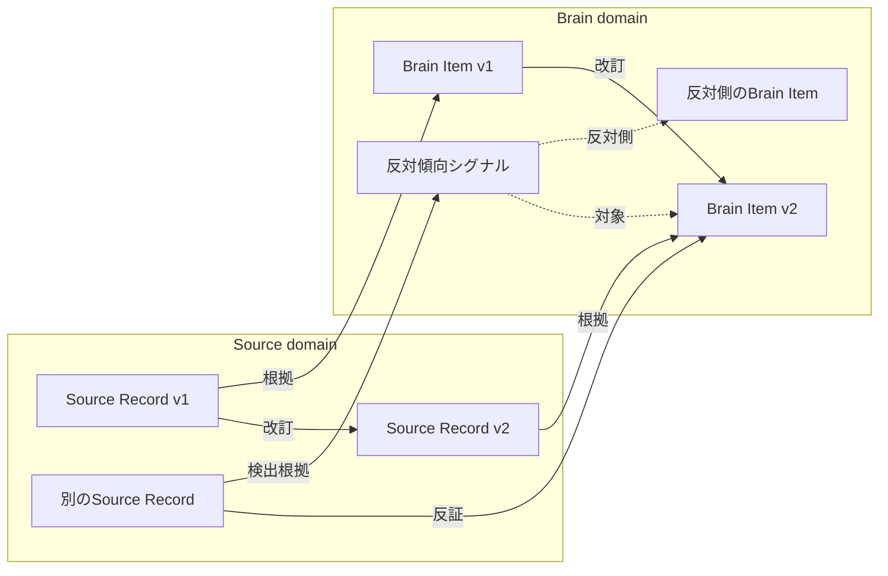

# 根拠・反証・改訂のエッジ設計

## 1. この文書の目的

Source RecordとBrain Itemを結ぶエッジと、Source Record同士・Brain Item同士を結ぶエッジの種類、属性、外部への開示範囲を定義します。

[ドメイン設計 §6](../domain-design.md#6-ドメイン間の関係)がSource RecordとBrain Itemの多重度と由来の必須性を確定したのに対し、この文書はその関係を実際に表現するエッジそのものを扱います。

所有する概念:

- 根拠、反証、改訂の3関係と、その両端・多重度・MVPでの扱い
- AIが検出する反対傾向シグナルと、正式な反証エッジの境界
- エッジが持つ属性と、Brain Itemの`Derivation`との役割分担
- Confidenceの入力、再計算、版管理と利用原則
- エッジとConfidenceを外部へどこまで開示するか
- 改訂で置き換えられた旧版の保持と開示条件

所有しない概念:

| 概念 | SSoT |
| --- | --- |
| Source RecordとBrain Itemの多重度、由来の必須性、本人の操作とSource Recordの発生 | [ドメイン設計 §6](../domain-design.md#6-ドメイン間の関係) |
| Source Recordの粒度とkind、Source domainの責務 | [ドメイン設計 §5](../domain-design.md#5-source-domain) |
| Brain Itemの分類と共通属性（`Evidence`、`Derivation`、`Confidence`、`Revision`） | [Brain内部情報の分類](brain-content-taxonomy.md) |
| Access Label、Access Policy、Access Profile、不変条件 | [Brainのラベル・アクセス制御設計](brain-access-label-design.md) |
| Source Recordの不変性、訂正・削除・撤回とBrain Itemへの波及 | [Source Recordのライフサイクル設計](../source/source-record-lifecycle-design.md) |

この文書では、Confidenceを構成する入力と再計算規則を定めます。具体的な係数、高・中・低の数値境界、永続化schemaは評価datasetを用意する後続実装で決めます（[§8](#8-この文書で決めていないこと)）。

## 2. 全体像

矢印は意味の向き（何が何を支え、何が何を置き換えるか）です。実装上どちら側がもう一方を指すかは[ドメイン設計 §6](../domain-design.md#sourceの所有者と依存方向)の依存方向に従い、Brain Item → Source Recordの単方向です。

## 3. エッジの種類

**確定**: 根拠、反証、改訂の3関係を定義します。改訂はSource Record間とBrain Item間の2つの別関係に分かれるため、エッジ型としては4つになります。

| 関係 | 両端（意味の向き） | 多重度 | MVPでの扱い |
| --- | --- | --- | --- |
| 根拠 | Source Record → Brain Item | Brain Itemごとに1..N（必須） | 必須 |
| 反証 | Source Record → Brain Item | Brain Itemごとに0..N | 型は定義する。反証を検出するAIの実装は必須要件にしない |
| 改訂（Source Record間） | Source Record → Source Record | 0..N | 必須。MVPで先に必要なのはこちら |
| 改訂（Brain Item間） | Brain Item → Brain Item | 0..N | Brain Itemの導出を始めるPhase 2以降 |

根拠の多重度「1..N（必須）」は[ドメイン設計 §6](../domain-design.md#source-recordとbrain-itemの対応)で確定済みのものです。

### 根拠を1つの関係へ統合する

**確定**: 「導出契機か否か」をエッジの属性として持たせ、導出元と事後の裏付けを1つの根拠関係へ統合します。導出元と事後の裏付けを別々の型には分けません。

根拠は包含関係です。導出元のSource Recordは必ず裏付けでもあります。別々の型に分けると、Confidenceを算出するたびに「導出元 ∪ 事後の裏付け」という集合演算を式の中へ常駐させることになります。統合しておけば、根拠エッジの集合をそのまま入力にできます。

導出契機かどうかは属性として残るため、統合しても「どのSource Recordから導出したか」は失われません。

### 反証を根拠と統合しない

**確定**: 反証は根拠とは別の関係にします。

根拠:

- 反証は再導出の入力になりません。根拠エッジの集合はBrain Itemを作り直せる入力ですが、反証はそうではありません
- 反証はBrain Itemを否定する側です。同じ関係へ入れると、符号を表す属性を追加しない限りConfidenceを算出できません
- [Brain内部情報の分類 §3](brain-content-taxonomy.md#3-各分類の詳細)のKnowledge / Beliefは「確信度、根拠、反証、最終確認時点が重要です」として、根拠と反証を並んだ別のものとして扱っています

### 改訂が2つの関係に分かれる

**確定**: 改訂はSource Record間とBrain Item間の2つの別関係とし、MVPで先に必要なのはSource Record間とします。

根拠:

- [プロジェクト概要 §9](../../product/project-overview.md#9-mvpの範囲)がMVPへ含める「回答履歴、修正、削除」は、Source Record側の話です
- [プロジェクト概要 §11](../../product/project-overview.md#11-段階的な進め方)より、Phase 1にはBrain Itemが存在しません。Brain Item間の改訂が必要になるのは、Brain Itemを導出するPhase 2以降です
- [ドメイン設計 §6](../domain-design.md#sourceの所有者と依存方向)の依存方向はBrain → Sourceの単方向です。Source Record間の改訂をBrain Item側の関係として表すことはできません

Source Recordを訂正・削除したときの原本と派生への波及は、[Source Recordのライフサイクル設計](../source/source-record-lifecycle-design.md)で扱います。

### AI検出結果を正式な反証へ昇格させない

**確定**: AIが新しいSource Recordと既存Brain Itemを比較した結果は、正式な反証エッジではなく、反対傾向シグナルとして保存します。本人確認画面や本人による確定操作を前提にせず、AI検出結果を`contradicts`へ自動昇格させません。

反証検出AIが返せる判定は、`supports`、`counters`、`unrelated`、`ambiguous`とContextだけです。AI自身に数値の重みやConfidenceを決めさせません。`counters`は対象Brain Item、根拠Source Record、Context、検出promptまたはモデルのversion、検出時点を持つ反対傾向シグナルになります。反対側のBrain Itemが存在する場合は両Itemも関連づけます。`ambiguous`は監査と将来の再評価のために保持しますが、Confidenceへ影響させません。

同じまたは近いContextで逆の内容が繰り返された場合は、対象Itemへの反対傾向として扱います。仕事と私生活などContextが異なる場合は単純に相殺せず、状況依存を示す入力として扱います。反対側のItemがあっても、一方を上書き、統合、無効化しません。

反対傾向シグナルはConfidenceへ段階的に影響しますが、正式な反証エッジではありません。根拠Source Recordが削除または撤回された場合は利用対象から外し、Confidenceを再計算します。検出器のversionを変更しても全件を自動再処理せず、重大な誤判定の修正が必要な場合だけ対象versionを指定して再評価します。過去の判定は監査履歴として保持します。

## 4. エッジの属性

**確定**: すべてのエッジが次の2つの属性を持ちます。

| 属性 | 内容 |
| --- | --- |
| 導出方法 | `ai` / `deterministic`。値域は[Brain内部情報の分類 §4](brain-content-taxonomy.md#4-分類とは別に持つ共通属性)の`Derivation`と同じ |
| 生成時点 | そのエッジが張られた時点 |

根拠のエッジは、これに加えて「導出契機か否か」を持ちます（[§3](#3-エッジの種類)）。

### 導出方法はエッジが持ち、Brain Itemの値は集計値とする

**確定**: 導出方法はエッジが持ちます。Brain Itemの`Derivation`は、そのBrain Itemに張られた根拠エッジからの集計値です。

[Brain内部情報の分類 §4](brain-content-taxonomy.md#4-分類とは別に持つ共通属性)で既に確定している「`ai`が1件でも混ざればBrain Itemの`Derivation`は`ai`」が、そのまま集計規則になります。集計の対象は、根拠エッジのうち導出契機であるものです。

同§4の「`Derivation`は1つのBrain Itemにつき1つの値を持つ」とは矛盾しません。Brain Itemのレベルで値が1つであることは変わらず、その値がエッジから導かれるだけです。

エッジごとに導出方法が必要なのは、事後の裏付けではBrain Itemの`Derivation`とエッジの導出方法が食い違うからです。

例: 診断の回答から`deterministic`で作ったBrain Itemに対し、後からAIが日記を読んで根拠エッジを張る場合、Brain Itemの`Derivation`は`deterministic`のままですが、そのエッジの導出方法は`ai`です。事後の裏付けはBrain Itemを導いた処理ではないため、何によって導かれたかという事実を書き換えません。エッジ側に導出方法を持たせなければ、この裏付けがAIによるものだと示せなくなります。

### 採らなかった属性

| 候補 | 採らない理由 |
| --- | --- |
| 強度（寄与の強さ） | 文書上の根拠がありません。[Brain内部情報の分類 §3](brain-content-taxonomy.md#3-各分類の詳細)のPreferenceが持つ「強さ」はBrain Itemの属性であって、エッジの属性ではありません。加えて、AI由来のスカラーをエッジへ焼き込むと、「エッジがSSoTでConfidenceは派生値」という[§5](#5-confidenceとエッジの関係)の設計の論拠そのものを弱めます |
| 作成者（本人 / AI） | 本人はエッジを直接作りません。[ドメイン設計 §6](../domain-design.md#本人の操作とsource-recordの発生)より、本人の新しい記述や訂正がSource Recordとなり、アプリケーションの変換処理がエッジを作ります。値域は結局`ai` / `deterministic`になり、導出方法と重複します |

## 5. Confidenceとエッジの関係

**確定**: SSoTはエッジの集合です。Confidenceはそこから導かれる派生値であり、事前に計算してBrain Itemが保持します。外部へ開示した値は、監査のために記録します。

根拠:

- MCPのリクエスト時に全エッジを走査して算出すると、許可されていないラベルの反証を要求経路で読むことになります。[Brainのラベル・アクセス制御設計 §9](brain-access-label-design.md#9-不変条件)の「Access Profileで許可されていないラベルの情報を検索しない」と、同[§7](brain-access-label-design.md#7-mcp接続)末尾の「検索候補を作る時点で許可されていない情報を除外する」に抵触します
- 同[§9](brain-access-label-design.md#9-不変条件)の「ラベル変更後の外部アクセスを監査できる」と、同[§7](brain-access-label-design.md#7-mcp接続)の手順7「使用したBrain Itemと結果を監査ログへ記録する」を満たすには、開示した時点のConfidenceが後から再現できる必要があります。エッジは後から増えるため、値を記録しなければ再現できません

### Confidenceが表すもの

**確定**: 「どちらへ傾いているか」と「判断に十分な独立観察があるか」を別の値として保持します。Confidenceは一方向の命題の確からしさを表し、観察量だけを表す値にはしません。

たとえば支持と反対が5対5なら、一方向のItemの傾きは中立になります。ただし2観察の5対5と100観察の5対5は同じではありません。後者は「状況によって変わる」ことへの確信を高められます。方向、観察量、新しさ、Context一貫性を内部では分離し、検索とAI入力では現在のContextに合うItemを全体傾向より優先します。

Confidenceの決定的計算へ使う要素は次のとおりです。

- activeな根拠エッジと反対傾向シグナル
- 独立した観察数。同じSessionまたは同じ出来事から得た同方向のEvidenceは1観察として数える
- 本人の明言か、実際の出来事からの観察か、AIだけの解釈か
- Source Recordの記録時点と、分類ごとの変化しやすさ
- 同じまたは近いContextで一貫しているか、Contextごとに傾向が分かれるか
- Source Recordの削除、撤回、Evidenceの利用状態

本人の明言は自己認識、Value / Motivation、Preferenceを示す強いEvidenceとして扱い、実際の出来事から繰り返し観察された行動はBehavior PatternとDecision Systemを示す強いEvidenceとして扱います。本人の自己願望は観察された行動への反証にせず、別の見方として保持します。AIだけの解釈は、本人の明言や繰り返し観察より弱く扱います。

古いEvidenceは削除せず、現在の傾向を計算するときの影響を分類ごとに徐々に下げます。Value / Motivationは比較的ゆっくり、Preference、Behavior Pattern、Decision System、Relationship Style、Expression Styleはそれより速く新しいEvidenceを優先します。最近の反対傾向が継続した場合は五分五分とせず、時間的な変化として扱います。

### 計算と再計算

**確定**: 反証とContextの抽出にはAIを利用できますが、Confidenceの最終値はversion付きの決定的なルールと数式で算出します。AIへ数値の重みを直接決めさせません。計算結果には計算式versionを保存し、過去に表示またはAI入力へ利用した値とversionは上書きせず監査履歴へ残します。

Evidenceまたは反対傾向シグナルの追加、削除、撤回、利用状態の変更時は、プランにかかわらず対象Itemの再計算を即時に予約します。それとは別に、検索、AI入力、本人向け表示の時点で前回計算からプラン別の最大更新間隔を超えていればオンデマンドで再計算します。定期処理は最近利用されたAccountの取りこぼし回復だけを担い、休眠Accountを間隔ごとに強制起動しません。最大更新間隔は[サブスクリプション・料金プラン設計 §4.1](../../product/subscription-plan-design.md#41-機能一覧)を正とします。

再計算はAccountData内のEvidenceとシグナルを集計する処理であり、反証検出AI、Embedding再生成、Vectorize再登録を含めません。計算式versionを更新したactive Itemも、利用時または回復処理で順次再計算します。

高・中・低の具体的な数値境界と各要素の係数は、同じ評価datasetで変更前後を比較して決めます。

Source Recordの削除時に古いConfidenceの開示を止めるタイミング、再計算後のBrain Item、監査ログへ記録済みのConfidenceの扱いは[Source Recordのライフサイクル設計 §5](../source/source-record-lifecycle-design.md#5-brain-itemへの波及)をSSoTとします。

## 6. 外部への開示

**確定**: エッジそのものは外部のAccess Profileへ返しません。Confidenceだけを粗い3段階（高 / 中 / 低）で開示します。

| 対象 | 本人（Owner Profile） | 外部のAccess Profile |
| --- | --- | --- |
| エッジの中身（どのSource Recordか） | 開示する | 開示しない |
| 根拠N件 / 反証M件の内訳 | 開示する | 開示しない |
| Confidenceの履歴 | 開示する | 開示しない |
| Confidence | 詳細を開示する | 粗い3段階（高 / 中 / 低）で開示する |

高・中・低は本人向け表示にも用います。検索とAI入力では表示値だけでなく内部の傾き、観察量、新しさ、Context一貫性を使います。低ConfidenceのItemを一律に除外せず、検索順位を下げたうえで弱い仮説として区別します。現在のContextに合う複数の反対傾向がある場合は、一方だけを隠さず両方を候補にします。

**確定**: 開示の粒度はAccess Profileの設定項目にせず、「外部は常に粗く、Owner Profileは詳細」という固定の規則とします。

根拠: [Brainのラベル・アクセス制御設計 §5](brain-access-label-design.md#5-access-profile)のAccess Profileの設定項目に、開示の粒度はありません。「利用可能な機能」で表現できるのは機能の可否だけで、粒度は表現できません。固定の規則にすれば、新しい設定語彙を増やさずに済みます。

**確定**: `get_evidence`は反証を返しません。

根拠: [プロジェクト概要 §3.2](../../product/project-overview.md#32-mcpでエージェントへ提供する)の`get_evidence`の定義は「生成内容の根拠となった回答を確認する」であり、反証はその範囲外です。加えて[Brainのラベル・アクセス制御設計 §9](brain-access-label-design.md#9-不変条件)の「非公開情報の存在自体を許可されていない接続先へ示さない」により、反証の件数も、反証が欠落していることも示せません。

`get_evidence`は[プロジェクト概要 §9](../../product/project-overview.md#9-mvpの範囲)のMVPの範囲には入っておらず、[§3.2](../../product/project-overview.md#32-mcpでエージェントへ提供する)の初期のMCP機能候補です。根拠表示を活用するのは[§11](../../product/project-overview.md#11-段階的な進め方)のPhase 3です。

### 原則4と不変条件の衝突をどう解いたか

Confidenceを外部へ開示するかどうかは、2つの要求が衝突します。

| 要求 | 内容 | Confidenceの開示への向き |
| --- | --- | --- |
| [プロジェクト概要 §13](../../product/project-overview.md#13-現時点のプロダクト原則)の原則4 | 分身であることと、回答の根拠・不確かさを明示する | 開示を要求する |
| [Brainのラベル・アクセス制御設計 §9](brain-access-label-design.md#9-不変条件)の6項目め | 非公開情報の存在自体を、許可されていない接続先へ示さない | 開示に反対する |

- 開示しない場合の損失: 外部エージェントが分身の自己申告を確定した事実として扱います。[プロジェクト概要 §13](../../product/project-overview.md#13-現時点のプロダクト原則)の原則2「本人の回答とAIの推定を混同しない」も同時に破れます
- 開示する場合の損失: 同じ問い合わせを繰り返したときのConfidenceの低下から「見えない反証が増えた」と推測でき、非公開のSource Recordの存在が間接的に漏れます

**確定**: 原則4を優先します。開示を粗い3段階に丸めることで、段階の境界をまたがない変動は観測できなくなり、漏洩を減らせます。

代償: これは不変条件の6項目めを満たすものではありません。段階の境界をまたぐ変化は依然として観測できるため、**漏洩を許容できる水準まで下げるにとどまります**。どこに境界を置くかで漏れやすさが変わるため、3段階の閾値を決めるときにこの代償を再評価します。

## 7. 改訂された旧版の扱い

**確定**: 改訂で置き換えられた旧版は削除せずに保持し、検索の対象から外します。検索の対象は最新版だけとし、旧版は改訂エッジを辿って参照します。

根拠: 旧版を消すと「本人が主張を変えた」という履歴が失われます。[Brain内部情報の分類 §7](brain-content-taxonomy.md#7-矛盾と優先順位)は、矛盾する内容を「上書きして1つに統合せず、利用場面、時点、確信度、根拠とともに保持します」としています。

**確定**: 改訂の履歴を残すために、追加の仕組みは設けません。

- 「いつ改訂したか」は、改訂エッジの生成時点（[§4](#4-エッジの属性)）が表します
- 「本人が何と言って書き直したか」は、訂正が生むSource Record（[ドメイン設計 §6](../domain-design.md#本人の操作とsource-recordの発生)）が表します

**確定**: 旧版の開示条件は、その版が属する改訂鎖上の全版のうち、最も厳しいAccess Policyとします。

根拠: [Brainのラベル・アクセス制御設計 §8](brain-access-label-design.md#8-派生情報の扱い)の「派生したBrain Itemは、元情報の最も厳しいAccess Policyを引き継ぐ」を、改訂鎖へ適用したものです。

「旧版自身のAccess Policyと最新版のAccess Policyの論理積」では不十分です。v1（公開）→ v2（非公開）→ v3（公開）と改訂した鎖でv1を判定すると、v1もv3も公開なのでv1が開示されます。v2で本人が非公開にしたという判断が、開示可否へ一切反映されません。v1とv2は同じ主題の版であるため、v1を出せばv2で隠したかった内容が推測できます。鎖の途中の版を飛ばさず、鎖全体で最も厳しいPolicyを見る必要があります。

外部へ提供済みの旧版をラベル変更後にどう扱うかは、[Brainのラベル・アクセス制御設計 §11](brain-access-label-design.md#11-今後決めること)の6項目め「ラベル変更後のキャッシュと外部提供済みデータの扱い」で扱います。

## 8. この文書で決めていないこと

- Confidenceの各要素に対する具体的な係数と、高・中・低の数値境界
- 反対傾向シグナル、Confidence計算履歴、利用時監査の永続化schemaとindex
- 外部連携時のAccess Label既定値の詳細と、Source Connectorの具体的なモデル
- 正式な反証エッジを作成できる、AI検出以外の信頼済み入力が将来必要か
