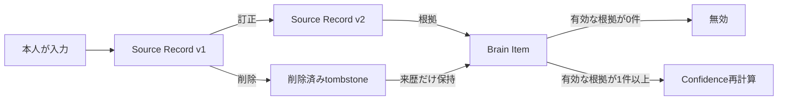

# Source Recordのライフサイクル設計

## 1. この文書の目的

Source Recordを原本としてどう保持し、訂正、削除、取り消し、撤回が起きたときに改訂鎖と派生したBrain Itemをどう扱うかを定義します。あわせて、アカウント復旧を補うエクスポートの対象を定義します。

所有する概念:

- Source Recordの不変性とライフサイクル
- 訂正、削除、日記の取り消し、撤回の意味
- Source Recordの削除がBrain ItemとConfidenceへ及ぼす影響
- 改訂鎖の途中の版を削除する規則
- エクスポートへ含める原本、派生、履歴の範囲

所有しない概念:

| 概念 | SSoT |
| --- | --- |
| Source Recordの粒度とkind、Source domainの責務 | [ドメイン設計 §5](../domain-design.md#5-source-domain) |
| Source RecordとBrain Itemの多重度、由来の必須性 | [ドメイン設計 §6](../domain-design.md#6-ドメイン間の関係) |
| 根拠、反証、改訂のエッジの種類と属性 | [根拠・反証・改訂のエッジ設計](../brain/evidence-edge-design.md) |
| 改訂鎖のAccess PolicyとConfidenceの開示 | [根拠・反証・改訂のエッジ設計 §5](../brain/evidence-edge-design.md#5-confidenceとエッジの関係)と[§7](../brain/evidence-edge-design.md#7-改訂された旧版の扱い) |
| Access Label、Access Policy、Access Profile | [Brainのラベル・アクセス制御設計](../brain/brain-access-label-design.md) |
| 物理削除・論理削除の実装方式、保存期間 | [プロジェクト概要 §12](../../product/project-overview.md#12-今後決めること) |

## 2. 全体像

**確定**: Source Recordの命題内容は作成後に上書きしません。訂正と撤回は新しいSource Recordを作り、削除と取り消しは既存のSource Recordを削除済みへ遷移させます。

削除済みへの遷移は原本の内容を訂正する操作ではありません。本文を物理的に消去するか、どの期間保持するかはこの文書では決めません。

## 3. 訂正と原本の不変性

**確定**: 訂正は既存のSource Recordを上書きせず、訂正後の命題を持つ新しいSource RecordとSource Record間の改訂エッジを作ります。旧版は検索対象から外れ、改訂鎖からのみ参照されます。

根拠:

- 本人の訂正が新しい命題内容を持ち込む操作であることは、[ドメイン設計 §6](../domain-design.md#本人の操作とsource-recordの発生)で確定している
- Source Record間の改訂エッジは、訂正を提供するV2で必須であり、旧版の保持も[根拠・反証・改訂のエッジ設計 §7](../brain/evidence-edge-design.md#7-改訂された旧版の扱い)で確定している
- 上書きすると、本人がいつ、どの内容から主張を変えたかを改訂鎖で説明できない

採らなかった代替案:

- **訂正時に既存のSource Recordを上書きする**: 改訂エッジの両端と旧版が失われ、確定済みの改訂モデルを満たせない
- **削除だけを原本の可変性の例外とする**: 削除は命題内容の書き換えではなく、利用を停止するライフサイクル遷移として表現できるため、例外を設ける必要がない

## 4. 削除とtombstone

**確定**: ドメイン上の削除は、Source Recordを削除済みtombstoneへ遷移させることを意味します。

削除済みSource Recordは次のように扱います。

- 本文を通常の検索、外部開示、Brain Itemの有効な根拠、通常のエクスポート対象にしない
- Source Recordの識別子、削除済みであること、改訂エッジと根拠エッジの来歴を保持する
- 改訂鎖の開示判定に必要なAccess Policyの制約を保持する
- 削除前に外部へ開示した事実を表す監査ログを削除しない。ただし、監査ログへSource Recordの本文を複製しない

tombstoneをどのデータ構造で表すか、本文を物理的に消すか、いつ消すかは永続化設計で決めます。この文書が要求するのは、実装方式にかかわらず上記のドメイン上の結果を保つことです。

根拠:

- Source Record自体を消すと、改訂鎖とBrain Itemの過去の来歴を説明できない
- 削除後も本文を根拠や検索へ使うと、[プロジェクト概要 §8](../../product/project-overview.md#8-プライバシーと安全性)の削除の約束を満たせない
- 開示制約まで消すと、非公開だった途中の版を削除して過去の公開版を開示できるようになる

採らなかった代替案:

- **Source Recordの存在と関係をすべて消す**: 改訂鎖、派生の来歴、過去の開示の監査が欠落する
- **画面から隠すだけで根拠として使い続ける**: ユーザーが削除後の利用を止められない

## 5. Brain Itemへの波及

### 唯一の有効な根拠が削除された場合

**確定**: 有効な根拠が0件になったBrain Itemは無効化し、通常の検索と外部開示から外します。Brain Itemと削除済みSource Recordの根拠エッジは、過去の来歴として保持します。

[ドメイン設計 §6](../domain-design.md#source-recordとbrain-itemの対応)の「すべてのBrain Itemは1件以上のSource Recordを根拠として持つ」という不変条件は維持されます。無効化後も根拠エッジは残りますが、削除済みSource Recordは有効な根拠として利用できません。通常の検索と外部開示に利用できるBrain Itemは、1件以上の削除されていない根拠を必要とします。

採らなかった代替案:

- **Brain Itemを連鎖削除する**: 過去にどのSource Recordから何を導出し、開示したかを追えなくなる
- **別のSource Recordへ自動的に付け替える**: 同じ命題を実際に支える根拠があることを確認せずに来歴を書き換えることになる。別の有効な根拠が既にある場合は、次節の複数根拠として扱う

### 複数の有効な根拠が残る場合

**確定**: Source Recordの削除時は、そのSource Recordを根拠にするBrain Itemを同期的に開示不可かつ再計算待ちへ遷移させます。Confidenceの再計算自体は非同期で行い、完了後に有効なBrain Itemを再び利用可能にします。

**確定**: 有効な根拠が1件以上残るBrain Itemは、Confidenceが下がったことだけを理由に削除または無効化しません。再計算後のConfidenceで保持します。

Confidenceの具体的な算出方法、閾値、処理基盤は決めません。ここで定めるのは、削除済み根拠を含む古いConfidenceを外部へ開示しないことと、再計算中の状態を安全側へ倒すことです。

### 過去に開示したConfidence

**確定**: Source Recordを削除しても、監査ログへ記録済みの過去の開示Confidenceは削除しません。

削除は将来の検索、根拠利用、開示を止める操作です。過去に何を開示したかという監査事実まで消すと、[根拠・反証・改訂のエッジ設計 §5](../brain/evidence-edge-design.md#5-confidenceとエッジの関係)が要求する開示時点の再現ができません。監査ログは開示したConfidenceと対象の識別に必要な情報を保持しますが、削除されたSource Recordの本文を保持する場所にはしません。

採らなかった代替案:

- **削除に合わせて過去の開示Confidenceも消す**: ユーザーの削除要求を監査記録にも広げられる一方で、過去の外部開示を後から検証できなくなる

## 6. 改訂鎖の途中の版の削除

**確定**: 改訂鎖全体に限らず、途中の版だけを削除できます。ただし、その版のtombstone、前後を含む改訂エッジ、その版が持っていたAccess Policyの制約は鎖に残します。

改訂鎖の旧版の開示条件は、削除済みtombstoneを含む鎖上の全版のうち最も厳しいAccess Policyです。途中の版を削除しても、開示判定からその版のPolicyを除外しません。

根拠: 鎖単位の削除だけでは、誤って機微情報を書いた版だけを削除したい要求へ過剰に作用します。一方、tombstoneとPolicyの制約を残せば、`v1（公開）→ v2（非公開）→ v3（公開）`のv2を削除してv1を開示できるようになる穴を防げます。

採らなかった代替案:

- **改訂鎖全体だけを削除可能にする**: 開示判定は単純になるが、削除したい版以外の原本まで利用できなくなる
- **途中の版を完全に取り除いて前後を直接つなぐ**: その版の非公開判断と改訂の事実が失われる

## 7. 日記の取り消しと撤回

**確定**: V2で、誤送信を戻す「送信取り消し」と、過去の発言を現在は支持しない「撤回」の両方を提供します。Webから行う通常の削除とも意味を分けます。

| 操作 | 意味 | 対象と時間 | Source Recordへの結果 |
| --- | --- | --- | --- |
| 送信取り消し | 誤送信した日記を削除するショートカット | サーバー受付後10分以内で、操作時点の直前の日記1件 | [§4](#4-削除とtombstone)と同じ削除済みtombstoneになる |
| 撤回 | 当時書いた事実は残すが、現在はその内容を支持しない | 時間制限なし | 撤回を表す新しいSource Recordと改訂エッジを作り、元の日記を旧版にする |
| 削除 | 保存されている内容を今後利用させない | Webから対象を選ぶ。時間制限なし | [§4](#4-削除とtombstone)の削除済みtombstoneになる |

撤回は削除ではないため、元の日記と撤回後のSource Recordを本人の履歴とエクスポートに含めます。改訂で置き換えられた元の日記は、[根拠・反証・改訂のエッジ設計 §7](../brain/evidence-edge-design.md#7-改訂された旧版の扱い)に従って通常の検索から外します。

根拠:

- 送信取り消しを削除と同じ規則にすれば、Phase 2でBrain Itemが導出されても削除の波及規則を再利用できる
- 撤回を別にすれば、「書いていないことにしたい」と「当時はそう考えていたが変わった」を区別できる
- 受付前の仮状態を設けないため、入力と導出の間へ新しいライフサイクルを追加せずに済む

採らなかった代替案:

- **取り消し時はSource Recordが存在しなかったことにする**: 受付後の仮状態と確定処理が必要になり、確定前に派生を作らないための別規則が増える
- **取り消しと撤回を同じ状態にする**: 誤送信の削除と、意見が変わった履歴を区別できない

## 8. エクスポート

**確定**: エクスポートは、LINEアカウントを失った場合にも別の環境で履歴と関係を再構成できる完全アーカイブとします。

含めるもの:

- 現行版と改訂済み旧版のSource Record、およびそのAccess Policy
- 有効・無効を含むBrain Itemと、保持しているConfidence
- 根拠、反証、Source Record間とBrain Item間の改訂エッジ
- 本人へ提供しているアクセス履歴と、外部へ開示したConfidenceの監査記録
- 削除済みSource Recordのtombstone、削除状態、関係、開示制約に必要なPolicy

含めないもの:

- 削除済みSource Recordの本文やメディア
- 認証トークン、サービス内部の秘密情報

V2でエクスポートを提供する時点でBrain Itemとそのエッジが存在しなければ、その部分は空になります。後から同じ形式へ派生情報を追加できるようにします。

archive全体のデータ分類、非同期生成、期限、APIと認可は[本人データエクスポート実装契約](../../development/personal-data-export.md)を正とします。

根拠:

- エクスポートは、LINEアカウント喪失時の復旧を保証しないことをV2で補う機能であり、現在有効な回答だけでは履歴と関係を再構成できない
- 削除済み本文を含めると、削除によって今後利用させないという[§4](#4-削除とtombstone)の意味と衝突する

採らなかった代替案:

- **現在有効なSource Recordだけを含める**: 改訂履歴、派生の根拠、アクセス履歴を移行できない
- **削除済み本文を含む全データを出力する**: 削除済みデータを再び利用可能にしてしまう

## 9. この文書で決めていないこと

- 物理削除と論理削除のどちらでtombstoneを実現するか
- Source Recordの本文、tombstone、監査ログの保存期間
- Confidenceの算出式、閾値、再計算処理の実行基盤
- archiveの暗号化方式
