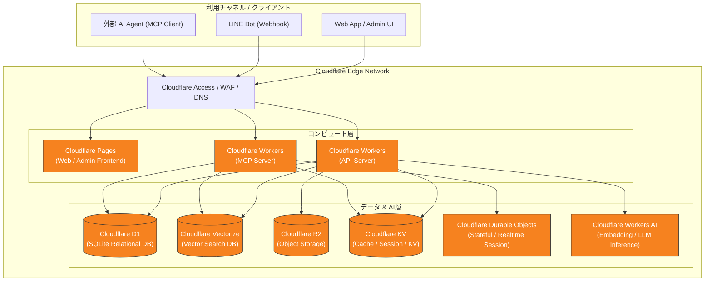

# me-builder インフラ・システム構成

## 1. この文書の目的

me-builderの開発基盤および全体アーキテクチャにおいて、インフラストラクチャおよびシステム構成のSSoT（Single Source of Truth）を定義します。

本サービスでは、高可用性・低遅延・グローバルエッジでのスケーラビリティ・開発運用コストの最小化を実現するため、インフラストラクチャを全面的に **Cloudflare** エコシステムに統一して構築します。

## 2. 所有する概念と所有しない概念

### 所有する概念

- システム全体のブロック構成および技術スタック
- 各 Cloudflare コンポーネント（Pages, Workers, D1, Vectorize, R2, KV, Durable Objects, Workers AI）の役割と配置
- フロントエンド、API、MCPサーバー、ストレージ間のデータフロー
- 開発・プレビュー・本番環境のインフラ運用方針

### 所有しない概念

- `Account` および `Brain` のドメイン境界や責務の定義 — [ドメイン設計](domain-design.md)
- ラベルの分類・定義およびMCPアクセス許可規則 — [Brainのラベル・アクセス制御設計](brain-access-label-design.md)
- Brain Itemの分類名および具体例 — [Brain内部情報の分類](brain-content-taxonomy.md)
- プロジェクトの目標、MVP範囲、全体ロードマップ — [プロジェクト概要](project-overview.md)
- 具体的なデータベーステーブル定義、GraphQL/REST/MCPツール等の個別スキーマ詳細

## 3. インフラ・システム構成の全体像

me-builderは、全コンポーネントが Cloudflare のグローバルエッジネットワーク上で動作するサーバーレス・エッジファースト構成を採用します。



## 4. コンポーネント別の役割と選定

| コンポーネント | Cloudflare サービス | 主な役割・用途 |
| --- | --- | --- |
| **フロントエンド** | **Cloudflare Pages** | Webアプリケーションおよび管理者画面のビルド・ホスティング。高速なエッジ配信と自動プレビューデプロイを実現。 |
| **API サーバー** | **Cloudflare Workers** | HTTP / REST / Webhook API（LINE連携、認証、データ登録等）の処理。軽量な TypeScript/Hono フレームワーク等で構築。 |
| **MCP サーバー** | **Cloudflare Workers** | 外部 AI エージェント向け MCP (Model Context Protocol) 端点の提供。SSE (Server-Sent Events) および HTTP 通信を直接処理。 |
| **構造化データストア** | **Cloudflare D1** | サーバーレスリレーショナルデータベース (SQLite)。`Account` 情報、`Brain` メタデータ、`Access Label`、`Access Profile`、監査ログを保持。 |
| **ベクトル検索ストア** | **Cloudflare Vectorize** | 完全マネージドなベクトルデータベース。`Brain Item` の埋め込みベクトル（Embedding）を保存し、コサイン類似度等による高速セマンティック検索を提供。 |
| **メディアストレージ** | **Cloudflare R2** | S3互換のオブジェクトストレージ。ユーザーが投稿・回答した写真、イラスト、動画、音声などのメディア原本データを保存（エグレス料金ゼロ）。 |
| **キー・バリュー / キャッシュ** | **Cloudflare KV** | 低遅延グローバルキー・バリューストア。認証トークン、一時セッション、アクセス制御キャッシュ、レート制限カウントを保持。 |
| **状態管理 / ドメイン協調** | **Cloudflare Durable Objects** | 厳格な単一整合性が求められるリアルタイムセッション制御や、MCP接続状態の排他制御・ステートフルな協調を処理。 |
| **AI / 推論基盤** | **Cloudflare Workers AI** | エッジ上でのテキスト Embedding 生成（ベクトル化）および軽量 AI モデル推論の実行。外部 LLM サービス呼び出し時は Workers 経由で安全にプロキシ通信。 |
| **セキュリティ & ネットワーク** | **Cloudflare Access / WAF** | DDoS防御、WAFルール適用、SSL/TLS証明書管理、管理画面等へのゼロトラストアクセス制御（Cloudflare Access）。 |

## 5. データ連携フロー原則

1. **メディア登録とメタデータ保持**
   - ユーザーから投稿されたバイナリデータ（写真・動画・音声）は Cloudflare R2 へ直接保存します。
   - メディアのメタデータ、所有権、アクセスラベル等の構造化情報は Cloudflare D1 へ記録します。

2. **テキストおよびメディアのベクトル化と検索**
   - 新規の回答データや要約テキストは Cloudflare Workers AI を通じて Embedding ベクトルへ変換されます。
   - 生成されたベクトルは Cloudflare Vectorize にインデックス化され、MCP経由でのセマンティック検索（`search_answers` 等）に利用されます。

3. **MCPアクセス制限と監査**
   - MCPリクエスト受領時、Cloudflare Workers は D1 および KV に保持された `Access Profile` と `Access Label` を照合し、認可範囲内の情報のみを返却します。
   - すべての閲覧・検索リクエストは D1 または KV に監査ログとして非同期書き込みされます。

## 6. 開発・運用環境方針

開発基盤には **Bun Workspaces** を用いたモノレポ構造（`apps/web`, `apps/api`）を採用し、ローカル開発・PRプレビュー・本番環境で一貫した開発体験と安全なデプロイを実現します。

- **モノレポ構成 (`Bun Workspaces`)**:
  ```text
  me-builder/
  ├── Taskfile.yml       # タスクランナー定義 (task dev, task i 等)
  ├── package.json       # ルート設定 (workspaces 定義)
  ├── tsconfig.json      # モノレポ共通 TypeScript 設定
  ├── apps/
  │   ├── web/           # Frontend UI (React + Vite + TypeScript)
  │   ├── api/           # API Server (Bun.serve + Hono)
  │   └── mcp/           # MCP Server (Bun.serve / Workers)
  └── packages/
      └── shared/        # 共有型定義 & ユーティリティ (純粋な .ts ソース直参照)
  ```
  - `apps/web`: React (Vite + TypeScript) によるフロントエンド。
  - `apps/api`: `Bun.serve` および Web標準 API 準拠の **Hono** フレームワークを採用。ローカルでの高速実行とエッジ/クラウド環境への透過的なデプロイを両立。
  - `apps/mcp`: Cloudflare Workers / Bun 上で動作する MCP (Model Context Protocol) サーバー。
  - `packages/shared`: 全アプリケーション間で共有されるドメイン型定義およびユーティリティライブラリ。
- **ローカル開発環境 (`Local`)**:
  - ルートの `bun dev` コマンドにより、`apps/api` (`Bun.serve`), `apps/mcp`, `apps/web` (Vite dev server) を並行起動して開発・デバッグを実施。
  - `wrangler dev` やローカルデータベースエミュレーションとの統合もサポート。
- **プレビュー環境 (`PR Preview`)**:
  - プルリクエスト作成時、GitHub Actions 経由で `apps/web` を Cloudflare Pages Preview 環境へ、`apps/api` および `apps/mcp` を Cloudflare Workers Preview / 検証環境へ自動ビルド & デプロイ。
- **本番環境 (`Production`)**:
  - `main` ブランチマージ時に、CI/CD パイプライン経由で各サービスを宣言的に Cloudflare 本番環境（Pages, Workers）等へデプロイ。

## 7. 関連ドキュメント

- [Agent向けガイド](../.agents/README.md)
- [開発運用ルール](../.agents/rules/development.md)
- [プロジェクト概要](project-overview.md)
- [ドメイン設計](domain-design.md)
- [Brain内部情報の分類](brain-content-taxonomy.md)
- [Brainのラベル・アクセス制御設計](brain-access-label-design.md)
