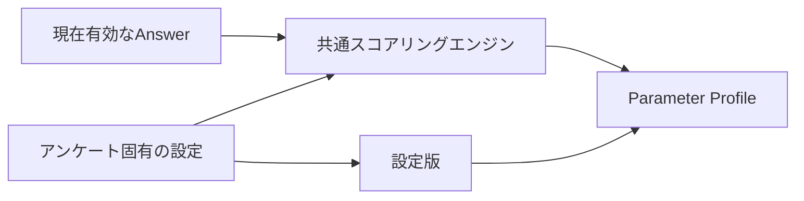

# アンケート回答のパラメータ変換設計

## 1. この文書の目的

この文書は、アンケート回答を複数のパラメータへ決定的に変換する共通方式を定義します。アンケートごとに与える設定、共通の計算手順、入力の検証、出力、版管理を所有します。

最初のアンケート固有のパラメータと重みは[「自分と相手の優先・境界線」パラメータ変換設計](relationship-priority-parameter-design.md)を正とします。Question / Survey / Answerは[Phase 1 アンケートドメイン設計](questionnaire-domain-design.md)、Brain Itemの分類と`Confidence`は[Brain内部情報の分類](brain-content-taxonomy.md)を正とします。

## 2. 結論

計算処理はすべてのアンケートで共通にし、違いを設定として渡します。



アンケート固有の設定が持つものは次のとおりです。

| 設定 | 役割 |
| --- | --- |
| `version` | 使用した変換規則を識別する |
| `parameters` | パラメータID、表示名、低い側・高い側のラベル |
| `choiceScores` | 回答値を-1〜1へ変換する |
| `questions` | Question ID、Question Version、パラメータごとの重み |
| `minimumCoverage` | スコアを表示できる最低回答充足率 |
| `lowMaximum` | 低い側と中央の境界 |
| `highMinimum` | 中央と高い側の境界 |
| `balancedLabel` | 中央帯の表示名 |

質問文、選択肢、重み、パラメータの意味はアンケート固有です。回答の検証、集計、正規化、回答不足判定、帯域判定は共通です。

## 3. 設定形式

設定は次の形で与えます。例は説明用であり、特定アンケートのSSoTではありません。

```ts
{
  version: 1,
  parameters: [
    {
      id: "planning",
      label: "計画性",
      lowLabel: "即興を好む",
      highLabel: "計画を好む",
    },
  ],
  choiceScores: { yes: 1, no: -1 },
  questions: {
    "question-id": {
      questionVersion: 1,
      weights: { planning: 0.5 },
    },
  },
  minimumCoverage: 0.6,
  lowMaximum: 35,
  highMinimum: 65,
  balancedLabel: "状況による",
}
```

`choiceScores`はYes／Noに限定しません。たとえば`agree: 1`、`neutral: 0`、`disagree: -1`を設定すれば、同じ計算処理で3択を扱えます。

1問は複数のパラメータへ寄与できます。重みが正なら回答値の正方向、負なら逆方向へ動かします。重みを持たないパラメータには寄与しません。

## 4. 共通の計算手順

パラメータごとに次を計算します。

```text
加重和 = Σ（choiceScores[回答値] × 質問の重み）
回答済み重み = Σ（abs（質問の重み）× 最大回答値）
生スコア = 加重和 ÷ 回答済み重み
表示スコア = round（50 + 50 × 生スコア）
coverage = 回答済み重み ÷ そのパラメータの全重み
```

`最大回答値`は、`choiceScores`の絶対値の最大です。これにより、重みと回答尺度が変わっても0〜100へ正規化できます。

処理順は次のとおりです。

1. 同じQuestion IDへ複数回答があれば、最後の回答を現在値とする
2. スキップ、未知のQuestion ID、未知の回答値を除外する
3. 設定のQuestion Versionと一致しない回答を除外する
4. パラメータごとに加重和、回答済み重み、`coverage`を計算する
5. `coverage`が`minimumCoverage`未満なら、スコアを`null`にする
6. それ以外は0〜100へ正規化し、低・中央・高の帯域を決める

## 5. 不変条件

- 設定版は1以上の整数とする
- Parameter IDは設定内で重複させない
- 各Parameter IDには、少なくとも1問の0以外の有限な重みを割り当てる
- `choiceScores`は1件以上を持ち、すべて-1〜1の有限値とする
- Question Versionは1以上とする
- `minimumCoverage`は0〜1とする
- 帯域境界は0〜100に置き、`lowMaximum < highMinimum`とする
- 同じ入力回答と同じ設定版からは、常に同じ出力を返す
- スコアの向きに良し悪しを持たせない
- `coverage`を統計的な`Confidence`として扱わない

## 6. 版管理

結果は少なくとも、使用したQuestion ID、Question Version、選択値、設定版から再現できる必要があります。

質問文・選択肢を変更する場合はQuestion Versionを追加します。パラメータ、重み、回答値の変換、表示境界を変更する場合は設定版を追加します。過去の回答結果を、新しい設定版で暗黙に読み替えません。

## 7. 新しいアンケートを追加する手順

1. 質問と選択肢を審査し、Question IDとQuestion Versionを確定する
2. 独立して表示したいパラメータと両端の意味を決める
3. 選択値のスコアを決める
4. 各質問が各パラメータへ与える重みを設定する
5. 最低回答充足率と表示境界を設定する
6. 代表回答、全回答、未回答、逆方向、再回答をテストする
7. 本人による評価と再回答データで、質問と重みの妥当性を検証する

新しい計算関数は作りません。新しい設定と、その設定を検証するテストだけを追加します。

## 8. 現在の実装境界

共通エンジンはWeb UI内の純粋関数です。現在はサーバー保存、Brain Itemの生成、改訂時の再計算を行いません。

将来サーバーへ移す場合も、設定の構造、版管理、決定性を維持します。クライアントの算出値を正として保存せず、検証済みAnswerと同じ設定版からサーバー側で再計算します。
