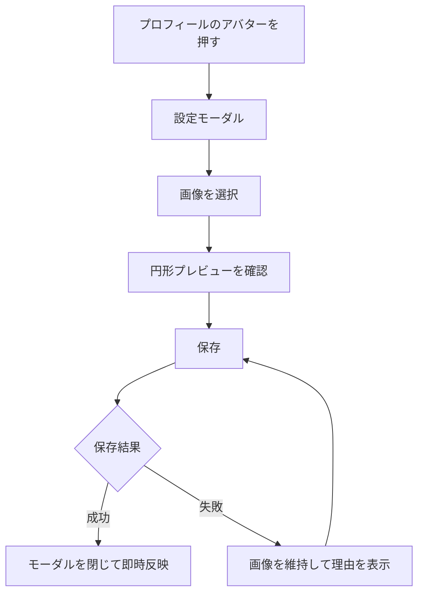

# アバター設定体験設計

## 1. 目的

この文書は、本人が端末の画像を自分のアバターとして設定する体験を定義します。プロフィールの入口と設定項目は[プロフィール設定体験設計](profile-settings-experience.md)、実装境界は[アバター実装設計](../architecture/avatar-implementation-design.md)を正とします。

## 2. 結論

- 共通ヘッダー右上からプロフィールを開き、アバターを押して設定モーダルを開く
- モーダルでは画像を1件選択し、円形のプレビューを確認して「保存」を押す
- 保存が成功したらモーダルを閉じ、現在のアバターへ即時反映する
- 人物判定、AI画像生成、候補生成、生成状態、pollingは設けない
- アバター未設定時はLINEプロフィール画像を初期表示し、アプリ側へ複製・保存しない
- 現在画像は本人がログインしたWeb内だけで表示する

## 3. 基本フロー

ファイルを選んだだけでは送信しません。「保存」を押した後だけアップロードします。保存中は二重送信を防ぎ、完了するまで保存ボタンを無効にします。失敗時は選択画像を維持し、再試行または選び直しができます。

## 4. 画像要件

- JPEG、PNG、WebP
- 最大10MB
- サーバーで画像としてdecodeし、1024px以下の正方形WebPへ正規化する
- SVG、壊れた画像、上限を超える画像は保存せず、理由と選び直しを表示する
- 画像を使う権利と、写っている人の同意が必要なことをファイル選択付近へ表示する

端末側の`accept`属性だけを検証に使いません。サーバーで形式、容量、decode結果を検証します。

## 5. 表示と変更

現在のアバターは次へ表示します。

- 共通ヘッダー右上のプロフィール入口
- プロフィールのアバター項目
- 「わたしの傾向」のヘッダー
- 主ナビゲーションの「わたし」アイコン

未設定時はLIFFから取得したLINEプロフィール画像を表示します。LINEプロフィール画像がない場合だけ共通のプレースホルダーを表示します。保存直後は再読み込みを待たず、同じ画面内の全表示へ反映します。削除するとLINEプロフィール画像またはプレースホルダーへ戻します。

本番では設定、差し替え、削除をプロフィール変更として記録し、次の変更まで7日間空けます。初回設定は制限しません。previewとlocalは動作確認のため変更間隔を設けません。制限中は次に変更できる日時を表示します。

## 6. プライバシー

- 画像はprivate R2へ保存し、公開URLを発行しない
- 画像取得APIはLIFF ID tokenで本人確認する
- Account ID、R2 object key、画像本文をログへ出さない
- AI事業者を含む外部の画像処理サービスへ画像を送らない
- 差し替え・削除した画像は再試行可能な削除対象として扱う

## 7. アクセシビリティ

- アバター操作はbuttonとしてキーボードで開ける
- モーダルには見出し、閉じる操作、フォーカス管理を設ける
- ファイル選択、保存中、エラーを文字でも伝える
- 色や画像だけに設定状態を依存しない

## 8. 完了条件

- プロフィールのアバターから設定モーダルを開ける
- 対応画像を選び、プレビュー後に保存できる
- 保存成功後にモーダルが閉じ、全表示へ即時反映される
- 再訪時に同じ画像を取得できる
- 不正画像、通信失敗、変更間隔制限を画面上で回復できる
- 削除後はプレースホルダーへ戻る
- 人物判定、AI生成、候補選択、生成中表示が残っていない
