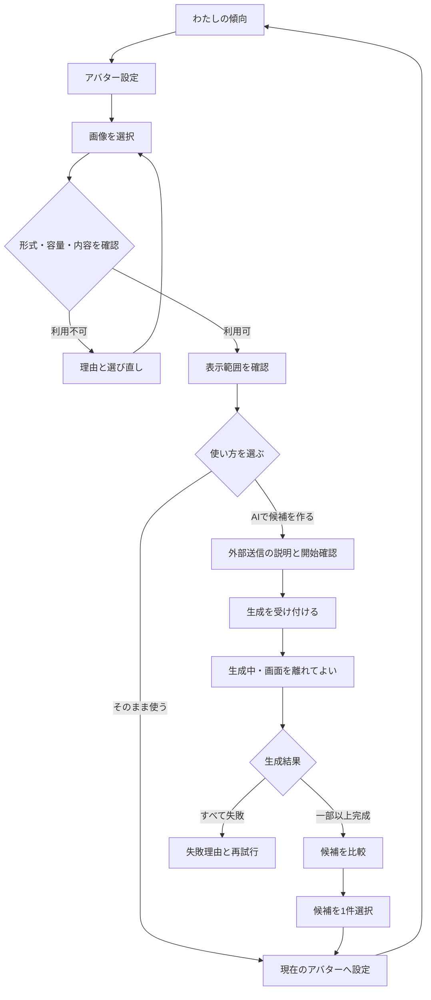
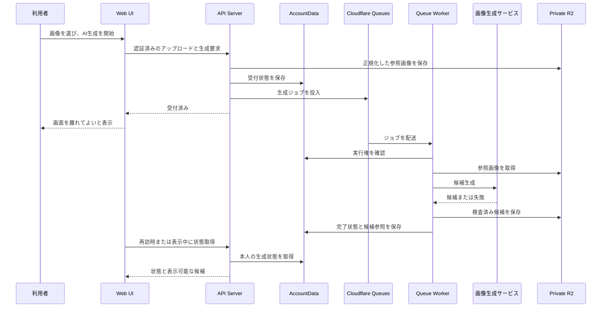
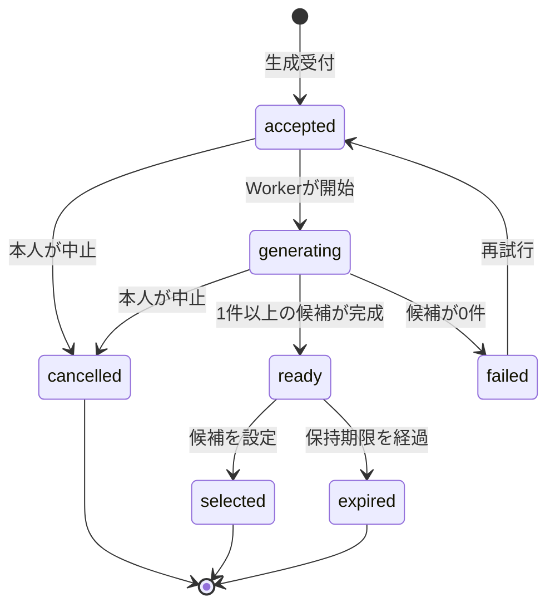
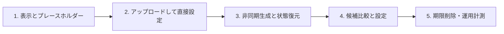

# アバター設定体験設計

## 1. この文書の目的

この文書は、本人が画像をアップロードし、その画像をそのまま使うか、AIで生成した複数候補から1つを選び、自分のアバターとして設定する体験を定義します。アバターの表示場所、アップロード、AI生成の待ち方、候補選択、差し替え・削除、画面状態、プライバシー上の説明、および機能の完了条件を所有します。

全体の画面接続は[全体画面遷移設計](screen-navigation.md)、Account所有データの分離は[Accountデータ分離設計](../architecture/account-data-isolation.md)、R2・Queues・Queue Workerの役割は[インフラ・システム構成](../architecture/infrastructure-architecture.md)を正とします。

この文書は、画像生成モデルや事業者の選定、具体的なプロンプト、API・イベント・データベースのスキーマ、課金プラン、他ユーザーへの公開、MCPでの提供を所有しません。

## 2. 結論

- 「わたしの傾向」のヘッダーから「アバター設定」を開けるようにする
- 未設定時は共通のプレースホルダーを表示し、LINEのプロフィール画像を本人の操作なく取り込まない
- アップロード後は、正方形の表示範囲を確認して「この画像を使う」か「AIで候補を作る」を選べるようにする
- AI生成は時間の読めない外部処理なので、Cloudflare Queuesを使う永続的な非同期ジョブにする
- 生成中に画面を離れたりブラウザを閉じたりしても処理を続け、再訪時に同じ状態と候補を復元する
- 初期提供では最大4件の候補を作り、1件ずつ比較して明示的に「このアバターに設定」する
- アップロードや生成を開始しただけでは現在のアバターを変更せず、選択の確定時にだけ一括で差し替える
- AI生成の完了を知らせるLINE Pushは初期提供に含めず、Webの「わたし」内に「候補ができました」と表示する

AI生成を同期レスポンスに含めると、タイムアウト、再送による二重生成、画面を閉じたときの結果喪失が起きやすくなります。受付と実行を分け、生成状況そのものを保存することで、待ち時間を利用者の画面滞在時間から切り離します。

## 3. 提供範囲

### 3.1 初期提供に含めるもの

- 端末から写真またはイラストを1件アップロードする
- 正方形サムネイルとして使う範囲を確認・調整する
- アップロード画像をそのまま現在のアバターに設定する
- アップロード画像を参照画像として、プロダクトが用意した画風でAI候補を生成する
- 生成状況を確認し、完成した候補を拡大・比較する
- 候補または新しいアップロード画像へ現在のアバターを差し替える
- 現在のアバターを削除してプレースホルダーへ戻す
- 生成を中止し、未選択の画像を削除する

初期提供では自由記述の生成プロンプトを設けません。本人が意図せず不適切な画像を作ること、生成結果のばらつき、プロンプト保存に伴う新たな個人情報を増やさず、アバターを選ぶ目的に集中するためです。

### 3.2 表示場所

現在のアバターは次へ表示します。

- 「わたしの傾向」のヘッダー
- 主ナビゲーションの「わたし」アイコン
- 「アバター設定」の現在値プレビュー

主ナビゲーションでは画像の有無にかかわらず「わたし」というラベルと選択状態を残します。画像だけをナビゲーションの意味や現在位置の手がかりにしません。

初期提供のアバターは本人がログインしたWeb内だけで使います。LINE公式アカウントのプロフィール、管理者画面、他ユーザー向け画面、MCPのプロフィール出力へは連携しません。

## 4. 画面構成

```text
┌──────────────────────────────┐
│ ‹ わたしの傾向               │
│ アバター設定                 │
├──────────────────────────────┤
│           ( 現在 )           │
│                              │
│ [画像をアップロード]         │
├──────────────────────────────┤
│ AIで候補を作成               │
│ 写真は生成サービスへ送られ、 │
│ 数分かかることがあります。   │
│ [AIで候補を作る]             │
├──────────────────────────────┤
│ 生成した候補                 │
│ [候補1] [候補2]              │
│ [候補3] [候補4]              │
│                              │
│ 選択中の候補                 │
│ [このアバターに設定]         │
├──────────────────────────────┤
│ [現在のアバターを削除]       │
└──────────────────────────────┘
```

状態に応じて不要な領域は表示しません。未アップロード時に空の候補枠を並べたり、生成中に確定操作を有効にしたりしません。

### 4.1 入口と現在値

「わたしの傾向」のアバターに「変更」操作を添え、「アバター設定」を開きます。未設定時も同じ位置にプレースホルダーと「アバターを設定」を表示し、機能を発見できるようにします。

設定画面の先頭には常に現在のアバターを表示します。別画像のアップロード中、AI生成中、候補選択中も、現在値と未確定の画像を区別します。

### 4.2 アップロード確認

ファイル選択後、保存前に次を確認できます。

- 円形表示から内容が切れない正方形の表示範囲
- 対象の画像と、選択し直す操作
- 「この画像を使う」と「AIで候補を作る」の違い

「この画像を使う」はAI事業者へ画像を送らず、正規化済み画像をそのまま設定します。「AIで候補を作る」は送信先が外部の画像生成サービスであること、処理に時間がかかること、候補が自動設定されないことを開始前に説明し、本人の明示操作で開始します。

### 4.3 候補の比較と設定

候補一覧では1件を選択状態にし、拡大プレビューで円形表示と正方形表示を確認できます。候補カード自体のタップで現在のアバターを変更せず、「このアバターに設定」で確定します。

設定が成功したら、現在値を即座に更新して「わたしの傾向」へ戻れるようにします。失敗した場合は候補の選択を維持し、同じ操作を再試行できます。

## 5. 基本フロー



## 6. AI生成の非同期設計

### 6.1 利用者から見える待ち方

生成開始後は、実測できない進捗率や断定的な完了時刻を表示しません。状態を「受付済み」「生成中」「候補ができました」「生成できませんでした」で示し、「数分かかることがあります。この画面を閉じても生成は続きます」と伝えます。

画面を開いている間だけ低頻度で状態を再取得します。別画面へ移動した後はブラウザ内で処理を継続させる必要はなく、再び「わたし」または「アバター設定」を開いたときにサーバー上の最新状態を取得します。

生成完了時は「わたしの傾向」に「アバター候補ができました」という控えめな案内を表示します。初期提供では、次の理由によりLINE PushとブラウザPushを使いません。

- アバター生成は緊急性がなく、チャットや診断通知へ新しい通知種別を混ぜる必要がない
- 通知の同意、配送失敗、通知からの復帰先を別途設計する必要がある
- 再訪時の状態復元だけで結果を失わずに済む

### 6.2 システムの流れ



外部AIの応答待ちの間にAccountDataを占有しません。実行前の短い状態更新、外部呼び出し、結果の短い保存へ処理を分けます。

### 6.3 重複、再試行、中止

- 1 Accountにつき同時に実行できる生成は1件とし、生成ボタンの連打や通信再送で生成費用を重複させない
- 同じ受付を再送した場合は、進行中の生成状態を返し、新しい生成を増やさない
- 一時的な外部障害はQueue Workerが上限付きで再試行し、同じ候補を重複登録しない
- 一部の候補だけが正常なら、完成した候補を表示し、全件そろうまで無期限に待たせない
- 全候補が失敗した場合だけ生成失敗とし、現在のアバターとアップロード確認状態を維持する
- 「生成をやめる」は、未開始ならQueue処理を止め、実行中なら結果を採用しない状態にする。外部呼び出し自体を停止できない場合も、返った候補を表示せず削除する
- 新しい候補が完成しても、生成開始後に本人が別のアバターを設定していれば自動で上書きしない

## 7. 状態とライフサイクル

### 7.1 生成状態



`ready`は候補が利用可能であることを表し、現在のアバターに採用済みであることを表しません。現在値の更新は`selected`への明示操作でだけ行います。

### 7.2 画像の保持

- 端末から受け取ったファイルは、向き、色空間、画像形式、寸法をサーバー側で正規化し、位置情報を含む不要なメタデータを除去する
- AI生成に使う正規化済み参照画像はprivate R2へ置き、最後の生成が終了してから24時間だけ再試行用に保持した後に削除する
- 未選択の生成候補は生成完了から7日間保持し、期限と削除予定を候補画面に表示する
- 選択された画像は現在のアバターとして、差し替えまたは削除まで保持する
- 差し替え前のアバターと中止・期限切れの候補は、参照されなくなったことを確認して削除対象にする
- 期限切れ後に再生成する場合は画像を再アップロードする

削除が失敗した場合は利用者の操作を成功と見せて参照だけ残すのではなく、再試行可能な削除状態として管理します。画面からは選択できないようにし、運用ログには画像本文、署名付きURL、Accountの外部識別子を残しません。

## 8. 責務境界

アバターは「その人らしさを推定した情報」ではなく、本人が選ぶAccountの表示設定です。アップロード画像や生成候補からBrain Itemを作らず、画像認識で性格、属性、健康状態などを推定しません。

| 領域 | 責務 |
| --- | --- |
| Web UI | ファイル選択、表示範囲の確認、状態表示、候補比較、本人の確定操作 |
| API Server | 本人確認、アップロード受付、ファイル検査、AccountDataへの操作依頼、短時間での受付応答 |
| AccountData | 現在のアバター、本人が所有する画像参照、生成状態、選択・中止・削除の一貫性 |
| Private R2 | 正規化済み参照画像、生成候補、現在のアバター画像のバイナリ |
| Cloudflare Queues | 受付済み生成ジョブの非同期配送 |
| Queue Worker | 重複実行の防止、外部画像生成、候補検査、再試行、結果保存 |
| 画像生成サービス | 同意された参照画像から候補画像を生成する外部処理 |

現在のアバター参照と生成状態はAccount所有データなので、認証結果から選んだAccountDataへ保存します。クライアントが指定したAccount IDやR2オブジェクトキーを認可根拠にしません。物理的なテーブル、RPC、Queue messageの形は実装設計まで延期します。

## 9. プライバシーと安全性

- 画像はprivate R2へ保存し、公開bucket URLを現在値や候補の恒久URLとして返さない
- 表示は認証済みAccountを確認する経路、または短時間だけ有効な表示権限を通す
- ファイル名、EXIF、端末内のパス、署名付きURL、画像のbase64をログへ出力しない
- 拡張子だけを信頼せず、実データの形式、容量、寸法、デコード可否をサーバー側で検査する
- SVGなど能動的な内容を持ち得る形式は受け付けず、安全なラスター形式へ限定する
- AIへ送る前に、利用者が画像を使う権利を持つこと、写っている人の同意を得ていること、外部の画像生成サービスへ送られることを説明する
- 画像生成事業者の学習利用、保持期間、処理地域が要件を満たすことを、モデル選定時の必須条件にする
- 生成候補は安全性検査と画像デコード検査を通過したものだけ表示する
- AI生成であることは候補選択中に表示する。ただし本人が設定した後の小さなアバターへ恒常的なAIラベルは付けない
- AI生成の失敗や安全性判定から、理由以上のセンシティブな推測を利用者へ返さない

## 10. 画面状態と回復

| 状態 | 表示と回復 |
| --- | --- |
| アバター未設定 | プレースホルダーと「画像をアップロード」 |
| 設定済み | 現在値、変更、削除 |
| ファイル不正 | 容量・形式・破損など本人が直せる理由と選び直し |
| アップロード中 | 対象画像を示した待機表示。重複送信を無効化 |
| アップロード失敗 | 現在値を維持し、同じ画像の再試行または選び直し |
| 生成受付済み | 受付完了と、画面を離れてよい旨 |
| 生成中 | 不確かな割合を出さず、状態と中止操作 |
| 一部候補が完成 | 完成分を選択可能にし、一部失敗を短く説明 |
| 全候補が失敗 | 現在値を維持し、再試行または別画像の選択 |
| 候補あり | 候補、保持期限、選択、再生成、未選択候補の削除 |
| 候補期限切れ | 期限切れを説明し、再アップロードへ案内 |
| 設定失敗 | 選択候補を維持して再試行 |
| 削除失敗 | 現在値を維持して再試行 |
| 通信失敗 | 最後に確認できた現在値を勝手に変更せず、再取得 |

別Accountへ切り替わった場合、以前のAccountの現在値、アップロードプレビュー、生成状況、候補、キャッシュを表示しません。

## 11. アクセシビリティとレスポンシブ表示

- 画像には「現在のアバター」「AI候補1」など、役割と選択状態が分かる代替テキストを付ける
- 候補の選択状態を色や枠線だけで伝えず、テキストまたはアイコンと支援技術向け状態を併用する
- 生成状態の変化はライブリージョンで通知するが、状態取得のたびに同じ文言を読み上げない
- ファイル選択、表示範囲の調整、候補選択、確定、削除をキーボードでも操作できるようにする
- 画像の切り抜き操作には、拡大・縮小と位置を戻せる操作、および操作なしで使える既定の中央配置を用意する
- 小さい画面では候補を2列、大きい画面では内容が過度に拡大しない範囲で並べ、拡大確認を別領域またはダイアログで行う
- 動きの軽減設定では、候補出現や生成中表示に必須でないアニメーションを使わない

## 12. 観測する指標

次のイベントを、画像本文、ファイル名、プロンプト、外部の個人識別子を含めずに集計します。

- アップロード開始・成功・失敗
- アップロード画像をそのまま設定した回数
- AI生成の受付・完了・一部完了・失敗・中止と処理時間
- 生成候補から設定した回数
- 候補を設定せず期限切れになった回数
- 再試行回数と、失敗種別ごとの件数

生成時間は受付から候補利用可能までを測り、画面を開いていた時間とは分けます。これにより、生成自体が遅いのか、利用者が結果へ戻っていないのかを混同しません。

## 13. 実装順序



まずアップロード画像を直接設定できる縦切りを完成させます。AI生成を機能フラグで追加すれば、外部モデルの接続や待ち時間に問題があっても、アバター機能全体を利用不能にせずに検証できます。

## 14. 完了条件

- 未設定時にプレースホルダーが表示され、「わたしの傾向」から設定を開始できる
- 利用可能な画像をアップロードし、表示範囲を確認してそのまま設定できる
- 利用できない画像では理由を確認し、現在のアバターを失わずに選び直せる
- AI生成の開始前に外部送信と待ち時間を理解でき、本人の明示操作でだけ開始する
- 生成受付後すぐに画面を離れられ、再読み込みや再訪後も同じ生成状態へ復帰できる
- 再送やQueueの再配送で同一生成が重複せず、1 Accountの生成が別Accountへ表示されない
- 1件以上完成した候補を比較し、明示的な確定操作で現在のアバターに設定できる
- 生成・アップロード・設定の失敗時も、それまでの現在のアバターを維持できる
- 中止、期限切れ、差し替え、削除に応じて不要画像が保持方針どおり削除される
- 現在のアバターが「わたしの傾向」、主ナビゲーション、設定画面へ一貫して表示される
- マウス、タッチ、キーボード、支援技術で主要操作と状態確認ができる

## 15. この設計で決めないこと

- 画像生成モデル、API事業者、具体的なプロンプトと画風
- 受け付ける形式、ファイル容量、画素数の具体的な上限
- API path、request / response、Queue message、AccountData RPCの具体形
- table、column、R2 object key、署名付きURLの具体的な実装
- 生成回数の上限、課金、レート制限の具体値
- AI候補を追加購入する体験
- LINE PushまたはブラウザPushによる完了通知
- アバターの他ユーザーへの公開、共有、MCP提供
- LINEプロフィール画像との同期
- 動画アバター、3Dアバター、着せ替えパーツ

これらは、利用状況、費用、採用する画像生成サービスの契約条件を確認してから個別に設計します。
