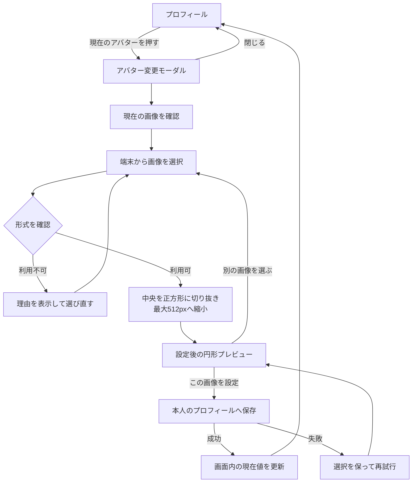
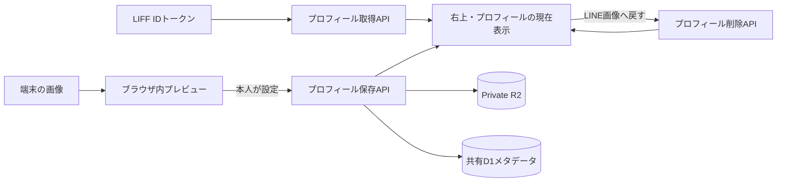

# アバター設定体験設計

## 1. この文書の目的

この文書は、本人がプロフィールに表示する画像を確認し、端末内の画像へ変更する体験を定義します。LINEプロフィール画像を使う初期表示、画像選択モーダル、選択後のプレビュー、設定・差し替え・削除、画面状態、プライバシー、および完了条件を所有します。

プロフィールへの入口と表示テーマは[プロフィール設定体験設計](profile-settings-experience.md)、Web全体の接続は[全体画面遷移設計](screen-navigation.md)を正とします。

保存API、共有D1、Private R2の具体的な契約は[プロフィールAPI契約](../development/profile-api.md)を正とします。この文書は、画像の公開・共有、MCPでの提供を所有しません。

## 2. 結論

- アプリで設定した画像がない場合は、LIFFから取得したLINEプロフィール画像を現在のアバターとして表示する
- LINEプロフィール画像もない場合だけ、共通の人物プレースホルダーを表示する
- プロフィール画面の現在画像を押すと、アバター変更モーダルを開く
- モーダルでは現在の画像を確認し、端末から画像を1件選び、設定後の見え方をプレビューする
- 画像を選んだだけでは現在値を変えず、「この画像を設定」で確定する
- 人物判定、顔照合、属性推定、AI画像生成、生成候補の比較は行わない
- 選択画像を外部AIサービスへ送信しない
- アプリで設定した画像を削除した場合は、LINEプロフィール画像へ戻す。LINE画像もなければプレースホルダーへ戻す
- 確定した画像は本人のプロフィールAPIへ保存し、LIFFを開き直した場合もAccountの現在画像を復元する

## 3. 提供範囲

現在のUI提供範囲に含めるものは次のとおりです。

- 共通ヘッダー右上、プロフィール画面、変更モーダルでの同じ現在画像の表示
- LINEプロフィール画像からの初期表示
- JPEG、PNG、WebPのファイル選択
- 選択画像の中央を正方形に切り抜き、最大512×512pxへ縮小するブラウザ内の画像調整
- 選択画像のローカルプレビュー
- 明示的な設定操作と、モーダルを閉じた後の画面内反映
- Private R2への保存、再読み込み後の復元、同じAccountを使う端末間での同期
- 取得中、保存中、取得失敗、保存失敗からの回復
- ファイル形式エラーと選び直し
- アプリで選択した画像からLINEプロフィール画像へ戻す操作

利用者による切り抜き位置・回転・拡大率の編集は現在のUI提供範囲に含めません。

## 4. 表示の優先順位

表示する画像は、次の順序で1件だけ決定します。

1. アプリで本人が設定した画像
2. LIFFから取得したLINEプロフィール画像
3. 共通の人物プレースホルダー

この優先順位は共通ヘッダー右上、プロフィール画面、アバター変更モーダルで統一します。画面ごとに異なる画像や「未設定」を表示しません。

LINEプロフィール画像は表示時の代替画像として利用し、画像本体をAccountのPrivate R2へ複製しません。LINE側で画像が変更された場合は、次回プロフィールを取得したときの表示へ反映されます。

## 5. 基本フロー

画像選択は現在値の変更ではありません。利用者がプレビューを確認して「この画像を設定」を押したときだけ現在値を更新し、モーダルを閉じます。閉じる操作では選択途中の画像を破棄し、現在値を維持します。

## 6. アバター変更モーダル

モーダルには次の順で情報と操作を置きます。

1. タイトルと閉じる操作
2. 現在のアバターと、その取得元
3. 端末から画像を選ぶ操作
4. 選択済みの場合は設定後のプレビュー
5. 「この画像を設定」または「LINEの画像に戻す」

人物判定の同意、外部AI送信の同意、生成開始、生成中、候補選択は表示しません。実行しない処理の説明やダミー操作を残さず、現在利用できる操作だけを提示します。

## 7. 画面状態と回復

| 状態 | 表示と操作 |
| --- | --- |
| LINE画像を表示 | 現在値としてLINEプロフィール画像を表示し、画像選択を案内 |
| LINE画像なし | プレースホルダーを表示し、画像選択を案内 |
| ファイル未選択 | 設定操作を無効にし、現在値を維持 |
| ファイル選択済み | 中央を正方形に切り抜いた円形プレビュー、選び直し、設定操作を表示。ファイル名は表示しない |
| 利用できない形式 | 対応形式を示し、現在値を維持したまま選び直せるようにする |
| 現在画像を取得中 | 右上の入口位置とプロフィールのアバター行を維持し、取得中と伝える |
| 現在画像の取得失敗 | プレースホルダーと再試行を表示し、テーマ変更は継続できるようにする |
| 保存・削除中 | 対象操作を無効にして処理中と伝え、モーダルを閉じない |
| 保存・削除失敗 | 現在値と選択中画像を維持し、同じ操作を再試行できるようにする |
| 設定済み | 共通ヘッダー右上とプロフィールへ同じ画像を即時反映 |
| モーダルを閉じる | 未確定画像を破棄し、プロフィールへ戻る |
| LINE画像へ戻す | アプリで選択した画像を外し、LINE画像またはプレースホルダーを表示 |

保存成功時だけモーダルを閉じます。通信失敗時は現在値を変更せず、選択中の画像と再試行操作を残します。

## 8. Web UIと保存API

選択画像をブラウザ内で中央の正方形へ切り抜き、最大512×512pxへ縮小してから保存APIへ送ります。元画像が512px以下の場合は拡大しません。JPEGとWebPは画質82%を目安に再圧縮し、PNGは透過を維持します。

Web UIは起動後にLIFF IDトークンを使って本人のプロフィールを取得し、右上の入口にもAccountの現在画像を反映します。保存・削除APIの成功応答をそのまま現在値へ反映し、直後に追加のGETを行いません。具体的なHTTP契約は[プロフィールAPI契約](../development/profile-api.md)を正とします。

## 9. 責務境界

| 領域 | 現在の責務 |
| --- | --- |
| LIFF連携 | 表示用LINEプロフィールとAPI認証用IDトークンを取得する |
| Web UI | 現在画像の取得、ファイル形式の一次確認、ローカルプレビュー、本人の確定操作、保存・削除、画面内反映 |
| 外部AIサービス | 利用しない |
| API Server / 共有D1 / Private R2 | 本人を認証し、現在画像の取得・保存・削除と保存整合性を担う |

アバターは本人が選ぶ表示設定であり、Brain Itemを生成する入力にはしません。画像から人物の本人性、性格、年齢、属性、感情、健康状態などを推定しません。

## 10. プライバシーと安全性

- 選択画像を外部AIサービスへ送信しない
- 選択画像は本人が「この画像を設定」と確定した場合だけプロフィールAPIへ送信する
- ファイル名、端末内のパス、画像のData URLを運用ログへ出力しない
- SVGなど能動的な内容を持ち得る形式は受け付けず、JPEG、PNG、WebPに限定する
- ブラウザ側の形式確認だけをサーバー側検査の代わりにしない
- 拡張子だけを信頼せず、実データの構造、容量、寸法をサーバー側でも検査する
- 別Accountへ切り替わった場合に、以前のAccountが選択した画像を表示しない

## 11. アクセシビリティとレスポンシブ表示

- 画像だけに操作の意味を持たせず、「アバターを変更」「画像を選ぶ」などの操作名を伝える
- モーダルを開いたらフォーカスをモーダル内へ移し、閉じたらプロフィールの開始操作へ戻す
- モーダル表示中は背後のプロフィールを操作・読み上げ対象にしない
- ファイル選択、選び直し、設定、閉じるをキーボードでも操作できるようにする
- 選択前と選択後を色だけで区別せず、見出しと文言で状態を伝える
- 狭い画面ではモーダルを画面幅に合わせ、内容が長い場合はモーダル内をスクロールできるようにする
- ライト・ダークの両方で文字、境界、フォーカス表示のコントラストを保つ

## 12. 完了条件

- アプリで設定した画像がない場合、LINEプロフィール画像が右上、プロフィール、変更モーダルへ一貫して表示される
- LINEプロフィール画像がない場合はプレースホルダーへ安全に退避する
- プロフィールの現在画像からアバター変更モーダルを開ける
- JPEG、PNG、WebPを選び、設定前に円形プレビューを確認できる
- 正方形でない画像は縦横比を崩さず中央を切り抜き、大きい画像は最大512×512pxへ縮小できる
- 選択したファイル名を画面へ表示しない
- ファイルを選んだだけでは現在値が変わらず、明示的な設定操作でだけ反映される
- 設定後はモーダルが閉じ、プロフィールと右上へ同じ画像が表示される
- LIFFを開き直しても、Accountへ保存した現在画像が右上とプロフィールへ復元される
- 保存・削除中は処理中と伝え、失敗時は現在値を維持して再試行できる
- 閉じる操作では現在値を変更しない
- アプリで選択した画像を外すとLINEプロフィール画像へ戻る
- 人物判定、AI生成、候補選択、外部AI送信の操作や文言が表示されない
- 確定前の選択画像、ファイル名、端末内パスをAPIや運用ログへ送信しない
- マウス、タッチ、キーボード、支援技術で主要操作を利用できる
