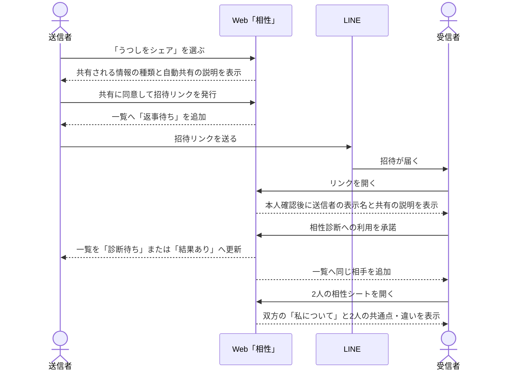
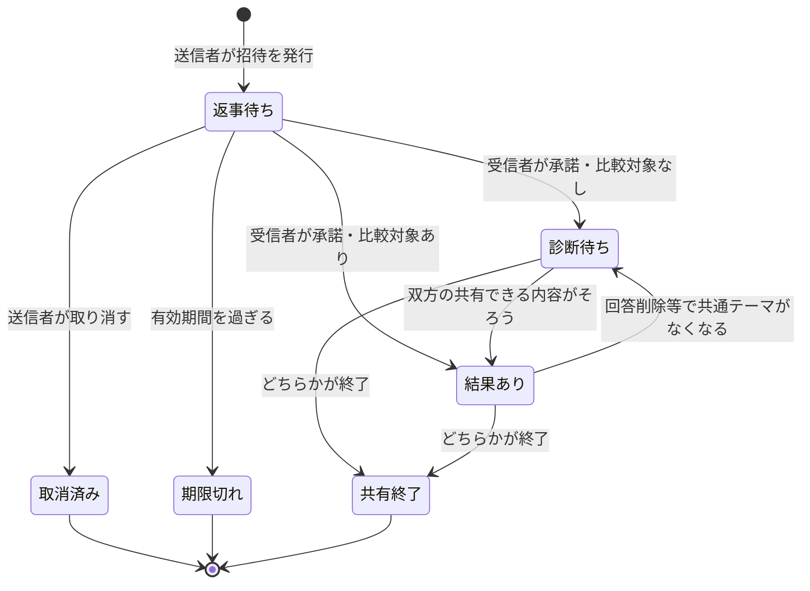

# 相性診断・うつし共有体験設計

## 1. この文書の目的

この文書は、自分を表すキャラクター「うつし」をきっかけに他の利用者を招待し、双方の診断回答から相性を振り返る体験を定義します。招待リンクの発行とLINE共有、受信者の同意、Webの「相性」一覧、結果内の「それぞれについて」と「2人について」、共有終了までの画面と状態を所有します。

「うつし」の役割と外見は[キャラクターデザイン](../design/character-design.md)、個別診断の回答体験は[Phase 1 診断体験設計](../diagnosis/diagnosis-experience.md)、本人の傾向表示は[わたしのまとめ仕様](profile-summary-experience.md)、回答からパラメータを計算する方法は[診断回答のパラメータ変換設計](../diagnosis/scoring/parameter-scoring-design.md)、本人識別とチャネルの役割は[プロジェクト概要](project-overview.md)を正とします。

この文書は、相性計算の物理データモデル、API、URL、招待の有効期間、LINE SDKの選定、通知方式を所有しません。物理データモデルと招待期間は[相性共有データ実装設計](../architecture/compatibility-data-design.md)を正とします。また、不特定多数へのプロフィール公開、利用者検索、推薦によるマッチング、利用者同士のメッセージ機能は対象にしません。

この体験は[プロジェクト概要のPhase 4](project-overview.md#phase-4-分析と関係性へ広げる)に位置づけます。現在のPhase 1へ実装範囲を混ぜず、先に利用体験とプライバシー境界を定めるための設計です。

## 2. 結論

利用者向けには「うつしをシェア」と表現しますが、共有するのはうつしの中にある全情報ではありません。共有対象は、共有専用に作られた「私について」と、相性診断へ利用できる診断テーマの傾向だけです。

同意は表示内容ごとではなく相手ごとに1回だけ行います。送信者が発行した招待を受信者が承諾すると、その2人の間では以降に増えた対象情報も自動的に共有されます。共有画面で確認するのは「この相手と共有していいか」だけです。

初期提供では次の形にします。

- 1つの招待は1人の受信者だけが承諾できる
- 送信者は「相性」タブから、共有される情報の種類と共有されない詳細を確認し、招待リンクを発行して友だちに送るか招待リンクをコピーする
- 送信者は招待時に、相手との関係を[DiagnosisのRelationship Category](../diagnosis/diagnosis-domain-design.md#構成)から選び、受信者は同じラベルを確認してから承諾する。ただし特定の相手を表さない`general`は招待時の選択肢にしない
- 共有画面と招待確認画面には、共有される具体的な文章、テーマ名、軸、本人の位置を表示しない
- 発行した時点で、送信者の一覧へ「返事待ち」として追加する
- 受信者が本人確認と共有の確認を終えて承諾した時点で、双方の一覧へ追加する
- 共有できる情報がまだない状態でも招待の発行と承諾を行える。比較可能な診断が足りない間は「診断待ち」とし、回答できる診断へ案内する
- 共有対象は個別選択せず、相性診断に利用できるものをすべて共有する
- 承諾後に答えた診断、更新した回答、新しく生成された「わたしのまとめ」も、再確認なしで同じ相手へ共有する
- 比較可能になったら、「それぞれについて」で双方の「私について」を資料のように先に表示し、その後に「2人について」として「一緒に大切にできそうなこと」「話してみたい違い」「まだ分からないこと」を表示する
- 2人の診断結果を比較するときは、招待のRelationship Categoryと一致するDiagnosis、および`general`のDiagnosisだけを使う
- 生の回答、日記や会話から得た記憶、自由記述、相手の「わたしのまとめ」全体は表示しない
- どちらかが共有を終了すると、双方とも2人の相性シートを閲覧できなくなり、以降の自動共有も止まる

共有される具体的な内容は、共有画面ではなく本人の「わたし」から確認します。共有を続けたくない場合の操作は個別の内容の取り消しではなく、その相手との共有終了です。

「相性がよい／悪い」と人物や関係を断定する機能にはしません。結果画面の名称は「2人の相性シート」とし、互いを知るための「私について」と、2人の違いを会話するための見取り図を1つにまとめます。

## 3. 体験全体の流れ



リンクを開いただけでは承諾扱いにしません。受信者が閉じる、断る、認証に失敗する場合、送信者へ受信者のAccountや閲覧した事実を知らせません。

## 4. Webの情報構造

一般利用者向けWebの主ナビゲーションを、左から「わたし」「診断」「相性」の3項目にします。「相性」のルート画面は相性一覧です。

```text
Web
├── わたし
│   └── わたしのまとめ・セルフケア・AI相談
├── 診断
│   └── 診断一覧・回答・個別結果
└── 相性
    ├── 相性一覧
    ├── 招待の発行・共有
    ├── 招待の確認
    └── 2人の相性シート
```

招待の確認と2人の相性シートでは、承諾や共有終了を誤操作しないよう、主ナビゲーションより画面内の戻る操作を優先します。

相性内の一覧、招待の発行・確認、2人の相性シートの間、および相性から「診断」「わたし」へ進む導線は、アプリの状態を維持したまま移動します。相性内で別画面へ進んで戻った場合は直前にいた位置へ戻し、その画面を初めて開く場合は先頭を表示します。

## 5. 画面と操作

### 5.1 相性一覧

相性一覧には、本人が発行した未承諾の招待と、承諾済みの相手をカードで表示します。同じ2人の組み合わせを重複表示しません。上部ラベルを「2人を知る」、見出しを「ふたりの見取り図」とします。

カードの上には、相性共有で選択できる関係に限定した「全部」「パートナー」「家族」「友達」「仕事」の絞り込みを横並びで表示します。選択したRelationship Categoryに一致する返事待ち・診断待ち・結果ありをまとめて絞り込み、選択状態はURLの`category` query parameterへ反映します。再読み込みやブラウザの履歴移動ではURLから選択状態を復元し、`general`を含む共有対象外または定義外の値は「全部」として扱います。該当するカードがない場合も全体の空状態へ戻さず、選択中のカテゴリに対象がないことを表示します。

```text
┌──────────────────────────────┐
│ 2人を知る                    │
│ ふたりの見取り図             │
│ 2人の違いを、会話のきっかけに│
│                              │
│ [ うつしをシェア ]           │
├──────────────────────────────┤
│ 結果を見られる相手           │
│ ┌──────────────────────────┐ │
│ │ わたしのうつし  ×  Aさん │ │
│ │ 3つのテーマで比較できます│ │
│ │              [相性を見る]│ │
│ └──────────────────────────┘ │
├──────────────────────────────┤
│ 準備中                       │
│ ┌──────────────────────────┐ │
│ │ Bさん       診断待ち     │ │
│ │ 比較できるテーマがありません│
│ │              [診断を行う]│ │
│ └──────────────────────────┘ │
│ ┌──────────────────────────┐ │
│ │ 招待リンク   返事待ち    │ │
│ │ [もう一度送る] [取り消す]│ │
│ └──────────────────────────┘ │
├──────────────────────────────┤
│ わたし      診断         相性│
└──────────────────────────────┘
```

一覧は少なくとも次の状態を区別します。

| 状態 | 表示 | 主な操作 |
| --- | --- | --- |
| 返事待ち | 受信者の個人情報を表示しない招待カード | もう一度送る、取り消す |
| 診断待ち | 双方が現在共有できる共通の診断テーマがない、またはどちらかの「私について」を用意できない | 診断を行う、わたしのまとめを作る、共有を終了する |
| 結果あり | 相手の表示名、2人のうつし、比較可能なテーマ数 | 相性を見る、共有を終了する |
| 読み込み失敗 | 取得できない理由と再試行 | 再試行する |
| 空 | 相性診断の説明 | うつしをシェアする |

返事待ち、診断待ち、結果ありの各カードと2人の相性シートには、招待時に選んだRelationship Categoryのラベルを表示します。

一覧全体のSkeletonは、表示できる既存データがない初回取得に限って表示します。招待の取り消しなど既存カードへの操作中は一覧を維持し、対象カードだけを操作不能なSpinner表示にします。成功時は対象カードを一覧から取り除き、失敗時はカードを維持して再操作できる状態へ戻します。

相性一覧と2人の相性シートは、画面を開いたまま別のアプリやタブから戻った時、または端末が再接続した時に、相手の承諾・準備・共有終了をバックグラウンドで再確認します。画面を開いた直後の復帰も確認対象とし、同じ復帰で重なって発生するイベントだけを短時間に1回へまとめ、常時の定期ポーリングは行いません。

確認中は表示済みのカードやシートをSkeletonへ戻さず、取得後に「返事待ち」「診断待ち」「結果あり」または共有終了を反映します。一時的な通信失敗では表示済みの内容を維持して再確認を案内し、共有終了など対象を利用できないことがAPIで確認できた場合だけ古い内容を隠します。

相手がどの質問へ未回答か、最後にいつ回答したかは一覧へ表示しません。「診断待ち」は、どちらが不足しているかを相手へ明かさず、本人に必要な診断だけを本人の画面で案内します。共有・招待・診断待ち・相性シートから診断一覧へ案内する場合は、招待時に選んだRelationship Categoryを初期選択した診断一覧へ遷移させます。

### 5.2 招待の発行とLINE共有

「うつしをシェア」を選んだ後、リンクを発行する前に次を表示します。

- この相手とのRelationship Category。初期状態では「パートナー」を選択し、本人が「家族」「友達」「仕事」へ変更できる。各選択肢の選択マークと枠は、そのカテゴリを表す同じ色で表示する
- 相手に見える表示名と、2人のうつしが並ぶこと
- 共有されるのは、共有専用の「私について」と相性診断に利用できる診断テーマの傾向であること
- 一度共有すると、以降に増えた対象情報も同じ相手へ自動的に共有されること
- 生の回答、日記や会話から得た記憶、自由記述などの詳細を共有しないこと
- 相手の承諾後に双方の相性一覧へ追加されること
- 共有は後から終了でき、終了すると自動共有も止まること

画面タイトル、説明、Relationship Categoryの選択肢、共有される情報の種類、共有されない詳細は固定内容として初回取得を待たずに表示します。SkeletonはAPIから取得するプロフィール画像と表示名の領域だけに限定し、取得前後で同じ高さを確保します。Relationship Categoryは見えるラジオボタンで1つだけ選ぶ形式とし、初期状態から「必要なら変更できます」という案内を見出しの横へ常時表示して、レイアウト変化を起こしません。

画面上で本人を表すアイコンには、プロフィール設定で選んだ画像を使います。設定画像がなければLINEプロフィール画像へ戻し、LINEにも画像がなければ表示名の先頭文字を表示します。招待の確認画面では送信者と受信者の双方へ同じ優先順位を適用します。

共有される具体的な文章、テーマ名、軸、本人の位置は、この画面に表示しません。相手へ渡る内容の粒度は情報の種類として説明し、実際の内容は本人の「わたし」へのリンクから確認します。このリンクには選択中のRelationship Categoryを引き継ぎ、「わたし」では同じカテゴリの共有内容を最初に表示します。確認する対象は「この相手と共有していいか」だけです。

共有できるテーマや「私について」がまだない場合も発行を止めません。まだ共有できる内容がないことと、診断や「わたしのまとめ」で内容が増えることを案内し、発行後に用意できた内容から自動的に共有します。相手へ表示する名前を検証済みIDトークンから取得できない場合だけ発行できません。

共有されない詳細は折りたたまずに表示し、リンク発行後の「招待リンクを発行しました」という完了状態、招待URL、有効期限も同じ領域で確認できるようにします。

リンク発行前は、固定フッターに「共有して招待リンクを発行する」を表示します。発行後は同じ固定フッターの操作領域を「友だちに送る」と「コピー」の横並びへ切り替え、フッターの高さを変えません。「友だちに送る」はLINEの共有先選択を開き、利用できない環境では端末の共有先選択を開きます。共有先選択を閉じた場合は送信済みと扱わず、キャンセルしたことを画面内に表示します。「コピー」は招待URLをクリップボードへコピーします。送信文は、誰からの招待か、選んだRelationship Category、相性診断へのリンクであること、承諾するまで情報共有が始まらないことが分かる短い定型文にします。

リンクにはAccount ID、認証情報、回答、パラメータ値を含めません。リンクの正当性と利用可否は、開いた後にサーバー側で確認します。

### 5.3 招待の確認と承諾

受信者は本人確認後に、送信者が相手に見せることへ同意した表示名、相性診断の説明、共有される情報の種類、共有されない詳細、承諾後は以降の更新も自動で共有されることを確認します。双方の具体的な文章、テーマ名、軸、本人の位置は表示しません。受信者側も対象を個別選択せず、「相性を見てみる」を選ぶまで関係を成立させません。

招待時に選ばれたRelationship Categoryも確認画面へ表示します。受信者がその分類で共有したくない場合は承諾せず、適切な分類で招待を作り直してもらいます。承諾後に分類だけを変更すると比較対象が変わるため、変更は共有を終了して新しい招待を作る操作として扱います。

送信者のアイコンは、招待が参照する送信者Accountをサーバー側で確定してから取得します。受信者が送信者のLINE認証情報を持つことや、クライアントが相手のAccount IDを指定することはありません。アイコンを取得できない場合も招待内容の確認は継続し、表示名の先頭文字へ縮退します。

受信者に共有できる内容がまだない場合も承諾を止めず、本人が回答できる診断や「わたしのまとめ」の作成へ案内します。承諾直後に比較できるテーマがそろっていない場合は「診断待ち」とし、双方の内容がそろった時点で追加の同意なしに相性シートを表示します。

承諾後は、受信者も自分の対象情報を相性診断に利用することへ継続的に同意したものとして扱います。相手へ表示する名前を検証済みIDトークンから取得できない場合だけ承諾できません。

次の場合は新しい関係を作りません。

- 送信者本人が自分のリンクを開いた
- 招待が取り消し済み、期限切れ、または別の受信者に承諾済みである
- すでに同じ2人の相性関係がある
- 送信者または受信者のAccountを利用できない

すでに同じ関係がある場合は、重複を作らず既存の2人の相性シートまたは診断待ちの状態へ案内します。

### 5.4 2人の相性シート

結果画面では2人のうつしを並べ、最初に「回答から見える範囲の資料であり、人物や関係の良し悪しを決めるものではない」と伝えます。「それぞれについて」と「2人について」のタブはタップまたは左右スワイプで切り替えます。スワイプ中は隣の内容とタブの選択表示を指へ追従させ、離した後は選択した位置へ移動します。`prefers-reduced-motion`が有効な場合は、指への追従を維持して自動的な移動アニメーションだけを省きます。内容は「それぞれについて知る」から「2人について考える」順にします。

人物ごとの「私について」は、閲覧者にとって相手となる人を先、自分を後に表示します。双方がそれぞれの画面を開いた時に、どちらも相手について先に読める順序にします。

```text
┌──────────────────────────────┐
│ < 相性一覧                   │
│ Aさん  ×  わたしのうつし    │
│ 2人の相性シート              │
│ 回答から見える、私たちの資料 │
├──────────────────────────────┤
│ Aさんについて                │
│                              │
│ まず知ってほしいこと         │
│ ・私は、自分で決められる余白を│
│   大切にしたいです           │
│ ・私は、休日には新しい体験を │
│   楽しみたいです             │
│                              │
│ こうしてもらえるとうれしい   │
│ ・一人で考える時間も尊重して │
│   もらえるとうれしいです     │
│              [テーマ別に見る]│
├──────────────────────────────┤
│ わたしについて               │
│                              │
│ まず知ってほしいこと         │
│ ・私は、予定を早めに決めて   │
│   おけると安心します         │
│ ・私は、一緒に楽しむ時間を   │
│   大切にしたいです           │
│                              │
│ こうしてもらえるとうれしい   │
│ ・予定が変わるときは、早めに │
│   相談してもらえるとうれしい │
│              [テーマ別に見る]│
├──────────────────────────────┤
│ 2人について                  │
│                              │
│ 一緒に大切にできそうなこと   │
│ ・予定は前もって決めたい     │
│ ・体験にはお金を使いたい     │
│                              │
│ 話してみたい違い             │
│ 休日の過ごし方               │
│ わたし  ひとり時間を重視 ●──│
│ Aさん   ─────一緒を重視 ●  │
│ 「理想の休日」を話してみよう │
│                              │
│ まだ分からないこと           │
│ お金と消費は比較できません   │
│                 [診断を行う] │
├──────────────────────────────┤
│ 比較に使ったテーマを見る     │
│ [共有を終了する]             │
└──────────────────────────────┘
```

#### 5.4.1 「それぞれについて」

2人それぞれについて、同じ構成の「私について」プロフィールシートを表示します。閲覧者本人のカードは「わたしについて」、相手のカードは「{表示名}さんについて」とします。カード内の文章はプロフィール所有者の一人称で書き、引用のように読める形にします。

| 項目 | 表示内容 | 組み立て方 |
| --- | --- | --- |
| まず知ってほしいこと | その人が大切にしたいことや、心地よい選び方 | プロフィールまとめ生成時に作る共有専用projectionから最大3件 |
| こうしてもらえるとうれしい | 相手が具体的に取りやすい関わり方 | 審査済みの関わり方文がある傾向だけ最大3件 |
| テーマ別に見る | パラメータ名、両端ラベル、本人の位置 | 共有対象となった全テーマ |
| この資料のもと | 共有プロフィールの生成日時と利用した情報の種別 | 診断結果を含む資料全体の生成日時と誤認させず、根拠本文やConfidenceではなく資料の範囲として表示 |

共有専用projectionは[自分の傾向サマリー体験設計](profile-summary-experience.md)の非同期生成基盤を再利用し、本人向けまとめと同じ生成要求から別のstructured outputとして作ります。「わたしの傾向」画面の`headline`や`insights`をコピーせず、最大3件の一人称の文章だけを保存します。各文章は生成時の根拠IDを内部に保持しますが、相手、APIレスポンス、ログへは出しません。

共有用の文章は具体的な出来事、日時、場所、人物・組織名、日記や会話の引用、健康状態を含めず、記録から一般化できる振る舞い・考え方だけにします。最新版を常に共有対象とし、新しい版の生成ごとに本人へ再確認を求めません。審査で共有できる文章が1件も残らなかった生成では新しい共有対象を作らず、直前に共有していた文章をそのまま使います。生成のばらつきだけで、成立済みの共有が本人の操作なしに止まらないようにします。

「こうしてもらえるとうれしい」は、パラメータの方向ごとに審査された一人称の定型文がある場合だけ表示します。定型文がなければ、AIや画面側で関わり方を推測せず、項目自体を省略します。

#### 5.4.2 「2人について」

初期提供では、同じ比較定義で計算できる診断パラメータを次のように表示します。

- 同じ中央以外の帯域にある軸は「一緒に大切にできそうなこと」の候補にする
- 低い側と高い側へ分かれた軸は「話してみたい違い」の候補にする
- 片方が中央帯、回答不足、または比較できない設定版である軸は、断定的な要約に使わない
- 各軸の詳細では、既存の両端ラベルと2人の位置を併記する
- 共通点や違いの件数を、相性の点数やランキングへ変換しない

#### 5.4.3 文章のルール

「まず知ってほしいこと」は共有専用projectionを使い、「こうしてもらえるとうれしい」、テーマ別の軸、2人の共通点・違い、会話のきっかけは既存のパラメータラベルと審査済み定型文から決定的に組み立てます。AIに2人の評価、関係の助言、相手への要求を生成させません。

- 「あなたは計画的な人です」ではなく「私は、予定を早めに決めておけると安心します」と一人称で書く
- 「相手はこうするべき」ではなく「こうしてもらえるとうれしい」と希望として書く
- 「必ず」「いつも」「普通は」のように固定性や規範を強める表現を使わない
- 能力、人格、愛情の強さ、関係の将来を文章で補わない
- 中央帯は「状況に合わせて選びたい」のように詳細で表し、見出し用の特徴へ無理に採用しない
- 共有専用projection以外のAI自由記述や、根拠のない「補い合える」という断定を加えない

初期提供では、本人による文章の自由編集と自由記述の追加を行いません。本人は共有相手を選ぶだけで、利用できる共有専用projectionと診断由来の振る舞い・考え方をすべて共有します。

双方には、人物ごとに同じ「私について」と、同じ比較範囲の「2人について」を表示します。一方だけに相手の詳しい結果を見せる非対称な表示は行いません。2人の相性シートは、表示時点で双方が共有できるテーマの共通部分から毎回組み立て、Brain Itemや新しい人物評価として保存しません。

#### 5.4.4 2人の継続的な振り返り

「2人の継続的な振り返り」は、成立中の相性関係について、共有中の相性シートが月ごとにどう変わったかを2人で確認し、現在の違いや共通点を話すきっかけにする機能です。利用できるPlanと同時利用できる関係数は[サブスクリプション・料金プラン設計](subscription-plan-design.md#41-機能一覧)を正とし、基本の相性シートや共有関係そのものとは分けて扱います。月は`Asia/Tokyo`の暦月で区切り、現在の月の振り返りだけを表示します。

双方へ、同じ月について次の2つを同じ順序で表示します。

1. **相性シートの月ごとの変化**: 前月にどちらかが相性シートを開いた最後の時点で記録した内容と現在の相性シートを比較し、比較できるようになったテーマ、低い・中央・高いの表示帯が変わった軸、比較できなくなったテーマを短く表示する
2. **2人で話すテーマ**: 現在共有できる「話してみたい違い」を優先し、変化した軸、現在の違い、現在の共通点の順から最大3件を表示する

パラメータの表示帯をまたがない数値の揺れは、月ごとの変化として強調しません。どちらが変わったか、なぜ変わったか、関係が進展または後退したかは断定せず、「回答から見える位置が変わりました」のように資料の変化として表現します。

前月に記録した相性シートがなかった場合は、現在の内容を最初の基準として扱い、過去からの変化を生成しません。記録後に前月中の回答が変わっていても、開かれていない状態を月末の内容として推測しません。前月から新しい変化を確認できない場合も空欄を推定で埋めず、「今月は新しい変化を確認できません」と表示したうえで、現在の相性シートから話すテーマを1件まで表示します。現在話せる違いや共通点もない場合は、無理にテーマを作りません。

話すテーマは既存のパラメータラベルと審査済み定型文から決定的に組み立てます。候補の順序はDiagnosisとParameterの公開catalog順を使い、閲覧者や取得順によって変えません。AIに関係の評価、問題の原因、相手の気持ち、話し合いの結論を生成させません。問いは「どちらが正しいか」ではなく、「最近はどんな場面でそれぞれが心地よいか」のように、双方が自分の経験を話せる形にします。

入力に利用できるのは、その時点で双方へ表示できる相性シートの次の内容だけです。

- Relationship Categoryと`general`に属し、双方が現在共有できる診断テーマ、軸、表示帯
- 相性シートで既に表示できる共通点、違い、比較可否
- 同じ関係について前月に双方へ共有できた相性シートとの差分

日記や会話本文、Brain Item、自由記述、AI相談、本人向けの「わたしのまとめ」全文、共有専用projectionの根拠、片方だけが見られる診断結果やその他の非共有情報は利用しません。過去に共有できた内容でも、回答削除や共有範囲の変更で現在は共有できない場合は、過去の軸や位置を再表示せず、「比較できなくなったテーマがある」という変化だけを中立に示します。

片方が開いたことで月の比較内容が更新された場合も、もう片方へ同じ内容を表示します。同じ月の中で共有中の回答が変わった場合、現在月の振り返りも最新の共有内容へ更新し、過去の版を履歴として並べません。共有終了後は振り返りを取得できず、有料の利用権限がなくなった場合は生成済みの振り返りを基本の相性シートへ混ぜません。

利用権限を持つ側が対象の関係へ明示的に割り当てた後にだけ振り返りを開始します。相手がFreeでも双方が同じ振り返りを確認できます。双方が利用権限を持つ場合も自動で二重に枠を使わず、現在どちら側の利用権限を使っているかを双方へ示します。割り当て、解除、上限超過の規則は[サブスクリプション・料金プラン設計](subscription-plan-design.md#41-機能一覧)を正とします。

この機能の完了条件は次のとおりです。

- 前月に記録した共有可能な相性シートがある場合だけ、現在との差分を月ごとの変化として表示できる
- 変化がない場合と比較基準がない場合を区別し、架空の進展を生成しない
- 現在共有できる相性シートから、双方に同じ話すテーマを最大3件表示できる
- 日記、Brain Item、AI相談、非共有情報を入力・レスポンス・保存内容へ含めない
- 回答削除、共有終了、利用権限の終了後に古い詳細を表示しない
- どちら側の利用権限を使うかを明示的に割り当て、同じ関係を双方の枠へ重複計上しない

### 5.5 本人向けの共有内容確認

「わたし」には「うつしで共有される内容」を表示し、本人が相手へ渡る現在の内容を招待前後に関係なく確認できるようにします。確認対象は「パートナー」「家族」「友達」「仕事」の4カテゴリで、初期表示は「パートナー」です。カテゴリを切り替えると、そのカテゴリと`general`に属する診断テーマをまとめて表示します。

招待画面のカテゴリは`category`、本人向け共有内容確認のカテゴリは`shareCategory` query parameterへ反映します。再読み込みとブラウザの履歴移動ではURLから選択状態を復元し、未指定または定義外の値は「パートナー」として扱います。招待の発行・確認、診断待ち一覧、相性シートから「わたし」へ移動するリンクは、その関係で選択中のカテゴリを`shareCategory`へ引き継ぎます。

表示する内容は、相性シートで相手へ開示できる次の情報と一致させます。

- 共有専用に生成された「私について」のラベルと文章
- 対象カテゴリで共有できる診断テーマ名、軸名、両端のラベル、本人の位置、表示用の文章

この画面は共有が始まっている相手の一覧ではなく、選んだカテゴリの相手へ共有を開始した場合に開示される本人の現在内容を確認する場所です。実際の相手への共有は招待が承諾され、2人の共有が始まった後にだけ行われることを、招待した側と受けた側のどちらにも当てはまる表現で画面内に明示します。

共有専用の「私について」がない場合は「わたしのまとめ」の作成を、対象カテゴリで共有できる診断テーマがない場合はそのカテゴリを選択した診断一覧を案内します。取得失敗は「わたし」の他の内容を隠さず、この領域だけで再試行できるようにします。一度取得したカテゴリは同じ画面内で保持し、カテゴリを戻したときに表示済みの内容を維持します。ただし、最新の「わたしのまとめ」の版が更新された場合は全カテゴリの保持内容を破棄し、選択中のカテゴリを再取得します。

生の回答、具体的な出来事、日記・会話本文、自由記述、Source Record、Brain Item本文、内部根拠ID、Account ID、各種指紋は表示しません。

## 6. 同意と共有終了

送信者のリンク発行と受信者の承諾を、別々の明示的な同意として扱います。リンクを知っていることだけを閲覧権限にしません。同意の対象は表示内容ではなく相手であり、成立後は共有終了までその相手へ継続します。

招待リンクの有効期間は発行から14日です。初期提供では相手のブロック・通報機能を設けません。



承諾済みの共有は、どちらからでも終了できます。終了前には、双方が2人の相性シートを見られなくなることを確認します。終了後はシートと相手の現在の傾向を取得できず、以降の自動共有も行いません。再開には新しい招待と双方の同意を必要とします。

招待の取り消し、共有終了、Accountの利用停止、対象回答の削除は、古い画面や再読み込み後のキャッシュにも反映します。

定期的な再同意は求めません。新しいプロフィール版の生成、新しい診断テーマへの回答、採点設定の更新は、同じ相手への共有として再確認なしで反映します。共有する情報の種類を実質的に広げる場合だけ、反映前に双方の再同意を求めます。共有文が依存する回答、Brain Item、日記、Source RecordがAccount削除や入力種別ごとの規則で利用不能になった場合は古い文章を直ちに非表示にし、相手へは相手側の準備待ちであることだけを表示します。共有を止めたい場合の操作は個別内容の取り消しではなく、その相手との共有終了です。

相手の表示名は、送信者は招待発行時、受信者は承諾時の検証済みLINEプロフィール名を使います。既存の相性関係では後のプロフィール変更へ自動追従しません。

## 7. プライバシーと安全性

- 招待リンクの発行だけで、回答や本人の傾向を公開しない
- 受信者の承諾前に、送信者へ受信者のAccountや閲覧状況を伝えない
- 2人の相性シートには、双方が現在共有できる診断テーマの共通部分だけを使う
- 共有画面と招待確認画面には具体的な文章、テーマ名、軸、本人の位置を出さず、共有される情報の種類だけを示す
- 相手へ渡る実際の内容は、本人が「わたし」からいつでも確認できるようにする
- 自動共有の範囲は共有開始時に説明した情報の種類を越えず、対象を広げる場合は新しい同意を求める
- 生の回答、具体的な出来事、日記・会話本文、記憶の本文、自由記述、Source Record、Brain Item本文、内部の根拠IDを相手へ表示しない
- 暴力、脅迫、監視、同意の無視を、価値観の違いや相性として肯定しない
- 能力、人格、健康状態、関係の将来を判定しない
- URL、ログ、画面分析イベントへ本人識別子、回答、パラメータ値を含めない
- 招待の総当たり、使い回し、転送後の多重承諾を防げる前提で実装する
- 共有終了後は、相手側の画面や直接リンクから結果を再取得できない

「断る」操作は送信者へ通知せず、受信者が心理的な圧力なく閉じられるようにします。初期提供では2人の相性シートから相手へメッセージを送る機能を置きません。

## 8. 共通状態と復帰先

| 状態 | 表示と復帰方法 |
| --- | --- |
| 本人確認中 | ローディング後に元の招待または2人の相性シートを再判定する |
| Accountなし | 友だち追加を案内し、完了後に元の招待へ戻す |
| 招待が無効 | 理由を必要以上に明かさず、自分の相性一覧へ案内する |
| 自分の招待 | 承諾せず、送信画面または返事待ちカードへ戻す |
| 比較対象なし | 関係は保持し、本人が回答できる診断と「わたしのまとめ」の作成だけを案内する |
| 比較の準備中 | 本人側に必要な操作がない場合は操作を促さず、相手の準備待ちや採点設定版の不一致を断定せず、比較可能になれば自動で表示されることだけを伝える |
| 回答が変わった | 更新後の内容をそのまま共有する。共有できる内容がなくなった場合は古い内容を表示せず、相手には準備待ちだけを表示する |
| 共有終了 | 結果を表示せず、相性一覧へ戻す |
| 通信失敗 | 同じ操作の再試行と相性一覧への退避を用意する |

直接リンクの再読み込みでも、本人確認、招待状態、双方の同意、比較可能な診断を再判定します。別Accountへ切り替わった場合は、以前のAccountの相性一覧や結果を表示しません。

## 9. 初期提供の完了条件

- 本人確認済みの送信者が、共有される情報の種類と自動共有を確認して、1人用の招待リンクを発行できる
- 共有画面と招待確認画面に、共有される具体的な文章、テーマ名、軸、本人の位置が表示されない
- 共有されない詳細を折りたたまずに確認でき、発行完了と招待リンクも同じ領域に表示される
- 招待リンクの発行後、固定フッターの高さを変えずに、横並びの「友だちに送る」と「コピー」から共有方法を選べる
- 発行直後に送信者の相性一覧へ「返事待ち」が表示される
- 受信者が本人確認を行い、共有される情報の種類と自動共有を確認して、明示的に承諾または拒否できる
- 承諾後、双方の相性一覧へ同じ関係が1件だけ表示される
- 共通して比較できる診断がない場合は「診断待ち」、ある場合は「結果あり」になる
- 承諾後に答えた診断と新しく生成された「わたしのまとめ」が、追加の同意なしに相性シートへ反映される
- 結果には2人のうつし、人物ごとの「まず知ってほしいこと」「こうしてもらえるとうれしい」「テーマ別に見る」、および「2人について」を表示できる
- 本人が「わたし」からカテゴリを切り替え、相手へ開示される現在の「私について」と診断テーマを確認できる
- 生の回答、日記や会話から得た記憶、自由記述、相手のサマリー全体を取得・表示しない
- 招待の取り消しと共有終了が、再読み込みと直接リンクにも反映される
- 共有終了後は、以降の更新が相手へ共有されない
- 自分の招待、使用済み、期限切れ、Accountなし、通信失敗で行き止まりにならない
- どちらかの回答削除後に古い比較結果が残らない

## 10. この設計で決めないこと

- API、画面キャッシュの具体的な構造
- LINE上での再通知頻度
- 相手に見せる表示名を設定・変更するプロフィール画面
- 共有相手ごとに共有対象を絞り込む設定
- 比較軸ごとの会話のきっかけ文と、その審査・版管理の具体的な形式
- 本人が「私について」へ自由記述を追加・編集する機能と、その審査方法
- 2人の相性シートを画像として保存・再共有する機能
- 3人以上のグループ相性、家族・組織単位の比較
- 利用者検索、おすすめ、ランキング、恋愛対象の紹介
- AIによる自由記述の相性分析
- 不特定多数へのうつしの公開と、公開プロフィール

具体的な相性計算設定と実装契約は、この体験が承認された後に別のSSoTで設計します。
