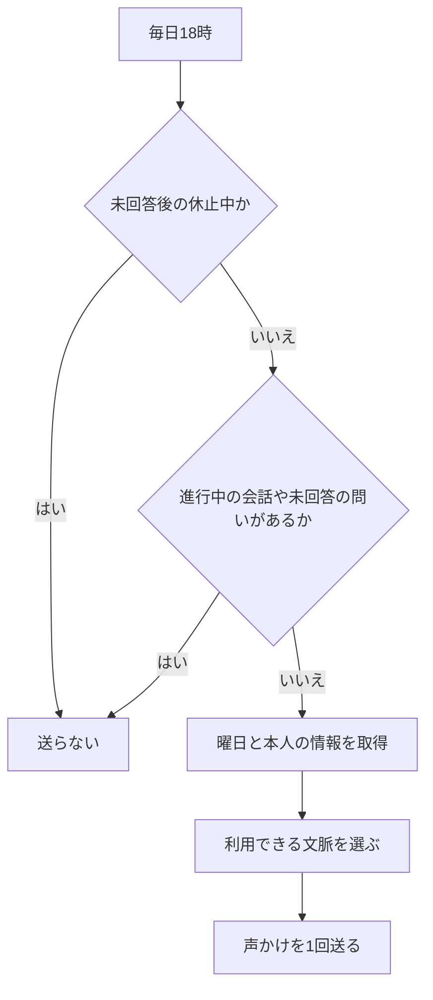
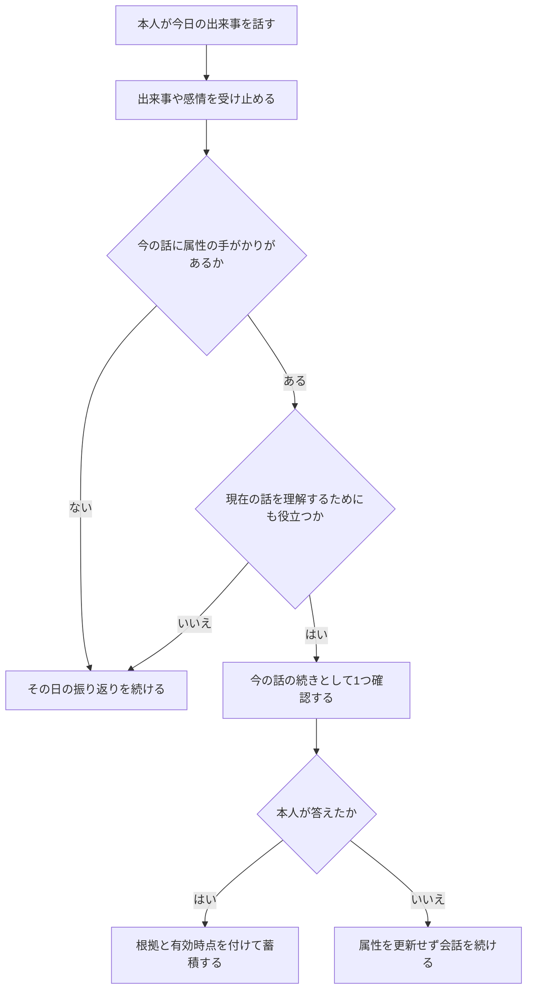
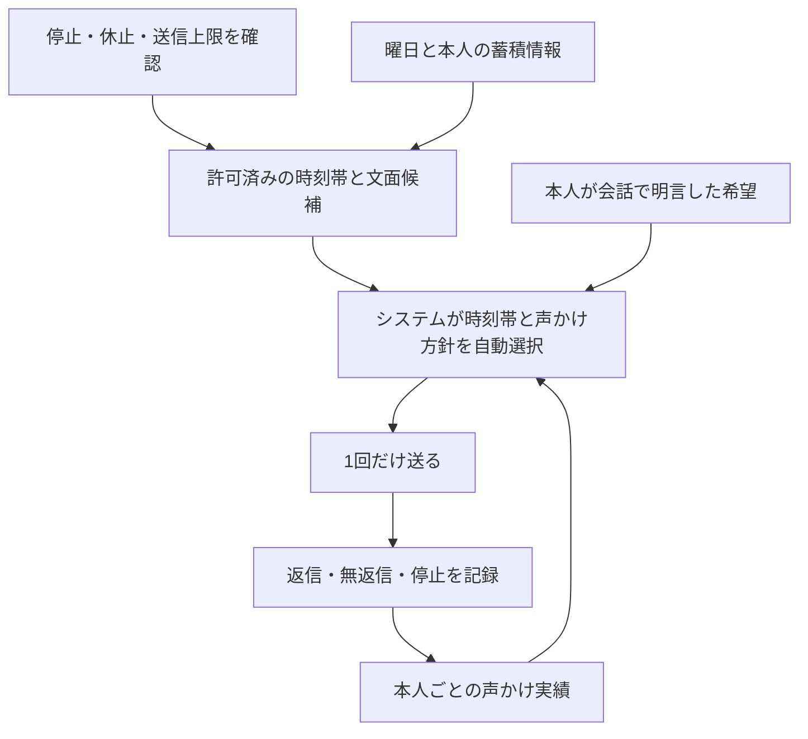
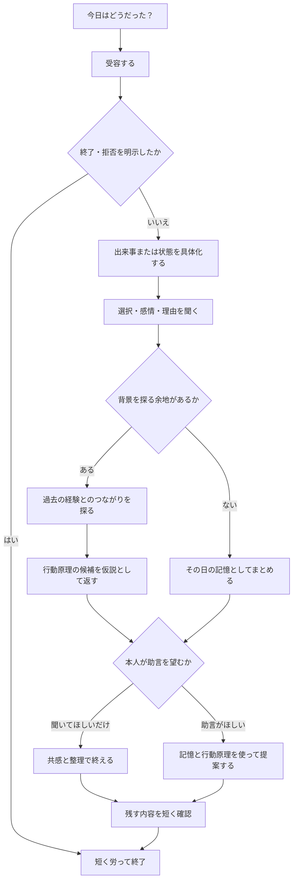
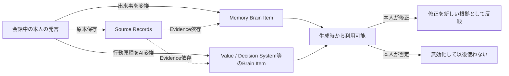
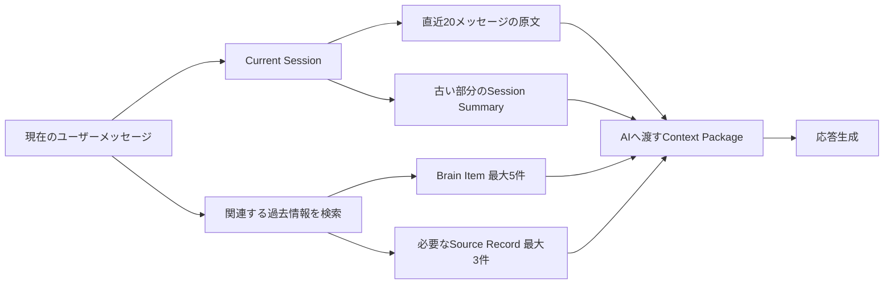

# 日記チャット体験設計

## 1. 目的

日記チャットを、ユーザーに日記を書かせる入力フォームではなく、何気ない対話からその日の出来事と本人の考え方を一緒に見つけ、後の生活に役立てる対話相手として設計します。

目指す体験は、チャットからの「今日はどうだった？」という声かけに自然な言葉で答えると、会話の中で次のことが起きる状態です。

1. その日にあったことが備忘録として残る
2. そのときの選択と理由が整理される
3. 現在の行動原理が、過去の経験とのつながりを含めて見えてくる
4. 蓄積した本人の記憶と行動原理を根拠に、今の状況に合う助言を受けられる

この文書が所有する概念:

- 日記チャットが担う役割と会話原則
- 日々の声かけの配信判断、個別化に使う情報、文脈選択、段階導入と、振り返りまでの会話フロー
- 出来事から行動原理とその背景を探る方法
- 本人が話している相手との関係性を考慮して質問する方法
- Conversation Sessionの境界と、AIへ渡す会話・記憶の範囲
- 会話から記憶候補を作り、本人へ確認する体験
- 蓄積した情報を使って助言する際の会話上の規則
- 日記チャット体験の完了条件と評価指標

この文書が所有しない概念:

| 概念 | SSoT |
| --- | --- |
| Phase 1の対応チャネル、入力形式、LINEとWebの役割分担 | [プロジェクト概要](project-overview.md) |
| Phaseごとの目的、提供順序、ロードマップ | [プロジェクト概要 §11](project-overview.md#11-段階的な進め方) |
| Brain Itemの分類と各分類の意味 | [Brain内部情報の分類](../domain/brain/brain-content-taxonomy.md) |
| 診断と日記に共通するBrain Item生成の入出力と登録タイミング | [Brain Item生成設計](../domain/brain/brain-item-generation-design.md) |
| Source Recordの粒度とSource / Brain間の関係 | [ドメイン設計](../domain/domain-design.md) |
| Source RecordとBrain Itemを結ぶ根拠、反証、改訂 | [根拠・反証・改訂のエッジ設計](../domain/brain/evidence-edge-design.md) |
| 日記の送信取り消し、訂正、撤回、削除 | [Source Recordのライフサイクル設計](../domain/source/source-record-lifecycle-design.md) |
| Access Labelと外部への提供範囲 | [Brainのラベル・アクセス制御設計](../domain/brain/brain-access-label-design.md) |
| プランごとに利用できるAI返信数と、関係性を考慮する時間範囲 | [サブスクリプション・料金プラン設計](subscription-plan-design.md) |
| AIモデル、プロンプト、検索方式、API、永続化方式、声かけの配信基盤 | 後続の実装設計 |

## 2. 結論

日記チャットは、1つの会話の中で次の4つの役割を順番に担います。

| 役割 | すること | してはいけないこと |
| --- | --- | --- |
| 話し相手 | 気分や出来事を受け止め、話しやすい入口を作る | 最初から質問票のように項目を埋めさせる |
| 聞き手 | 出来事、選択、感情を具体的にする | すべての発言へ「なぜ？」を繰り返す |
| 鏡 | 過去との共通点や行動原理の候補を、仮説として返す | 推定を本人の確定した性格として断言する |
| 伴走者 | 蓄積した記憶と本人の基準を使って助言する | 一般論や過去の1件だけで結論を押しつける |

会話は情報収集のためだけに最適化しません。安心して話せることを先に置き、その結果として記憶や行動原理が蓄積される順序にします。

## 3. 日々の入口

### チャットからの声かけ

日記チャットは、日本時間の18時を基本に1日1回だけ声をかける体験を目標とします。本人に有効化や曜日選択を求めず、蓄積した本人の情報、曜日、これまでの返信しやすさに合わせてシステムが文面を変えます。

```text
今日はどうだった？
短いひとことでも、まとまっていなくても大丈夫だよ。
```

声かけは会話を始めるきっかけであり、回答義務を作る通知ではありません。

- 未回答の日に再通知しない
- 連続未回答を責めたり、記録の欠落として見せたりしない
- 本人が停止を求めた場合は、それ以降の声かけを止める
- 停止後に本人から新しい日記メッセージが届いた場合は、次の送信可能な日から声かけを再開する
- 本人からいつでも先に話しかけられる入口も維持する
- 診断やキャンペーンの案内を、最初の問いへ同時に混ぜない

Phase 1の日記はユーザー起点で始まり、声かけ機能の段階1から固定文面の能動的な入口を追加します。停止の意思は直ちに反映し、その停止発言より後に本人から新しい日記メッセージが届いた場合は、明示的な再開操作を求めず次の送信可能な日から再開します。停止や再開を受け付けた日に、すでに送信済みまたは停止済みの声かけを追加送信しません。通常利用では声かけを有効にする操作や送信曜日を選ぶ設定を設けません。配信方式は[日記チャット実装設計 §3.3](../architecture/diary-chat-implementation-design.md#33-18時の基本声かけjob)を正とします。

### 送るかどうかの判断

声かけの基本時刻は毎日18時です。曜日によって送るかどうかを分けず、未回答による間隔と進行中の会話だけを確認してから、曜日と本人の情報に合う文面を選びます。

段階2では、`Asia/Tokyo`の配送日から曜日を決め、次の一般文面をシステムが自動選択します。曜日だけから勤務、登校、休日、疲労などを推定しません。文面はversion付きで管理し、配送準備時に選んだversionを再試行でも使います。

| 曜日 | 一般文面 |
| --- | --- |
| 月 | 今日はどんな一日だった？まずは、いちばん印象に残ったことから聞かせて。 |
| 火 | 今日、ちょっと気になったことや心に残ったことはあった？ |
| 水 | 今日はどんなことがあった？まとまっていなくても大丈夫だよ。 |
| 木 | 今日を振り返ると、どんな場面が浮かぶ？ |
| 金 | 今日、少しでも話しておきたいことはある？ |
| 土 | 今日はどんなふうに過ごした？ひとことだけでも聞かせて。 |
| 日 | 今日はどんな一日だった？話したいことから聞かせて。 |



本人が日中にLINEで会話を始め、18時時点でも会話が続いている場合は、別の「今日はどうだった？」を重ねません。チャットからの直前の問いへ返答がない場合も、日々の声かけを催促として使いません。送信に失敗した場合の再試行は同じ1回の配送として扱い、別文面による追加通知へ変えません。

### 返信がない場合は間を空ける

返信がないことは、忙しさ、体調、通知を見ていないことなど複数の理由があり得るため、拒否や性格として推定しません。初期版では次の保守的な固定規則を使います。

- 声かけへ返信がなければ、同日中は再通知しない
- 次に予定されている声かけを1回休み、少なくとも1日は間を空ける
- 返信のない声かけが3回続いたら能動的な声かけを自動休止し、本人から新しい会話が届くまで送らない
- 本人からLINEが届いた場合は未回答の連続回数を解消するが、進行中の会話へ別の声かけを重ねない
- 返信があった場合は未回答の連続回数を解消するが、その日の追加の声かけは送らない

休止中も、本人からいつでも日記を送れる状態は維持します。返信がなかった回数や「久しぶり」といった表現を次の声かけへ混ぜず、心理的な負債を作りません。

### 本人の情報、曜日、前日と日中の文脈を汲む

声かけの文面は、本人が日記やLINEで話した情報を蓄積したうえで、当日の曜日と結びつく内容をシステムが選びます。本人に曜日ごとの設定を入力させません。次の優先順で利用可能な文脈を選び、使える文脈がない、または現在も正しいか確信できない場合は、その曜日向けの一般的な声かけへ戻します。

1. 当日の日中に本人が話し、会話を閉じた後も続きが自然に生じる話題
2. 本人が話した、当日の曜日と結びつく学校、仕事、塾、習い事、休日などの繰り返す予定や過ごし方
3. 前日に本人が「明日やる」「また話したい」など継続する意思を示した話題
4. 本人の情報を使わない、曜日ごとの一般的な振り返り

```text
日中に話してくれたこと、その後はどう？
話題を変えて、今日全体のことを話しても大丈夫だよ。
```

```text
昨日話していたこと、今日は何か動きがあった？
特になければ、今日の別のことでも大丈夫だよ。
```

```text
今日は塾の日だったかな。帰って落ち着いてから、残っていることをひとことだけでも聞かせて。
```

```text
週の始まり、おつかれさま。今日いちばん気を使ったことはあった？
```

曜日だけで本人の出来事を決めつけません。「月曜日だから疲れている」「塾の日だから大変だった」と感情や結果まで推定せず、本人が答えを訂正したり別の話題を選べる問いにします。

前日のConversation Sessionを再開するのではなく、終了済みSessionから現在も有効な情報を必要最小限だけ参照し、新しいSessionの入口を作ります。次の情報は声かけの個別化へ使いません。

- 返答されなかったチャット側の質問や、未達の記録ゴール
- 本人が終了、拒否、保留を示した話題
- AIだけが推定し、本人の発言で裏づけられていない内容
- 医療、家庭事情、第三者名など、通知画面に具体的に出すと不利益がある情報
- 削除、撤回、無効化された情報

文脈を使う場合も、第三者名や出来事の詳細を文面へ再掲せず、「昼に話してくれたこと」のように本人だけが分かる最小限の表現を優先します。

### 曜日に結びつく本人の情報を扱う

学校、仕事、塾など曜日に結びつく情報は、本人の日記やLINEでの発言から得ます。1回の出来事だけで毎週の予定とはみなさず、本人が繰り返す予定として話した内容、または複数回の発言から現在も続いていると確認できる内容だけを使います。

- 曜日は、声かけを送るかどうかではなく、どの文面を送るかの判断に使う
- 本人の明示した事実とAIの推定を区別し、推定だけを根拠に予定を断定しない
- 予定が変わったという発言があれば、古い曜日情報を以後の声かけへ使わない
- 日中の会話、前日の継続、曜日の予定が複数ある場合は、現在の本人に最も近い内容を1つだけ使う
- 個人情報を文面へ過度に再掲せず、予定名を出す場合も本人が答えを修正できる表現にする

### 声かけのために把握する情報

システムは、声かけを個別化するために把握したい情報を`声かけコンテキスト`として定義します。これは新しいBrain分類や必須プロフィールではなく、[Brain内部情報の分類](../domain/brain/brain-content-taxonomy.md)に従って蓄積した情報から、この用途に必要なものを選ぶ観点です。

空欄をすべて埋めることを会話の目的にしません。本人が自然に話した内容を優先し、情報が足りない場合だけ会話の流れに合う質問を1つ尋ねます。

| 優先度 | 把握したい情報 | 例 | 声かけでの利用 | 主なBrain分類 |
| --- | --- | --- | --- | --- |
| 高 | 今の立場 | 学生、会社員、自営業、家事・育児中、休職中 | 学校、仕事、休日など入口の前提を合わせる | Identity / Current State |
| 高 | 1週間の基本リズム | 平日勤務、土日休み、シフト制、登校日、在宅日 | 曜日に合わない問いを避ける | Memory / Behavior Pattern |
| 高 | 曜日ごとの定期予定 | 月曜は塾、水曜は部活、金曜は出社 | 当日の予定に沿った文面を選ぶ | Memory / Goal |
| 高 | 一息つきやすい時間 | 帰宅後、夕食後、21時台、日によって不定 | 後続段階で送信時刻を調整する | Preference / Behavior Pattern |
| 高 | 返信しやすい聞かれ方 | ひとこと、出来事から、気分から、選択肢なし | 声かけ方針を選ぶ | Preference / Expression Style |
| 中 | 通勤・通学と活動場所の傾向 | 電車通勤、在宅中心、放課後に移動する | 18時時点の状況を決めつけない | Behavior Pattern |
| 中 | 習慣と定期的な楽しみ | 運動、ゲーム、習い事、友人との予定 | 話しやすい具体的な入口を作る | Preference / Behavior Pattern |
| 中 | 直近の予定と節目 | 試験、締切、発表、旅行、長期休暇 | 前日や当日の続きへ自然につなぐ | Goal / Current State |
| 中 | 曜日ごとの負担傾向 | 月曜は会議が多い、金曜は疲れやすい | 質問の重さや文量を調整する | Behavior Pattern / Current State |
| 低 | 誕生日・記念日 | 誕生日の月日、本人が大切にする節目 | その日前後だけ文面へ反映する | Identity / Memory |

誕生日は月日だけで目的を満たすため、生年や年齢を既定では尋ねません。職場名、学校名、住所、正確な現在地、第三者の氏名など、自然な声かけに不要な詳細は集めません。健康、家庭、金銭など機微な情報は、本人が話した場合も曜日別文面の材料として安易に使いません。

### 自然な会話から情報を増やす

初回にプロフィール質問を並べず、本人がその日に話した出来事を起点にします。発言の中に声かけコンテキストの手がかりが現れた場合だけ、まず出来事や感情を受け止め、その話の続きを聞く形で1つ確認します。手がかりがない日に、未取得の属性を埋めるためだけの質問へ切り替えません。



把握したい順序は、今の立場と週間リズム、曜日別予定、一息つく時間、趣味や節目の順です。ただし、質問する順番は固定しません。その日の発言に最も自然につながるものを優先します。

#### 今の立場

職業を直接尋ねるより、本人が話した出来事の背景を確認します。

```text
本人: 今日はお客さんへの説明がうまくいった。
チャット: うまく伝わったんだね。普段も、人に説明することが多い仕事なの？
```

この回答から仕事内容は分かっても、「会社員」「自営業」まで分からない場合があります。本人が言っていない雇用形態を埋めません。

今の話から関連する属性が続けて確認できる場合は、短い1つの流れとして扱います。属性だけを聞き続けず、最大2問で元の話題へ戻ります。

```text
チャット: 今日はどうだった？
本人: 仕事がつらくて。
チャット: それはしんどかったね。そういえば、どんな仕事をしているの？
本人: 看護師なの。
チャット: 看護師なんだね。お休みは曜日が決まっている？ それともシフトで変わることが多い？
本人: シフトで変わるよ。
チャット: 休みが一定じゃない中で働いているんだね。今日は何がいちばんつらかった？
```

「看護師だから休日は固定ではない」と推定せず、本人の回答を得てから週間リズムを確定します。2問目が元の話から離れる場合や、本人が短く会話を閉じようとしている場合は、職業だけを把握して元の話題へ戻ります。

#### 週間リズムと曜日別予定

休日や定期予定は、その曜日に起きた出来事から繰り返しなのかを確認します。

```text
本人: 明日からやっと休み。
チャット: 今週もおつかれさま。普段も土日は休めることが多い？
```

```text
本人: 塾から帰ってきた。今日は難しかった。
チャット: 遅くまでおつかれさま。月曜はいつもこの時間まで塾なの？
```

1回の回答は、その週だけの予定か、毎週の予定かを区別して保存します。「今日は塾だった」だけで毎週月曜と推定しません。

#### 一息つきやすい時間

返信時刻だけから生活リズムを断定せず、移動中や帰宅直後だと分かった会話で確認します。

```text
本人: 今帰りの電車。今日は長かった。
チャット: 長い一日だったんだね。普段ひと息つけるのは、家に着いてからになりそう？
```

正確な時刻を答えさせる必要はありません。「帰宅後」「夕食後」「日による」のような本人の感覚を保持し、実際の返信実績と組み合わせます。

#### 返信しやすい聞かれ方

聞かれ方の好みは、原則としてプロフィール質問で尋ねません。コードレビュー済みの複数の声かけ方針を試し、本人が返信したか、すぐ終了したか、どの程度自然に会話が続いたかから学びます。

本人が「気分を聞かれるより、何があったか聞かれる方が答えやすい」のように明言した場合は、その発言を実績より優先します。反応がないことだけを嫌いという意思にはせず、同じ聞き方を連続させないための弱い手がかりとして扱います。

### 情報収集を会話の目的にしない

1つのSessionでは、現在の話から自然につながる1つの属性のまとまりだけを扱い、その中で行う確認は最大2問とします。日記の記録ゴールや本人が話したい内容を中断してまで尋ねません。質問への回答がなければ、同じSessionや次の声かけで言い換えて追いかけません。

後から予定や立場が変わった場合は新しい発言を優先し、古い情報を恒久的なプロフィールとして残しません。収集の進み具合を達成率として見せたり、情報が少ない人へ質問を増やしたりせず、情報が少ない間は曜日ごとの一般文面を使います。

### 把握した時点と根拠を残す

声かけコンテキストの値だけを独立したプロフィール欄へ転記しません。本人が述べた命題をBrain Itemとして扱い、根拠になったSource Recordと時点を結びます。分類と共通属性は[Brain内部情報の分類](../domain/brain/brain-content-taxonomy.md)を、生成と観測時点は[Brain Item生成設計](../domain/brain/brain-item-generation-design.md)を正とします。

| 確認したいこと | 保持方法 |
| --- | --- |
| 何を知ったか | 「看護師なの」「休みはシフトで変わる」のように、本人の命題を独立したBrain Itemとして分ける |
| どの発言で知ったか | Brain ItemからEvidence edgeで本人のSource Recordを参照する |
| いつ初めて知ったか | activeな根拠の最古時点から`firstObservedAt`を導出する |
| 最後に確認できたのはいつか | activeな根拠の最新時点から`lastObservedAt`を導出する |
| いつの状態か | Brain ItemのValid Timeで、その事実が有効な期間を表す |
| 後から変わったか | 新しいSource Recordを根拠に改訂し、以前のBrain Itemを置き換える |

`createdAt`はBrain Itemを処理・作成した時刻であり、本人から初めて得た時刻とは限りません。本人が発言した時点を示す`firstObservedAt`と混同しません。具体的な保存方法は[日記チャット実装設計 §4.7](../architecture/diary-chat-implementation-design.md#47-brain-item関連)を正とします。

### 返信しやすい時刻と聞き方を本人ごとに調整する

本人の返信実績を使い、基本の18時から時刻を調整する後続段階を設けます。ほかの利用者の会話本文や実績を、その本人の最適化へ流用しません。

時刻帯と声かけ方針はシステムが自動で選び、本人に曜日、時刻帯、聞き方の設定を求めません。ただし、会話の中で「21時ごろが返しやすい」「出来事から聞いてほしい」のように本人が希望を明言した場合は、返信実績からの推定より優先します。本人の希望も十分な返信実績もない間は、日本時間18時の標準文面へフォールバックします。

調整対象は、声かけを送る時刻帯と、コードレビュー済みの声かけ方針です。声かけ方針は、通常の問い、ひとことでも答えられる問い、許可された文脈への短い続きなど、返信の負担と入口の作り方だけを変えます。安全規則、送信上限、未回答時の休止、扱ってよい記憶の範囲は変更しません。



自動選択は送信判定のたびに、その時点で有効な本人の情報だけを使います。単発の返信や無返信だけで急に時刻や聞き方を変えず、判断に足りる実績がない候補は標準へ戻します。必要な観測数、候補ごとの評価方法、再評価の間隔は実装前に固定し、運用中にモデルが自由に変更できる値にはしません。

最適化は返信数だけを増やすことを目的にしません。声かけから会話が始まった割合に加え、停止、連続未回答、すぐ終了した割合、文脈を持ち出されて不快だったという評価も見ます。探索のために送信回数を増やしたり、強い感情を誘う文面へ変えたりしません。

同一Session内の会話方針と返信率は[日記チャット実装設計 §7.3](../architecture/diary-chat-implementation-design.md#73-会話方針の選択と返信率)が扱います。声かけ前の時刻・文面の選択とは評価機会が異なるため、同じ返信率として合算しません。

### 最初の返答への向き合い方

最初の返答が「普通」「疲れた」「特に何もない」のように短くても、詳細不足として扱いません。まず言葉を受け止め、話を広げられる小さな問いを1つだけ返します。

```text
本人: 今日は疲れた。
チャット: おつかれさま。いちばん消耗したのは、どんな場面だった？
```

```text
本人: 特に何もなかった。
チャット: 静かな一日だったんだね。あえて残すなら、気分に残っている小さなことはある？
```

返答が短いことだけを「話を広げたくない」という意思とはみなしません。まず1回は答えやすい問い方へ変えます。そのうえで、ユーザーが終了や拒否を示した場合は「そっか、おつかれさま」で終え、記録のために質問を続けません。

## 4. 会話の流れ

会話は決まった設問を順に消化するのではなく、ユーザーの発言に合わせて必要な段階だけを通ります。



### 受容する

事実確認より先に、ユーザーが表した感情や温度感へ反応します。ここでは評価、解決、分析を急ぎません。

- 「それは嬉しいね」
- 「かなり気を張った一日だったんだね」
- 「まだ自分でも整理しきれていない感じかな」

感情をユーザーが明言していない場合は、「つらかったんだね」と断定せず、「つらさもあった？」のように確認可能な表現にします。

### 出来事を具体化する

後から本人が思い出せる最低限の具体性を、会話の流れを壊さない範囲で引き出します。

- 何が起きたか
- 誰や何が関係したか
- どんな選択をしたか
- その結果どうなったか
- 何が特に印象へ残ったか

一度に複数を尋ねません。その人の発言に対して最も自然な問いを1つだけ返します。

### 選択と理由を探る

行動原理は「あなたの価値観は？」と直接聞くより、実際の選択から探ります。

```text
何を選んだ？
その場でいちばん守りたかったものは何だった？
逆に、どうなることは避けたかった？
迷ったもう一方には、どんな良さがあった？
```

同じ行動でも、動機は誠実さ、不安、習慣、他者への配慮など複数あり得ます。チャットが先に理由を決めず、本人の言葉を待ちます。

### 行動原理の背景を探る

理由が見えたら、必要に応じて「なぜその原理を持つようになったか」を過去の経験とのつながりから探ります。

質問は尋問のような「なぜ？」の反復を避け、次のように具体化します。

```text
それを大事にするようになった、思い当たる出来事はある？
以前に逆の選択をして、うまくいかなかった経験がある？
誰かから受け取った考え方に近い？
昔からそうだった？ それとも途中で変わった？
どんな状況なら、その基準より別のものを優先する？
```

背景を思い出せない、話したくない、今は掘り下げたくないという回答も成立させます。由来を説明できない行動原理を無効とは扱いません。

### 仮説を鏡として返す

複数の発言や過去の記憶に共通点が見えた場合、チャットは断定ではなく確認可能な仮説として返します。

```text
前にチームの予定を変えたときも、速さより「相手が安心して使える状態」を選んでいたね。
あなたは、期限そのものより、約束した品質を守ることを優先しやすいのかもしれない。これは自分の感覚に近い？
```

本人は、同意、部分的な修正、否定、保留を選べます。否定された仮説を言い換えて承認させようとしません。

## 5. 会話で扱う情報

チャットは内部で次の観点を使いますが、会話中に分類名や入力欄としてユーザーへ見せません。分類の定義は[Brain内部情報の分類](../domain/brain/brain-content-taxonomy.md)を正とします。

| 会話から見つけるもの | 会話上の手がかり | 主に関係するBrain Item |
| --- | --- | --- |
| その日の出来事 | 起きたこと、選択、結果 | Memory |
| 今の状態 | 気分、体力、関心、負担 | Current State |
| 大切にしたこと | 守りたいもの、行動した理由 | Value / Motivation |
| 好みと避けたいこと | 快・不快、やりやすさ、回避したい状況 | Preference |
| 選ぶときの軸 | 比較した条件、優先順位 | Decision Criterion |
| 譲れない線 | 選択肢から外す条件 | Constraint |
| 繰り返す傾向 | 着手、継続、対人反応の共通点 | Behavior Pattern、Relationship Style |
| 次に向けた意図 | 続けること、変えること、約束 | Goal |

1日の会話ですべてを集めません。その日に自然に現れた情報だけを扱い、欠けている分類を埋めるための質問はしません。

### 関係性を考慮した質問

この節は後続提供する目標体験です。[§12](#12-既存ロードマップとの関係)で実装済みとする声かけ段階3には、関係性を考慮した質問は含みません。プランごとの提供範囲と提供状態は[サブスクリプション・料金プラン設計](subscription-plan-design.md)を正とします。

本人がパートナー、家族、友達、仕事で関わる人について話した場合は、出来事だけでなく、その関係だから生じた期待、言いづらさ、守りたい境界、続けたい関わり方を必要な範囲で尋ねます。一般的な人間関係の型へ当てはめず、本人が現在話している関係を理解するために使います。

関係の整理には、Diagnosisが持つ[Relationship Category](../diagnosis/diagnosis-domain-design.md#構成)と同じ`partner`、`family`、`friend`、`work`、`general`を使います。ただし、会話では質問の種類を選ぶ内部の手がかりであり、本人へカテゴリ選択画面を先に提示したり、1人の相手を恒久的に1カテゴリへ固定したりしません。

関係の把握は次の順で行います。

1. 「夫」「母」「友達」「上司」のように本人が関係を明示した場合は、その発言の範囲で対応するRelationship Categoryを使う
2. 「あの人」「相手」のように関係が質問内容へ影響するが不明な場合だけ、「仕事で関わる人？それとも親しい人？」のように1回確認する
3. 関係を確認しなくても現在の気持ちや出来事を聞ける場合は、カテゴリ確認を優先しない
4. 本人が訂正した場合は現在の発言を優先し、過去のカテゴリを押し付けない

関係ごとに必ず同じ質問を出すのではなく、現在の発言からまだ分からないことを1つだけ尋ねます。

| Relationship Category | 考慮する観点 | 質問例 |
| --- | --- | --- |
| `partner` | 親密さ、共同の選択、一人の時間、伝え方 | 相手には、まずどんな気持ちが伝わってほしかった？ |
| `family` | 家族からの期待、支え方、役割、自分の選択 | 家族として期待されていることと、自分が望んでいることはどこが違った？ |
| `friend` | 距離感、信頼、秘密、断り方、関係の継続 | その友達との関係を大切にしながら、どこは守りたかった？ |
| `work` | 役割、権限、責任、期限、評価への影響 | 立場や役割があることで、言いづらかったことはあった？ |
| `general` | 本人自身の選択、状態、価値観 | 今回いちばん守りたかったことは何だった？ |

質問例は定型文として毎回使うものではありません。「家族だから支えるべき」「パートナーなら共有すべき」のような規範を前提にせず、暴力、脅迫、監視、同意の無視を関係性の違いとして相対化しません。

現在の会話へ過去情報を加える場合は、本人自身について確認済みの次の情報だけを候補にします。

- 同じRelationship Categoryで本人が大切にしていたこと
- 本人が確認したRelationship Style、境界、支援の求め方
- 同じ相手または関係について、本人が現在の会話で明示的に参照した過去の出来事
- 現在も有効なGoal、約束、次に試すと本人が選んだこと

相性関係が成立していることや、同じファミリーパックへ参加していることは、相手側の情報を日記チャットへ利用する根拠になりません。相手の診断結果、日記、Brain Item、AI相談は利用せず、相性体験で双方が共有したprojectionも、本人がその内容について相談すると明示した場合を除いて自動では持ち込みません。

会話から保存するのは、本人が経験した出来事、本人の感情、選択、Relationship Styleです。第三者の性格、病気、意図、行動原理を、その第三者についてのBrain Itemとして生成しません。

## 6. 会話から記憶へ残す流れ

### 原文と解釈を分ける

本人の各発言は、本人が話した原文としてSource Recordへ保存します。日記1通を1件のSource Recordとする粒度は[ドメイン設計 §5](../domain/domain-design.md#source-recordの粒度)に従い、AIが会話全体を要約した文章で原文を置き換えません。

AIが会話から見つけた記憶や行動原理は、原文とは別のBrain Itemとして扱います。AIによる推定は、本人が明言した内容と区別できる属性を持たせます。



実線は保存・変換の処理、破線は保存後のEvidence依存を表します。すべてのBrain Itemが1件以上のSource Recordを根拠に持つこと、本人の同意・否定自体はSource Recordを生まないことは[ドメイン設計 §6](../domain/domain-design.md#6-ドメイン間の関係)に従います。変換とEvidence edgeの区別は[Brain Item生成設計 §2](../domain/brain/brain-item-generation-design.md#2-結論)を正とします。

### 生成した内容は会話の区切りで短く提示する

Brain Itemの保存許可は毎回尋ねません。原文は既定で日記として保存し、導出した記憶や行動原理は会話の区切りで提示して、違う場合に訂正・否定できるようにします。

```text
今日の記録としては、
・公開を一週間延ばした
・期限より、利用者が安心できる品質を優先した
・この基準には、以前の障害対応の経験が影響していそう
と残しておこうと思う。違うところはある？
```

提示を毎日必須にはしません。新しい行動原理がない日や、ユーザーが疲れている日は、出来事の記録だけで終えます。応答しなかったことを同意とは解釈せず、Brain ItemはEvidence、Derivation、Confidenceを保ったまま利用します。

## 7. 蓄積した情報を使った助言

### 助言する前に目的を合わせる

悩みが語られても、すぐ解決策を返しません。ユーザーが求めていることが不明な場合だけ、短く確認します。

```text
今は、もう少し話を聞くのと、一緒に整理するのと、具体的な案を出すのと、どれがよさそう？
```

本人が明確に「どうしたらいい？」「意見がほしい」と尋ねた場合は、重ねて許可を取りません。

### 助言に使う情報の優先順

助言は次の順に組み立てます。情報の意味と優先順位の詳細は[Brain内部情報の分類 §6](../domain/brain/brain-content-taxonomy.md#6-意思決定の組み立て方)に従います。

1. 今回の会話で本人が語った状況と、助言を求める目的
2. 根拠が明確なConstraint、Goal、Decision Criterion
3. Value / Motivation、Preference、過去のDecision Record
4. 最近のCurrent State
5. AIによる推定は、役立つ可能性があり、かつ仮説だと明示できる場合だけ補助的に使う

現在の状況と過去の情報が食い違う場合は、過去の情報を優先しません。「以前はこうだったが、今も同じか」を確認します。

### 助言の返し方

助言は、結論だけでなく「本人のどの記憶・行動原理を使ったか」が分かる形にします。

```text
今回は、いきなり全体を引き受けるより、まず範囲を決めて小さく試すのが合いそう。
前に新しい案件を進めたときも、「相手への責任は果たしたいけれど、曖昧な約束はしない」を大事にしていたから。
まず明日、担当範囲と期限だけ確認してから返事をするのはどうかな。
```

助言には原則として次の4点を含めます。

1. 今の状況に対する理解
2. 参照した本人の記憶または行動原理
3. 具体的で小さな次の一歩
4. 本人が違うと感じた場合に修正できる余地

根拠が足りない場合は、本人らしい助言を装いません。一般的な案であることを明示するか、判断に必要なことを1つだけ質問します。

## 8. 会話生成の規則

### 1ターンの基本形

通常の返信は次の3要素のうち必要なものだけを使い、2〜4文程度を基本にします。

1. 受容または共感
2. 本人の言葉の短い言い換え
3. 次へ進む問いを1つ

毎回3要素を定型的に並べる必要はありません。質問を含まない相づちだけのターンも許容し、自然な会話の間を残します。

### 記録ゴールを持ち続ける

日記チャットは自然な会話を行いながらも、会話ごとに「後から本人の役に立つ記録を1つ以上残す」という内部ゴールを持ち続けます。相づちや雑談だけでゴールを達成したとみなさず、明示的な終了・拒否がない限り、次のいずれかが具体化する方向へ会話を戻します。

- その日に起きた出来事と、印象へ残った点
- 現在の気分や状態と、それに影響したこと
- 本人が行った選択と、その理由または結果
- 次に行いたいこと、続けたいこと、変えたいこと

ゴールは分類項目を順番に埋めるためのものではありません。その日の会話で既に得られた情報と、まだ曖昧な部分を内部で見失わず、最も自然な問いを1つ選ぶために使います。

話題が雑談へ移った場合も、機械的に元の質問を繰り返さず、現在の話題から記録へつながる橋をかけます。

```text
本人: そういえば帰りに新しいパン屋を見つけた。
チャット: いい寄り道だったんだね。今日の中では、その時間がいちばん気持ちが緩んだ？
```

次の状態だけを理由に、記録ゴールを手放してはいけません。

- 最初の返答が「普通」「別に」「特にない」など短い
- 一度の問いに答えなかった
- 会話が一時的に雑談へ移った
- 行動原理まで深掘りできなかった

一方、記録ゴールはユーザーの意思、安全、心理的負担より下位に置きます。ユーザーが終了・拒否を示した場合、疲労や動揺が強い場合、機微な話題を避けた場合は、その時点までの発言を記録して終了します。未達のゴールを同日中に再通知したり、後日の会話で本人の同意なく蒸し返したりしません。

### 会話セッションの境界

AIへ一連の会話として渡す範囲を、論理的な`Conversation Session`で区切ります。Conversation Sessionは会話文脈の単位であり、Source Recordの粒度を変更したり、複数の発言を1つの原本へ結合したりするものではありません。

**確定**: Conversation Sessionは次の規則で開始・終了します。

| 条件 | 扱い |
| --- | --- |
| 日々の声かけにユーザーが返答する | 返答時点で新しいSessionを開始する。声かけを送っただけでは開始しない |
| Sessionがない状態でユーザーから話しかける | そのメッセージから新しいSessionを開始する |
| 「今日はここまで」「また今度」など終了を明示する | その応答を返した後に終了する |
| ユーザーの最後の発言、またはそれに対するチャットの最終応答のうち遅い方から6時間が経過する | 終了する |
| Session開始から24時間が経過する | 会話中でも次のユーザーメッセージから新しいSessionにする |
| 日付が変わる | それだけでは終了しない。6時間・24時間の規則を優先する |

6時間以内であれば、食事や移動などで会話が中断しても同じ文脈を維持できます。一方、24時間を越えて同じSessionを延ばさないことで、前日の状態や記録ゴールを現在の会話へ暗黙に持ち越すことを防ぎます。

同じSession内で「別の話なんだけど」と話題が変わっても、Session自体は分けません。話題ごとの区切りを内部で持ち、直前の話題に関する未回答の質問や記録ゴールを、新しい話題へ無理に戻しません。

終了済みSessionについて「昨日の話だけど」「さっき相談した件」と本人が参照した場合も、元のSessionを再開はしません。新しいSessionから過去の記憶を検索し、どの過去Sessionを指すか確認できた範囲だけを現在の文脈へ加えます。

### AIへ渡す現在の会話

現在のSessionでは、直近20メッセージまでを原文のままAIへ渡します。ここでいう1メッセージは、ユーザーまたはチャットが1回送信した単位です。

20メッセージを越えた場合は、古い部分を作業用の`Session Summary`へ畳み、直近20メッセージと一緒に渡します。Session Summaryは会話を続けるための一時的な文脈であり、本人の原文、Source Record、Brain Itemのいずれにも置き換わりません。

Session Summaryには次の内容を残します。

- このSessionで起きた出来事、関係者、時点
- 本人が明示したRelationship Categoryと、同じ話題で対象にしている相手の範囲。未確認の場合は不確かであること
- 本人が表した感情とCurrent State
- 本人が行った選択と、本人が述べた理由
- 本人が訂正・否定した内容
- 現在求めていることが、共感、整理、助言のどれか
- まだ回答されていない問いと、現在の記録ゴール
- 既に提示した助言と、それに対する本人の反応

要約時には、推定と本人の発言を同じ事実として統合しません。誰が述べた内容か、AIによる推定か、本人が否定したかを区別します。

本人が発言を訂正・削除・撤回した場合は、次のAI呼び出しより前にSession Summaryへ反映し、変更前の要約を以後の文脈へ使いません。

非常に長い1メッセージがAIの入力上限を越える場合、先頭や末尾だけを切り取って意味を欠落させません。分割して処理し、全体から作った要約と参照箇所を現在の文脈へ渡します。分割サイズやトークン配分は実装設計で決めます。

### 過去から追加する記憶

終了した過去Sessionの全文を、毎回AIへ渡しません。現在の会話に関係する情報を次の順で検索し、必要最小限だけを追加します。

1. 本人が現在の会話で明示的に参照した過去の出来事
2. 現在の話題と、確認済みのRelationship Categoryが一致する本人のBrain Item
3. 有効なGoal、Constraint、Decision Criterion
4. 最近のCurrent Stateと、過去のDecision Record
5. Brain Itemの意味を確認するために必要なSource Recordの一部

1回のAI入力へ追加する過去情報は、Brain Itemを最大5件、Source Recordの原文を最大3件とします。件数内へ収まらない場合は、現在の状況との関連性、現在も有効か、EvidenceとConfidenceを優先して選びます。

AI推定のBrain Itemは推定であることをContext Packageで明示します。無効化済み、削除済み、撤回済み、Access Policyで利用できない情報は追加しません。

Context PackageはAI呼び出しごとに現在のstatus、Derivation、Confidence、削除状態、Access Policyを評価して作ります。以前のターンで作ったContext Packageを、そのまま次のターンへ再利用しません。Context Packageの内容を運用ログへ出力しないことは[§11](#11-安全性とプライバシー)に従います。



AIへ渡す各情報には、種類、発言または記録の時点、Derivation、Confidence、根拠の識別子を添えます。モデルが現在の発言、過去の原文、AIの要約、ルールベース変換とAI推定による行動原理を区別できる形にします。

### 連続送信と遅延応答

ユーザーがAIの応答前に複数のメッセージを送った場合、応答生成を始める前に受信済みのメッセージはまとめて同じターンの入力として扱います。生成開始後に届いたメッセージは失わず、次のターンで直前の応答とともに扱います。

[§9](#9-応答時間)の最終応答は、対象のSessionとユーザーメッセージへ関連づけます。処理中にSessionが時間切れとなっても、別のSessionへの回答として送信しません。ユーザーが新しい話題を始めている場合は、古い最終応答で現在の会話を遮らない提示方法を実装設計で決めます。

### 質問の規則

- 1ターンに主質問は1つだけにする
- 既に答えた内容を聞き直さない
- 「なぜ？」だけを繰り返さず、選択、守りたいもの、過去の経験、例外へ問いを具体化する
- 誘導する選択肢を先に並べず、本人の言葉を待つ
- 話したくないという意思を理由なく再確認しない
- 過去の機微な記憶を、現在の話題と関係なく持ち出さない
- 関係が不明なまま、診断結果や過去の発言から相手との関係を決めつけない
- 相手の気持ち、性格、病気、意図を本人の発言だけから断定しない

### 深掘りを止める兆候

次の場合は追加質問を止め、共感または短い整理で終えます。

- 「今日はもういい」「話したくない」と明示した
- 答えやすい問い方へ変えても返答が繰り返し短く、会話を閉じる表現がある
- 疲労や動揺が強く、分析より休息が必要だと本人が示した
- 行動原理の由来を思い出せない、または確信がない
- 助言ではなく、聞いてほしいだけだと分かった

## 9. 応答時間

### 38秒以内に最初の返信を返す

**確定**: 日記チャットでユーザーのメッセージを受信したら、38秒以内に最初の意味のある返信を返します。

計測区間は、サービスがチャネルからメッセージを受信した時点から、返信の送信要求がチャネルに受理された時点までとします。チャネルからユーザー端末までの配送時間はサービスが制御できないため、計測区間に含めません。

意味のある返信には、次のいずれかを含めます。

- 発言を受け止める応答
- 発言内容を踏まえた問い
- 求められた整理または助言
- 正常に応答できない場合のエラー案内

入力中表示、既読表示、空のメッセージ、機械的なスタンプだけでは、この規約を満たしたとみなしません。

### 完成した返信を待っている間

記憶の検索や応答生成に時間がかかる場合は、独立した受領応答を送らず、チャネルの入力中表示を使って処理中であることを示します。入力中表示のために内容を捏造したり安全確認を省いたりしません。

処理を放置せず、完成した応答または失敗したことを同じ会話へ返します。最終応答までの上限、再試行、チャネルごとの送信方法は後続の実装設計で決めます。完成した応答に診断導線は付加せず、LINE内から診断への主導線は[Phase 1 診断体験設計 §7](../diagnosis/diagnosis-experience.md#7-リッチメニュー)を正とします。

38秒という期限を守るために、次のことを行ってはいけません。

- 未確認の記憶を確認済みとして扱う
- Access Policyによる絞り込みを省略する
- 根拠を確認せず本人らしい助言を生成する
- 生成途中の不完全な文章をそのまま送る
- 同じ受信メッセージへ重複返信する

### 計測と監視

メッセージごとに、受信時点、最終応答の送信時点、結果を計測します。ただし、会話原文や検索した記憶を計測ログへ含めません。

38秒以内返信率に加えて、最終応答時間の中央値、95パーセンタイル、99パーセンタイルを確認します。違反件数だけでなく、外部チャネル障害、記憶検索、応答生成など遅延した段階を識別できるようにします。

## 10. 会話例

```text
チャット: 今日はどうだった？ 短いひとことでも大丈夫だよ。

本人: リリースを一週間延期した。正直、言い出しづらかった。

チャット: 言い出しづらい中で、延期を選んだんだね。
いちばん気になっていたのは何だった？

本人: 不具合が残ったまま出して、利用者に迷惑をかけること。

チャット: 予定を守ることより、安心して使える状態を守りたかったんだね。
そう考えるようになった、思い当たる経験はある？

本人: 前の会社で、急いで出した機能が障害になったことかな。対応した人にも迷惑をかけた。

チャット: その経験から、速さだけでなく、利用者と対応する人への影響まで考えるようになったのかもしれないね。
「影響を引き受けられない状態では公開しない」という基準に近い？

本人: 近い。でも絶対に延期するというより、問題の大きさ次第。

チャット: なるほど。「問題があるなら延期」ではなく、影響の大きさと自分たちが対処できるかで判断するんだね。
今は、延期後の進め方も一緒に考えたい？ それとも今日は整理できたところで終える？

本人: 進め方も考えたい。

チャット: なら、まず残っている問題を「利用者への影響」と「発生時に対処できるか」で分けるのが合いそう。
以前から大事にしている、関係者へ曖昧な約束をしない姿勢にも沿っている。明日、公開条件を3つに絞ってチームへ共有するのはどうかな。
```

この会話では、出来事、選択理由、原理の由来、原理の例外、次の行動を順に扱っています。ただし、実際の会話で毎回この深さまで進むことは求めません。

## 11. 安全性とプライバシー

- 日記と会話原文の既定Access Labelは`private`とする
- LINE上で公開範囲を広げる操作を提供しない
- 会話原文、要約、検索した記憶を運用ログへ出力しない
- 助言には、適用されたAccess Profileで利用可能なBrain Itemだけを使う
- 過去の第三者情報を、現在の相談に必要な範囲を越えて再表示しない
- 相性関係やファミリーパックへの参加を、相手側の非共有情報を参照する同意として扱わない
- 第三者についての推定を、その第三者を表すBrain Itemとして保存しない
- 医療、法律、金融、自傷他害など高い安全性が必要な相談では、日記チャットの推定だけで断定的な助言をしない
- 送信取り消し、撤回、削除は[Source Recordのライフサイクル設計 §7](../domain/source/source-record-lifecycle-design.md#7-日記の取り消しと撤回)に従う
- 本人が削除・撤回したSource Recordと、それによって無効になったBrain Itemを助言へ使わない

高リスクな相談の検出、応答、専門窓口への案内は、通常の日記会話とは別の安全設計で具体化します。

## 12. 既存ロードマップとの関係

Phaseごとの目的と提供順序は[プロジェクト概要 §11](project-overview.md#11-段階的な進め方)を正とし、この文書では再定義しません。

この文書の目標体験は、同節のPhase 3「自分とのチャット」を、Phase 1の日記入力と接続したものです。成立には、Phase 1で蓄積したSource Recordと、[プロジェクト概要 §12](project-overview.md#12-今後決めること)に挙げられているBrain Itemの導出・訂正が必要です。

AI推定だけを根拠に「本人らしい」と断定した助言を返しません。AI推定を使う場合は、推定であることと根拠を示し、本人が否定・訂正できる形にします。

### 声かけ機能の段階導入

製品Phaseとは別に、声かけ機能は次の順で小さく提供します。後の段階は前の段階の送信上限と休止規則を引き継ぎます。

| 段階 | 追加するもの | この段階では行わないこと |
| --- | --- | --- |
| 0. 導入前 | ユーザー起点の日記チャット | 能動的な声かけ |
| 1. 18時の基本版 | 日本時間18時、1日1回、未回答後の間隔、自動休止、停止意思の反映 | 本人情報の利用、学習による調整 |
| 2. 曜日別の文面 | 曜日ごとにコードレビュー済みの一般文面を切り替える | 本人が話していない予定の推定 |
| 3. 本人情報と文脈の反映 | 声かけコンテキストの段階的な収集、曜日に結びつく本人の予定、前日・日中の文脈、一般文面へのフォールバック | 未回答の属性を埋めるための質問連発、未回答の問いや拒否した話題の持ち越し |
| 4. 個人ごとの調整 | 本人の明言と返信実績を用いた、システムによる時刻帯・声かけ方針の自動選択と評価 | 設定画面での選択要求、送信頻度の増加、Accountをまたぐ会話本文の学習 |

各段階は、配信の正確さだけでなく、停止率、連続未回答、文脈利用への不快評価に悪化がないことを確認してから次へ進みます。

現在は段階3まで着手し、本人が会話で明言した高優先属性の抽出・保存、現在の会話に手がかりがある場合の自然な確認質問、曜日に結びつく本人情報、当日の日中と前日の終了済み会話による声かけ文面の個別化まで実装済みです。本人ごとの時刻帯・声かけ方針の調整はまだ行いません。段階1の未回答時の休止、本人の停止意思、新着メッセージによる自動再開は維持します。停止意思は「声かけを止めて」「もう送らないで」のように意味が確定する表現だけを決定的なルールで反映し、曖昧な発言から推定しません。再開専用の表現は要求せず、停止発言より後の新しい日記メッセージを再開の契機とします。

## 13. 完了条件と評価指標

### 体験の完了条件

- 「今日はどうだった？」への短い返答から会話を始められる
- 未回答後の休止中と会話中には送信しない
- 1日に複数の声かけを送らず、連続未回答時に間隔と自動休止を適用できる
- 前日・日中の文脈を使う場合に、拒否・未回答・機微な内容を持ち越さない
- 本人へ曜日選択を求めず、曜日と蓄積した本人の情報から文面を選べる
- 塾日など曜日に結びつく予定を、本人の発言に根拠がある場合だけ文面へ反映できる
- 声かけコンテキストを一括質問せず、現在の話に手がかりがある場合だけ、1つのSessionにつき1つの属性のまとまりを最大2問で確認できる
- 情報がない項目を未達として扱わず、一般文面へ戻せる
- 返信しやすい聞かれ方は実際の反応から学び、本人が明言した好みを優先できる
- 属性の値、Evidence、`firstObservedAt`、`lastObservedAt`、Valid Time、改訂を区別できる
- 本人へ設定を求めず、本人が明言した希望と本人自身の声かけ実績だけを用いて、システムが時刻と声かけ方針を自動選択できる
- 質問へ答えない、または途中で終えても、発言済みの内容は日記として残る
- 1ターンに複数質問を出さず、聞いてほしいだけの会話を成立させられる
- 明示的な終了・拒否がない限り、出来事、現在の状態、選択、次の意図のいずれか1つを具体化するまで記録ゴールを保つ
- 明示終了、6時間の無操作、開始から24時間の規則でConversation Sessionを一意に区切れる
- 現在Sessionの原文、Session Summary、過去の記憶を区別したContext Packageを作れる
- 過去情報の件数上限、Derivation、Confidence、Access Policyを守ってAI入力を構成できる
- 本人が明示した関係を現在の話題に必要な範囲で把握し、関係に応じた観点から主質問を1つだけ選べる
- 関係が不明または訂正された場合に、過去情報からRelationship Categoryを固定しない
- 同じ相性関係またはファミリーパックの相手であっても、相手側の非共有情報を日記チャットへ利用しない
- 会話から第三者の人物像を生成せず、本人の経験とRelationship Styleだけを記録できる
- 出来事、選択理由、背景となる経験を区別して記録できる
- 行動原理の推定を仮説として提示し、修正、否定を受け付けられる
- 助言する前に、共感・整理・助言のどれを本人が求めているか合わせられる
- 助言に使った記憶または行動原理を本人が確認できる
- 根拠がない場合に、本人らしいと装った助言をしない
- 削除・撤回・Access Labelの変更が、その後の会話と助言へ反映される
- 各メッセージに対する最初の意味のある返信を、定義した計測区間で38秒以内に返す
- 処理中はチャネルの入力中表示を出し、最終的に完成した返信または失敗案内を返す
- 完成した返信に診断導線が付加されない

### 主に見る指標

- 声かけを受け取ったユーザーの会話開始率
- 時刻帯、曜日、本人情報の利用有無、声かけ方針、文脈利用有無ごとの会話開始率
- 声かけ後の未回答継続数、自動休止率、手動停止率
- 文脈を使った声かけに対する訂正、不快評価、通常の声かけへの変更率
- 属性確認の問いに対する返信率と、その後も元の話題を自然に続けられた割合
- 曜日別予定や週間リズムについて、本人から訂正された割合
- 関係性を考慮した問いへの回答率、Relationship Categoryの訂正率、不快評価率
- 過去の関係情報を使った問いと、現在Sessionだけを使った問いの会話継続率
- 1週間・1か月後も日記会話を利用している割合
- 会話後に「話して整理できた」と回答した割合
- 提示した行動原理候補への同意・修正・否定・保留の割合
- 助言に対する「自分に合っている」という評価
- 助言後に提案した次の一歩を本人が採用・修正した割合
- 質問が多い、決めつけられた、過去を持ち出されて不快だったという評価の割合
- 開始した会話のうち、後から振り返れる具体的な記録を1件以上残せた割合
- 短い返答や雑談から記録へ自然に戻れた割合と、その後に終了・拒否された割合
- Session Summaryに対する本人の訂正率と、過去情報の参照が助言に役立った割合
- 38秒以内返信率と、最終応答時間の中央値・95パーセンタイル・99パーセンタイル

会話の長さや収集したBrain Item数を主要指標にしません。長く話させ、多く推定することより、また話したいと思えることと、本人が納得できる記憶・助言を優先します。

## 14. この文書で決めていないこと

- 時刻候補、個人調整の具体的な選択方法
- Brain Itemを訂正・否定する画面をLINE内とWebのどちらへ置くか
- Confidenceの算出方法

Conversation SessionとSession Summaryの物理モデル、プロンプト、Context Packageのtoken配分、記憶検索、応答期限、ガードレール、評価方法は[日記チャット実装設計](../architecture/diary-chat-implementation-design.md)を正とします。
