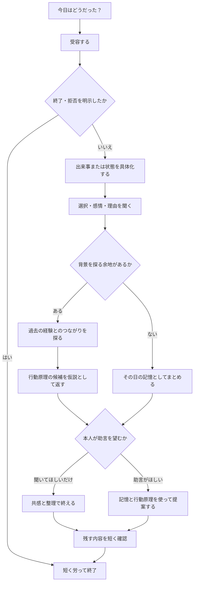
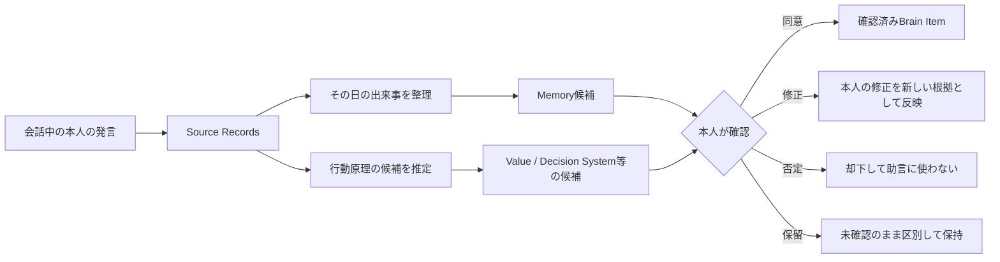
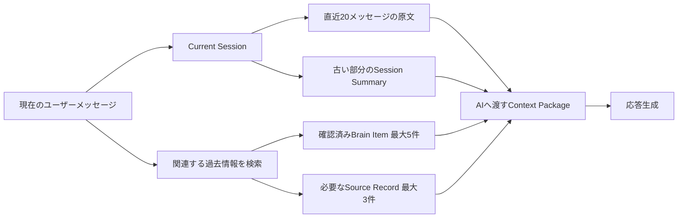

# 日記チャット体験設計

## 1. 目的

日記チャットを、ユーザーに日記を書かせる入力フォームではなく、何気ない対話からその日の出来事と本人の考え方を一緒に見つけ、後の生活に役立てる対話相手として設計します。

目指す体験は、チャットからの「今日はどうだった？」という声かけに自然な言葉で答えると、会話の中で次のことが起きる状態です。

1. その日にあったことが備忘録として残る
2. そのときの選択と理由が整理される
3. 現在の行動原理が、過去の経験とのつながりを含めて見えてくる
4. 蓄積した本人の記憶と行動原理を根拠に、今の状況に合う助言を受けられる

この文書が所有する概念:

- 日記チャットが担う役割と会話原則
- 日々の声かけから振り返りまでの会話フロー
- 出来事から行動原理とその背景を探る方法
- Conversation Sessionの境界と、AIへ渡す会話・記憶の範囲
- 会話から記憶候補を作り、本人へ確認する体験
- 蓄積した情報を使って助言する際の会話上の規則
- 日記チャット体験の完了条件と評価指標

この文書が所有しない概念:

| 概念 | SSoT |
| --- | --- |
| Phase 1の対応チャネル、入力形式、LINEとWebの役割分担 | [プロジェクト概要](project-overview.md) |
| Phaseごとの目的、提供順序、ロードマップ | [プロジェクト概要 §11](project-overview.md#11-段階的な進め方) |
| Brain Itemの分類と各分類の意味 | [Brain内部情報の分類](../domain/brain/brain-content-taxonomy.md) |
| Source Recordの粒度とSource / Brain間の関係 | [ドメイン設計](../domain/domain-design.md) |
| Source RecordとBrain Itemを結ぶ根拠、反証、改訂 | [根拠・反証・改訂のエッジ設計](../domain/brain/evidence-edge-design.md) |
| 日記の送信取り消し、訂正、撤回、削除 | [Source Recordのライフサイクル設計](../domain/source/source-record-lifecycle-design.md) |
| Access Labelと外部への提供範囲 | [Brainのラベル・アクセス制御設計](../domain/brain/brain-access-label-design.md) |
| AIモデル、プロンプト、検索方式、API、永続化方式 | 後続の実装設計 |

## 2. 結論

日記チャットは、1つの会話の中で次の4つの役割を順番に担います。

| 役割 | すること | してはいけないこと |
| --- | --- | --- |
| 話し相手 | 気分や出来事を受け止め、話しやすい入口を作る | 最初から質問票のように項目を埋めさせる |
| 聞き手 | 出来事、選択、感情を具体的にする | すべての発言へ「なぜ？」を繰り返す |
| 鏡 | 過去との共通点や行動原理の候補を、仮説として返す | 推定を本人の確定した性格として断言する |
| 伴走者 | 蓄積した記憶と本人の基準を使って助言する | 一般論や過去の1件だけで結論を押しつける |

会話は情報収集のためだけに最適化しません。安心して話せることを先に置き、その結果として記憶や行動原理が蓄積される順序にします。

## 3. 日々の入口

### チャットからの声かけ

日記チャットは、本人が許可した時間帯に1日1回だけ声をかけられる体験を目標とします。

```text
今日はどうだった？
短いひとことでも、まとまっていなくても大丈夫だよ。
```

声かけは会話を始めるきっかけであり、回答義務を作る通知ではありません。

- 未回答の日に再通知しない
- 連続未回答を責めたり、記録の欠落として見せたりしない
- 声かけの時刻、頻度、曜日、停止を本人が変更できるようにする
- 本人からいつでも先に話しかけられる入口も維持する
- 診断やキャンペーンの案内を、最初の問いへ同時に混ぜない

Phase 1の日記はユーザー起点であり、この能動的な声かけは後続段階の目標体験です。通知設定の具体的なUIと配信方式は後続設計で決めます。

### 最初の返答への向き合い方

最初の返答が「普通」「疲れた」「特に何もない」のように短くても、詳細不足として扱いません。まず言葉を受け止め、話を広げられる小さな問いを1つだけ返します。

```text
本人: 今日は疲れた。
チャット: おつかれさま。いちばん消耗したのは、どんな場面だった？
```

```text
本人: 特に何もなかった。
チャット: 静かな一日だったんだね。あえて残すなら、気分に残っている小さなことはある？
```

返答が短いことだけを「話を広げたくない」という意思とはみなしません。まず1回は答えやすい問い方へ変えます。そのうえで、ユーザーが終了や拒否を示した場合は「そっか、おつかれさま」で終え、記録のために質問を続けません。

## 4. 会話の流れ

会話は決まった設問を順に消化するのではなく、ユーザーの発言に合わせて必要な段階だけを通ります。



### 受容する

事実確認より先に、ユーザーが表した感情や温度感へ反応します。ここでは評価、解決、分析を急ぎません。

- 「それは嬉しいね」
- 「かなり気を張った一日だったんだね」
- 「まだ自分でも整理しきれていない感じかな」

感情をユーザーが明言していない場合は、「つらかったんだね」と断定せず、「つらさもあった？」のように確認可能な表現にします。

### 出来事を具体化する

後から本人が思い出せる最低限の具体性を、会話の流れを壊さない範囲で引き出します。

- 何が起きたか
- 誰や何が関係したか
- どんな選択をしたか
- その結果どうなったか
- 何が特に印象へ残ったか

一度に複数を尋ねません。その人の発言に対して最も自然な問いを1つだけ返します。

### 選択と理由を探る

行動原理は「あなたの価値観は？」と直接聞くより、実際の選択から探ります。

```text
何を選んだ？
その場でいちばん守りたかったものは何だった？
逆に、どうなることは避けたかった？
迷ったもう一方には、どんな良さがあった？
```

同じ行動でも、動機は誠実さ、不安、習慣、他者への配慮など複数あり得ます。チャットが先に理由を決めず、本人の言葉を待ちます。

### 行動原理の背景を探る

理由が見えたら、必要に応じて「なぜその原理を持つようになったか」を過去の経験とのつながりから探ります。

質問は尋問のような「なぜ？」の反復を避け、次のように具体化します。

```text
それを大事にするようになった、思い当たる出来事はある？
以前に逆の選択をして、うまくいかなかった経験がある？
誰かから受け取った考え方に近い？
昔からそうだった？ それとも途中で変わった？
どんな状況なら、その基準より別のものを優先する？
```

背景を思い出せない、話したくない、今は掘り下げたくないという回答も成立させます。由来を説明できない行動原理を無効とは扱いません。

### 仮説を鏡として返す

複数の発言や過去の記憶に共通点が見えた場合、チャットは断定ではなく確認可能な仮説として返します。

```text
前にチームの予定を変えたときも、速さより「相手が安心して使える状態」を選んでいたね。
あなたは、期限そのものより、約束した品質を守ることを優先しやすいのかもしれない。これは自分の感覚に近い？
```

本人は、同意、部分的な修正、否定、保留を選べます。否定された仮説を言い換えて承認させようとしません。

## 5. 会話で扱う情報

チャットは内部で次の観点を使いますが、会話中に分類名や入力欄としてユーザーへ見せません。分類の定義は[Brain内部情報の分類](../domain/brain/brain-content-taxonomy.md)を正とします。

| 会話から見つけるもの | 会話上の手がかり | 主に関係するBrain Item |
| --- | --- | --- |
| その日の出来事 | 起きたこと、選択、結果 | Memory |
| 今の状態 | 気分、体力、関心、負担 | Current State |
| 大切にしたこと | 守りたいもの、行動した理由 | Value / Motivation |
| 好みと避けたいこと | 快・不快、やりやすさ、回避したい状況 | Preference |
| 選ぶときの軸 | 比較した条件、優先順位 | Decision Criterion |
| 譲れない線 | 選択肢から外す条件 | Constraint |
| 繰り返す傾向 | 着手、継続、対人反応の共通点 | Behavior Pattern、Relationship Style |
| 次に向けた意図 | 続けること、変えること、約束 | Goal |

1日の会話ですべてを集めません。その日に自然に現れた情報だけを扱い、欠けている分類を埋めるための質問はしません。

## 6. 会話から記憶へ残す流れ

### 原文と解釈を分ける

本人の各発言は、本人が話した原文としてSource Recordへ保存します。日記1通を1件のSource Recordとする粒度は[ドメイン設計 §5](../domain/domain-design.md#source-recordの粒度)に従い、AIが会話全体を要約した文章で原文を置き換えません。

AIが会話から見つけた記憶や行動原理は、原文とは別のBrain Item候補として扱います。



すべてのBrain Itemが1件以上のSource Recordを根拠に持つこと、本人の承認・却下自体はSource Recordを生まないことは[ドメイン設計 §6](../domain/domain-design.md#6-ドメイン間の関係)に従います。

### 確認は会話の終わりに短く行う

会話中のたびに「保存しますか」と聞くと対話が途切れるため、原文は既定で日記として保存し、導出した記憶や行動原理の候補だけを会話の区切りで確認します。

```text
今日の記録としては、
・公開を一週間延ばした
・期限より、利用者が安心できる品質を優先した
・この基準には、以前の障害対応の経験が影響していそう
と残しておこうと思う。違うところはある？
```

確認を毎日必須にはしません。新しい行動原理の候補がない日や、ユーザーが疲れている日は、出来事の記録だけで終えます。

## 7. 蓄積した情報を使った助言

### 助言する前に目的を合わせる

悩みが語られても、すぐ解決策を返しません。ユーザーが求めていることが不明な場合だけ、短く確認します。

```text
今は、もう少し話を聞くのと、一緒に整理するのと、具体的な案を出すのと、どれがよさそう？
```

本人が明確に「どうしたらいい？」「意見がほしい」と尋ねた場合は、重ねて許可を取りません。

### 助言に使う情報の優先順

助言は次の順に組み立てます。情報の意味と優先順位の詳細は[Brain内部情報の分類 §6](../domain/brain/brain-content-taxonomy.md#6-意思決定の組み立て方)に従います。

1. 今回の会話で本人が語った状況と、助言を求める目的
2. 本人が確認したConstraint、Goal、Decision Criterion
3. 本人が確認したValue / Motivation、Preference、過去のDecision Record
4. 最近のCurrent State
5. 未確認の推定は、役立つ可能性があり、かつ仮説だと明示できる場合だけ補助的に使う

現在の状況と過去の情報が食い違う場合は、過去の情報を優先しません。「以前はこうだったが、今も同じか」を確認します。

### 助言の返し方

助言は、結論だけでなく「本人のどの記憶・行動原理を使ったか」が分かる形にします。

```text
今回は、いきなり全体を引き受けるより、まず範囲を決めて小さく試すのが合いそう。
前に新しい案件を進めたときも、「相手への責任は果たしたいけれど、曖昧な約束はしない」を大事にしていたから。
まず明日、担当範囲と期限だけ確認してから返事をするのはどうかな。
```

助言には原則として次の4点を含めます。

1. 今の状況に対する理解
2. 参照した本人の記憶または行動原理
3. 具体的で小さな次の一歩
4. 本人が違うと感じた場合に修正できる余地

根拠が足りない場合は、本人らしい助言を装いません。一般的な案であることを明示するか、判断に必要なことを1つだけ質問します。

## 8. 会話生成の規則

### 1ターンの基本形

通常の返信は次の3要素のうち必要なものだけを使い、2〜4文程度を基本にします。

1. 受容または共感
2. 本人の言葉の短い言い換え
3. 次へ進む問いを1つ

毎回3要素を定型的に並べる必要はありません。質問を含まない相づちだけのターンも許容し、自然な会話の間を残します。

### 記録ゴールを持ち続ける

日記チャットは自然な会話を行いながらも、会話ごとに「後から本人の役に立つ記録を1つ以上残す」という内部ゴールを持ち続けます。相づちや雑談だけでゴールを達成したとみなさず、明示的な終了・拒否がない限り、次のいずれかが具体化する方向へ会話を戻します。

- その日に起きた出来事と、印象へ残った点
- 現在の気分や状態と、それに影響したこと
- 本人が行った選択と、その理由または結果
- 次に行いたいこと、続けたいこと、変えたいこと

ゴールは分類項目を順番に埋めるためのものではありません。その日の会話で既に得られた情報と、まだ曖昧な部分を内部で見失わず、最も自然な問いを1つ選ぶために使います。

話題が雑談へ移った場合も、機械的に元の質問を繰り返さず、現在の話題から記録へつながる橋をかけます。

```text
本人: そういえば帰りに新しいパン屋を見つけた。
チャット: いい寄り道だったんだね。今日の中では、その時間がいちばん気持ちが緩んだ？
```

次の状態だけを理由に、記録ゴールを手放してはいけません。

- 最初の返答が「普通」「別に」「特にない」など短い
- 一度の問いに答えなかった
- 会話が一時的に雑談へ移った
- 行動原理まで深掘りできなかった

一方、記録ゴールはユーザーの意思、安全、心理的負担より下位に置きます。ユーザーが終了・拒否を示した場合、疲労や動揺が強い場合、機微な話題を避けた場合は、その時点までの発言を記録して終了します。未達のゴールを同日中に再通知したり、後日の会話で本人の同意なく蒸し返したりしません。

### 会話セッションの境界

AIへ一連の会話として渡す範囲を、論理的な`Conversation Session`で区切ります。Conversation Sessionは会話文脈の単位であり、Source Recordの粒度を変更したり、複数の発言を1つの原本へ結合したりするものではありません。

**確定**: Conversation Sessionは次の規則で開始・終了します。

| 条件 | 扱い |
| --- | --- |
| 日々の声かけにユーザーが返答する | 返答時点で新しいSessionを開始する。声かけを送っただけでは開始しない |
| Sessionがない状態でユーザーから話しかける | そのメッセージから新しいSessionを開始する |
| 「今日はここまで」「また今度」など終了を明示する | その応答を返した後に終了する |
| ユーザーの最後の発言、またはそれに対するチャットの最終応答のうち遅い方から6時間が経過する | 終了する |
| Session開始から24時間が経過する | 会話中でも次のユーザーメッセージから新しいSessionにする |
| 日付が変わる | それだけでは終了しない。6時間・24時間の規則を優先する |

6時間以内であれば、食事や移動などで会話が中断しても同じ文脈を維持できます。一方、24時間を越えて同じSessionを延ばさないことで、前日の状態や記録ゴールを現在の会話へ暗黙に持ち越すことを防ぎます。

同じSession内で「別の話なんだけど」と話題が変わっても、Session自体は分けません。話題ごとの区切りを内部で持ち、直前の話題に関する未回答の質問や記録ゴールを、新しい話題へ無理に戻しません。

終了済みSessionについて「昨日の話だけど」「さっき相談した件」と本人が参照した場合も、元のSessionを再開はしません。新しいSessionから過去の記憶を検索し、どの過去Sessionを指すか確認できた範囲だけを現在の文脈へ加えます。

### AIへ渡す現在の会話

現在のSessionでは、直近20メッセージまでを原文のままAIへ渡します。ここでいう1メッセージは、ユーザーまたはチャットが1回送信した単位です。

20メッセージを越えた場合は、古い部分を作業用の`Session Summary`へ畳み、直近20メッセージと一緒に渡します。Session Summaryは会話を続けるための一時的な文脈であり、本人の原文、Source Record、確認済みBrain Itemのいずれにも置き換わりません。

Session Summaryには次の内容を残します。

- このSessionで起きた出来事、関係者、時点
- 本人が表した感情とCurrent State
- 本人が行った選択と、本人が述べた理由
- 本人が訂正・否定した内容
- 現在求めていることが、共感、整理、助言のどれか
- まだ回答されていない問いと、現在の記録ゴール
- 既に提示した助言と、それに対する本人の反応

要約時には、推定と本人の発言を同じ事実として統合しません。誰が述べた内容か、本人が確認したか、否定したかを区別します。

本人が発言を訂正・削除・撤回した場合は、次のAI呼び出しより前にSession Summaryへ反映し、変更前の要約を以後の文脈へ使いません。

非常に長い1メッセージがAIの入力上限を越える場合、先頭や末尾だけを切り取って意味を欠落させません。分割して処理し、全体から作った要約と参照箇所を現在の文脈へ渡します。分割サイズやトークン配分は実装設計で決めます。

### 過去から追加する記憶

終了した過去Sessionの全文を、毎回AIへ渡しません。現在の会話に関係する情報を次の順で検索し、必要最小限だけを追加します。

1. 本人が現在の会話で明示的に参照した過去の出来事
2. 現在の話題と一致する、本人確認済みのBrain Item
3. 有効なGoal、Constraint、Decision Criterion
4. 最近のCurrent Stateと、過去のDecision Record
5. Brain Itemの意味を確認するために必要なSource Recordの一部

1回のAI入力へ追加する過去情報は、本人確認済みBrain Itemを最大5件、Source Recordの原文を最大3件とします。件数内へ収まらない場合は、現在の状況との関連性、現在も有効か、本人確認済みかを優先して選びます。

未確認のBrain Itemは、現在の発言と照合する仮説が必要な場合だけ、未確認であることを明示して最大1件まで追加できます。却下済み、削除済み、撤回済み、Access Policyで利用できない情報は追加しません。

Context PackageはAI呼び出しごとに現在の削除状態、Confirmation、Access Policyを評価して作ります。以前のターンで作ったContext Packageを、そのまま次のターンへ再利用しません。Context Packageの内容を運用ログへ出力しないことは[§11](#11-安全性とプライバシー)に従います。



AIへ渡す各情報には、種類、発言または記録の時点、本人確認状態、根拠の識別子を添えます。モデルが現在の発言、過去の原文、AIの要約、確認済みの行動原理を区別できる形にします。

### 連続送信と遅延応答

ユーザーがAIの応答前に複数のメッセージを送った場合、応答生成を始める前に受信済みのメッセージはまとめて同じターンの入力として扱います。生成開始後に届いたメッセージは失わず、次のターンで直前の応答とともに扱います。

[§9](#9-応答時間)の受領応答後に生成する最終応答は、受領応答を発生させたSessionとユーザーメッセージへ関連づけます。処理中にSessionが時間切れとなっても、別のSessionへの回答として送信しません。ユーザーが新しい話題を始めている場合は、古い最終応答で現在の会話を遮らない提示方法を実装設計で決めます。

### 質問の規則

- 1ターンに主質問は1つだけにする
- 既に答えた内容を聞き直さない
- 「なぜ？」だけを繰り返さず、選択、守りたいもの、過去の経験、例外へ問いを具体化する
- 誘導する選択肢を先に並べず、本人の言葉を待つ
- 話したくないという意思を理由なく再確認しない
- 過去の機微な記憶を、現在の話題と関係なく持ち出さない

### 深掘りを止める兆候

次の場合は追加質問を止め、共感または短い整理で終えます。

- 「今日はもういい」「話したくない」と明示した
- 答えやすい問い方へ変えても返答が繰り返し短く、会話を閉じる表現がある
- 疲労や動揺が強く、分析より休息が必要だと本人が示した
- 行動原理の由来を思い出せない、または確信がない
- 助言ではなく、聞いてほしいだけだと分かった

## 9. 応答時間

### 38秒以内に最初の返信を返す

**確定**: 日記チャットでユーザーのメッセージを受信したら、38秒以内に最初の意味のある返信を返します。

計測区間は、サービスがチャネルからメッセージを受信した時点から、返信の送信要求がチャネルに受理された時点までとします。チャネルからユーザー端末までの配送時間はサービスが制御できないため、計測区間に含めません。

意味のある返信には、次のいずれかを含めます。

- 発言を受け止める応答
- 発言内容を踏まえた問い
- 求められた整理または助言
- 処理を続けていることが分かる受領応答
- 正常に応答できない場合のエラー案内

入力中表示、既読表示、空のメッセージ、機械的なスタンプだけでは、この規約を満たしたとみなしません。

### 完成した返信が間に合わない場合

記憶の検索や応答生成に時間がかかる場合は、内容を捏造したり安全確認を省いたりせず、先に受領応答を返します。

```text
話してくれてありがとう。これまでの記録も確認しながら、少し整理して返すね。
```

受領応答を返した後は、処理を放置せず、完成した応答または失敗したことを同じ会話へ返します。最終応答までの上限、再試行、チャネルごとの送信方法は後続の実装設計で決めます。

38秒という期限を守るために、次のことを行ってはいけません。

- 未確認の記憶を確認済みとして扱う
- Access Policyによる絞り込みを省略する
- 根拠を確認せず本人らしい助言を生成する
- 生成途中の不完全な文章をそのまま送る
- 同じ受信メッセージへ重複返信する

### 計測と監視

メッセージごとに、受信時点、最初の返信の送信時点、最終応答の送信時点、結果を計測します。ただし、会話原文や検索した記憶を計測ログへ含めません。

38秒以内返信率に加えて、初回返信時間の中央値、95パーセンタイル、99パーセンタイル、受領応答から最終応答までの時間を確認します。違反件数だけでなく、外部チャネル障害、記憶検索、応答生成など遅延した段階を識別できるようにします。

## 10. 会話例

```text
チャット: 今日はどうだった？ 短いひとことでも大丈夫だよ。

本人: リリースを一週間延期した。正直、言い出しづらかった。

チャット: 言い出しづらい中で、延期を選んだんだね。
いちばん気になっていたのは何だった？

本人: 不具合が残ったまま出して、利用者に迷惑をかけること。

チャット: 予定を守ることより、安心して使える状態を守りたかったんだね。
そう考えるようになった、思い当たる経験はある？

本人: 前の会社で、急いで出した機能が障害になったことかな。対応した人にも迷惑をかけた。

チャット: その経験から、速さだけでなく、利用者と対応する人への影響まで考えるようになったのかもしれないね。
「影響を引き受けられない状態では公開しない」という基準に近い？

本人: 近い。でも絶対に延期するというより、問題の大きさ次第。

チャット: なるほど。「問題があるなら延期」ではなく、影響の大きさと自分たちが対処できるかで判断するんだね。
今は、延期後の進め方も一緒に考えたい？ それとも今日は整理できたところで終える？

本人: 進め方も考えたい。

チャット: なら、まず残っている問題を「利用者への影響」と「発生時に対処できるか」で分けるのが合いそう。
以前から大事にしている、関係者へ曖昧な約束をしない姿勢にも沿っている。明日、公開条件を3つに絞ってチームへ共有するのはどうかな。
```

この会話では、出来事、選択理由、原理の由来、原理の例外、次の行動を順に扱っています。ただし、実際の会話で毎回この深さまで進むことは求めません。

## 11. 安全性とプライバシー

- 日記と会話原文の既定Access Labelは`private`とする
- LINE上で公開範囲を広げる操作を提供しない
- 会話原文、要約、検索した記憶を運用ログへ出力しない
- 助言には、適用されたAccess Profileで利用可能なBrain Itemだけを使う
- 過去の第三者情報を、現在の相談に必要な範囲を越えて再表示しない
- 医療、法律、金融、自傷他害など高い安全性が必要な相談では、日記チャットの推定だけで断定的な助言をしない
- 送信取り消し、撤回、削除は[Source Recordのライフサイクル設計 §7](../domain/source/source-record-lifecycle-design.md#7-日記の取り消しと撤回)に従う
- 本人が削除・撤回したSource Recordと、それによって無効になったBrain Itemを助言へ使わない

高リスクな相談の検出、応答、専門窓口への案内は、通常の日記会話とは別の安全設計で具体化します。

## 12. 既存ロードマップとの関係

Phaseごとの目的と提供順序は[プロジェクト概要 §11](project-overview.md#11-段階的な進め方)を正とし、この文書では再定義しません。

この文書の目標体験は、同節のPhase 3「自分とのチャット」を、Phase 1の日記入力と接続したものです。成立には、Phase 1で蓄積したSource Recordと、[プロジェクト概要 §12](project-overview.md#12-今後決めること)に挙げられているBrain Itemの導出・本人確認が必要です。

本人確認の体験が成立する前に、未確認の推定だけで「本人らしい助言」を返しません。

## 13. 完了条件と評価指標

### 体験の完了条件

- 「今日はどうだった？」への短い返答から会話を始められる
- 質問へ答えない、または途中で終えても、発言済みの内容は日記として残る
- 1ターンに複数質問を出さず、聞いてほしいだけの会話を成立させられる
- 明示的な終了・拒否がない限り、出来事、現在の状態、選択、次の意図のいずれか1つを具体化するまで記録ゴールを保つ
- 明示終了、6時間の無操作、開始から24時間の規則でConversation Sessionを一意に区切れる
- 現在Sessionの原文、Session Summary、過去の記憶を区別したContext Packageを作れる
- 過去情報の件数上限、本人確認状態、Access Policyを守ってAI入力を構成できる
- 出来事、選択理由、背景となる経験を区別して記録できる
- 行動原理の推定を仮説として提示し、同意、修正、否定、保留を受け付けられる
- 助言する前に、共感・整理・助言のどれを本人が求めているか合わせられる
- 助言に使った記憶または行動原理を本人が確認できる
- 根拠がない場合に、本人らしいと装った助言をしない
- 削除・撤回・Access Labelの変更が、その後の会話と助言へ反映される
- 各メッセージに対する最初の意味のある返信を、定義した計測区間で38秒以内に返す
- 完成した返信が間に合わない場合も、受領応答の後に最終結果を返す

### 主に見る指標

- 声かけを受け取ったユーザーの会話開始率
- 1週間・1か月後も日記会話を利用している割合
- 会話後に「話して整理できた」と回答した割合
- 提示した行動原理候補への同意・修正・否定・保留の割合
- 助言に対する「自分に合っている」という評価
- 助言後に提案した次の一歩を本人が採用・修正した割合
- 質問が多い、決めつけられた、過去を持ち出されて不快だったという評価の割合
- 開始した会話のうち、後から振り返れる具体的な記録を1件以上残せた割合
- 短い返答や雑談から記録へ自然に戻れた割合と、その後に終了・拒否された割合
- Session Summaryに対する本人の訂正率と、過去情報の参照が助言に役立った割合
- 38秒以内返信率と、初回返信時間の中央値・95パーセンタイル・99パーセンタイル
- 受領応答を返した割合と、受領応答から最終応答までの時間

会話の長さや収集したBrain Item数を主要指標にしません。長く話させ、多く推定することより、また話したいと思えることと、本人が納得できる記憶・助言を優先します。

## 14. この文書で決めていないこと

- 声かけの既定時刻、曜日、通知UI、配信基盤
- Conversation SessionとSession Summaryの物理的な保存モデル
- AIが次の質問を選ぶ入力、出力、プロンプト
- Brain Item候補を生成する処理とConfidenceの算出方法
- 本人確認画面をLINE内とWebのどちらへ置くか
- 会話から参照する記憶の検索・ランキング方式
- 1件の長文を分割するときのサイズと、Context Packageのトークン配分
- 最終応答までの上限時間、タイムアウト、再試行、非同期送信の実装方式
- 助言品質と本人らしさを評価する具体的なテストセット
- 高リスクな相談に対する検出・応答・エスカレーション設計
