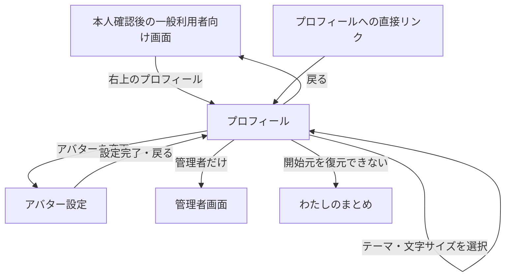
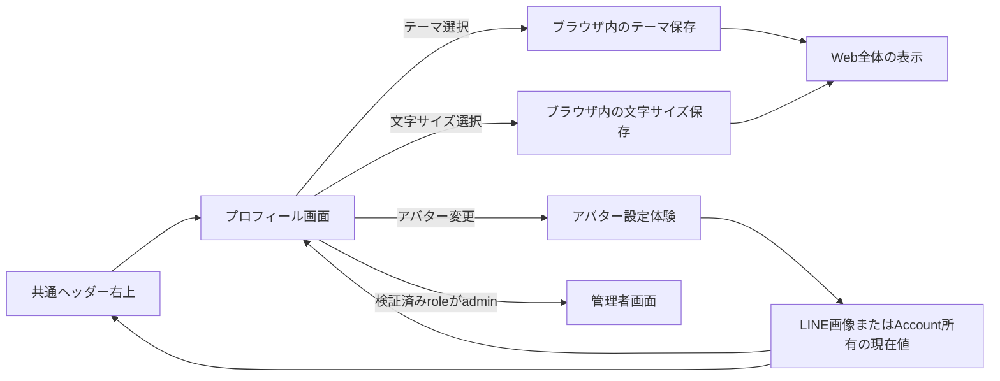

# プロフィール設定体験設計

## 1. この文書の目的

この文書は、本人がWebの共通ヘッダー右上から「プロフィール」を開き、アバターと表示設定を確認・変更する体験を定義します。プロフィールへの入口、画面構成、設定項目のまとまり、管理者画面への導線、ライト・ダークテーマと文字サイズの選択・保存、開始元へ戻る規則、画面状態、および完了条件を所有します。

アバター画像の現在表示、選択、プレビュー、設定、削除は[アバター設定体験設計](avatar-experience.md)、Web全体での画面接続は[全体画面遷移設計](screen-navigation.md)を正とします。

開発用データリセットのAPI、削除対象、維持対象、Vector削除の完了境界は[開発用AccountデータリセットAPI契約](../development/development-account-data-reset-api.md)を正とします。この文書は、画像処理の詳細、配色トークン、公開プロフィール、表示名の編集、Accountの認証情報、APIやデータベースの具体的なスキーマを所有しません。

## 2. 結論

- 本人確認後の一般利用者向けWebでは、共通ヘッダー右上にプロフィール操作を置く
- アバター設定済みなら現在のアバター、未設定ならLINEプロフィール画像を入口へ表示する。LINE画像もない場合だけ共通の人物プレースホルダーを使う
- 入口の支援技術向け名称は、画像の有無にかかわらず「プロフィールを開く」とする
- 画面タイトルは「プロフィール」とし、全員に「アバター」と「表示」の2セクションを置く
- 管理者には「管理」セクションを追加し、管理者画面へのリンクを置く。一般利用者にはセクションごと表示しない
- 開発環境ではプロフィールの一番下に、本人の個人コンテンツを初期状態へ戻す確認付きの`DEV ONLY`操作を置く
- アバター行には現在値と状態を表示し、「変更」から専用のアバター設定へ進む
- 表示テーマは「ライト」と「ダーク」の2択とし、選択時に画面全体へ即時反映する
- 文字サイズは「小」「中」「大」の3択とし、「中」を既定値として選択時に画面全体へ即時反映する
- テーマと文字サイズは同じブラウザへ保存する。初期提供ではAccountへ保存せず、端末間で同期しない
- プロフィールを閉じると開始元へ戻り、アバター変更モーダルを閉じると未確定の画像を破棄してプロフィールへ戻る

右上の小さな操作へアバター編集とテーマ切替を直接詰め込まず、一度プロフィール画面を開いて現在値と変更先を確認できる形にします。設定項目が今後増えても、主ナビゲーションへ新しい項目を追加せず同じ入口へまとめられます。

## 3. 提供範囲

初期提供に含めるものは次のとおりです。

- 共通ヘッダー右上のプロフィール操作
- 現在のアバター、LINEプロフィール画像、またはプレースホルダーの表示
- アバター設定画面への導線と、設定後の現在値更新
- ライトテーマとダークテーマの明示的な選択
- 小・中・大の文字サイズの明示的な選択
- 選択したテーマと文字サイズの即時反映と同じブラウザでの復元
- 開始元を保ったプロフィールの表示と終了
- 検証済みのAccount roleが`admin`の場合に限った管理者画面への導線
- 読み込み、画像未設定、画像設定済み、保存不能の状態表示
- 開発環境に限った本人データリセットの表示、確認、処理中、成功、失敗

表示名、自己紹介、公開範囲、ログアウト、本番のAccount削除は、所有する体験が未設計なので初期提供へ混ぜません。開発用データリセットはAccountを残す検証支援であり、本番のAccount削除として扱いません。「プロフィール」という名称だけを根拠に空の項目や操作不能な行を並べません。

## 4. 画面構成

### 4.1 共通ヘッダーの入口

```text
┌──────────────────────────────┐
│ 画面タイトル          (本人) │
│                       ↑      │
│              プロフィール入口│
├──────────────────────────────┤
│                              │
│ 各画面の内容                 │
│                              │
└──────────────────────────────┘
```

入口は本人確認後の一般利用者向けWebの共通ヘッダー右上へ置きます。アバターは円形に切り抜いて表示し、画像が取得できない場合も同じ大きさのプレースホルダーを残します。画像だけに操作の意味を持たせず、「プロフィールを開く」という名前を支援技術へ伝えます。

読み込み中に入口自体を消したり、アバターの有無で位置を移動したりしません。タップ領域は画像より広く取り、端末のセーフエリアと重ならない余白を確保します。

### 4.2 プロフィール画面

```text
┌──────────────────────────────┐
│ ‹ 戻る        プロフィール  │
├──────────────────────────────┤
│ アバター                     │
│ (現在の画像)            変更 ›│
│ LINEのプロフィール画像       │
├──────────────────────────────┤
│ 表示                         │
│ (●) ライト    ( ) ダーク     │
│ 文字サイズ  [小] [中] [大]   │
│ 選んだ表示はこの端末に保存   │
├──────────────────────────────┤
│ 管理（管理者だけに表示）     │
│ 管理者画面を開く           › │
└──────────────────────────────┘
```

アバターと表示テーマは異なる設定なので、同じカード内の連続した操作にせず見出しで分けます。各項目は現在値を確認できる状態にし、画面を開いただけでは変更しません。

## 5. 入口、遷移、戻る操作



- プロフィールを開いたときは開始元をブラウザ履歴として保ち、戻る操作で同じ画面へ戻す
- アバター設定から戻る場合はプロフィールへ戻し、その後にプロフィールの開始元へ戻れるようにする
- プロフィールを直接開いた場合や開始元を復元できない場合は「わたしのまとめ」を安全な戻り先にする
- 戻る操作でテーマ選択を取り消さない。選択した時点で確定済みとして扱う
- 戻る操作で文字サイズ選択を取り消さない。選択した時点で確定済みとして扱う
- アバター変更モーダルで画像を選択中に閉じた場合は未確定画像を破棄し、現在値を維持する
- 管理者画面へのリンクは、サーバーが検証済みの本人情報から解決したAccount roleが`admin`の場合だけ表示する
- roleを取得できない間や取得に失敗した場合はリンクを表示せず、一般利用者向けのプロフィール操作は継続できる

診断回答中やAI相談中もプロフィール入口の位置は変えません。ただし、プロフィールを開くことで未保存の入力が失われる実装にはせず、開始元の状態を保持できない場合は遷移前に説明します。

## 6. アバター設定

プロフィールのアバター行には、アプリで設定した画像、LINEプロフィール画像、またはプレースホルダーのうち、現在使われているものを表示します。画像の選択、プレビュー、設定、LINE画像へ戻す操作はプロフィール画面へ展開せず、[アバター設定体験設計](avatar-experience.md)が所有する変更モーダルで行います。

右上のプロフィール入口、プロフィール画面、変更モーダルでは同じ画像の優先順位を使い、画面ごとに異なる現在値を表示しません。

## 7. ライト・ダークテーマ

### 7.1 選択と反映

「表示」には「ライト」と「ダーク」を常に両方表示し、現在値を選択済みとして示します。現在と反対のテーマだけを示すトグルにはせず、変更後もどちらを選んだか確認できるラジオグループ相当の操作にします。

選択時は保存ボタンを要求せず、プロフィールを含むWeb全体へ即時反映します。再描画でスクロール位置、入力値、表示中の診断、AI相談の文脈を失わないようにし、色の変化だけを設定変更として扱います。

### 7.2 保存と初期値

- 選択したテーマはブラウザ内の保存領域へ保持する
- Reactの初回描画前に保存済みテーマを反映し、明るい画面または暗い画面が一瞬だけ表示されるちらつきを避ける
- 保存済みテーマがない場合の初期値はダークとする
- 初期提供ではOSの配色設定へ自動追従せず、「システム」は選択肢に含めない
- ブラウザの保存領域を利用できない場合も、そのページを開いている間は選択を維持し、保存できなかったことをエラー画面にはしない
- テーマは端末の見え方であり、Account所有データや公開プロフィールとしてサーバーへ送らない

同じブラウザでAccountが切り替わってもテーマは維持されます。一方、アバターはAccountごとに再取得し、以前のAccountの画像を表示しません。

## 8. 文字サイズ

「表示」には「小」「中」「大」をタブ状に常に並べ、現在値を選択済みとして示します。選択時は保存ボタンを要求せず、プロフィールを含むWeb全体の文字へ即時に反映します。余白、カード、アイコン、ボタンなどの操作領域は拡大縮小せず、文字サイズを変更してもボタンの寸法と位置を維持します。

- 既定値は「中」とし、従来の表示より全体を少しコンパクトにする
- 「大」は従来相当の表示、「小」は「中」よりさらにコンパクトな表示とする
- 選択した文字サイズはブラウザ内の保存領域へ保持し、Reactの初回描画前に反映する
- 保存領域を利用できない場合も、そのページを開いている間は選択を維持する
- 文字サイズはAccount所有データとしてサーバーへ送らず、端末間で同期しない

文字サイズを変えても表示中の画面、スクロール位置、入力値を失わないようにします。3択は色や文字の大きさだけで区別せず、「小」「中」「大」の文字と選択状態を支援技術へ伝えます。

## 9. 画面状態と回復

| 状態 | 表示と操作 |
| --- | --- |
| 読み込み中 | 右上の入口位置と各設定行の骨格を維持し、別Accountの現在値を残さない |
| アプリ画像未設定・LINE画像あり | 右上の入口と設定行にLINEプロフィール画像と「変更」を表示 |
| アプリ画像未設定・LINE画像なし | プレースホルダーと「設定する」を表示 |
| アバター設定済み | 現在の画像と「変更」 |
| アバター取得失敗 | プレースホルダーへ安全に退避し、再試行。壊れた画像を表示し続けない |
| テーマ保存済み | 現在のライトまたはダークを選択済みで表示 |
| テーマ保存不能 | 選択をページ内では反映し、次回復元できない可能性だけを短く伝える |
| 文字サイズ保存済み | 現在の小、中、大を選択済みで表示 |
| 文字サイズ保存不能 | 選択をページ内では反映し、次回復元できない可能性だけを短く伝える |
| 通信失敗 | テーマと文字サイズの変更は利用可能なままにし、アバターだけを再取得できるようにする |
| 管理者 | 「管理」と管理者画面へのリンクを表示 |
| 一般利用者・role取得不能 | 管理者向けのセクションとリンクを表示しない |

アバターの通信失敗でプロフィール画面全体を利用不能にしません。テーマと文字サイズはサーバー通信へ依存せず、画像の取得状態とは別に操作できます。

## 10. 責務境界とデータの流れ



- 共通ヘッダーはプロフィールへの入口と現在のアバター表示を担当する
- プロフィール画面は設定項目の一覧、現在値、各設定体験への接続を担当する
- テーマ機能はブラウザ内の選択、初回描画前の復元、Web全体への反映を担当する
- 文字サイズ機能はブラウザ内の選択、初回描画前の復元、Web全体への反映を担当する
- アバター機能はLINE画像を使う初期表示とAccount所有画像の変更を担当し、詳細はアバター設計へ閉じる
- Web UIはテーマと文字サイズをAccount設定とみなしてAPIへ送らず、アバターのAccount IDをクライアント指定しない
- 管理者導線の表示判定はクライアント申告のroleを使わず、サーバーがIDトークンを検証して解決したAccount roleを使う。管理者画面とAPIの認可境界は[管理者向け統計ダッシュボード設計](../architecture/admin-statistics-dashboard.md)を正とする

## 11. アクセシビリティとレスポンシブ表示

- 右上の入口は画像の代替テキストではなく、操作として「プロフィールを開く」と伝える
- プロフィール画面の戻る、アバター変更、テーマ選択、文字サイズ選択をキーボードとタッチの両方で操作できる
- テーマ選択は色、太陽・月のアイコンだけで示さず、「ライト」「ダーク」の文字と選択状態を併記する
- 文字サイズ選択は大きさだけで示さず、「小」「中」「大」の文字と選択状態を併記する
- ラジオグループ相当の名前を「表示テーマ」とし、現在値を支援技術へ伝える
- 文字サイズのラジオグループ相当の名前を「文字サイズ」とし、現在値を支援技術へ伝える
- ライト・ダークの両方で文字、境界、無効状態、フォーカス表示のコントラストを保つ
- テーマ変更時に不要な点滅や全画面アニメーションを行わず、`prefers-reduced-motion`を尊重する
- 狭い画面でも設定名と現在値を省略せず、テーマの2択は必要なら縦に並べる
- 管理者画面へのリンクは遷移先が分かる「管理者画面を開く」という名前を持つ

## 12. 完了条件

- 本人確認後の一般利用者向け画面で、右上の同じ位置からプロフィールを開ける
- アバター設定済みと未設定のどちらでも、入口の意味と操作領域が変わらない
- プロフィールで現在のアバターと表示テーマを確認できる
- 管理者のプロフィールだけに管理者画面へのリンクが表示され、一般利用者には表示されない
- プロフィールからアバター設定へ進み、設定または中断後にプロフィールへ戻れる
- アバター変更モーダルを閉じた場合は未確定画像を破棄し、現在値を維持できる
- ライトまたはダークを明示的に選び、Web全体へ即時反映できる
- 小、中、大を明示的に選び、Web全体の密度へ即時反映できる
- 同じブラウザで次回開いたとき、保存したテーマと文字サイズが初回描画前から復元される
- テーマと文字サイズをAccountへ保存せず、アバターは別Accountへ切り替わったときに混ざらない
- プロフィールを閉じると開始元へ戻り、直接リンクでは「わたしのまとめ」へ退避できる
- アバター取得失敗時もテーマを変更でき、テーマ保存不能時もアバターを変更できる
- マウス、タッチ、キーボード、支援技術で入口と主要設定を操作できる
- 開発環境ではプロフィールの最下部から本人データリセットを確認付きで実行でき、本番では操作もAPIも利用できない

## 13. この設計で決めないこと

- 表示名、自己紹介、公開範囲、相手に見せるプロフィールの編集
- ログアウト、本番のAccount削除、データエクスポート、MCP接続管理
- ライト・ダーク以外のテーマ、配色のカスタマイズ、OS設定への自動追従
- Accountへのテーマ保存と端末間同期
- 具体的なURL、ルーター、ブラウザ履歴、コンポーネント名
- 配色トークン、余白、画像サイズの具体値
- API、AccountData、ブラウザ保存キーの具体的な形

これらを追加する場合も、「プロフィール」という名称だけで未設計のAccount設定や公開情報を同じ画面へ混ぜず、所有する体験を先に設計します。
