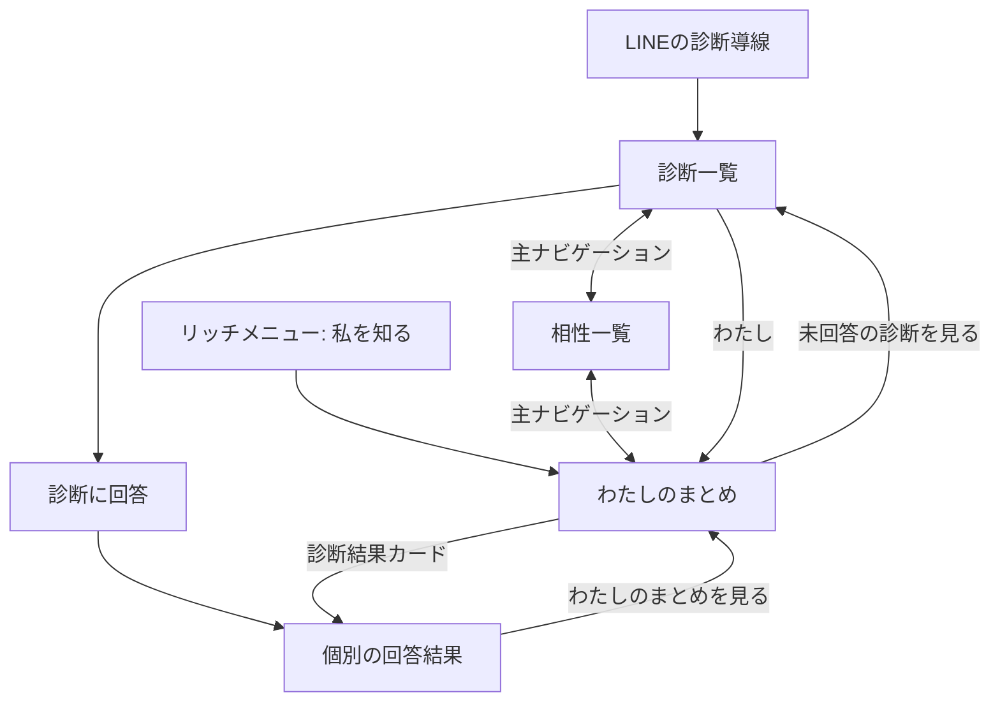
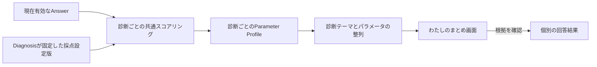
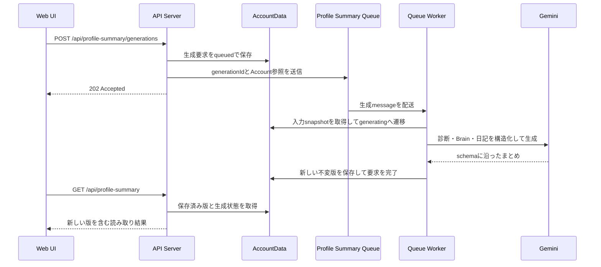

# わたしのまとめ仕様

## 1. 基本仕様

画面名は「わたしのまとめ」とします。診断と日記を含む本人の記録から非同期にAI生成したまとめを、不変な版として保存して表示します。

- 診断と日記を横断した短い「今のわたし」
- 最新版と過去版、その生成日時と生成方法
- 診断・日記・生成形式の変更による再生成理由、7日間の待機条件、生成状態
- 完了済み診断から個別の回答結果へ進む小さなカード
- 版の生成に使った診断・日記の件数と、次の生成に利用できる現在件数
- 各診断テーマから個別の回答結果と回答内容へ進む根拠導線
- 回答を増やす導線
- 本人が確認したセルフケア情報と、AIへ相談する導線
- 最新版のinsightに対する本人自身の見え方

AIは入力となった記録の範囲だけを要約します。人物を1つの性格タイプへ分類せず、人物の能力、善悪、健康状態、将来の行動、医療・心理学的な判断を生成しません。生成本文はBrain Itemとして保存せず、生成時点の入力snapshotと結び付いた「わたしのまとめ」の版として保存します。診断の詳しいパラメータは個別の回答結果で、現在有効な回答と採点設定版から決定的に再構成します。

AIが診断とチャットから生成した見え方と、本人が自分についてどう感じるかは別のデータとして保持します。本人の評価で生成済み版を変更したり、元の見え方を否定・削除したりしません。相性共有などで他者が入力した評価はこの仕組みに含めません。

### 1.1 画面上の表現

画面上では次を表示します。

- 表示は、me-builderへ記録した範囲から見える現在の傾向である
- 軸のどちら側にも良し悪しはない
- 回答していないテーマについては分からない
- 回答や日記の追加後は再生成理由が表示され、新しい版を作るとまとめが変わり得る。V2で修正・削除を提供した後も同じ扱いとする
- 保存済みの過去版は、その後に記録が変わっても生成時点の内容を保つ
- 医療的・心理学的な診断ではない

「あなたは○○な人です」のような断定表現は使わず、「○○を重視しやすい傾向があります」のように回答範囲と変化可能性を残します。

## 2. 画面構成

```text
┌──────────────────────────────┐
│ わたしのまとめ               │
│ 診断と記録から見える今の姿   │
├──────────────────────────────┤
│  ┌────────────────────────┐  │
│  │ 今のわたし             │  │
│  │ 第3版 8/9              │  │
│  │ ・傾向…                │  │
│  └────────────────────────┘  │
│       過去のまとめがあります │
│  [    最新のわたしを知る    ] │
├──────────────────────────────┤
│ 診断結果                     │
│ [時間と予定                  >]│
│  20 / 20問・4項目の結果        │
│ [余暇の過ごし方              >]│
│  16 / 16問・4項目の結果        │
├──────────────────────────────┤
│ もっと自分を知る             │
│ [未回答の診断を見る]         │
├──────────────────────────────┤
│ わたしのセルフケア           │
│ 負荷の手がかり・早めのサイン │
│ [詳しく見る]  [AIに聞く]     │
├──────────────────────────────┤
│ 診断                     わたし│
└──────────────────────────────┘
```

### 2.1 ヘッダー

上部ラベルを「私を知る」、見出しを「わたしのまとめ」、補足を「これまでの診断と記録から見える、今のあなたです」とします。版選択と生成情報を独立したパネルとしてヘッダーへ置かず、「今のわたし」カードへ統合します。医療的な診断や固定された性格ではないことを示す短い注意書きを、サマリーカードの直後に表示します。

共通ヘッダー右上にはプロフィール入口を表示します。アバターと表示テーマの変更は[プロフィール設定体験設計](profile-settings-experience.md)、アバター画像の選択と設定は[アバター設定体験設計](avatar-experience.md)を正とし、この画面内へ変更操作を重複して置きません。

### 2.2 最新版と過去版の切り替え

通常は最新版の「今のわたし」カードを1枚だけ表示し、履歴があっても背面へカードを常時重ねません。カード上部には最新版で「最新のまとめ」、過去版で「過去のまとめ」と表示し、切り替え前後で同じ高さを確保します。過去版の存在はカード下の控えめな「過去のまとめがあります」ボタンで伝え、押すと最新版が左へ抜けて1つ前の版を表示します。過去版では上部に「最新のまとめへ」も常時表示し、現在の状態と戻り方を同時に伝えます。全体の版数や現在位置は強調せず、過去の詳細な探索を画面の主目的にしません。

スワイプは補助操作として残します。最新版を左へスワイプすると1つ前の版へ、過去版を右へスワイプすると1つ新しい版へ移動します。古い版へ移動するときだけ切り替え先を背面に置き、新しい版へ戻るときは左端から手前へ入れます。右へ動かしたカードの背面から新しい版が現れる表現は使いません。アニメーション完了後に別の外観へ置き換えず、カードの横位置や高さを切り替えの前後で連続させ、カード下の内容が急に移動するレイアウトシフトを発生させません。

スワイプだけに依存せず、「過去のまとめがあります」と「最新のまとめへ」を名前付きボタンとして提供し、キーボードと支援技術からも主要な切り替えを行えるようにします。過去版では再生成操作を出しません。

### 2.3 新しい版の生成

最新版で再生成可能なときは、カード下に幅いっぱいの主ボタン「最新のわたしを知る」を表示します。右スワイプは過去版から新しい版へ戻る操作だけに使い、最新版では再生成を開始しません。ボタンを押すと生成を要求し、最新版と同じ位置へ「新しい版を作成中」カードを表示します。診断、日記・記録、必要な生成形式のうち該当する変更理由を、生成カード内に短く表示します。変更があっても前回の生成から7日間は再生成操作を表示しません。

「新しい版を作成中」カードは、再生成ボタンを押したカードの幅と高さを引き継ぎます。生成状態へ切り替わる際にカード下の説明や導線を上下させません。

主ボタンには表示文言と同じ「最新のわたしを知る」という名前を付け、キーボードと支援技術からも実行できるようにします。動きを減らす設定でも操作結果を即座に反映します。

生成要求・生成中は、最後に成功した版を残して「新しい版を作成中」と伝えます。失敗時も現在の版を消さず、失敗理由と再試行可能な状態を表示します。

画面が生成状態の確認を続けても完了または失敗を確認できない場合は、確認に時間がかかっていることを通知し、利用者が最新状態を再取得できる導線を表示します。この通知のために生成状態を失敗へ変更しません。

版、再生成可否、再生成理由、非同期生成状態はAPIの応答だけを正とします。画面は存在しない履歴や再生成状態を補いません。環境による例外を設けず、初回生成後は入力または形式の変更と7日経過の両方を満たす場合だけ再生成できます。

### 2.4 「今のわたし」カード

AIが診断と日記の根拠から生成した、互いに重複しないinsightを最大3件表示します。各insightには根拠の種別と件数を表示します。このカードだけで本人の記録すべてを説明できるとは扱いません。診断由来の詳しいパラメータは次の「診断結果」カードから個別の回答結果で確認できるようにします。

カードの末尾には、その版が参照した診断数、日記数、最終入力日時を表示します。これらは統計的な信頼度として見せず、「どの範囲をまとめたか」を示す情報として扱います。

最新版の各insightでは、本人が「自分ではそう感じない」と評価できます。評価は生成済み版を変更せず、対象insight、生成時点の外部視点、本人自身の評価を分けて保存します。次の版を生成するときは有効な本人評価を入力へ含め、両方の見え方を回答へ出すかどうかと表現は、現在の診断・チャット入力との関連を踏まえてAIが判断します。評価操作そのものをBrain Itemへ変換せず、Brain Itemの直接確認・訂正画面は後続とします。

カード下には「まとめに使えるもの」として、現在利用できる診断と日記の件数を表示します。ここは表示中の版が実際に参照した件数ではなく、次の版を生成するときに利用できる現時点のデータ量を示します。表示中の版が過去版であっても、その版の参照件数と混同せず現在値を表示します。

### 2.5 「診断結果」

完了済み診断を、ホームの回答済み一覧と同じく最終回答日時の降順で、小さなカードとして並べます。各カードには診断名、回答数、確認できる結果の項目数を表示します。採点設定がない場合は、回答内容を確認できることを表示します。詳しいパラメータはこの画面へ重複して表示しません。

カード全体を個別の回答結果へのリンクにし、診断名と遷移先が分かる名前を支援技術へ伝えます。遷移先では、すべてのパラメータと、どの質問と選択肢が根拠になったかを確認できます。回答の修正・削除はV2で追加します。

### 2.6 次の回答への導線

未回答または回答途中の診断がある場合だけ、「もっと自分を知る」から診断一覧へ移動できるようにします。回答を増やすことをサマリー閲覧の条件にはせず、回答を促すために結果を隠しません。

### 2.7 「わたしのセルフケア」とAI相談

本人が確認した「負荷がかかりやすい場面」「早めのサイン」「合いやすかった対処」を短く表示し、「詳しく見る」と「AIに聞く」を置きます。診断結果だけからストレスの原因や対処法を確定しません。表示内容、AIの返答、安全上の切り替えは[ストレスの手がかりとAIセルフケア相談体験設計](self-care-ai-consultation-experience.md)を正とします。

### 2.8 開発環境のBrain Item確認

`development`、`local`、`preview`、`test`では、生成処理を確認するため、プロフィールの`DEV ONLY`導線から開く独立した画面に本人のactive Brain Item一覧を表示します。「わたしのまとめ」には一覧も開発用導線も表示しません。LINE内のLIFFと外部ブラウザで表示条件を変えません。statement、分類、AIまたは決定的な導出、作成日時、EvidenceのSource Record IDを表示し、0件も「追加されたBrain Itemはありません」と明示します。チェックポイントの処理状態はBrain Itemの状態ではないため、`pending` Itemとしては表示しません。

この一覧は画面を開いたときに、本人確認済みAccountのデータだけを専用の開発APIから読み、最大100件を新しい順に表示します。戻る操作でプロフィールへ復帰します。Productionでは導線と一覧UIを構築せず、APIも404を返します。否定・修正などの操作は表示しません。

## 3. 診断結果カード

「今のわたし」のAI生成規則は[§6.2](#62-ai生成と版の永続化)を適用します。

### 3.1 対象

本人の現在有効な回答による、回答済みのDiagnosisResponseを表示対象にします。採点設定の有無は、カードを表示する条件にしません。

対象となる診断はカードとして表示し、採点設定から確認できる結果の項目数だけを案内します。中央帯や回答不足を含む各パラメータの値と方向はカード上で要約せず、個別の回答結果で表示します。採点設定がない診断もカードを表示し、回答内容を確認できるようにします。

### 3.2 表示順

診断カードは最終回答日時の降順に並べます。同じ日時の場合はDiagnosisの表示順、Diagnosis IDの順で決め、再読み込みで表示が変わらないようにします。

### 3.3 表示

カードには診断名、回答数、確認できる結果の項目数または回答内容を確認できる旨を表示し、結果そのものを独自に要約しません。カード全体を個別の回答結果へのリンクにし、AI生成した「今のわたし」のinsightと診断結果を同じ根拠表現として混ぜません。

## 4. 導線と遷移

診断を探す場所、相性を見る場所、自分について確認する場所を分け、Webの主ナビゲーションに左から「わたし」「診断」「相性」の3項目を置きます。LINEのリッチメニューからも「私を知る」でこの画面へ直接入り、「診断を行う」と診断通知は診断側へ遷移します。リッチメニューの項目定義は[Phase 1 診断体験設計 §7](../diagnosis/diagnosis-experience.md#7-リッチメニュー)、相性側の導線は[相性診断・うつし共有体験設計](compatibility-experience.md)を正とします。



個別診断の完了直後は「一覧へ」と「わたしのまとめを見る」を表示し、自動遷移は行いません。

端末の戻る操作では、サマリーから個別結果を開いた場合はサマリーへ、診断一覧から開いた場合は診断一覧へ戻します。URLで各画面を識別し、再読み込みしても同じ画面へ復帰できるようにします。

## 5. 画面状態

| 状態 | 表示と操作 |
| --- | --- |
| 読み込み中 | サマリーと診断結果カードの骨格を表示し、完了まで以前の別ユーザーの内容を残さない |
| まとめ版あり | 「今のわたし」と、取得できた診断結果カードを表示する |
| 過去版を表示中 | カード上部に「過去のまとめ」と「最新のまとめへ」を表示し、右スワイプでは新しい版を左端から手前へ入れる |
| 再生成可能 | 最新版のカード下に「最新のわたしを知る」を主ボタンとして表示する |
| 再生成要求・生成中 | 最新版と同じ位置・寸法で「新しい版を作成中」カードを表示し、レイアウトシフトを発生させない |
| 再生成失敗 | 最後の完了版を表示したまま失敗を説明し、再試行可能な状態を表示する |
| まとめ版なし・生成可能 | 「まだ、わたしのまとめはありません」と「最初のまとめを作る」を表示する |
| まとめ版なし・生成入力なし | 「まだ、わたしのまとめはありません」と説明し、診断または日記へ案内する |
| 完了済み診断がない | 診断結果カードを表示しない。日記由来のまとめ版は表示できる |
| 完了済み診断はあるが採点設定がない | カードから個別の回答内容へ案内する |
| 回答不足のパラメータがある | カードでは数値や方向を要約せず、個別の回答結果で説明する |
| 通信失敗 | 本人の内容を部分的に確定表示せず、再試行と診断一覧への導線を表示する |
| 回答の修正・削除後（V2） | 診断テーマは現在有効な回答から再計算する。保存済みのまとめ版は変更せず、現在件数と再生成理由を更新する |
| 受付終了・公開停止 | 既に回答済みなら個別結果とサマリーへ含める。新しい回答への導線は出さない |

一部の診断結果だけ取得できた場合は、取得単位全体をエラーとして再試行させます。

## 6. データの流れと責務境界



- Diagnosis domainは現在有効なAnswerを守る
- 共通スコアリングは診断ごとのParameter Profileを再現する
- 診断テーマ用の読み取り処理は複数診断の結果を並べ、表示する傾向を決定的に選ぶ
- Web UIは返された診断結果と保存済みのまとめ版を表示し、独自に採点設定や重みを保持しない
- 診断テーマごとの決定的な集計結果は保存せず、AI生成した「今のわたし」の本文だけを生成時点の不変な版として保存する
- Brain Itemの生成と本人確認はこの画面の対象外とする

### 6.1 保存済み版の取得API

`GET /api/profile-summary`は、本人の保存済み版を新しい順で返します。各版には版ID、版番号、生成日時、最新版かどうか、生成方法、その版から変更されないサマリー本文を含めます。画面は版を選んだときに、その版へ含まれる本文を表示し、別の版の本文を流用しません。

同じレスポンスで、次の生成に利用できる現在の診断・日記件数と、現在の生成状態を返します。現在件数は過去版が参照した件数から導出せず、保存済み版の本文とは分けて扱います。再生成理由と再生成可否はAccountDataが現在の入力と最新版の入力snapshotを比較して計算します。

保存済み版はAccountDataから読み取ります。HTTP契約とWebの版切り替えは保存先の具体的なテーブル構造を知らず、取得した各版の本文と生成状態だけを扱います。

### 6.2 AI生成と版の永続化

本人が生成を要求すると、`POST /api/profile-summary/generations`は本人確認済みのAccountへ生成要求を1件作成し、本文を含まない参照だけをQueueへ送ります。同じAccountに処理中の要求がある場合は新しい要求を重ねず、その要求を返します。APIはAI生成の完了を待ちません。



生成入力には、現在有効な診断由来のBrain Item、現在有効なその他のBrain Item、日記として保存したuser message本文を含めます。日記本文はMemoryへ変換済みかどうかを条件にせず、Memoryに含まれなかった出来事や表現もまとめの根拠候補にします。本文をQueue message、APIレスポンス、運用ログへ含めません。

同じ生成要求から、本人向けまとめとは別に相性共有専用のprojectionを生成できます。本人向けの`headline`や`insights`をそのまま外部へ公開せず、共有専用projectionの内容、本人による事前確認、無効化条件は[相性診断・うつし共有体験設計](compatibility-experience.md)を正とします。

AIは入力ごとの内部IDを根拠として返し、Workerは提示したIDだけで構成されていることを検証します。画面へ保存する根拠は診断・日記の種別と件数へ丸め、日記本文やBrain Item本文を版へ複製しません。モデル出力がschemaに適合しない場合と、本人向けの`headline`・`insights`が検証を通らない場合は版を保存しません。

共有専用projectionの文章は1件ずつ検査し、規則を満たさない文章だけを共有せずに落とします。本人向けの生成結果が有効であれば、落とした文章があっても版は保存し、その版で共有できる文章が残らなかった場合は[§6.3](#63-再生成判定)の`format`として次の生成へ回します。共有できる文章の有無を本人向けまとめの保存条件にしません。

生成に失敗した場合は、設定不足、入力不在、モデル応答の不備を区別できる結果コードを運用ログへ残します。応答が得られても共有専用文章を落とした生成は、版を保存した縮退成功として記録します。ログへ残す情報は[アプリケーション運用ログ方針](../development/operational-logging.md)に従い、生成本文や落ちた文章そのものを含めません。

版はAccountDataのprivate SQLiteへAccountごとの連番で追記し、保存後に本文を変更しません。再試行で同じ生成要求が配送されても同じ要求から複数版を作らないよう、生成要求と版を一意に対応させます。Queueの最終試行まで失敗した要求は`failed`とし、完了済みの過去版は残します。

`GET /api/profile-summary`はAccountDataから保存済み版と最新の生成状態を読みます。

### 6.3 再生成判定

初回版がない場合は、生成に利用できる診断または日記由来の入力が1件以上あれば生成できます。版がある場合は、最新版の生成から7日以上経過し、かつ最新版の生成時にAIへ渡した入力snapshotから現在の入力または必要な生成形式が変わった場合に再生成できます。入力・形式の変化は次の理由で表示します。

- 診断由来の現在有効な入力件数が増えた、または最新入力日時が新しくなった場合は`diagnosis`
- 日記本文または日記由来の現在有効なBrain Itemの入力件数が増えた、または最新入力日時が新しくなった場合は`brain`
- 最新版が現在必要な生成形式を満たさない、または生成済みの補助出力が根拠削除や共有できる文章の不在により利用できない場合は`format`
- 最新版の生成から7日以上経過したことは再生成の共通条件とし、単独の再生成理由にはしない

入力snapshotはAI生成の完了時刻ではなく、AccountDataが生成contextの先頭で確定した時点の件数と最新入力日時を版へ保存します。AIへ渡す根拠もこのsnapshotの最終入力日時までに限定し、生成中に追加された入力を次の再生成理由として検出できるようにします。本文や入力IDは判定用snapshotへ複製しません。

入力snapshot列を持たない既存版の移行時は、旧版本文の診断・日記件数に加え、旧版の最終入力日時までに作られた現在有効な非診断Brain Item件数を補完します。移行しただけで使用済みのBrain Itemを新しい情報と誤判定せず、移行後に追加された情報は再生成理由として検出します。

処理中の生成要求がある間は理由があっても再生成できません。`POST /api/profile-summary/generations`も同じ判定を使い、画面を経由しない要求で理由のない版を増やしません。失敗した要求は版を作らないため、最後の成功版との比較結果を維持して再試行できます。

環境による再生成条件の例外は設けません。`development`、`local`、`preview`、`test`を含む全環境で、初回生成後は入力または形式の変更と7日経過の両方を求め、処理中の要求がある間は新しい要求を作りません。

## 7. プライバシー、表現、アクセシビリティ

- 本人確認済みのAccountの回答だけを対象にし、クライアント指定のAccount IDを信頼しない
- 「わたしの傾向」画面にはサマリーそのものを共有・公開する操作を置かない。相性共有は専用projectionだけを別の同意画面から扱う
- URL、ログ、画面分析イベントへ回答内容、Parameter Profile、本人識別子を含めない
- 診断結果カードは診断名と遷移先が分かるリンク名を持ち、カード全体にフォーカス表示を出す
- 主ナビゲーションは現在位置を支援技術へ伝え、キーボードとタップの両方で操作できる
- ライト・ダークの両テーマで文字、境界、フォーカス表示のコントラストを保つ

## 8. 受け入れ条件

- 診断または日記の記録がある本人について、記録を横断したAI生成のまとめを表示できる
- 同じ回答では、診断結果カードの表示順が再読み込みで変わらない
- 最新版と過去版を名前付きボタンと補助的なスワイプ操作で切り替えられる
- 診断、日記・記録、必要な生成形式による再生成理由を区別し、前回生成から7日間の待機条件を適用できる
- 生成中と失敗時にも最後の完了版を閲覧できるUIがある
- 診断と日記本文を含む生成入力からAIがまとめを生成し、不変な版として保存できる
- 版、現在件数、再生成可否、再生成理由、生成状態をAccountDataから取得できる
- 各診断結果カード全体から個別診断の回答結果と回答内容を確認できる
- 採点設定なし、回答不足、完了済み診断なし、通信失敗を区別できる
- サマリーから、回答可能な未回答・回答途中の診断へ移動できる
- 画面上に、回答範囲から見える傾向であり医療的な診断ではないことを表示する
- 本人以外の回答、別Accountのキャッシュ、クライアント指定のAccount IDを利用しない
- サマリーの共有・公開や、サマリー本文自体のBrain Item化を実装範囲へ混ぜない

## 9. 対象外

- Source RecordからBrain Itemを導出し、本人が確認・却下する流れ
- Brain ItemのConfidence算出と提示
- 複数の傾向を性格タイプや総合スコアへ変換する方法
- 他ユーザーとの比較と相性（[相性診断・うつし共有体験設計](compatibility-experience.md)を正とする）、ランキング
- サマリーの外部共有、公開範囲、MCPでの提供形式
