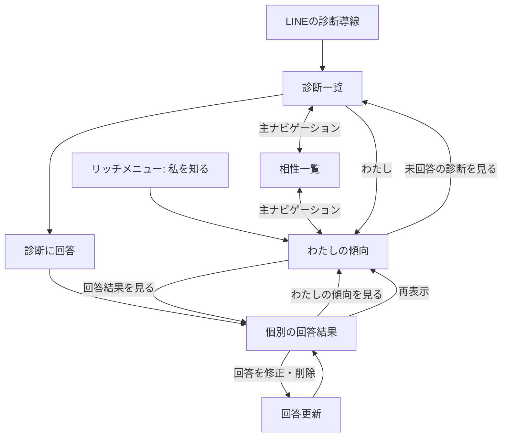
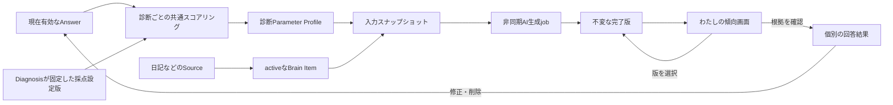

# 自分の傾向サマリー体験設計

## 1. この文書の目的

この文書は、本人がこれまでの診断回答とBrainに蓄積された情報から「今の自分にどのような傾向や出来事があるか」を確認する画面の体験を定義します。画面の呼称、表示内容、版の切り替え、再生成の条件と操作、導線、状態、注意書き、根拠確認と回答修正への遷移を所有します。

個別診断の回答と画面は[Phase 1 診断体験設計](../diagnosis/diagnosis-experience.md)、回答からパラメータを計算する方法と版管理は[診断回答のパラメータ変換設計](../diagnosis/scoring/parameter-scoring-design.md)、共通ヘッダー右上のプロフィール入口と表示テーマは[プロフィール設定体験設計](profile-settings-experience.md)、アバターの表示・設定は[アバター設定体験設計](avatar-experience.md)、ストレスの手がかりとAI相談は[ストレスの手がかりとAIセルフケア相談体験設計](self-care-ai-consultation-experience.md)、Source RecordとBrainの責務境界は[ドメイン設計](../domain/domain-design.md)を正とします。

この文書は、診断固有のパラメータ、Brain Itemの導出・永続化、AIプロンプトとモデル、Confidenceの算出、APIやデータベースの具体的なスキーマを所有しません。

## 2. 結論

画面名は「わたしの傾向」とします。「診断結果」や「性格分析」では、単一の診断結果との区別がつかず、回答から人物全体を断定した印象を与えるためです。

完了済み診断の版付き採点結果と、日記を含む入力から生成済みのactiveなBrain Itemを入力として、AIが非同期に版付きサマリーを生成します。画面は最新の完了版を既定で表示し、過去の完了版へ切り替えられるようにします。

- 複数の診断と複数分類のBrain Itemを横断した短い「今のわたし」
- 診断テーマごとの全パラメータ
- 日記から抽出された最近の出来事や、Memory以外を含む参照情報
- 要約に使った診断数、診断回答数、Brain Item数、最終記録日時
- サマリーの版、生成日時、過去版への切り替え
- 新しい診断、新しい日記由来情報、一定期間の経過による再生成
- 各傾向から個別の回答結果と回答内容へ進む根拠導線
- 回答を増やす、または既存回答を修正する導線
- 本人が確認したセルフケア情報と、AIへ相談する導線

サマリー生成は画面取得とは分離した非同期AI処理とし、生成中も最後に成功した版を閲覧できます。完了した版は後から入力が増えても書き換えず、生成時に参照した入力範囲とともに保持します。診断の数値・帯域や個別Brain Itemは根拠表示のため構造化データとして残し、AIの文章だけで置き換えません。AIが作った文章であること、人物や健康状態を断定しないことを画面で明示します。

## 3. 利用者へ伝える価値と限界

この画面は「これまでの回答を探し直さなくても、自分の傾向を一か所で振り返れる」ことを価値とします。人物の能力、善悪、健康状態、将来の行動を判定するものではありません。

画面上では次を一貫して伝えます。

- 表示は、選択した版が参照した診断と記録の範囲から見える傾向である
- 軸のどちら側にも良し悪しはない
- 回答していないテーマについては分からない
- 回答の修正・削除は次の版へ反映され、過去版は書き換わらない
- 医療的・心理学的な診断ではない

「あなたは○○な人です」のような断定表現は使わず、「○○を重視しやすい傾向があります」のように回答範囲と変化可能性を残します。

## 4. 画面構成

```text
┌──────────────────────────────┐
│ わたしの傾向       [第3版 ▼] │
│ 診断と記録から見える今の姿   │
│ AI生成 8/9  [まとめを更新]   │
├──────────────────────────────┤
│ 今のわたし                   │
│ ・前もって決めたい傾向       │
│ ・新しい体験を好む傾向       │
│ ・相談・情報共有を重視する傾向│
│                              │
│ 4診断・40回答から作成        │
│ 最終回答 2026/08/08          │
├──────────────────────────────┤
│ テーマごとの傾向             │
│ [時間と予定]                 │
│ 事前計画        ●──────      │
│ 予定変更        ───●───      │
│             回答結果を見る > │
│                              │
│ [余暇の過ごし方]             │
│ ...                          │
├──────────────────────────────┤
│ もっと自分を知る             │
│ [未回答の診断を見る]         │
├──────────────────────────────┤
│ わたしのセルフケア           │
│ 負荷の手がかり・早めのサイン │
│ [詳しく見る]  [AIに聞く]     │
├──────────────────────────────┤
│ 診断                     わたし│
└──────────────────────────────┘
```

### 4.1 ヘッダーと版の切り替え

見出しを「わたしの傾向」とし、右上に表示中の版を選ぶコントロールを置きます。既定は最新の完了版です。選択肢には版番号と生成日を表示し、過去版を選んだときは「過去の版を表示中」と明示します。生成中、失敗、取り消された要求は版の選択肢へ含めません。

版の切り替えはページ全体の表示対象を変更します。「今のわたし」だけを過去へ戻し、テーマや入力件数だけを最新版のまま残すことはしません。

補足は「これまでの診断と記録から見える、今のあなたです」とします。初見でAIによる要約であること、医療的な診断や固定された性格ではないことを理解できる短い注意書きを、サマリーカードの前に表示します。

共通ヘッダー右上にはプロフィール入口を表示します。アバターと表示テーマの変更は[プロフィール設定体験設計](profile-settings-experience.md)、画像の生成状態と候補の扱いは[アバター設定体験設計](avatar-experience.md)を正とし、この画面内へ変更操作を重複して置きません。

### 4.2 再生成

最新版を表示しているときは、版情報の近くに「まとめを更新」ボタンを置きます。再生成できる理由は次の3種類とし、該当する理由をボタンの近くへ表示します。

- 前回版より後に完了または更新された診断がある
- 前回版より後に、日記由来を含む対象Brain Itemが追加・改訂された
- 最新版の生成からサーバーが定める更新間隔を経過した

再生成の要求後は、最新の完了版を消さず「新しい版を作成中」と表示します。完了したら新しい版を最新版として選択し、失敗したら現在の版を残したまま再試行できるようにします。過去版を表示中は誤って古い入力から生成する印象を与えないよう、再生成操作を無効にして最新版へ戻る案内を出します。

### 4.3 「今のわたし」カード

方向性が明確な傾向を最大3件表示します。一読できる量に絞り、選ばれなかった傾向も次の「テーマごとの傾向」で確認できるようにします。

カードの末尾には、選択した版が参照した完了済み診断数、診断回答数、対象Brain Item数、参照した記録のうち最も新しい日時を表示します。これらは統計的な信頼度として見せず、「どの範囲をまとめたか」を示す情報として扱います。

### 4.4 「テーマごとの傾向」

完了済み診断を、ホームの回答済み一覧と同じく最終回答日時の降順で並べます。各テーマでは、個別診断の回答結果と同じパラメータ名、両端のラベル、位置、回答充足度を表示します。

テーマカード全体を個別の回答結果への導線にせず、「回答結果を見る」という名前付き操作を置きます。遷移先では、どの質問と選択肢が根拠になったかを確認し、回答を修正または削除できます。

### 4.5 「日記からの記録と参照情報」

日記由来`Memory`は、本人の発言に含まれる出来事として独立した欄に表示します。AIサマリーはMemoryだけに限定せず、利用可能なPreference、Trait、Goal、ConstraintなどのactiveなBrain Itemも入力にできます。分類の意味と利用条件は[Brain内部情報の分類](../domain/brain/brain-content-taxonomy.md)を正とし、画面ではAI文章と根拠情報を区別します。

日記Memoryがなくても診断サマリーは表示し、診断結果がなくても日記Memoryがあればこの画面を空状態にしません。

### 4.6 次の回答への導線

未回答または回答途中の診断がある場合だけ、「もっと自分を知る」から診断一覧へ移動できるようにします。回答を増やすことをサマリー閲覧の条件にはせず、回答を促すために結果を隠しません。

### 4.7 「わたしのセルフケア」とAI相談

本人が確認した「負荷がかかりやすい場面」「早めのサイン」「合いやすかった対処」を短く表示し、「詳しく見る」と「AIに聞く」を置きます。診断結果だけからストレスの原因や対処法を確定しません。表示内容、AIの返答、安全上の切り替えは[ストレスの手がかりとAIセルフケア相談体験設計](self-care-ai-consultation-experience.md)を正とします。

## 5. 版付きAIサマリー

### 5.1 版の単位

成功した生成ごとに、Account内で単調増加する版番号を持つ完了版を1件作ります。完了版は生成後に書き換えず、次をひとまとまりとして保持します。

- AIが生成した見出しと短い要点
- 生成時に表示する診断テーマ、日記Memory、その他の参照情報
- 参照した診断回答revisionとBrain Itemの範囲を識別する入力スナップショット
- prompt version、model、生成開始日時、完了日時

入力スナップショットは、過去版の文章と根拠表示を同じ時点へ戻すために使います。最新版のBrain Itemを過去版の根拠として混ぜません。

### 5.2 AIへ渡す対象

対象は、認証済みAccountが所有する現在有効な完了済み診断と、用途上サマリーへ利用できるactiveなBrain Itemです。Brain Itemは`Memory`に限定せず、分類、Derivation、Evidence、Access Label、削除・撤回状態を検証してから入力へ含めます。AIへ本文を渡す具体的な上限、優先順、prompt schemaは後続の実装設計で定めます。

AIは根拠にない属性、診断名、健康状態を補いません。診断のスコアとBrain Itemのstatementを区別できる構造化入力を受け取り、出力した要点がどの入力を参照したかをアプリケーション側で検証できる形式を使います。

### 5.3 再生成の判定

最新完了版の入力スナップショットと現在の入力を比較し、次のいずれかを満たすと再生成可能にします。

1. 新しい診断が完了した、または使用済み診断の回答revisionが進んだ
2. 対象Brain Itemが追加、改訂、無効化された
3. 最新版の生成から、サーバーが定める更新間隔を経過した

同じ入力スナップショットと更新間隔で複数回要求しても生成jobを重複させません。再生成中にさらに入力が増えた場合、実行中jobの入力範囲は変えず、完了後に改めて再生成可能と判定します。

### 5.4 失敗と可用性

生成要求、生成中、失敗は完了版と分けて扱います。生成が遅い、または失敗しても、最後に成功した版と過去版の閲覧を止めません。初回生成だけは完了版がないため専用の待機状態を表示します。

## 6. 導線と遷移

診断を探す場所、相性を見る場所、自分について確認する場所を分け、Webの主ナビゲーションに左から「わたし」「診断」「相性」の3項目を置きます。LINEのリッチメニューからも「私を知る」でこの画面へ直接入り、「診断を行う」と診断通知は診断側へ遷移します。リッチメニューの項目定義は[Phase 1 診断体験設計 §7](../diagnosis/diagnosis-experience.md#7-リッチメニュー)、相性側の導線は[相性診断・うつし共有体験設計](compatibility-experience.md)を正とします。



個別診断の完了直後は、従来の「一覧へ」に加えて「わたしの傾向を見る」を表示します。ただし、完了直後に自動遷移はさせず、今回の結果を確認する操作を奪いません。

端末の戻る操作では、サマリーから個別結果を開いた場合はサマリーへ、診断一覧から開いた場合は診断一覧へ戻します。URLで各画面を識別し、再読み込みしても同じ画面へ復帰できるようにします。

## 7. 画面状態

| 状態 | 表示と操作 |
| --- | --- |
| 読み込み中 | サマリーとテーマカードの骨格を表示し、完了まで以前の別ユーザーの内容を残さない |
| 有効な傾向あり | 「今のわたし」とテーマごとの全結果を表示する |
| 過去版を表示中 | 版番号と生成日を明示し、再生成操作を無効にして最新版へ戻る導線を表示する |
| 再生成可能 | 診断、Brain Item、時間経過のうち該当する理由と「まとめを更新」を表示する |
| 再生成要求・生成中 | 最後の完了版を表示したまま、新しい版を作成中であることを表示する |
| 再生成失敗 | 最後の完了版を表示したまま失敗を説明し、再試行できるようにする |
| 日記Memoryあり | 診断とは別の「日記からの記録」に、AI由来と根拠件数を表示する |
| 日記Memoryだけがある | 診断テーマを空のまま強制表示せず、日記からの記録を表示する |
| 完了済み診断がない | 「まだ傾向をまとめられません」と説明し、未回答または回答途中の診断へ案内する |
| 完了済み診断はあるが採点設定がない | 回答は保存されていることを説明し、個別の回答内容へ案内する |
| 回答不足のパラメータがある | 数値や方向を推測せず「回答が増えると表示できます」とする |
| 通信失敗 | 本人の内容を部分的に確定表示せず、再試行と診断一覧への導線を表示する |
| 回答の修正・削除後 | 最新版を直ちに書き換えず、再生成可能として新しい版の作成を案内する |
| 受付終了・公開停止 | 既に回答済みなら個別結果とサマリーへ含める。新しい回答への導線は出さない |

一部の診断結果だけ取得できた場合に、それを全体のサマリーとして表示しません。どの範囲が欠けたかを利用者が判断できないため、取得単位全体をエラーとして再試行させます。

## 8. データの流れと責務境界



- Diagnosis domainは現在有効なAnswerを守る
- 共通スコアリングは診断ごとのParameter Profileを再現する
- サマリー生成処理は診断と対象Brain Itemの入力スナップショットを固定してからAIを呼ぶ
- 完了版は不変であり、入力が増えた場合は新しい版を作る
- Web UIは返された結果を表示し、独自に採点設定や重みを保持しない
- Web UIは版の選択と再生成要求だけを行い、AIを同期実行しない
- Brain Itemの生成・状態・EvidenceはBrain domainを正とし、サマリー版へ複製して正本化しない

## 9. プライバシー、表現、アクセシビリティ

- 本人確認済みのAccountの回答だけを対象にし、クライアント指定のAccount IDを信頼しない
- 初期提供ではサマリーの共有・公開操作を置かない
- URL、ログ、画面分析イベントへ回答内容、Parameter Profile、本人識別子を含めない
- 軸の位置を色だけで示さず、低い側・高い側のラベルと文章を併記する
- 軸は`meter`相当の名前、最小値、最大値、現在の傾向を支援技術へ伝える
- 主ナビゲーションは現在位置を支援技術へ伝え、キーボードとタップの両方で操作できる
- ライト・ダークの両テーマで文字、境界、フォーカス表示のコントラストを保つ

## 10. 完了条件

- 完了済み診断と複数分類のBrain Itemを横断したAIサマリーを非同期生成できる
- 完了版が不変で、再読み込みしても同じ版の文章と根拠範囲を表示できる
- 最新版と過去版を右上の版選択から切り替えられる
- 診断の追加・更新、対象Brain Itemの追加・改訂、一定期間の経過を区別して再生成可能と判定できる
- 生成中と失敗時にも最後の完了版を閲覧できる
- サマリーの各傾向に対応する個別診断の回答結果と回答内容を確認できる
- 回答の修正・削除後に最新版を書き換えず、新しい入力から次版を生成できる
- 採点設定なし、回答不足、完了済み診断なし、通信失敗を区別できる
- サマリーから、回答可能な未回答・回答途中の診断へ移動できる
- 日記Memoryとその他の対象Brain Itemを、診断由来の結果と区別して利用できる
- サマリー取得時にはAIを呼び出さず、版生成を非同期jobとして扱う
- 画面上に、回答範囲から見える傾向であり医療的な診断ではないことを表示する
- 本人以外の回答、別Accountのキャッシュ、クライアント指定のAccount IDを利用しない
- サマリーの共有・公開を実装範囲へ混ぜない

## 11. この設計で決めないこと

- Source RecordからBrain Itemを導出し、本人が確認・却下する流れ
- Brain ItemのConfidence算出と提示
- 複数の傾向を性格タイプや総合スコアへ変換する方法
- 他ユーザーとの比較と相性（[相性診断・うつし共有体験設計](compatibility-experience.md)を正とする）、ランキング
- サマリーの外部共有、公開範囲、MCPでの提供形式
- API、データベース、キャッシュの具体的な構造

これらを追加するときも、本人の回答、決定的な導出、AI推定を同じ表現で混ぜません。
