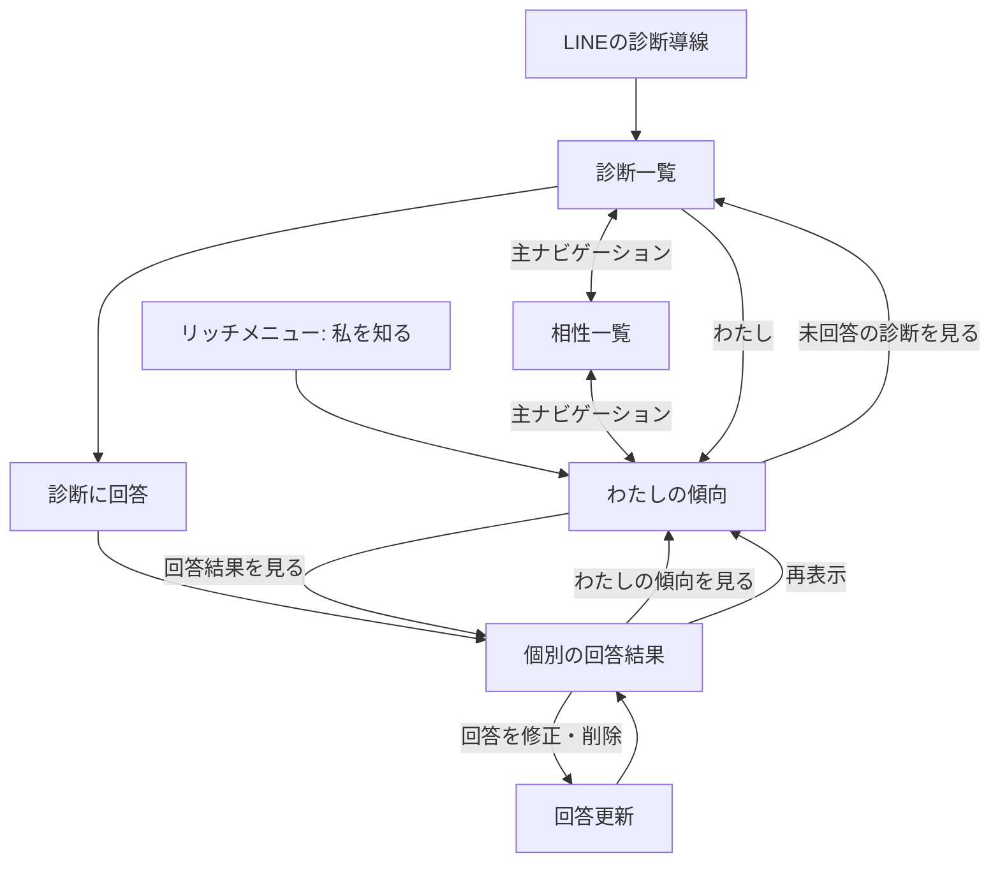
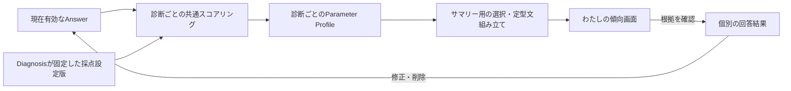

# 自分の傾向サマリー体験設計

## 1. この文書の目的

この文書は、本人がこれまでの診断回答を横断して「今の自分にどのような傾向があるか」を確認する画面の体験を定義します。画面の呼称、表示内容、要約の組み立て方、導線、状態、注意書き、根拠確認と回答修正への遷移を所有します。

個別診断の回答と画面は[Phase 1 診断体験設計](../diagnosis/diagnosis-experience.md)、回答からパラメータを計算する方法と版管理は[診断回答のパラメータ変換設計](../diagnosis/scoring/parameter-scoring-design.md)、共通ヘッダー右上のプロフィール入口と表示テーマは[プロフィール設定体験設計](profile-settings-experience.md)、アバターの表示・設定は[アバター設定体験設計](avatar-experience.md)、ストレスの手がかりとAI相談は[ストレスの手がかりとAIセルフケア相談体験設計](self-care-ai-consultation-experience.md)、Source RecordとBrainの責務境界は[ドメイン設計](../domain/domain-design.md)を正とします。

この文書は、診断固有のパラメータ、Brain Itemの導出・永続化、AIによる自由記述の生成、Confidenceの算出、APIやデータベースの具体的なスキーマを所有しません。

## 2. 結論

画面名は「わたしの傾向」とします。「診断結果」や「性格分析」では、単一の診断結果との区別がつかず、回答から人物全体を断定した印象を与えるためです。

最初の提供範囲では、完了済み診断の版付き採点結果だけを使い、次を表示します。

- 複数の診断を横断した短い「今のわたし」
- 診断テーマごとの全パラメータ
- 要約に使った診断数、回答数、最終回答日時
- 各傾向から個別の回答結果と回答内容へ進む根拠導線
- 回答を増やす、または既存回答を修正する導線
- 本人が確認したセルフケア情報と、AIへ相談する導線

AIによる人物像の生成や、異なるパラメータを1つの性格タイプへ統合する処理は行いません。既存の決定的な採点結果から表示用の文章を組み立て、同じ回答と同じ設定版からは常に同じ内容を表示します。このサマリー自体はBrain Itemとして保存せず、表示時に再構成する読み取りモデルとして扱います。

## 3. 利用者へ伝える価値と限界

この画面は「これまでの回答を探し直さなくても、自分の傾向を一か所で振り返れる」ことを価値とします。人物の能力、善悪、健康状態、将来の行動を判定するものではありません。

画面上では次を一貫して伝えます。

- 表示は、me-builderで回答した範囲から見える現在の傾向である
- 軸のどちら側にも良し悪しはない
- 回答していないテーマについては分からない
- 回答の修正・削除により表示は変わる
- 医療的・心理学的な診断ではない

「あなたは○○な人です」のような断定表現は使わず、「○○を重視しやすい傾向があります」のように回答範囲と変化可能性を残します。

## 4. 画面構成

```text
┌──────────────────────────────┐
│ わたしの傾向                 │
│ 回答から見える、今のあなた   │
├──────────────────────────────┤
│ 今のわたし                   │
│ ・前もって決めたい傾向       │
│ ・新しい体験を好む傾向       │
│ ・相談・情報共有を重視する傾向│
│                              │
│ 4診断・40回答から作成        │
│ 最終回答 2026/08/08          │
├──────────────────────────────┤
│ テーマごとの傾向             │
│ [時間と予定]                 │
│ 事前計画        ●──────      │
│ 予定変更        ───●───      │
│             回答結果を見る > │
│                              │
│ [余暇の過ごし方]             │
│ ...                          │
├──────────────────────────────┤
│ もっと自分を知る             │
│ [未回答の診断を見る]         │
├──────────────────────────────┤
│ わたしのセルフケア           │
│ 負荷の手がかり・早めのサイン │
│ [詳しく見る]  [AIに聞く]     │
├──────────────────────────────┤
│ 診断                     わたし│
└──────────────────────────────┘
```

### 4.1 ヘッダー

見出しを「わたしの傾向」、補足を「これまでの回答から見える、今のあなたです」とします。初見で医療的な診断や固定された性格ではないと理解できる短い注意書きを、サマリーカードの前に表示します。

共通ヘッダー右上にはプロフィール入口を表示します。アバターと表示テーマの変更は[プロフィール設定体験設計](profile-settings-experience.md)、画像の生成状態と候補の扱いは[アバター設定体験設計](avatar-experience.md)を正とし、この画面内へ変更操作を重複して置きません。

### 4.2 「今のわたし」カード

方向性が明確な傾向を最大3件表示します。一読できる量に絞り、選ばれなかった傾向も次の「テーマごとの傾向」で確認できるようにします。

カードの末尾には、サマリーが参照した完了済み診断数、現在有効な回答数、参照した回答のうち最も新しい回答日時を表示します。これらは統計的な信頼度として見せず、「どの範囲をまとめたか」を示す情報として扱います。

### 4.3 「テーマごとの傾向」

完了済み診断を、ホームの回答済み一覧と同じく最終回答日時の降順で並べます。各テーマでは、個別診断の回答結果と同じパラメータ名、両端のラベル、位置、回答充足度を表示します。

テーマカード全体を個別の回答結果への導線にせず、「回答結果を見る」という名前付き操作を置きます。遷移先では、どの質問と選択肢が根拠になったかを確認し、回答を修正または削除できます。

### 4.4 次の回答への導線

未回答または回答途中の診断がある場合だけ、「もっと自分を知る」から診断一覧へ移動できるようにします。回答を増やすことをサマリー閲覧の条件にはせず、回答を促すために結果を隠しません。

### 4.5 「わたしのセルフケア」とAI相談

本人が確認した「負荷がかかりやすい場面」「早めのサイン」「合いやすかった対処」を短く表示し、「詳しく見る」と「AIに聞く」を置きます。診断結果だけからストレスの原因や対処法を確定しません。表示内容、AIの返答、安全上の切り替えは[ストレスの手がかりとAIセルフケア相談体験設計](self-care-ai-consultation-experience.md)を正とします。

### 4.6 開発環境のBrain Item確認

`development`、`local`、`preview`、`test`では、生成処理を確認するため「わたしのまとめ」の末尾に本人のactive Brain Item一覧を表示します。statement、分類、AIまたは決定的な導出、作成日時、EvidenceのSource Record IDを表示し、0件も「追加されたBrain Itemはありません」と明示します。チェックポイントの処理状態はBrain Itemの状態ではないため、`pending` Itemとしては表示しません。

この一覧は本人確認済みAccountのデータだけを専用の開発APIから読み、最大100件を新しい順に表示します。ProductionではUIを構築せず、APIも404を返します。否定・修正などの操作はこの確認一覧へ混ぜず、後続の本人向け体験として設計します。

## 5. サマリーの決定的な組み立て方

### 5.1 対象

次の条件をすべて満たすパラメータだけを候補にします。

1. 本人の現在有効な回答による、回答済みのDiagnosisResponseである
2. Diagnosisが固定した採点設定版で再計算されている
3. パラメータの`coverage`が診断固有の最低回答充足率以上である
4. パラメータの帯域が低い側または高い側である

中央帯は「今のわたし」の最大3件には含めません。中央は情報不足ではなく、「状況に応じて調整する」という有効な結果としてテーマごとの傾向へ表示します。採点設定がない診断と回答不足のパラメータはサマリー計算から除外し、存在しなかったことにはせず後述の状態として説明します。

### 5.2 選択順

候補は表示スコアと中央の距離`abs(score - 50)`が大きい順に並べ、先頭から最大3件を採用します。同じ距離の場合は、Diagnosisの表示順、Diagnosis ID、診断内のパラメータ順、Parameter IDの順で決め、再読み込みで表示が変わらないようにします。

この距離はカードへ数値表示せず、表示件数を絞るためだけに使います。距離が大きいことをConfidenceや傾向の重要度とは扱いません。

### 5.3 文の生成

採用したパラメータごとに、スコアが属する側の既存ラベルを使って次の定型文を組み立てます。

```text
「{低い側または高い側のラベル}」傾向があります
```

診断固有のラベル以外の形容や理由を補いません。たとえば「外へ出ることを好む」から「社交的である」と推定しません。

方向性が明確な候補がなく、中央帯の有効な結果だけがある場合は、「回答したテーマでは、状況に応じて選び方を調整する傾向が見えています」と表示します。

## 6. 導線と遷移

診断を探す場所、相性を見る場所、自分について確認する場所を分け、Webの主ナビゲーションに左から「わたし」「診断」「相性」の3項目を置きます。LINEのリッチメニューからも「私を知る」でこの画面へ直接入り、「診断を行う」と診断通知は診断側へ遷移します。リッチメニューの項目定義は[Phase 1 診断体験設計 §7](../diagnosis/diagnosis-experience.md#7-リッチメニュー)、相性側の導線は[相性診断・うつし共有体験設計](compatibility-experience.md)を正とします。



個別診断の完了直後は、従来の「一覧へ」に加えて「わたしの傾向を見る」を表示します。ただし、完了直後に自動遷移はさせず、今回の結果を確認する操作を奪いません。

端末の戻る操作では、サマリーから個別結果を開いた場合はサマリーへ、診断一覧から開いた場合は診断一覧へ戻します。URLで各画面を識別し、再読み込みしても同じ画面へ復帰できるようにします。

## 7. 画面状態

| 状態 | 表示と操作 |
| --- | --- |
| 読み込み中 | サマリーとテーマカードの骨格を表示し、完了まで以前の別ユーザーの内容を残さない |
| 有効な傾向あり | 「今のわたし」とテーマごとの全結果を表示する |
| 完了済み診断がない | 「まだ傾向をまとめられません」と説明し、未回答または回答途中の診断へ案内する |
| 完了済み診断はあるが採点設定がない | 回答は保存されていることを説明し、個別の回答内容へ案内する |
| 回答不足のパラメータがある | 数値や方向を推測せず「回答が増えると表示できます」とする |
| 通信失敗 | 本人の内容を部分的に確定表示せず、再試行と診断一覧への導線を表示する |
| 回答の修正・削除後 | 最新の現在有効な回答から再計算し、件数、日時、文章、軸を同時に更新する |
| 受付終了・公開停止 | 既に回答済みなら個別結果とサマリーへ含める。新しい回答への導線は出さない |

一部の診断結果だけ取得できた場合に、それを全体のサマリーとして表示しません。どの範囲が欠けたかを利用者が判断できないため、取得単位全体をエラーとして再試行させます。

## 8. データの流れと責務境界



- Diagnosis domainは現在有効なAnswerを守る
- 共通スコアリングは診断ごとのParameter Profileを再現する
- サマリー用の読み取り処理は複数診断の結果を並べ、最大3件の定型文を選ぶ
- Web UIは返された結果を表示し、独自に採点設定や重みを保持しない
- サマリーの文章とパラメータ結果は保存せず、回答変更時の二重管理を作らない
- Brain Itemの生成と本人確認の流れは後続設計とし、この画面の提供条件にしない

## 9. プライバシー、表現、アクセシビリティ

- 本人確認済みのAccountの回答だけを対象にし、クライアント指定のAccount IDを信頼しない
- 初期提供ではサマリーの共有・公開操作を置かない
- URL、ログ、画面分析イベントへ回答内容、Parameter Profile、本人識別子を含めない
- 軸の位置を色だけで示さず、低い側・高い側のラベルと文章を併記する
- 軸は`meter`相当の名前、最小値、最大値、現在の傾向を支援技術へ伝える
- 主ナビゲーションは現在位置を支援技術へ伝え、キーボードとタップの両方で操作できる
- ライト・ダークの両テーマで文字、境界、フォーカス表示のコントラストを保つ

## 10. 完了条件

- 完了済み診断が2件以上ある本人について、複数診断を横断したサマリーを表示できる
- 同じ回答と採点設定版では、再読み込みしても同じ3件と同じ順序になる
- サマリーの各傾向に対応する個別診断の回答結果と回答内容を確認できる
- 回答の修正・削除後に古い傾向が残らず、再計算された表示へ変わる
- 採点設定なし、回答不足、完了済み診断なし、通信失敗を区別できる
- サマリーから、回答可能な未回答・回答途中の診断へ移動できる
- 画面上に、回答範囲から見える傾向であり医療的な診断ではないことを表示する
- 本人以外の回答、別Accountのキャッシュ、クライアント指定のAccount IDを利用しない
- サマリーの共有・公開、AIによる自由記述生成、Brain Itemの永続化を実装範囲へ混ぜない

## 11. この設計で決めないこと

- 日記や自由記述を含むAIプロフィール要約
- Source RecordからBrain Itemを導出し、本人が確認・却下する流れ
- Brain ItemのConfidence算出と提示
- 複数の傾向を性格タイプや総合スコアへ変換する方法
- 他ユーザーとの比較と相性（[相性診断・うつし共有体験設計](compatibility-experience.md)を正とする）、ランキング
- サマリーの外部共有、公開範囲、MCPでの提供形式
- API、データベース、キャッシュの具体的な構造

これらを追加するときも、本人の回答、決定的な導出、AI推定を同じ表現で混ぜません。
