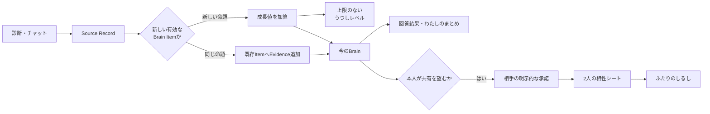

# 成長・報酬体験の提案

## 1. この文書の目的

この文書は、診断やチャットを続ける動機をつくり、任意の相性共有へ自然につなげる成長・報酬体験の提案を所有します。ゲームにおけるレベルに近い進行表示、Brain Itemが増え続けることを反映した上限のない成長、行動ごとのフィードバック、共有に報酬を与える条件、安全上の制約を扱います。

個別診断の回答UIは[Phase 1 診断体験設計](../diagnosis/diagnosis-experience.md)、診断と日記から本人へ返す価値は[わたしのまとめ仕様](profile-summary-experience.md)、Brain Itemの生成と意味的重複の扱いは[Brain Item生成設計](../domain/brain/brain-item-generation-design.md)、双方の同意を含む共有は[相性診断・うつし共有体験設計](compatibility-experience.md)、うつしとミラの外見は[キャラクターデザイン](../design/character-design.md)を正とします。

この文書は、物理データモデル、API、イベントスキーマ、通知頻度、レベル閾値の具体的な数式、報酬アセットの制作仕様を所有しません。利用者向けの名称、レベル進行式、アンロック内容は検証前の候補であり、確定仕様ではありません。

## 2. 提案の結論

成長の中心を、診断の完了数ではなく、診断やチャットから新しく生成された有効なBrain Itemに置きます。Brain Itemには上限がないため、うつしレベルも最大値を設けません。

ただし、報酬体験を単一の数値へ統合せず、次の3つに分けます。

1. **うつしレベル**: 新しいBrain Itemとの出会いを積み上げた、上限のない「これまでの歩み」
2. **今のBrain**: 現在有効なBrain Itemの数、分類の広がり、最近の更新。実データに合わせて増減する現在値
3. **ふたりのしるし**: 双方の同意と比較可能な材料がそろったときだけ得られる、任意のペア報酬

利用者向けには、Brain Itemをそのまま表示せず「わたしのかけら」などの名称に置き換えることを候補とします。内部用語を表示するかは[Brain内部情報の分類](../domain/brain/brain-content-taxonomy.md#9-今後決めること)とあわせて確定します。



## 3. 設計原則

- レベルは「人として優れている度合い」ではなく、me-builderで得た自分についての命題の積み重ねを表す
- 最大レベルや「完成」を設けず、本人は変化し続ける前提にする
- 回答内容、特定の傾向、相性の良し悪しでは差を付けない
- 長文、機微な内容、珍しい内容を多く話すほど有利にしない
- 日数の連続記録を必須にせず、休んでも損失や罪悪感を与えない
- 診断結果、現在のまとめ、プライバシー設定、共有終了などの中核機能をレベルで制限しない
- 削除、撤回、共有終了によって、獲得済みレベルや装飾を没収しない
- 招待の送信数、承諾者数、共有相手数を競わせない
- 何がレベルへ反映されたかを説明できるようにし、AIの出力件数だけで不透明に上下させない

## 4. うつしレベル

### 4.1 レベルが表すもの

うつしレベルは、診断とチャットから、本人についての新しい独立した命題が見つかった歩みを表します。現在のプロフィールの完全さ、分析の信頼度、人物の成熟度は表しません。

画面では数値と一緒に「これまでに見つけた、わたしのかけらから育ったレベル」のような説明を置きます。「あなたの理解度は80%」「あと20%で完成」のように、本人を有限かつ完全に把握できると誤解させる表現は使いません。

### 4.2 上限のない進行

レベルは`Lv.1`、`Lv.2`、`Lv.3`と上がり続け、最大値を持ちません。新しいBrain Itemが1件生成されるたびに、レベル計算へ使う成長値が1増える方式を基本候補とします。

必要な成長値はレベルが上がるほど緩やかに増やし、1件ごとにレベルアップし続ける状態を避けます。具体的な数式は、診断1件から生成されるItem数、チャット1チェックポイントから生成されるItem数、利用者ごとの分布を観測して決めます。数式を変更する場合も、同じ成長履歴から同じ結果を再計算できるよう版を持つことを後続の実装設計で検討します。

```text
Lv.1 ──数件──> Lv.2 ───数件───> Lv.3 ────より多く────> Lv.4 ...
  ※ 上限なし。必要件数は徐々に広がる
```

最初の診断完了で複数のBrain Itemが生成され、最初のレベルアップを体験できる程度を初期調整の目安とします。診断とチャットのどちらから生成されたItemも同じ1件として扱い、入力経路による価値の上下を付けません。

### 4.3 成長値へ加えるBrain Item

Brain Itemが物理的に1行増えたことではなく、本人について新しい命題が有効になったことを数えます。

| Brain Itemの出来事 | 成長値 | 理由 |
| --- | --- | --- |
| 診断から新しい`active` Itemを生成 | `+1` | 決定的な規則で新しい傾向が得られた |
| チャットの本人発言から新しい非推定の`active` Itemを生成 | `+1` | 本人が明言した新しい命題が得られた |
| 同じ命題が見つかり、既存ItemへEvidenceだけを追加 | `+0` | 根拠は深まったが、新しい命題は増えていない |
| Queue再配送などで同じtriggerを再処理 | `+0` | 冪等な再処理を報酬へ変えない |
| 既存Itemを置き換えるだけのRevision | `+0` | 修正の繰り返しによる水増しを避ける |
| 旧Itemと独立した新しい命題をRevision時に追加 | `+1` | 訂正とは別に新しい内容が増えた場合だけ数える |
| 本人が明言していないAI推定Item | 原則`+0` | AIが自動的に本人のレベルを上げない。将来、本人確認後に扱いを再検討する |
| Itemの否定、無効化、根拠削除 | 減算しない | 訂正・削除する権利へ不利益を与えない |

成長値へ加えるのは、[Brain Item生成設計](../domain/brain/brain-item-generation-design.md#8-重複evidence追加改訂)の重複判定後に新規作成されたItemです。同じ内容を言い換える、同じ診断を再送する、同じメッセージを再処理するだけでは増えません。

分類、Sensitivity、Access Label、文章の長さによる係数は設けません。機微なことを話すほどレベルが上がりやすい構造を作らないためです。

### 4.4 下がらないレベルと変化する現在値

うつしレベルは「これまでに新しい命題を見つけた歩み」として維持します。一方、今のBrainは現在`active`で利用可能なBrain Itemだけから表示し、本人が否定、修正、削除した場合に更新します。

```text
これまでの歩み: うつしレベル 12    ← 下がらない
今のBrain:       48個・6分類         ← 現在の状態で増減する
```

削除後に以前と同じ結果を表示し続けたり、レベル維持を理由に削除済みのstatement、分類、Evidenceを利用したりしてはいけません。削除後にレベルの根拠として残す場合も、「過去に加算対象が1件発生した」という内容を持たない集計事実だけにし、元の命題を復元できる情報を残しません。具体的な削除境界と保存先は後続の実装設計で確定します。

## 5. 進行の手応えと報酬

上限のないレベルに対して、レベルごとに固有アセットを作り続ける必要はありません。次の3つの周期で手応えを返します。

| タイミング | フィードバック | 報酬候補 |
| --- | --- | --- |
| 新しいBrain Itemの反映 | レベルバーが進み、「新しいかけらが増えた」とまとめて表示 | なし。通知を乱発しない |
| レベルアップ | 短い光の演出と新しいレベル | 既存モチーフの組み合わせ変化 |
| 節目のレベル | これまで増えた分類やテーマを振り返る | 背景・カード枠・花や光の選択肢、記念カード |

節目は一定間隔で繰り返せますが、装飾カタログを取り切った後もレベルは上がり続けます。すべてのレベルで固有報酬が得られるとは案内せず、レベルそのもの、今のBrainの広がり、定期的な記念カードを持続可能な報酬にします。

分類やテーマの広がりはレベルの加点係数にせず、別の可視化として使います。たとえば、同じ`Preference`が増え続けてもレベルは進みますが、「今のBrain」の花びらは、複数分類がそろったときに色が広がります。量と幅を混ぜないことで、診断中心の人とチャット中心の人のどちらかを不利にしません。

## 6. 行動とフィードバック

| 行動 | その場のフィードバック | レベルへの反映 |
| --- | --- | --- |
| 1問へ回答 | 既存の進捗表示と短い反応 | 回答時点では加算しない |
| 診断を完了 | 回答結果と、Brainへの反映中であること | projection後に新規Item数を加算 |
| チャットで本人について話す | 会話として自然に応答 | checkpoint処理後に新規Item数を加算 |
| 同じ内容の根拠が増える | 今のまとめの材料として利用 | Evidence追加だけなら加算しない |
| 招待リンクを発行・送信 | 送信状態だけを案内 | 加算しない |
| 双方が承諾し比較可能になる | 2人の相性シート | うつしレベルとは別のしるし |
| 回答・発言を削除する | 現在値と利用結果を更新 | 獲得済みレベルを下げない |
| 共有を終了する | 終了と今後共有されないことを案内 | 罰やレベル低下を与えない |

Brain Item生成は診断回答やチャット返信と非同期で完了します。診断完了直後やチャット返信時に、未確定のItem数を先に加算して見せません。「反映中」から実際に保存された新規Item数へ更新し、0件でも失敗とは扱わず、同じ命題の根拠が深まった可能性を説明できるようにします。

## 7. ふたりのしるし

共有は、うつしレベルとは独立した任意の寄り道にします。共有しない利用者も、Brain Itemが増える限り同じようにレベルを上げられます。

「ふたりのしるし」は次をすべて満たした後に、双方へ同じものを付与します。

- 招待の受信者が、共有内容を確認して明示的に承諾している
- 双方に比較可能な診断テーマがある
- 2人の相性シートを表示できる

リンクの発行、共有先選択を開く、リンクを送るだけでは報酬を与えません。送信者が報酬を得るために相手へ承諾を迫る構図を避けるため、受信者の承諾画面では「相手の報酬達成に必要」と案内しません。

しるしは人数の多さを競うコレクションではなく、その関係で初めて見えたテーマを記念する控えめな装飾とします。共有終了後は相性シートを閲覧できなくする既存ルールを維持し、しるしを表示する場合も相手の現在の情報や終了済み相性シートへ遷移させません。

## 8. 画面への置き方

### 8.1 わたしのまとめ

「今のわたし」より上に大きなゲーム画面を追加せず、ヘッダー付近にうつしレベル、次のレベルまでのかけら数、今のBrainへの入口を表示します。

```text
うつし Lv.12
████████░░  次のレベルまで、あと3個
今のBrain: 48個のかけら・6つの分類  >
```

「あと3個」は達成を急がせる期限と組み合わせません。未回答診断への導線は[わたしのまとめ仕様](profile-summary-experience.md)の「もっと自分を知る」を再利用し、チャットへ話すことと診断を行うことのどちらも選べるようにします。

### 8.2 診断一覧と完了時

診断一覧では、一覧の探索を邪魔しない小さなレベル表示だけを置きます。各カードに獲得見込み値を表示しません。診断から作られるBrain Item数は回答によって変わり、保存完了前には確定しないためです。

診断完了時は、回答結果を報酬より先に表示します。Brainへの反映が完了しレベルが上がった場合だけ、その後に短い演出を示します。全画面演出はスキップでき、動きを減らす設定では静的な変化へ置き換えます。

### 8.3 チャット

会話のたびに「経験値を獲得」と返信すると、本人が自然に話す場をゲーム入力へ変えてしまいます。通常返信にはレベル情報を混ぜず、チェックポイント処理後に「わたしのまとめ」側でまとめて反映します。本人が望む場合だけ、増えたかけらを後から確認できるようにします。

### 8.4 相性

招待画面では、共有の内容と継続同意の説明を報酬より優先します。「ふたりのしるし」は相性シートが利用可能になった後に表示し、招待CTAの強調材料にはしません。

## 9. 採用しない仕組み

- 最大レベル、うつしの完成、100%の自己理解
- 連続ログイン、回答ストリーク、休むと消える報酬
- Source Record、メッセージ、文字数をそのまま経験値にすること
- 同じBrain ItemへのEvidence追加を毎回加点すること
- AIが推定Itemを増やすだけで本人のレベルを上げること
- 機微度、分類、Access Labelによる経験値の増減
- 招待リンクの発行数、送信数、承諾数に応じた経験値
- 共有相手数のランキングや公開表示
- 回答速度、回答内容、特定の性格傾向による得点差
- ランダム報酬、ガチャ、期間限定で失う装飾
- プライバシー設定、削除、共有終了をレベルで制限すること
- 結果を隠して、回答数や共有を達成するまで見せないこと
- 有料通貨や交換可能なポイント

## 10. 初期検証の範囲

最初から多数の装飾を作らず、次の順で価値を検証します。

1. 現在の有効な非推定Brain Itemを初期値とし、上限のないレベルと次のレベルまでの進捗を表示する
2. 診断projectionとチャットcheckpointの完了後、新規Itemだけが進捗へ反映され、Evidence追加と再配送では増えないことを確認する
3. レベルアップ時に、うつしの周囲の花・光を使った短い演出を表示する
4. 今のBrainで、Item数と分類の広がりをレベルとは別に表示する
5. 相性シートが成立した2人へ、任意の「ふたりのしるし」を表示する

初期検証では、装飾カスタマイズや多数の節目報酬より先に、「Brain Itemが増えるほど自分の分身が育つ」という因果が理解されるか、自然なチャットを損なわないかを確認します。

## 11. 評価指標

主に確認する指標は次のとおりです。

- 診断開始から完了までの割合
- 最初の診断完了後に、別テーマの診断を開始・完了した割合
- レベル表示後にチャットまたは診断へ再訪した割合
- 1人あたりの新規Brain Item数と、意味的重複によるEvidence追加数
- 診断由来とチャット由来のItemが、継続へそれぞれ与えた影響
- 今のBrainや獲得した装飾を本人が確認した割合
- 招待発行から承諾ではなく、双方が相性シートを確認できた割合

安全性のため、次も同時に確認します。

- レベル表示後に、短時間のメッセージ連投や不自然な再回答が増えていないか
- 機微な情報を話すほど有利だと誤解されていないか
- 招待の拒否、期限切れ、取り消し、短期間での共有終了の割合
- LINE通知の停止やブロックにつながっていないか
- 回答や発言の削除、共有終了をためらわせるとの問い合わせがないか
- レベルが人物評価、分析精度、現在有効なItem数だと誤解されていないか

## 12. 確定前に検証すること

- 「うつしレベル」「わたしのかけら」「今のBrain」という利用者向け名称
- レベルが上がるほど必要な成長値を増やす具体的な数式と、その版変更時の扱い
- 既存利用者の初期レベルを現在のactive Itemから計算するか、導入後の増加だけで始めるか
- Revisionで新しい独立命題も増えた場合に、訂正分と追加分を区別する方法
- Current Stateなど期限切れになるItemを、今のBrainでどう見せるか
- うつし本体を変えず、周囲の花・光・背景だけで無限の成長を十分に感じられるか
- 装飾カタログを取り切った後の節目報酬
- 共有終了後の「ふたりのしるし」を、相手を特定しない思い出として残すか、非表示にするか
- 初期検証で比較する対照群と観測期間
