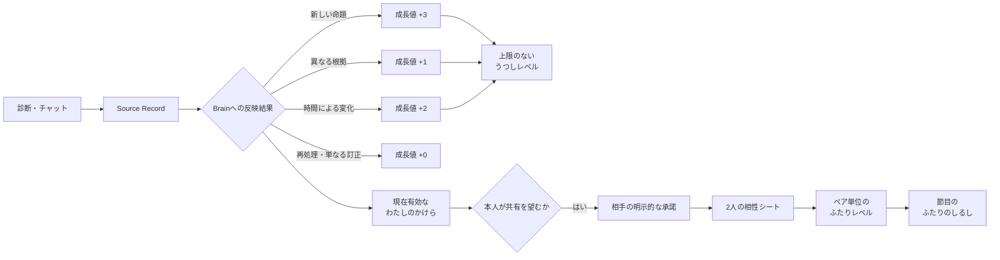

# 成長・報酬体験の提案

## 1. この文書の目的

この文書は、診断やチャットを続ける動機をつくり、任意の相性共有へ自然につなげる成長・報酬体験の提案を所有します。ゲームにおけるレベルに近い進行表示、Brain Itemが増え続けることを反映した上限のない成長、行動ごとのフィードバック、共有に報酬を与える条件、安全上の制約を扱います。

個別診断の回答UIは[Phase 1 診断体験設計](../diagnosis/diagnosis-experience.md)、診断と日記から本人へ返す価値は[わたしのまとめ仕様](profile-summary-experience.md)、Brain Itemの生成と意味的重複の扱いは[Brain Item生成設計](../domain/brain/brain-item-generation-design.md)、双方の同意を含む共有は[相性診断・うつし共有体験設計](compatibility-experience.md)、うつしとミラの外見は[キャラクターデザイン](../design/character-design.md)を正とします。

この文書は、物理データモデル、API、イベントスキーマ、通知頻度、報酬アセットの制作仕様を所有しません。利用者向けの名称、レベル式、加点値、アンロック内容は初期検証で使う案であり、検証結果を基に版を更新します。

## 2. 提案の結論

成長の中心を、診断の完了数やメッセージ数ではなく、Brainに新しい命題・異なる根拠・時間経過による変化が反映された出来事に置きます。Brain ItemとEvidenceは増え続けるため、レベルにも最大値を設けません。

利用者へ見せる概念は次の4つです。「今のBrain」という別名称は設けません。

1. **うつしレベル**: Brainが育った出来事を積み上げた、本人全体の上限のないレベル
2. **わたしのかけら**: 現在有効なBrain Itemの個数。実データに合わせて増減する現在値
3. **ふたりレベル**: 成立済みの共有関係ごとに、2人について新しく比較できた内容を積み上げるレベル
4. **ふたりのしるし**: ふたりレベルの節目で得る、ペア単位の記念表示

`Brain Item`は内部用語のまま画面へ出さず、「わたしのかけら」と表示します。



## 3. 設計原則

- レベルは「人として優れている度合い」ではなく、me-builderで自分への理解が更新された歩みを表す
- 最大レベルや「完成」を設けず、本人は変化し続ける前提にする
- 回答内容、特定の傾向、相性の良し悪しでは差を付けない
- 長文、機微な内容、珍しい内容を多く話すほど有利にしない
- 日数の連続記録を必須にせず、休んでも損失や罪悪感を与えない
- 診断結果、現在のまとめ、プライバシー設定、共有終了などの中核機能をレベルで制限しない
- 削除、撤回、共有終了によって、獲得済みレベルや装飾を没収しない
- 招待の送信数、承諾者数、共有相手数を競わせない
- 何がレベルへ反映されたかを説明できるようにし、AIの出力件数だけで不透明に上下させない

## 4. うつしレベル

### 4.1 レベルが表すもの

うつしレベルは、診断とチャットから新しい命題が見つかったこと、同じ命題に異なる根拠が加わったこと、時間とともに本人が変化したことの累積を表します。現在のプロフィールの完全さ、分析の信頼度、人物の成熟度は表しません。

画面では数値と一緒に「これまでに自分への理解が育った歩み」のような説明を置きます。「あなたの理解度は80%」「あと20%で完成」のように、本人を有限かつ完全に把握できると誤解させる表現は使いません。

### 4.2 レベル式

ゲームでよく使われるレベル式には、主に次の型があります。

| 型 | 次のレベルに必要な値 | 長期利用時の特徴 | 採否 |
| --- | --- | --- | --- |
| 固定 | 毎回同じ | 高レベルでも頻繁に上がり、節目が弱くなる | 採らない |
| 線形増加 | レベルごとに一定量ずつ増える | 累積必要値は二次式になり、序盤と長期を調整しやすい | 初期案に採る |
| 指数増加 | 一定倍率で増える | 長期では必要値が急増し、実質的な上限になりやすい | 採らない |

初期案では、累積成長値`G`でレベル`L`へ到達する閾値を次の二次式にします。条件を満たす最大の`L`が現在レベルです。

```text
T(L) = 5 × (L - 1)²

Lv.1:  0
Lv.2:  5
Lv.3: 20
Lv.4: 45
Lv.5: 80
```

次のレベルまでに必要な値は`5、15、25、35...`と線形に増えます。上限を作らず、初期の診断で複数のBrain Itemが生成されたときは早い段階で最初のレベルアップを体験でき、高レベルでは1つの処理ごとにレベルアップし続けない形です。

診断由来かチャット由来かでは加点を変えません。式と加点値には版を持たせ、変更時の扱いは[§4.5](#45-既存利用者の開始値と式の更新)に従います。

### 4.3 成長値へ加える出来事

Brain Itemが物理的に1行増えたことだけでなく、本人への理解がどのように更新されたかを次の単位で数えます。

| Brainで起きた出来事 | 成長値 | 判定例 |
| --- | --- | --- |
| 新しい非推定の`active` Itemを生成 | `+3` | 診断または本人発言から、既存Itemと独立した命題が得られた |
| 既存Itemへ異なるEvidenceを追加 | `+1` | 別のSource Recordが、異なる出来事・理由・時点から同じ命題を支えた |
| 時間経過による変化をRevisionとして追加 | `+2` | 過去の内容も当時は正しく、現在の状態・好み・目標が変わった |
| 誤字、誤回答、事実誤認の訂正だけを行うRevision | `+0` | 過去の内容を正しい記録へ直しただけで、新しい変化ではない |
| Revisionと同時に独立した新しい命題を追加 | `+2`と`+3` | 時間による変化と、別の新しい命題をそれぞれ数える |
| 同じ内容を言い換える、再送する | `+0` | Source Recordが異なっても、新しい出来事・理由・時点がない |
| Queue再配送などで同じtriggerを再処理 | `+0` | 冪等な再処理を報酬へ変えない |
| 本人が明言していないAI推定Item | `+0` | AIが自動的に本人のレベルを上げない |
| Itemの否定、無効化、根拠削除 | 減算しない | 訂正・削除する権利へ不利益を与えない |

異なるEvidenceは、Evidence edgeのIDが違うだけでは足りません。根拠となるSource Recordが別で、かつ同じ文章の再送ではないことを必要とします。たとえば「コーヒーが好き」に対して、後日の「香りで落ち着くから朝に飲む」は異なる理由を持つため`+1`ですが、「コーヒーが好き」をもう一度送るだけなら`+0`です。

Revisionは、旧内容が誤りだったか、時間とともに変わったかで分けます。「在宅勤務です」を誤入力として「出社勤務です」へ直すのは`+0`です。一方、「以前は在宅勤務だったが、今月から出社勤務になった」は旧内容と新内容の時点が両立するため`+2`です。「今月から出社勤務で、朝の散歩を始めた」なら、勤務形態の変化`+2`と新しい習慣Item`+3`を別々に加えます。

この判定は、[Brain Item生成設計](../domain/brain/brain-item-generation-design.md#8-重複evidence追加改訂)で確定した新規Item、Evidence追加、Revisionの結果を受けて行います。分類、Sensitivity、Access Label、文章の長さによる係数は設けません。

### 4.4 下がらないレベルと変化する「わたしのかけら」

うつしレベルは「これまでに理解が育った歩み」として維持します。一方、「わたしのかけら」は現在`active`で利用可能なBrain Itemの個数そのものです。本人が否定、修正、削除した場合は増減します。

```text
これまでの歩み: うつし Lv.12         ← 下がらない
現在の状態:     わたしのかけら 48個  ← active Itemに合わせて増減する
分類の広がり:   6種類
```

`Current State`など期限を持つItemは、有効期限が切れるか新しいItemに置き換えられた時点で「わたしのかけら」から除きます。期限を推測できないItemを画面側だけで失効させません。過去の変化として履歴画面に残す場合も、現在のかけら数には含めません。失効しても、既に得たうつしレベルは下げません。

削除後に以前と同じ結果を表示し続けたり、レベル維持を理由に削除済みのstatement、分類、Evidenceを利用したりしてはいけません。レベルの根拠として残せるのは、「過去に何点加算された」という元の命題を復元できない集計事実だけです。

### 4.5 既存利用者の開始値と式の更新

既存利用者を導入後の増加だけで`Lv.1`から始めると、それまで蓄積したBrainが報われません。一方、削除済みの履歴までさかのぼって完全に再構築するのは複雑で、削除の期待にも反します。初回導入時は、現在利用可能なデータだけから開始値を作ります。

```text
開始時の成長値
= activeな非推定Brain Item数 × 3
+ 同じItemにある2件目以降の異なる有効Evidence数 × 1
```

過去のRevisionは、時間による変化だと既存データから確実に区別できる場合だけ`+2`し、区別できない履歴は加点しません。導入後は[§4.3](#43-成長値へ加える出来事)の出来事を累積します。

式や加点値を更新するときは、出来事の種類から新しい版で再計算します。更新前よりレベルが下がる場合は、それまでの最高到達レベルを下限にします。式を変えるだけのアップデートでレベルや獲得済み報酬を失わせません。

## 5. 進行の手応えと報酬

上限のないレベルに対して、レベルごとに固有アセットを作り続ける必要はありません。次の3つの周期で手応えを返します。

| タイミング | フィードバック | 報酬 |
| --- | --- | --- |
| 成長値の反映 | 「新しいかけら」「根拠が深まった」「今の自分へ更新」をまとめて表示 | レベルバーの進行 |
| レベルアップ | 短い光の演出と新しいレベル | うつしの周囲の花・光が1段階進む |
| 10レベルごとの節目 | 10段階の花・光が満開になり、次の周回へ移る | 成長カードを保存できる |

うつし本体の造形は変えません。周囲に10段階の花と光のリングを置き、現在の10レベル区間の進み具合を示します。たとえば`Lv.47`では4周目を表す小さな節目番号と、次の50まで7段階進んだリングを表示します。`Lv.50`で満開の演出と成長カードを出した後、リングは5周目の1段階目へ移ります。これにより、有限のアセットを繰り返し組み合わせても上限を感じさせません。

成長カードには、到達レベル、到達日、前回の節目から増えたかけら数、広がった分類名だけを載せます。Brain ItemのstatementやEvidence本文は載せません。背景色やカード枠などの選択肢は最初の数回の節目で有限個をアンロックできますが、カタログを取り切った後も10レベルごとに異なる数値と日付の成長カードを得られます。期間限定、ランダム排出、未取得へ戻る報酬は設けません。

分類の広がりはレベルの加点係数にせず、「わたしのかけら」の隣に別表示します。量と幅を混ぜないことで、診断中心の人とチャット中心の人のどちらかを不利にしません。

## 6. 行動とフィードバック

| 行動 | その場のフィードバック | うつしレベルへの反映 |
| --- | --- | --- |
| 1問へ回答 | 既存の進捗表示と短い反応 | 回答時点では加算しない |
| 診断を完了 | 回答結果と、Brainへの反映中であること | projection後に新規Item、異なるEvidence、時間変化を加算 |
| チャットで本人について話す | 会話として自然に応答 | checkpoint処理後に対象の成長値を加算 |
| 同じ内容の異なる根拠が増える | 「根拠が深まった」とまとめて表示 | `+1` |
| 同じ内容を再送する | 通常の結果だけを表示 | `+0` |
| 招待リンクを発行・送信 | 送信状態だけを案内 | 加算しない |
| 双方が承諾し比較可能になる | 2人の相性シート | うつしレベルではなく、ふたりレベルへ反映 |
| 回答・発言を削除する | かけら数と利用結果を更新 | 獲得済みレベルを下げない |
| 共有を終了する | 終了と今後共有されないことを案内 | 罰やレベル低下を与えない |

Brainへの反映は診断回答やチャット返信と非同期で完了します。診断完了直後やチャット返信時に、未確定の成長値を先に加算して見せません。「反映中」から実際に確定した結果へ更新し、`+0`でも失敗とは扱いません。

## 7. ふたりレベルとふたりのしるし

共有側には、うつしレベルと独立した「ふたりレベル」を設けます。共有しない利用者も、うつしレベルと中核機能では不利になりません。

### 7.1 管理単位

ふたりレベルは、成立済みの2つのAccountの組み合わせとRelationship Categoryの組み合わせごとに1つ持ち、双方へ同じ値を表示します。パートナーとしての共有と仕事相手としての共有は、見える内容が異なるため別のふたりレベルです。招待を送った人だけ、または承諾した人だけに点を与えません。

ふたりレベルは、相性の良さや関係の優劣ではなく、「2人について比較できる材料が更新された歩み」を表します。

### 7.2 成長条件と式

ペアの累積成長値`P`でレベル`L`へ到達する初期閾値は`Tpair(L) = 3 × (L - 1)²`とします。

| 共有で起きた出来事 | ペア成長値 |
| --- | --- |
| 新しい診断テーマが双方で初めて比較可能になった | `+3` |
| 比較済みテーマが更新され、相性シートの共通点・違いが実際に変わった | `+1` |
| 相性シートを同じ内容で再生成した | `+0` |
| 招待リンクを発行・送信した | `+0` |
| 受信者が承諾しただけで、比較可能なテーマがない | `+0` |
| 共有を終了した | 減算しない |

リンクの発行、共有先選択を開く、リンクを送るだけでは報酬を与えません。受信者の承諾画面にも「相手の報酬達成に必要」と案内しません。

`Lv.2`、`Lv.5`、`Lv.10`、以後10レベルごとの節目で「ふたりのしるし」を双方へ表示します。しるしは人数の多さを競うコレクションではなく、ペアの相性シート内だけで見られる記念表示です。

### 7.3 共有終了と再開

共有終了後は、相性シート、ふたりレベル、ふたりのしるしを双方の画面から非表示にします。現在の相手情報へ遷移できる入口も残しません。内容を持たない累積値と最高到達レベルだけを保持し、同じ2人・同じRelationship Categoryで双方が再度同意した場合に再表示します。再同意前には、過去のレベルを理由に相手との関係が残っていることを画面へ示しません。

## 8. 画面への置き方

### 8.1 わたしのまとめ

「今のわたし」より上に大きなゲーム画面を追加せず、ヘッダー付近にうつしレベル、次のレベルまでの成長値、わたしのかけら数を表示します。

```text
うつし Lv.12
████████░░  次のレベルまで、あと8
わたしのかけら 48個・6つの分類  >
```

「あと8」は達成を急がせる期限と組み合わせません。未回答診断への導線は[わたしのまとめ仕様](profile-summary-experience.md)の「もっと自分を知る」を再利用し、チャットへ話すことと診断を行うことのどちらも選べるようにします。

### 8.2 診断一覧と完了時

診断一覧では、一覧の探索を邪魔しない小さなレベル表示だけを置きます。各カードに獲得見込み値を表示しません。Brainへの反映結果は保存完了前には確定しないためです。

診断完了時は、回答結果を報酬より先に表示します。Brainへの反映が完了しレベルが上がった場合だけ、その後に短い演出を示します。全画面演出はスキップでき、動きを減らす設定では静的な変化へ置き換えます。

### 8.3 チャット

会話のたびに「成長値を獲得」と返信すると、本人が自然に話す場をゲーム入力へ変えてしまいます。通常返信にはレベル情報を混ぜず、チェックポイント処理後に「わたしのまとめ」側でまとめて反映します。本人が望む場合だけ、増えたかけらや深まった根拠を後から確認できるようにします。

### 8.4 相性

招待画面では、共有の内容と継続同意の説明を報酬より優先します。ふたりレベルは相性シートが利用可能になった後に表示し、招待CTAの強調材料にはしません。

```text
Aさん × わたし
ふたり Lv.5  ✦ ふたりのしるし
3つのテーマを比べられます
```

## 9. 採用しない仕組み

- 最大レベル、うつしの完成、100%の自己理解
- 連続ログイン、回答ストリーク、休むと消える報酬
- Source Record、メッセージ、文字数をそのまま成長値にすること
- 同じBrain Itemへの同一内容のEvidence追加を毎回加点すること
- AIが推定Itemを増やすだけで本人のレベルを上げること
- 機微度、分類、Access Labelによる成長値の増減
- 招待リンクの発行数、送信数、承諾数に応じた成長値
- 共有相手数やレベルのランキング、公開表示
- 回答速度、回答内容、特定の性格傾向による得点差
- ランダム報酬、ガチャ、期間限定で失う装飾
- プライバシー設定、削除、共有終了をレベルで制限すること
- 結果を隠して、回答数や共有を達成するまで見せないこと
- 有料通貨や交換可能なポイント

## 10. 初期導入と検証

最初から多数の装飾を作らず、次の順で導入します。

1. 既存利用者の開始値を[§4.5](#45-既存利用者の開始値と式の更新)で計算し、うつしレベル、次のレベルまでの進捗、わたしのかけら数を表示する
2. 新規Item、異なるEvidence、時間によるRevisionだけが成長値へ反映され、再配送、同じ発言、単なる訂正では増えないことを確認する
3. うつしの周囲へ10段階の花・光と、10レベルごとの成長カードを表示する
4. 成立済みの共有関係へ、ペア単位のふたりレベルとふたりのしるしを表示する

うつしレベルの初期検証は、新規利用者をAccount単位で1対1に割り付けます。

| 群 | 表示 |
| --- | --- |
| 対照群 | 現行の診断結果とわたしのまとめ。レベルを表示しない |
| 体験群 | うつしレベル、わたしのかけら、反映フィードバックを表示する |

初回診断完了から28日間を観測し、各群100 Accountを最低目安にします。28日で到達しなければ最長8週間まで募集を続けます。ふたりレベルはうつしレベルと分け、成立済みの共有関係をペア単位で1対1に割り付け、同じ観測期間で検証します。

## 11. 評価指標

主に確認する指標は次のとおりです。

- 診断開始から完了までの割合
- 最初の診断完了後に、別テーマの診断を開始・完了した割合
- レベル表示後にチャットまたは診断へ再訪した割合
- 1人あたりの新規Brain Item数、異なるEvidence数、時間によるRevision数
- 診断由来とチャット由来の成長イベントが、継続へそれぞれ与えた影響
- わたしのかけらや成長カードを本人が確認した割合
- ふたりレベル表示後に、別の比較可能テーマが増えた割合

安全性のため、次も同時に確認します。

- レベル表示後に、短時間のメッセージ連投や不自然な再回答が増えていないか
- 異なるEvidenceの加点を狙った、実質的に同じ内容の言い換えが増えていないか
- 機微な情報を話すほど有利だと誤解されていないか
- 招待の拒否、期限切れ、取り消し、短期間での共有終了の割合
- LINE通知の停止やブロックにつながっていないか
- 回答や発言の削除、共有終了をためらわせるとの問い合わせがないか
- レベルが人物評価、分析精度、現在有効なItem数、相性の良さだと誤解されていないか

継続率だけが上がっても、安全性指標が悪化した場合は採用しません。式、加点値、名称、演出は、上記の比較結果と誤解の聞き取りを基に版を更新します。

## 12. 後続の実装設計で決めること

- 成長イベントと式の版を保持する物理データモデル
- Evidenceが異なる出来事・理由・時点を持つか判定する処理の入出力
- 誤りの訂正と時間による変化を判定する処理の入出力
- `Current State`など分類ごとの有効期限を決める規則
- 10段階の花・光、成長カード、ふたりのしるしの制作仕様
- A/B割り付け、計測イベント、集計基盤の実装方式
