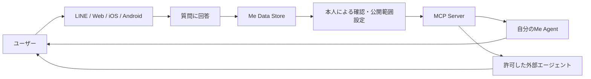
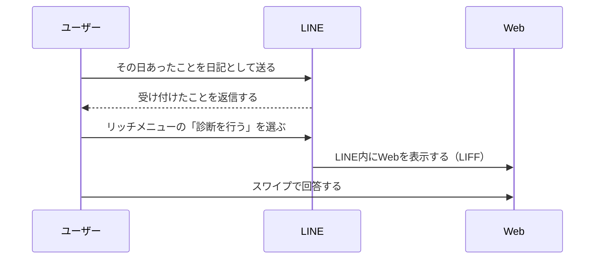
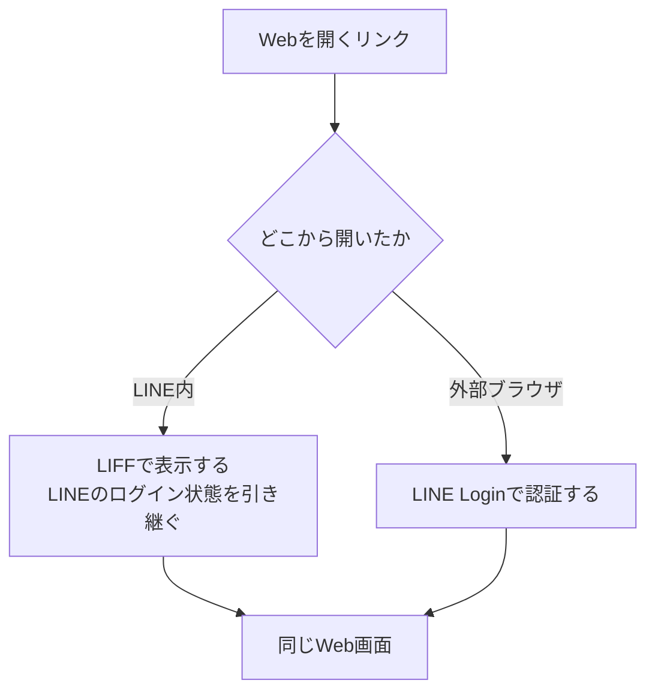

# me-builder プロジェクト概要

## 1. プロジェクトの目的

me-builderは、誰でも自分自身の価値観、経験、好み、考え方をデータとして蓄積し、その人らしく応答する「自分の分身（Me Agent）」を作成できるサービスです。

単なるプロフィール作成ではなく、継続的な質問への回答を通じて「その人が何を知っているか」「何を好むか」「どのように判断するか」を少しずつ表現できる状態を目指します。蓄積した情報は、本人の許可に基づき、MCP（Model Context Protocol）を介してさまざまなAIエージェントから利用できるようにします。

## 2. 解決したい課題

現在のAIサービスでは、サービスごとにプロフィールや好みを入力し直す必要があります。また、一般的なプロフィール項目だけでは、その人らしい判断やニュアンスを十分に表現できません。

me-builderは次の状態を実現します。

- ユーザーが、日常の中で無理なく自分に関する情報を蓄積できる
- 文章だけでなく、選択肢、画像、動画、音声などで自分を表現できる
- 一度蓄積した情報を、複数のAIエージェントで安全に再利用できる
- どの情報を、どのエージェントへ、何の目的で渡すかを本人が制御できる

## 3. 中核となる要件

### 3.1 多様な質問に回答する

ユーザーは多数の質問に回答し、自分を表すデータを蓄積します。質問と回答は、単一の形式に限定しません。

#### 質問の表現形式

- テキスト
- 選択肢
- 写真・イラスト
- 動画
- 音声
- 複数の形式を組み合わせた質問

例：「休日に近い過ごし方を、次の写真から選んでください」「この音楽を聴いてどう感じますか」「大切にしている価値観を文章で教えてください」

#### 回答の入力形式

- 自由記述
- 単一選択・複数選択
- 数値・尺度・ランキング
- 写真・画像のアップロードまたは選択
- 動画のアップロードまたは選択
- 音声の録音または選択
- 質問のスキップ、あとで回答

質問の分類や公開範囲、回答の履歴など、詳細な管理方法はデータ構想とあわせて今後検討します。利用体験としては、回答後の修正や公開範囲の変更ができることを要件とします。

Phase 1で実際に提供する入力の形式は[§4](#4-想定する利用体験)で確定しています。

### 3.2 MCPでエージェントへ提供する

蓄積した情報をMCPサーバーとして公開し、本人が許可したAIエージェントから利用できるようにします。

初期のMCP機能候補は次のとおりです。

| 機能 | 用途 |
| --- | --- |
| `get_profile` | 基本プロフィールと利用可能な情報カテゴリを取得する |
| `search_answers` | 目的やキーワードに関連する回答を検索する |
| `get_preferences` | 好み、価値観、避けたいことを取得する |
| `ask_me` | 蓄積情報を根拠に、本人らしい回答候補を生成する |
| `get_evidence` | 生成内容の根拠となった回答を確認する |

MCPの利用では、次を必須とします。

- ユーザー本人による接続許可
- エージェントごとの権限スコープ
- 目的に必要な最小限の情報だけを返す仕組み
- 接続解除と権限変更
- いつ、どのエージェントが、何を取得したかを確認できる監査ログ
- センシティブな情報やメディア原本に対する追加確認

MCPへは、可能な限り写真や音声などの原本ではなく、本人が確認できる要約・特徴・回答を提供します。原本が必要な場合だけ、用途と有効期限を限定したアクセスを許可します。

`get_evidence`が返す範囲と、外部のエージェントへConfidenceをどの粒度で開示するかは[根拠・反証・改訂のエッジ設計 §6](../domain/brain/evidence-edge-design.md#6-外部への開示)で確定しています。

## 4. 想定する利用体験

LINEとWebをまたぐ入口、Webの主ナビゲーション、診断・本人向け情報・AI相談・管理者画面の接続は[全体画面遷移設計](screen-navigation.md)を正とします。

1. ユーザーがLINE、Web、iOS、Androidなどからサービスを利用する
2. 短い質問やテーマ別の質問セットに回答する
3. 回答からプロフィール、好み、価値観などが整理される
4. ユーザーが内容と公開範囲を確認・修正する
5. 許可したエージェントがMCP経由で必要な情報を取得する
6. エージェントが本人らしい回答や提案を返す

### Phase 1の入力体験

**確定**: Phase 1で対応するチャネルはLINEとWebの2つとし、入力を「日記」と「スワイプ診断」の2本立てにします。

| 入力 | チャネル | 起点 | 形式 | 想定頻度 |
| --- | --- | --- | --- | --- |
| 日記 | LINE | ユーザー起点。書きたいときに送る | 自由記述（写真を添えられる） | 毎日から不定期 |
| スワイプ診断 | Web | サービス起点。LINEからリンクを配信する | 1問1画面の選択 | 1日1回 |

Phase 1の日記入力を、後続段階で日々の対話と助言へ発展させる目標体験は[日記チャット体験設計](diary-chat-experience.md)を正とします。

2本立てにする根拠:

- 自由記述だけでは構造化された情報が取れず、選択肢だけでは本人の言葉が取れない。両方が必要
- 日記はユーザー起点なので邪魔にならず、毎日書くハードルが最も低い。蓄積の量を担う
- 診断は運営が設計した質問なので、狙った軸の回答を確実に取れる。選択肢なので迷わず、1日1回で継続しやすい
- LINEが配信と通知を担うことで、Web単独では作れない再訪の導線になる

採らなかった代替案:

- **日記も診断もLINEのトーク内で完結させる**: クイックリプライやリッチメニューで選択は取れるが、スワイプの操作感が出せず、連続回答でトーク履歴が埋まって日記の記録が埋もれる
- **日記もWebで書く**: 毎日Webを開かせる摩擦が大きく、蓄積の量を担えない
- **iOS・Androidネイティブアプリを起点にする**: [§9](#9-mvpの範囲)で後続リリース範囲として整理済み

#### LINEからWebへの遷移とログイン

診断一覧、回答、回答内容、LINE通知、リッチメニューの詳細なUIと遷移は[Phase 1 診断体験設計](../diagnosis/diagnosis-experience.md)を正とします。

**確定**: LINEで配信するリンクには認証情報を持たせず、本人性はLINE側のログイン状態が保証します。

**確定**: LINE内からの主導線はLIFF（LINE Front-end Framework）でWebを開く形とします。あわせて、外部ブラウザから独立して開けるWebも維持し、そちらはLINE Loginによる認証を通します。

| 導線 | 開き方 | 本人性の保証 |
| --- | --- | --- |
| LINE内（主導線） | トークやリッチメニューのリンクをLIFFで開く | LIFFが引き継ぐLINEのログイン状態 |
| 外部ブラウザ | URLを直接開く | LINE Login |

根拠:

- LINEのトークに送るリンクは転送・コピーされうる。リンク自体に認証を持たせると、転送先の第三者が本人の診断に回答できてしまう
- リンクは「どの診断か」だけを指し、本人性はLINE側が保証する構成にすることで、リンクが漏れても回答されない。この原則はLIFFでも外部ブラウザでも同じ
- スワイプ診断は1日1回の反復操作なので、回答のたびにログイン画面を挟む摩擦が継続率へ直接効く。LINE内ではLIFFがログイン状態を引き継ぐため、リンクを開いてそのまま回答へ入れる
- 外部ブラウザの導線を残すのは、Webの利用をLINE内で開くことだけに依存させないため。公開範囲を広げる操作とMCP接続の管理はWebに限定しており（[次節](#チャネルごとの役割分担)）、これらは対象の一覧と変更前後の差分の提示を必要とするので、画面の広さを選べる状態を保つ
- どちらの導線でもログイン手段はLINEだけ（[§5](#5-アカウントと本人識別)）なので、導線を2つ持っても認証の入口は増えない

LIFFで得られる識別子をAccountへ束ねる方法は[§5](#5-アカウントと本人識別)で確定しています。

採らなかった代替案:

- **LIFF単独に絞る**: 実装は減るが、公開範囲設定やMCP接続の管理までLINE内に閉じることになり、外部ブラウザで独立して開ける導線を失う
- **LIFFを採らず外部ブラウザだけで開く**: 実装は最小だが、回答のたびにLINE Loginの画面を挟むことになり、1日1回の反復操作に対して摩擦が大きい
- **リンクに使い捨てのトークンを埋める**: 転送された時点で第三者が回答できる状態になり、本人の分身に他人の回答が混ざる

#### チャネルごとの役割分担

| 操作 | LINE | Web |
| --- | --- | --- |
| 日記の入力 | 担当する | 提供しない |
| 診断の回答 | リンクを配信する | 担当する |
| 直前に送った日記の送信取り消し | 行える | 担当する |
| 回答・日記の一覧確認、修正、削除 | 一覧はWebへ誘導する | 担当する |
| 公開範囲を広げる操作 | 提供しない | 担当する |
| MCP接続の許可・解除・アクセス履歴 | 提供しない | 担当する |

根拠: 公開範囲の設定には、対象の一覧、変更前後の差分、影響するMCP接続先の提示が必要で、トーク画面では誤操作の危険が大きい。公開範囲を広げる操作をWebに限定することで、LINE側の誤操作が意図しない情報開示につながらない（狭める操作や取り消しは、誤操作でも安全側に働く）。

送信取り消し、撤回、削除の意味と対象は[Source Recordのライフサイクル設計 §7](../domain/source/source-record-lifecycle-design.md#7-日記の取り消しと撤回)をSSoTとします。

#### 質問の作成と版管理

Question、Diagnosis、DiagnosisResponseの集約、状態、不変条件と、回答をSource Recordとして扱う関係は[Phase 1 診断ドメイン設計](../diagnosis/diagnosis-domain-design.md)を正とします。

**確定**: 診断の質問は運営（me-builder側）が作成・審査・更新します。ユーザーによる質問作成は提供しません。公開済みの質問文は書き換えず、改訂は新しい版として追加し、既存の回答は回答した時点の版を指し続けます。

根拠:

- 質問文が変わると、それに紐づいた既存の回答の意味も変わる。回答を横断して比較するには版管理が前提になる
- ユーザー投稿の質問には、誘導的な質問や機微情報の直接収集に対する審査が必要で、Phase 1のスコープを超える

採らなかった代替案:

- **ユーザーが自分用の質問を作れるようにする**: 蓄積量は増えるが、質問の審査体制が必要になる
- **AIが質問文を動的に生成する**: 毎回質問文が変わるため回答を横断して比較できず、機微な内容を誘導的に聞く危険もある

#### Phase 1でAIを使わない範囲

**確定**: Phase 1の入力から蓄積までの経路でAIを使いません。日記の本文も診断の回答も、本人が入力したまま記録します。

分類、要約、推定、公開範囲の自動判定はPhase 2以降で設計します。回答をどこまで構造化し、どこからAIで解釈するかの境界も、蓄積したデータを見てから決めます。

根拠:

- Phase 1の検証対象は「回答を続けたくなるか」（[§11](#11-段階的な進め方)）であり、AIの精度は変数として不要
- [ラベル判定前の本文をLLMや外部検索サービスへ送らない](../domain/brain/brain-access-label-design.md#1-結論)という制約があるため、公開範囲の判定方法を決める前に本文をAIへ渡す実装を入れられない

## 5. アカウントと本人識別

iOS、Android、Web、LINEは利用チャネルとして扱います。どのチャネルから利用しても同じ分身へアクセスできることを、アカウント体系の要件とします。

ログイン手段としては、LINE、Sign in with Apple、Google、メールアドレス、パスキーなどが候補になります。ただし、ユーザーの識別方法とログイン手段との紐づけ方、具体的なアカウント構造は、Phase 1で使う範囲を除いて決定しません。

### Phase 1のログイン手段と復旧方針

**確定**: Phase 1のログイン手段はLINEだけとします。LINE公式アカウントの友だち追加をアカウント作成の起点とし、Webの本人性もLINE側のログイン状態で保証します。導線ごとの開き方は[§4](#4-想定する利用体験)で確定しています。

**確定**: LINEアカウント自体を失った場合のアカウント復旧は、Phase 1では保証しません。代わりに蓄積したデータのエクスポートを提供し、復旧できないことを利用開始時に明示します。

復旧・移行のためにエクスポートへ含める原本、派生、履歴の範囲は[Source Recordのライフサイクル設計 §8](../domain/source/source-record-lifecycle-design.md#8-エクスポート)で確定しています。

根拠:

- 実装は既にLINE起点で進んでおり、ログイン手段を1つに絞ることでPhase 1の検証に不要な実装を増やさない
- ログイン手段が1つなら、[復旧手段がなくなる状態で最後のログイン手段を解除しない](../domain/domain-design.md#accountが守るルール)というルールと、解除操作を提供しないことで整合する
- 実在人物であることの厳格な本人確認を初期段階では必須としない方針（本節後段）と矛盾しない。復旧を保証しないことで失われるのは本人のデータのみで、第三者に被害が及ばない
- 復旧しない前提は「データの主導権はユーザー本人が持つ」という原則（[§13](#13-現時点のプロダクト原則)）に対して弱いため、エクスポートで補う

採らなかった代替案:

- **メールアドレスとマジックリンクを最初のログイン手段にする**: 復旧しやすくチャネルにも依存しないが、メール送信基盤が新たに必要になり、LINEを起点とする入力体験（[§4](#4-想定する利用体験)）と二重の導線になる
- **LINEとメールアドレスを同時に必須にする**: 登録の摩擦が上がり、回答を続ける体験の検証に不利
- **パスキーを最初の手段にする**: Web単独なら有力だが、LINEからリンクを開く導線と二重管理になる

**確定**: Messaging APIで得られる利用者の識別子とLINE Loginで得られる識別子は、同じAccountへ束ねられます。

LINEの利用者の識別子は**プロバイダー単位**で一意であり、チャネル単位ではありません。Messaging APIチャネルとLINE Loginチャネル（LIFFを含む）を同一プロバイダー配下に置く限り、両者は同じ値になります。Phase 1の実装で実機確認済みです。

このため、**チャネルを同一プロバイダー配下に置くことがアカウント体系の前提**になります。別のプロバイダーへチャネルを作ると識別子が一致せず、同じ人物を1つのAccountへ束ねる手段を別途用意する必要があります。プロバイダー間でチャネルを移動する手段はないため、チャネルを追加する際に確認します。

2つ目以降のログイン手段（Sign in with Apple、Google、メールアドレス、パスキーなど）の追加はPhase 2以降に検討します。

アカウント設計では次を考慮します。

- 複数ログイン手段の追加・解除
- 同一人物の誤った重複登録を解消するアカウント統合
- 端末紛失や外部アカウント停止時の復旧
- 認証情報とプロフィール・回答データの分離
- データのエクスポート、退会、削除
- 将来的な家族・組織・代理管理への拡張

初期段階では、実在人物であることの厳格な本人確認は必須としません。「サービスを利用する人」と「分身が表現する対象」の関係については、利用場面を具体化した後に検討します。ただし、第三者になりすます分身の公開は禁止し、公開範囲が広い機能では追加の本人確認を検討します。

## 6. データ構想

データの構造、保存方式、各データの関係は現時点では未定です。利用体験、対応する質問・回答形式、MCPでの提供方法、プライバシー要件を具体化した後に設計します。

設計時には、少なくとも次の観点を検討します。

- 本人が入力した回答と、AIが生成・推定した情報の区別（ドメイン上の整理は[ドメイン設計 §6](../domain/domain-design.md#6-ドメイン間の関係)で確定済み）
- テキスト、画像、動画、音声を横断して扱う方法
- 回答の変更履歴と、時間による価値観・嗜好の変化の表現
- ユーザーが設定する公開範囲、同意、削除状態の管理
- MCP接続先ごとの権限とアクセス履歴
- データの移行とエクスポートの具体的な形式、および物理削除の方法（対象範囲は[Source Recordのライフサイクル設計](../domain/source/source-record-lifecycle-design.md)で確定済み）

具体的なデータモデルやデータストアは、この概要では決定しません。

## 7. 付加機能

中核機能の上に、次の体験を構築できます。

### 自分とのチャット

蓄積した回答を根拠に、自分の分身と対話します。回答には「本人が実際に答えた内容」と「AIが推定した内容」の区別を表示し、根拠を確認できるようにします。

日々の声かけから出来事と行動原理を探り、蓄積した記憶を使って助言する具体的な対話体験は[日記チャット体験設計](diary-chat-experience.md)を正とします。

本人がストレスの手がかりや早めのサインを振り返り、今できるセルフケアをAIへ相談する体験は[ストレスの手がかりとAIセルフケア相談体験設計](self-care-ai-consultation-experience.md)を正とします。

### 性格分析

質問への回答から性格傾向や価値観を整理します。医療的な診断として扱わず、分析手法、根拠、限界を明示します。ユーザー自身が分析結果を訂正・非表示にできます。

### 相性・マッチング

価値観、関心、コミュニケーション傾向などを使い、相性がよい可能性のある人物像や相手を提示します。単一のスコアだけで断定せず、「共通点」「補完関係」「注意が必要な違い」を説明します。実在ユーザー同士を紹介する場合は、双方の明示的な同意を必要とします。

1対1の招待リンクをLINEで共有し、双方の診断回答から相性を振り返る具体的な体験は[相性診断・うつし共有体験設計](compatibility-experience.md)を正とします。

### 写真への本人らしい回答

ユーザーが写真を送ると、写真の内容と蓄積された回答を組み合わせて、その人らしい感想、選択、提案を返します。顔、位置情報、周囲の人物などが含まれる可能性を考慮し、保存期間と二次利用を明示します。

## 8. プライバシーと安全性

本サービスは、本人の嗜好、思想、声、顔、交友関係などの機微な情報を扱う可能性があります。そのため、プライバシーは付加機能ではなく中核要件として扱います。

- 回答単位・カテゴリ単位で公開範囲を設定できる
- 初期状態は非公開とし、外部提供は明示的な同意を必要とする
- 利用目的、保存期間、二次利用の有無を説明する
- 通信時・保存時にデータを暗号化する
- 管理者を含めたアクセスを記録し、必要最小限に制限する
- ユーザーが回答の訂正、削除、エクスポートを行える
- AI学習への利用はサービス利用と分離して同意を得る
- 第三者の顔や声を含むメディアに配慮する
- 未成年者の利用には年齢に応じた同意・保護を設ける
- 分身による応答であることを相手に明示し、なりすましを防止する

## 9. MVPの範囲

最初のリリースでは、価値検証に必要な範囲へ絞ります。

### 含めるもの

- LINEを起点としたアカウント作成とLINEログイン（[§5](#5-アカウントと本人識別)）
- LINEでの日記入力と、Webでのスワイプ診断（[§4](#4-想定する利用体験)）
- 運営が作成・審査・更新する質問と、その版管理
- 複数形式の質問定義（テキスト、選択肢、画像）
- 回答入力（自由記述、選択、画像）
- 回答履歴、修正、削除
- 蓄積したデータのエクスポート
- ユーザー向けプロフィール要約（最初の診断横断体験は[自分の傾向サマリー体験設計](profile-summary-experience.md)を正とする）
- MCPによるプロフィール・回答検索
- エージェント接続の許可、解除、アクセス履歴

### 後続リリースで検討するもの

- 動画・音声による質問と回答
- iOS・Androidネイティブアプリ
- 自分の分身とのチャット
- 高度な性格分析
- ユーザー同士のマッチング
- 写真を入力とするマルチモーダル対話
- 分身の共有・公開
- 外部サービス向け開発者API

## 10. 成功指標の例

- 登録後に最初の回答を完了したユーザーの割合
- 1週間・1か月後にも回答を続けているユーザーの割合
- ユーザー1人あたりの有効回答数と回答形式の広がり
- プロフィール要約に対する本人の納得度
- MCP接続を1つ以上有効化したユーザーの割合
- 分身の回答に対する「自分らしい」という評価
- 権限設定やデータ削除を迷わず完了できる割合
- 意図しない情報開示や不正アクセスの件数

## 11. 段階的な進め方

Phase 1とPhase 2を通じて、2つの中核要件を満たすMVPを構築します。Phase 3以降で付加機能へ展開します。

### Phase 1: 回答を集める

回答を続けたくなる体験を検証します。入力体験は[§4](#4-想定する利用体験)、ログイン手段は[§5](#5-アカウントと本人識別)で確定しています。この段階では入力から蓄積までにAIを使わず、蓄積したデータ（Source Record）からBrain Itemを導出する処理はPhase 2以降で追加します。両者の関係は[ドメイン設計 §6](../domain/domain-design.md#6-ドメイン間の関係)で確定しています。

### Phase 2: 外部と接続する

MCPサーバー、認可、監査ログを提供し、複数のエージェントから安全に利用できることを検証します。

### Phase 3: 分身として使う

回答の検索、要約、根拠表示を活用し、自分とのチャットで「自分らしさ」を検証します。

### Phase 4: 分析と関係性へ広げる

性格分析、相性の説明、写真を使った対話などを追加します。

## 12. 今後決めること

Phase 1に必要な決定（対応チャネルと入力形式、チャネルの役割分担、ログイン手段と復旧方針、質問の作成主体と版管理、AIを使わない範囲）は[§4](#4-想定する利用体験)と[§5](#5-アカウントと本人識別)へ移しました。

### Phase 2で決めること

- Source RecordからBrain Itemを導出する処理と本人確認の流れ（ドメイン上の関係は[ドメイン設計 §6](../domain/domain-design.md#6-ドメイン間の関係)で確定済み）
- 回答をどこまで構造化し、どこからAIで解釈するか
- Access Labelの付与に関する未決事項（[Brainのラベル・アクセス制御設計 §11](../domain/brain/brain-access-label-design.md#11-今後決めること)）
- MCPの認証方式、権限スコープ、接続フロー

### 時期を定めずに残すこと

- 主な対象ユーザーと、最初に解決する具体的な利用場面
- Phase 2以降に追加するログイン手段と、その場合のアカウント統合・復旧手順
- 分身の回答品質と「本人らしさ」の評価方法
- メディアデータの保存期間と処理方法
- 公開・共有機能に必要な本人確認と不正利用対策
- 家族・組織による代理管理と、1つのAccountが複数のBrainを持つ体験の提供時期
- 対象地域に応じた個人情報保護・AI関連法令への対応

## 13. 現時点のプロダクト原則

1. データの主導権はユーザー本人が持つ
2. 本人の回答とAIの推定を混同しない。すべての情報について、根拠になった元データと導出方法を区別して示す
3. 情報は目的に必要な最小限だけを共有する
4. 分身であることと、回答の根拠・不確かさを明示する
5. 質問に答えるほど価値が増え、いつでも修正・削除できる
