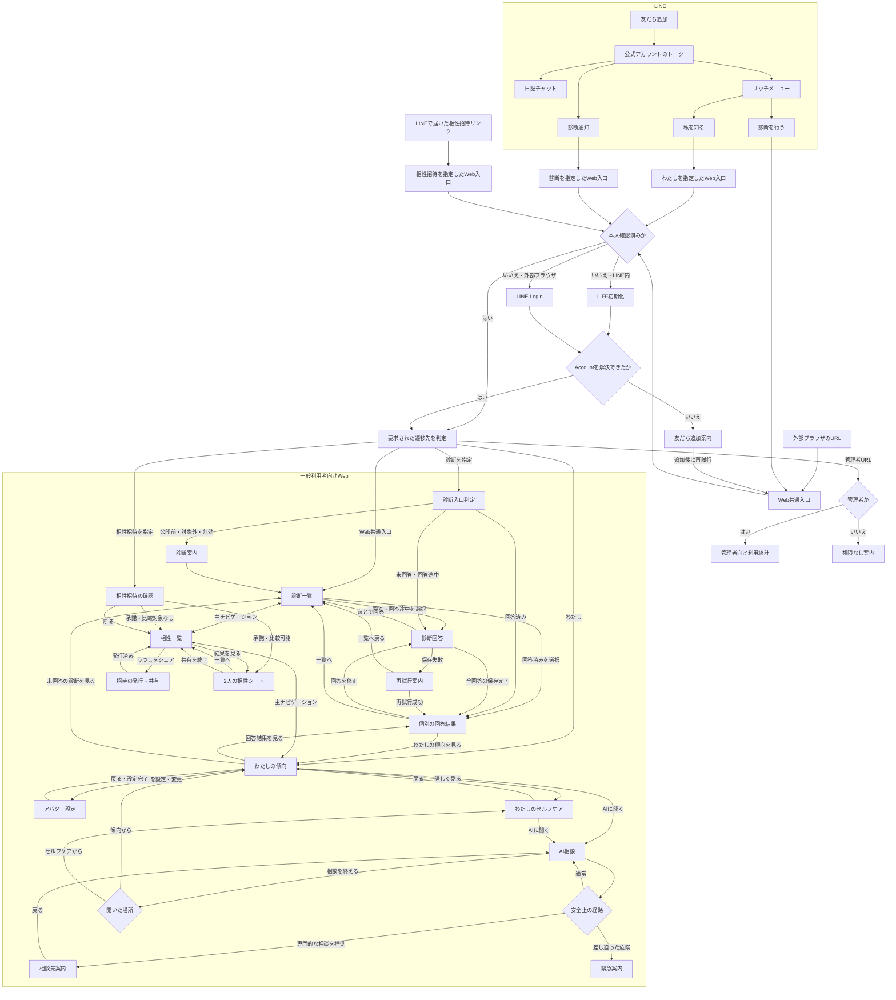
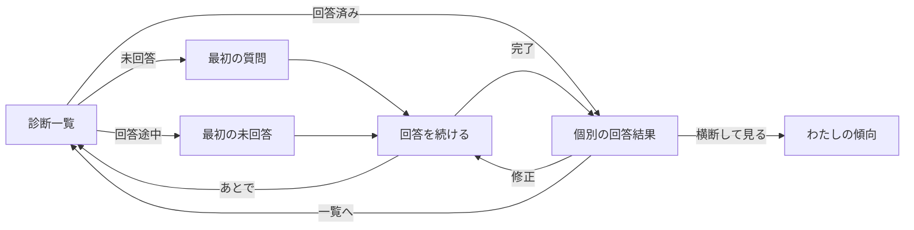
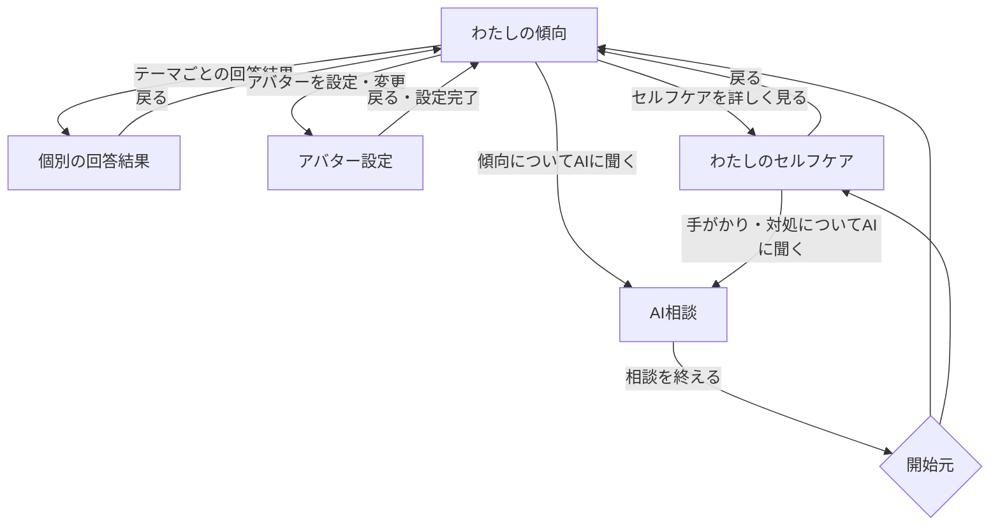
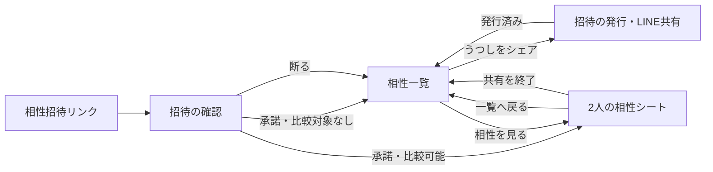
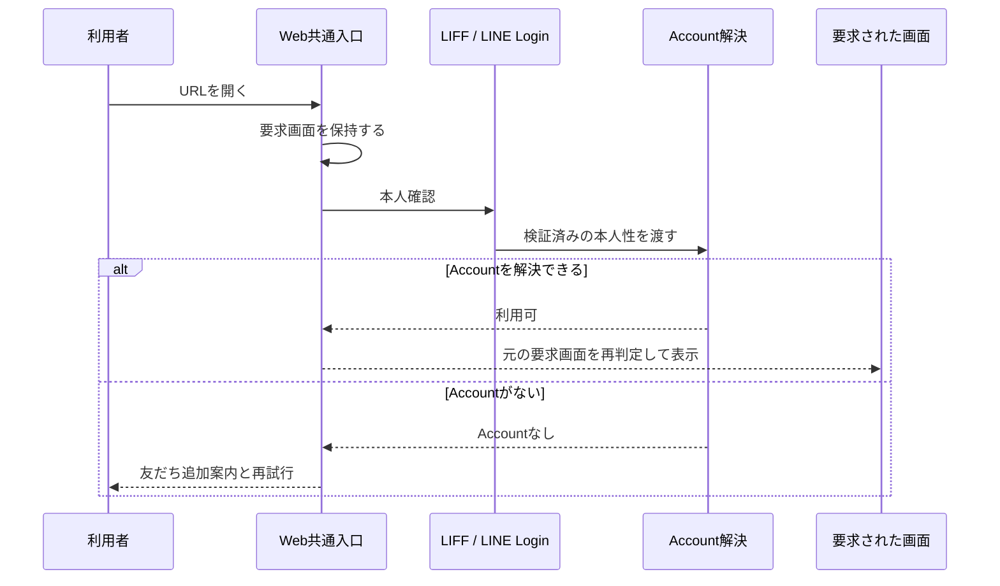
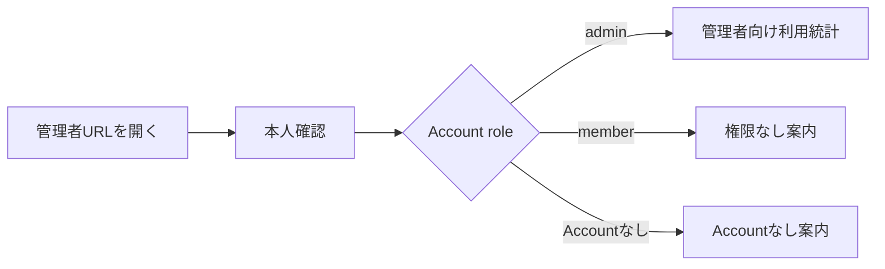

# 全体画面遷移設計

## 1. この文書の目的

この文書は、me-builderの利用者がLINEとWebを行き来し、日記、診断、相性、自分の傾向、アバター設定、セルフケア、AI相談へ到達するまでの全体画面遷移を定義します。チャネルをまたぐ入口、Webの主ナビゲーション、各画面の接続、認証後の復帰先、共通の例外遷移、および一般利用者と管理者の画面分離を所有します。

各画面内の表示と操作は、次の文書を正とします。

| 対象 | SSoT |
| --- | --- |
| LINEとWebの役割、本人識別 | [プロジェクト概要](project-overview.md) |
| 診断一覧、回答、個別の回答結果 | [Phase 1 診断体験設計](../diagnosis/diagnosis-experience.md) |
| 複数診断を横断した「わたしの傾向」 | [自分の傾向サマリー体験設計](profile-summary-experience.md) |
| 招待リンク、相性一覧、2人の相性シート | [相性診断・うつし共有体験設計](compatibility-experience.md) |
| アバターのアップロード、AI生成、選択、設定 | [アバター設定体験設計](avatar-experience.md) |
| 「わたしのセルフケア」とAI相談 | [ストレスの手がかりとAIセルフケア相談体験設計](self-care-ai-consultation-experience.md) |
| LINEの日記チャット | [日記チャット体験設計](diary-chat-experience.md) |
| 管理者向け利用統計 | [管理者向け統計ダッシュボード設計](../architecture/admin-statistics-dashboard.md) |

この文書は、画面内の文言、診断の状態判定、AIの返答内容、認証方式、URL、API、データベースの具体形を所有しません。また、ここで示すのは設計上の目標遷移であり、すべてが実装済みであることを表しません。

## 2. 結論

利用者向け体験は、LINEとWebで役割を分けます。

- LINEは、友だち追加を起点とするAccount作成、日記チャット、診断通知、Webへの入口を担当する
- Webは、診断への回答、個別の回答結果、相性、自分の傾向、アバター設定、セルフケア情報、AI相談を担当する
- Webの主ナビゲーションは、左から「わたし」「診断」「相性」の3項目にする
- AI相談は主ナビゲーションへ独立した項目を増やさず、「わたしの傾向」または「わたしのセルフケア」から文脈付きで開く
- 管理者画面は一般利用者の主ナビゲーションへ表示しない

```text
LINE
├── 日記を書く・相談する
└── Webを開く
    ├── わたし
    │   ├── わたしの傾向
    │   ├── アバター設定
    │   ├── わたしのセルフケア
    │   └── AIに聞く
    ├── 診断
    │   ├── 診断一覧
    │   ├── 回答
    │   └── 個別の回答結果
    └── 相性
        ├── 相性一覧
        ├── うつしをシェア
        └── 2人の相性シート
```

## 3. 全体画面遷移図



差し迫った危険を示す`緊急案内`は、AI相談へ戻すことを主操作にしません。現地の緊急窓口、医療機関、信頼できる人へ連絡する行動を優先します。詳細は[ストレスの手がかりとAIセルフケア相談体験設計 §7](self-care-ai-consultation-experience.md#7-安全性)を正とします。

## 4. Webの情報構造

### 4.1 主ナビゲーション

Webの一般利用者向け画面では、次の3項目を左から同じ位置と順序で表示します。

| 項目 | ルート画面 | 役割 |
| --- | --- | --- |
| わたし | わたしの傾向 | 複数診断の傾向と本人向け情報を確認する |
| 診断 | 診断一覧 | 未回答、回答途中、回答済みの診断を探す |
| 相性 | 相性一覧 | うつしを共有し、承諾済みの相手との相性を見る |

診断回答中、個別の回答結果、AI相談中は主ナビゲーションを操作の中心にしません。画面内の明示的な戻る操作を使い、回答途中や相談中の文脈を意図せず失わないようにします。

テーマ切替は画面の状態にかかわらず同じ位置から利用できますが、画面遷移には含めません。

### 4.2 「診断」配下



LINE通知から診断を直接開いた場合も、同じ診断入口判定を通り、回答状態に応じて回答または個別の回答結果へ進みます。

### 4.3 「わたし」配下



「わたしの傾向」は、診断結果の閲覧、次の診断、アバター設定、セルフケア、AI相談を接続する本人向けのハブです。ただし、MCP接続管理、公開範囲、エクスポートなど画面設計が未確定の機能を、この図だけで新しい遷移先として確定しません。

### 4.4 「相性」配下



相性招待は認証後も有効性と双方の同意を再判定します。2人の相性シートの内容、診断待ち、共有終了の振る舞いは[相性診断・うつし共有体験設計](compatibility-experience.md)を正とします。

## 5. 認証と要求画面への復帰

認証は独立した目的地ではなく、要求された画面へ入る前の共通ゲートです。



- LINE内ではLIFF、外部ブラウザではLINE Loginを使う
- 認証前に要求された診断、相性招待、2人の相性シート、わたし画面、管理者画面の区別を失わない
- 認証後も診断の公開状態、回答状態、管理者権限を改めて判定する
- 認証情報やAccount IDをURLへ含めない
- 認証失敗、Accountなし、権限なしを同じエラー表示へまとめない

## 6. 画面一覧

| 領域 | 画面・状態 | 主な入口 | 主な遷移先 |
| --- | --- | --- | --- |
| LINE | 公式アカウントのトーク | 友だち追加、既存トーク | 日記チャット、リッチメニュー、診断通知 |
| LINE | 日記チャット | 本人の送信、将来の声かけ | 同じトーク内で継続・終了 |
| 認証 | LIFF初期化・LINE Login | Web共通入口、直接リンク | 要求された画面、友だち追加案内 |
| 認証 | 友だち追加案内 | Accountを解決できない | 追加後の再試行 |
| 診断 | 診断一覧 | リッチメニュー、主ナビゲーション | 診断回答、個別の回答結果、わたしの傾向 |
| 診断 | 診断回答 | 診断一覧、直接リンク、回答修正 | 次の質問、診断一覧、個別の回答結果 |
| 診断 | 保存待機・再試行案内 | 全問操作後の未保存・保存失敗 | 個別の回答結果、診断一覧 |
| 診断 | 個別の回答結果 | 回答完了、回答済み診断、わたしの傾向 | 診断回答、診断一覧、わたしの傾向 |
| 診断 | 対象外・公開前・無効の案内 | 古い直接リンク | 診断一覧 |
| 相性 | 相性一覧 | 主ナビゲーション、招待の発行・承諾 | 招待の発行、2人の相性シート、診断一覧 |
| 相性 | 招待の発行・共有 | 相性一覧 | LINE共有、相性一覧 |
| 相性 | 招待の確認 | LINEで届いたリンク | 相性一覧、2人の相性シート |
| 相性 | 2人の相性シート | 相性一覧、招待の承諾 | 相性一覧、共有終了 |
| 相性 | 無効・期限切れ・共有終了の案内 | 古い直接リンク、状態変更 | 相性一覧 |
| わたし | わたしの傾向 | リッチメニュー、主ナビゲーション、個別の回答結果 | 個別の回答結果、診断一覧、アバター設定、セルフケア、AI相談 |
| わたし | アバター設定 | わたしの傾向 | わたしの傾向、同画面内のアップロード・生成候補選択 |
| わたし | わたしのセルフケア | わたしの傾向 | わたしの傾向、AI相談 |
| AI | AI相談 | 傾向、セルフケア | 開始元、相談先案内、緊急案内 |
| AI | 相談先案内 | AIの安全判定 | AI相談、外部の相談先 |
| AI | 緊急案内 | AIの安全判定 | 外部の緊急窓口・医療機関・信頼できる人 |
| 管理 | 管理者向け利用統計 | 管理者URL | 同画面内の再取得 |
| 管理 | 権限なし案内 | 非管理者による管理者URL | 一般利用者向けWeb |

回答削除の確認、回答内容の開閉、AI相談後の評価などは、元画面の文脈を維持する一時的なUIです。独立した主画面としてナビゲーションへ追加しません。

## 7. 戻る・再読み込み・直接リンクの規則

- 認証後は、認証前に要求された画面へ戻す
- サマリーから個別の回答結果を開いた場合はサマリーへ、診断一覧から開いた場合は診断一覧へ戻す
- 相性招待の確認または2人の相性シートから戻る場合は相性一覧へ戻す
- AI相談を終えた場合は、相談を開始した傾向またはセルフケアへ戻す
- アバター設定を終えるか中断した場合は、わたしの傾向へ戻す。AI生成中に戻っても生成処理は中止しない
- 開始元を復元できない直接リンクでは、領域のルート画面へ戻す。診断は診断一覧、相性は相性一覧、本人向け情報はわたしの傾向とする
- 再読み込みしても同じ主画面を復元し、本人確認と閲覧可否を再判定する
- 戻る操作で未保存の回答や入力が失われる場合は、破棄されることを確認する
- 通信失敗時は白画面にせず、同じ操作の再試行と安全なルート画面への退避を用意する
- 別Accountへ切り替わった場合は、以前のAccountの画面内容や戻る履歴を表示しない

## 8. 一般利用者と管理者の分離

管理者向け利用統計は、一般利用者向けWebと同じ認証基盤を使っても、主ナビゲーションと認可境界を共有しません。



- 一般利用者の「わたし」「診断」「相性」へ管理者項目を表示しない
- URLを知っていることを認可根拠にしない
- 管理者でない場合に統計データを部分表示しない
- 管理者画面から一般利用者の個人回答へ遷移する導線を、この設計では追加しない

## 9. 完了条件

- LINEの友だち追加、日記、リッチメニュー、診断通知から目的の体験へ到達できる
- LINE内と外部ブラウザのどちらからでも、本人確認後に要求した画面へ復帰できる
- Webの「わたし」「診断」「相性」を相互に移動できる
- 未回答、回答途中、回答済みの各診断から正しい画面へ進める
- 個別の回答結果と、診断横断の「わたしの傾向」を往復できる
- LINEで届いた相性招待を本人確認後に承諾し、双方の相性一覧と2人の相性シートへ到達できる
- 「わたしの傾向」からアバター設定へ進み、設定または中断後に戻れる
- 「わたしの傾向」からセルフケア詳細とAI相談へ進める
- AI相談終了後に開始元へ戻り、安全上の懸念がある場合は通常相談から適切な案内へ切り替わる
- 再読み込み、直接リンク、認証失敗、Accountなし、権限なし、通信失敗で行き止まりや白画面にならない
- 一般利用者向け主ナビゲーションから管理者画面へ遷移しない

## 10. この設計で決めないこと

- 具体的なURL、ルーター、ブラウザ履歴の実装
- MCP接続、公開範囲、データエクスポートの画面遷移
- 日記・回答履歴を横断する一覧画面
- AI相談をLINEでも提供する場合のチャネル間Session引き継ぎ
- 管理者向けの利用者検索、質問管理、診断管理
- iOS・Androidネイティブアプリのナビゲーション

これらは各体験が設計された時点で全体図へ接続し、未設計の画面を図だけで確定しません。
