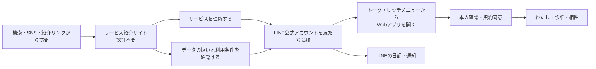
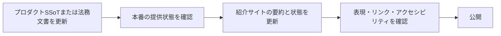

# サービス紹介サイト設計

## 1. 目的と所有範囲

この文書は、未ログインの人へサービスを紹介し、内容とデータの扱いを理解したうえで利用開始へ進んでもらうための公開サイトについて、役割、情報設計、サイトマップ、ページ構成、掲載内容の原則を定義します。

### 所有する概念

- サービス紹介サイトの目的と、ログイン後のWebアプリとの役割分担
- 公開ページのサイトマップと初期公開範囲
- トップページのセクション構成、CTA、各ページの掲載要件
- 公開情報の表現、更新、アクセシビリティ、計測に関する原則
- サイト公開前に解消する項目と受け入れ条件

### 所有しない概念

- サービスの目的、提供Phase、機能要件は[プロジェクト概要](project-overview.md)を正とします
- LINEとログイン後のWebアプリ内の画面遷移は[全体画面遷移設計](screen-navigation.md)を正とします
- 診断、わたしのまとめ、相性、AI相談などの個別体験は、それぞれの体験設計を正とします
- うつしとミラの役割、外見、既存アセットは[キャラクターデザイン](../design/character-design.md)を正とします
- 利用規約の本文と同意方法は[サービス利用規約・同意体験設計](service-terms-consent-experience.md)を正とします
- ホスト名、デプロイ先、ルーター、CMS、分析製品の選定
- 広告施策、SNS運用、検索キーワードごとの記事制作

初期実装では既存のWeb UI内で役割をパス分離し、`/`を紹介トップ、`/app`をWebアプリの共通入口とします。既存の`/diagnosis`、`/me`、`/compatibility`、`/profile`、`/admin`とLIFF deep linkは本人向けWebアプリとして維持します。ホスト名やデプロイプロジェクトを分ける判断は後続へ延期します。

## 2. 結論

サービス紹介サイトは、本人データを扱うWebアプリの手前に置く、認証不要の公開サイトとします。訪問者が短時間で「何のサービスか」「何ができるか」「何を記録し、どう扱うか」「どう始めるか」を判断できることを優先します。

初期公開は、トップページを中心とした小さな構成にします。機能ごとの紹介ページや読み物を先に増やさず、トップページ、利用規約、プライバシーポリシー、問い合わせの4領域を揃えます。



主CTAはLINE公式アカウントの「友だち追加」とし、日記、通知、日々の声かけを使い始める導線へ接続します。本人向けWebアプリは、友だち追加後のトークやリッチメニュー、既存のLIFF deep linkから開きます。外部ブラウザから直接ログインする導線は公開サイトの主CTAにせず、既存利用者向けの`/app`として維持します。

## 3. 想定する訪問者と達成したい状態

[プロジェクト概要](project-overview.md#12-今後決めること)では、主な対象ユーザーと最初に解決する具体的な利用場面を未決定としています。そのため、このサイト設計では年齢、職業、家族構成などの市場ペルソナを確定しません。

初期サイトが対象とするのは、サービス名やリンクを知ったものの、利用開始前に内容を確かめたい人です。

| 訪問時の疑問 | サイトを見た後の状態 |
| --- | --- |
| 何をするサービスなのか | LINEの日記とWebの診断を通じて、自分の考え方や傾向を振り返るサービスだと説明できる |
| 使うと何が返ってくるのか | 記録から「わたしのまとめ」などを確認できると分かる |
| 性格や相性を断定されないか | 入力した範囲から見える傾向であり、医療的・心理学的な診断ではないと分かる |
| 入力した内容が勝手に公開されないか | 初期状態では本人向けで、他者との共有には別の同意が必要だと分かる |
| LINEの友だち追加が必要なのか | 公開サイトからの開始は友だち追加へ進み、既存利用者はトークやリッチメニューからWeb機能を開くと分かる |
| どう始めるのか | 主CTAから迷わずLINE公式アカウントの友だち追加へ進める |

初期公開で優先する訪問文脈は次の3つです。

1. LINE公式アカウントや知人から紹介され、サービスの安全性を確認する
2. 検索やSNSから訪れ、自己理解にどう役立つかを確認する
3. 相性招待リンクを受け取り、承諾前にサービス全体を確認する

相性招待リンク自体は紹介サイトへ迂回させず、本人確認後に要求された招待画面へ戻します。招待画面から「サービスについて」を別タブで確認できる導線を設けても、元の招待状態を失わせません。

## 4. サイトマップ

### 4.1 初期公開

```text
サービス紹介サイト
├── トップ
│   ├── サービス概要
│   ├── できること
│   ├── 使い方
│   ├── データと安全性
│   ├── 現在の利用料金
│   ├── よくある質問
│   └── 利用開始CTA
├── 利用規約
├── プライバシーポリシー
└── お問い合わせ

Webアプリ
├── 本人確認・規約同意
└── ログイン後の各画面
```

| パス | 役割 | 初期公開 |
| --- | --- | --- |
| `/` | サービスの価値、主要体験、安全性、利用開始を1ページで伝える | 必須 |
| `/terms` | 現在の利用規約を認証前にも閲覧できるようにする | 必須 |
| `/privacy` | 取得情報、利用目的、外部送信、保存、安全管理、問い合わせ先を示す | 必須 |
| `/contact` | 利用前の質問、不具合、プライバシー、権利侵害の連絡先を示す | 必須 |
| `/app` | LINEによる本人確認後、要求されたアプリ画面へ進む共通入口 | 必須 |

利用規約とプライバシーポリシーは、トップページの一部だけに埋め込まず、個別URLで直接参照できるようにします。Webアプリの同意画面、プロフィール、LINEの案内からも同じ公開文書へ到達できるようにします。

公開ページの初期HTMLは、末尾スラッシュなしの上記パスへリダイレクトせずHTTP 200で応答させます。これにより、ブラウザのpathname、canonical URL、OG URLを同じ公開URLへ揃えます。

### 4.2 後続候補

次は、掲載できる実績や問い合わせが増えたときに追加を判断します。初期公開の必須範囲には含めません。

| ページ候補 | 追加条件 |
| --- | --- |
| 機能別の詳しい紹介 | トップだけでは主要体験を説明しきれず、検索や案内で独立ページが必要になった |
| お知らせ | 障害、規約改定、機能提供状況など、継続的に公開すべき更新が生じた |
| 安全性・データ管理 | プライバシーポリシーとは別に、平易な説明やセキュリティ情報を継続更新できる体制ができた |
| 使い方・ヘルプ | 問い合わせで繰り返し発生する操作上の疑問が蓄積した |
| 開発者向け情報 | MCPや外部連携を実際に一般提供するPhaseへ進んだ |

将来機能だけを説明するページは作りません。提供前の機能に触れる場合は、現在利用できる機能と視覚的・文章的に分け、「構想中」「提供予定」など実態に合う状態を明記します。

## 5. グローバルナビゲーション

### ヘッダー

- 左: サービス名またはロゴ。選択するとトップへ戻る
- 中央またはメニュー: 「できること」「使い方」「安心して使う」「利用料金」「よくある質問」。初期公開ではトップ内の該当セクションへ移動する
- 右: LINE公式の「友だち追加」ボタン

モバイルでは、サービス名と主CTAを先に残します。メニューを開かなくても利用開始できる状態にし、アンカー項目はメニュー内へまとめられます。

### フッター

- サービス概要への短い導線
- 利用規約
- プライバシーポリシー
- お問い合わせ
- 運営者情報
- 著作権表示

ログイン後のWebアプリで使う「わたし」「診断」「相性」の主ナビゲーションは、紹介サイトのグローバルナビゲーションへ混ぜません。同じ見た目のナビゲーションで公開サイトと本人向け画面を行き来させないようにします。

## 6. トップページ構成

```text
┌─────────────────────────────────┐
│ ヘッダー                         │
│ サービス名   セクション導線   CTA │
├─────────────────────────────────┤
│ 1. ファーストビュー             │
│ 一言の価値 / 補足 / 主CTA・使い方 │
│ うつしとミラのサービスビジュアル │
├─────────────────────────────────┤
│ 2. 共感と課題                    │
├─────────────────────────────────┤
│ 3. できること                    │
│ 診断 / LINEの日記 / わたしのまとめ│
├─────────────────────────────────┤
│ 4. 使い方                        │
│ 始める → 答える → 振り返る       │
├─────────────────────────────────┤
│ 5. うつしとミラ                  │
├─────────────────────────────────┤
│ 6. データと安全性                │
├─────────────────────────────────┤
│ 7. 現在できること                │
├─────────────────────────────────┤
│ 8. 利用料金                      │
│ 現在は誰でも無料                 │
├─────────────────────────────────┤
│ 9. よくある質問                  │
├─────────────────────────────────┤
│ 10. 最終CTA                      │
├─────────────────────────────────┤
│ フッター                         │
└─────────────────────────────────┘
```

### 6.1 ファーストビュー

最初の画面だけで、自己理解のサービスであること、日記と診断を使うこと、LINEで始めることを理解できるようにします。

コピーの叩き台:

- 見出し: 「答えるたび、今のわたしが見えてくる。」
- 補足: 「LINEの日記と、気軽に答えられる診断から、あなたの考え方や大切にしていることを少しずつ整理します。」
- 主CTA: LINE公式の「友だち追加」ボタン
- 補助導線: 「使い方を見る」
- 安心材料: 「入力した内容は、初期状態で他の利用者へ公開されません。」

見出しだけで「AIが本人を完全に理解する」「本当の性格が分かる」と受け取れる表現は使いません。バナーを利用する場合は、[キャラクターデザイン](../design/character-design.md#バナー)で定義された文字用の余白とトリミング前提に従います。

### 6.2 共感と課題

「自分について聞かれても、すぐには言葉にしづらい」「そのときの気分だけではなく、日々の記録から振り返りたい」といった利用場面を短く示します。対象者の属性を狭く断定せず、本人が自分のために記録し、振り返る価値を中心にします。

不安、孤独、病気などを過度に強調して利用を促す表現や、専門的な支援の代わりになると受け取れる表現は使いません。

### 6.3 できること

初期公開では、現在の中核体験を次の順で紹介します。

| 体験 | 見出し案 | 伝えること | 詳細のSSoT |
| --- | --- | --- | --- |
| Webの診断 | 気軽な診断で、価値観を見つける | 1問ずつ答え、自分の回答結果を確認できる | [Phase 1 診断体験設計](../diagnosis/diagnosis-experience.md) |
| LINEの日記 | いつものLINEで、日々を残す | 書きたいときに送り、記録を自分の理解へつなげる | [日記チャット体験設計](diary-chat-experience.md) |
| わたしのまとめ | 記録から、今の自分を振り返る | 診断と記録から見える傾向を、変化しうる現在の姿として確認する | [わたしのまとめ仕様](profile-summary-experience.md) |

相性、セルフケア、AI相談、うつしレベルなどを掲載する場合は、公開時点の提供状況を確認して「現在できること」に含めるか、「これから」に分けます。設計済みであることを、一般提供済みであることとして表示しません。

### 6.4 使い方

初回利用の全体像を3段階で示します。

1. LINE公式アカウントを友だち追加する
2. Webの診断やLINEの日記で、自分のことを少しずつ記録する
3. 回答結果や「わたしのまとめ」で、今の自分を振り返る

詳しい認証フローや画面一覧は紹介サイトへ転載せず、[全体画面遷移設計](screen-navigation.md)を実装時の参照先とします。

### 6.5 うつしとミラ

キャラクターを装飾だけでなく、サービスの仕組みを平易に伝える案内役として使います。

- うつし: 回答が蓄積されるほど、その人らしさを映す存在
- ミラ: 質問や使い方を案内する存在

名称、造形、アセットをこの文書では再定義せず、[キャラクターデザイン](../design/character-design.md)を正とします。キャラクターが本人の全情報を知る、本人の代わりに意思決定する、心を読めるといった擬人化はしません。

### 6.6 データと安全性

利用開始前の判断に必要な内容を、法務文書へのリンクだけで済ませず平易に説明します。

- 入力した情報は初期状態で本人向けに扱う
- 本人の入力とAIが整理・生成した内容を区別する
- 他の利用者への共有は、対象と範囲を示して別に同意を求める
- 診断やAIの出力は医療行為、医学的診断、心理検査、その他の専門的助言ではない
- LINE Accountを利用できなくなった場合、事前に復旧コードを保存した有料契約Accountだけが復旧の対象であり、コードがなければ自動・有人のどちらでも同じAccountへの再接続や保存済みデータへの再アクセスを可能にしない
- 詳細は利用規約とプライバシーポリシーで確認できる

要約側で新しいデータ取扱規則を作りません。[プロジェクト概要のプロダクト原則](project-overview.md#13-現時点のプロダクト原則)と、公開済みの法務文書に一致する範囲だけを掲載します。

### 6.7 現在できること

機能一覧には、公開時点の状態を次のいずれかで付けます。

| 状態 | 意味 |
| --- | --- |
| 利用できます | 一般利用者が本番環境で利用できる |
| 準備中です | 提供内容は決まっているが、一般利用はまだできない |
| 構想中です | 将来像であり、提供内容や時期を約束しない |

「近日公開」「もうすぐ」など期限を想起させる表現は、公開日が決まっている場合だけ使います。機能の状態はデプロイのたびに手作業で推測せず、リリース責任者が公開前チェックリストで確認します。

### 6.8 利用料金

初期Productionで公開している機能は誰でも無料で利用できると表示します。有料Plan名、価格、無料トライアル、将来の購入条件は公開サイトへ掲載しません。課金実装とtest catalogはPreview検証用に保持し、一般提供を決定した場合だけ[サブスクリプション・料金プラン設計](subscription-plan-design.md)を先に更新します。

### 6.9 よくある質問

初期公開では、少なくとも次の質問へ回答します。

- 無料で使えますか
- 年齢制限はありますか
- LINE公式アカウントの友だち追加は必要ですか
- どのような情報を記録しますか
- 入力した日記や診断結果は誰に見えますか
- AIは何に使われますか
- 診断は医療的・心理学的な診断ですか
- LINE Accountを失った場合はどうなりますか

公開時点で利用できる機能だけを回答します。Account削除方法は公開サイトへ掲載せず、本人向け画面で提供する場合に案内します。

### 6.10 最終CTA

トップ末尾で価値を1文だけ振り返り、主CTAを繰り返します。新しい訴求や機能は追加しません。

- 見出し案: 「少しずつ、わたしを知っていこう。」
- 主CTA: LINE公式の「友だち追加」ボタン
- 副CTA: 「まずは利用規約とデータの扱いを見る」

## 7. 個別ページの要件

### 7.1 利用規約

- 認証せずに現在の規約本文を閲覧できる
- タイトル、version、適用日、本文を表示する
- 公開済みの正確な本文は[`service-terms.ts`](../../packages/shared/src/legal/service-terms.ts)を正とし、紹介サイト用の別本文を作らない
- 重要改定時の再同意は、公開ページではなくWebアプリの同意ゲートで扱う

### 7.2 プライバシーポリシー

公開前に、少なくとも次を具体化して掲載します。

- 運営者の正式名称と連絡先
- 取得する情報と取得方法
- 利用目的
- LINE、AIサービス、インフラなどの外部送信先と目的
- 他の利用者や第三者への提供条件
- 保存期間または決定方法
- 開示、訂正、削除、利用停止などの請求方法
- Cookie、localStorage、アクセス解析の利用
- 未成年者に関する扱い
- 改定方法、公開日、適用日

正式本文は[`privacy-policy.ts`](../../packages/shared/src/legal/privacy-policy.ts)を正とし、公開画面はその最新1版を表示します。

### 7.3 お問い合わせ

問い合わせ種別を少なくとも「サービスについて」「不具合」「契約・請求」「データとプライバシー」「権利侵害」に分けます。送信前に、返信に必要な連絡先と問い合わせ本文がどのように扱われるかを示します。

日記や診断回答の原文、復旧コード、認証token、LINE user IDなどの機微情報を入力するよう求めません。Account内データの変更は問い合わせでは受け付けず、本人向け画面だけで行います。問い合わせで得た情報を復旧コードの代わりにして、同じAccountへ再接続したり保存済みデータへのアクセスを付与したりしません。Customer Portalを利用できない有料契約の期間末解約は、Account復旧と分離して受け付けることを示します。

## 8. 表現とビジュアルの原則

### 8.1 トーン

- 本人を評価するのではなく、本人が振り返るための言葉を使う
- 「正しい自分」「本当の性格」「完全な分身」のような固定・完成を示す言葉を使わない
- AIを主体にせず、本人の入力と本人の判断を中心にする
- 不安をあおって登録を迫らない
- 将来の変化や、記録されていないことがある余地を残す

### 8.2 ビジュアル

- パステルを基調とする既存のサービスビジュアルを第一候補として使う
- 重要な説明を画像内の文字だけで伝えない
- キャラクター画像には役割が分かる代替テキストを付け、純粋な装飾なら空の代替テキストにする
- 細いパステル色だけで文字や操作の境界を示さず、本文とCTAのコントラストを確保する
- 動画や自動アニメーションを必須にせず、`prefers-reduced-motion`へ対応する

既存画像の構図、色、切り抜き前提は[キャラクターデザイン](../design/character-design.md)を参照します。サイト固有の配色token、タイポグラフィ、コンポーネント仕様は、実装または別のデザインシステム設計で定義します。

## 9. CTAと状態の規則

| CTA | 対象 | 遷移後の期待 |
| --- | --- | --- |
| 友だち追加 | サービスを使い始めたい人 | LINE公式アカウントの友だち追加へ進み、トークやリッチメニューから本人向けWebアプリを開ける |
| サービスについて | 招待など特定の目的でWebアプリへ来た人 | 紹介サイトを別タブで開き、元の目的と認証状態を失わない |

- CTAリンクへ認証情報、Account ID、個人データを含めない
- 既に友だち追加済みの場合も主CTAからLINE公式アカウントを開ける
- LINEアプリがない環境や遷移失敗時は、要件と再試行方法を説明する
- QRコードを使う場合は同じリンクをテキストでも提供し、QRコードだけを入口にしない

## 10. 検索、共有、計測

### 10.1 検索と共有

- ページごとに固有の`title`、説明、canonical URLを持つ
- トップのタイトルだけで、サービス名と自己理解を支援するサービスであることを伝える
- SNS共有画像は既存バナーを候補にし、サービス名を画像だけに依存させない
- 利用規約、プライバシーポリシー、問い合わせを検索と直接リンクから到達可能にする
- Webアプリの本人向け画面、招待状態、管理者画面を検索対象にしない

### 10.2 計測

初期サイトでは、個人の診断回答や日記と結びつけず、次の到達だけを確認できれば十分です。

- トップページの閲覧
- 主CTAの選択
- 利用規約、プライバシーポリシー、問い合わせへの遷移
- CTA遷移の失敗

分析製品を導入する場合は、プライバシーポリシーへ取得項目と送信先を反映し、同意が必要な地域・方式では取得前に適切な選択肢を提供します。広告目的の追跡や、本人向けアプリの行動との横断プロファイリングは初期サイトの目的に含めません。

## 11. 更新運用

機能を紹介サイトへ掲載する前に、その機能が本番で利用できるか、対象者、必要な同意、制約を対応するSSoTとリリース状態から確認します。



- サービスの定義や法務本文を紹介サイト側だけで変更しない
- 機能終了時はCTAを先に外し、古い直リンクにも終了または代替の案内を出す
- 規約は公開済みversionを追跡し、プライバシーポリシーは最新の版、制定日、適用日を公開する
- スクリーンショットを載せる場合は実画面と乖離していないか、個人データが含まれていないかを公開ごとに確認する

## 12. 公開前に解消する項目

公開前に残っている意思決定、法務確認、実環境検証とその完了条件は、[サービス紹介サイト残タスク](../development/service-site-remaining-tasks.md)を正とします。未決事項を紹介文のコピーで先回りして確定せず、特に運営者、問い合わせ先、プライバシーポリシー、料金は公開前のゲートとして扱います。

## 13. 初期公開の受け入れ条件

- 認証していない訪問者がトップ、利用規約、プライバシーポリシー、問い合わせを閲覧できる
- 最初の画面で、自己理解を支援するサービスであること、LINEの日記とWebの診断を使うこと、始め方が分かる
- 主CTAがLINE公式アカウントの友だち追加であることと、その後トークやリッチメニューからWeb機能を開くことが分かる
- 現在利用できる機能と将来機能を混同していない
- 現在公開している機能を誰でも無料で利用できることが分かり、有料Plan名、価格、無料トライアルを表示しない
- 本人の入力とAIの出力、本人向け利用と他者共有を混同していない
- 医療的・心理学的な診断や専門的助言でないことを、FAQまたは安全性の説明から確認できる
- 利用規約、プライバシーポリシー、問い合わせへ、トップとフッターから移動できる
- 相性招待などWebアプリへの直接リンクは、紹介サイト追加後も要求された画面へ復帰できる
- Webアプリの本人向け画面と管理者画面が検索結果へ公開されない
- キーボード、画面拡大、支援技術、動きを減らす設定で主要な情報とCTAを利用できる
- モバイルのLINE内ブラウザと外部ブラウザで、主要な文章とCTAが隠れない
- 公開サービス名、運営者、問い合わせ先、料金、掲載機能の状態が確定している
- 利用規約とプライバシーポリシーが実際の提供機能とデータ処理に一致し、必要なレビューを完了している

## 14. 初期公開で扱わないこと

- 認証不要の診断体験や、診断結果の公開
- 不特定多数へ向けたうつしの公開プロフィール
- 利用者の声、導入実績、満足度など、根拠を提示できない社会的証明
- MCPや外部AI連携を現在利用できる機能として訴求すること
- ブログ、診断テーマごとのSEOページ、比較記事の量産
- 問い合わせフォームからのAccount復旧や本人データ削除の即時実行
- Cookie banner、CMS、A/Bテスト基盤、分析製品の具体的な選定
