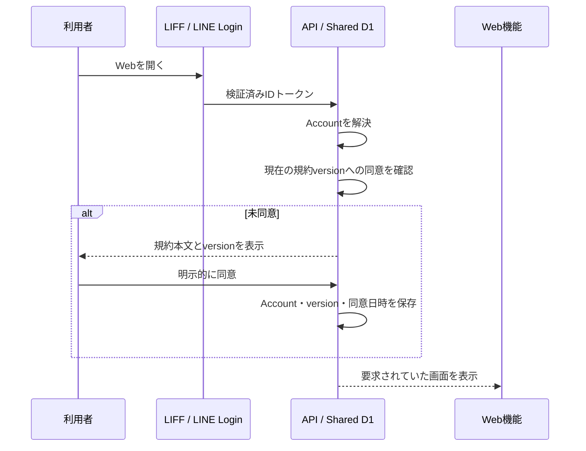
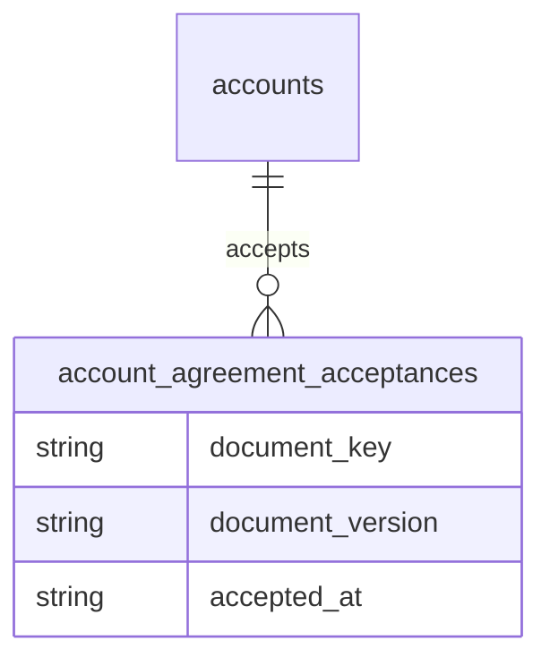

# サービス利用規約・同意体験設計

## 1. 目的と所有範囲

この文書は、サービス利用規約の版管理、Accountごとの同意記録、同意画面を表示するタイミング、同意前後の利用可能範囲を定義します。

この文書が所有しないもの:

- Accountの本人確認と作成は[プロジェクト概要](project-overview.md#5-アカウントと本人識別)を正とします
- Account運営情報と個人コンテンツの保存先は[Accountデータ分離設計](../architecture/account-data-isolation.md)を正とします
- 相手ごとの共有同意は[相性診断・うつし共有体験設計](compatibility-experience.md)を正とします
- 公開中の正確な規約本文は[`service-terms.ts`](../../packages/shared/src/legal/service-terms.ts)を正とします

## 2. 結論

規約は、LIFF／LINE Loginによる本人確認とAccount解決が成功した直後、診断・日記・プロフィールなどの本人データを取得または作成する前に表示します。本人を特定する前には「誰が同意したか」を保存できず、機能利用後では同意前にデータ処理が始まるため、この間を共通ゲートにします。

同意済みのversionが現在の必須versionと一致する間は、起動のたびに同意画面を出しません。重要な改定では新しいversionを公開し、同じゲートで再同意を求めます。プロフィールからは、現在の本文、version、本人の同意日時をいつでも確認できます。

## 3. 規約の版管理

- 文書識別子は`terms_of_service`とする
- versionは公開日を表す`YYYY-MM-DD`とし、同日に複数版を出す場合は末尾へ連番を付ける
- 公開済みversionの本文は編集・削除しない。改定は新しいversionを追加する
- 現在の必須versionは公開済み文書一覧の末尾とする
- 誤字修正であっても、同意時の表示内容が変わる場合は新しいversionにする
- AI学習、第三者提供、相性共有など目的の異なる任意同意を利用規約へ束ねない。将来は別の文書識別子と同意履歴で扱う

## 4. 同意記録

共有D1へ、Account ID、文書識別子、文書version、同意日時を追記型で保存します。同じAccount・文書・versionへの再送は最初の記録を返し、日時を上書きしません。

Account IDはクライアントから受け取らず、検証済みIDトークンからサーバーが解決します。LINE user ID、IDトークン、User-Agent、IPアドレスは同意の証明に不要なため保存しません。

## 5. 画面と状態

初回同意画面は規約タイトル、要約、version、適用日、全文、確認チェック、同意ボタンを表示します。チェックは初期状態で未選択とし、明示的な操作後だけ同意を送信します。

- 読み込み中: 規約と同意状態を確認中であることを表示する
- 未同意: 主機能をマウントせず、規約画面だけを表示する
- 保存中: 二重送信を防ぎ、進行状態をボタンへ表示する
- version競合: 最新本文を再取得し、古い画面のversionへ同意させない
- 失敗: 入力済みチェックだけで利用可にせず、再試行を表示する
- 同意済み閲覧: 同意ボタンを出さず、同意日時を表示する

## 6. 同意前の利用範囲

同意前に許可するのは、本人確認、Account解決、規約本文・同意状態の取得、同意記録だけです。診断回答、日記、プロフィール要約、相性共有など本人コンテンツの利用は同意後に開始します。

友だち追加だけではWeb同意画面を表示できないため、同意前のAccountを定時通知の対象にしません。LINEから先にメッセージを受けた場合の同意案内と、全APIを横断するサーバー側強制は、この共通ゲートと同じ同意記録を使って段階的に接続します。

## 7. 受け入れ条件

- 初回の検証済みLIFF利用では、主画面より先に現在の規約が表示される
- 同意完了まで主画面のAPI取得を開始しない
- 同意後の再訪では同じversionを再表示しない
- 新しい必須versionでは再同意が必要になる
- Account、文書識別子、version、最初の同意日時を確認できる
- 別Accountの同意を利用できない
- プロフィールから規約本文と同意日時を確認できる

## 8. 本番公開前の確認

- 運営者の正式名称と問い合わせ窓口を確定し、規約本文とサービス画面へ表示する
- 取り扱う個人情報、利用目的、外部送信先、保存・削除方法を記載したプライバシーポリシーを別文書として用意する
- 実際の事業形態と提供機能に照らして、利用規約とプライバシーポリシーの法務レビューを受ける
