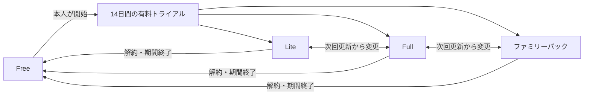
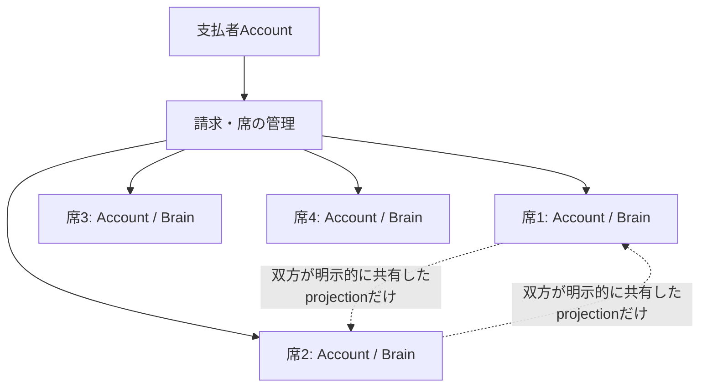

# サブスクリプション・料金プラン設計

## 1. 目的と所有範囲

この文書は、me-builderの無料版、有料版Lite、有料版Full、ファミリーパックについて、初期価格、利用できる価値、AI利用上限、トライアル、プラン変更、解約後の扱い、ファミリーパックのプライバシー境界を定義します。

### 所有する概念

- 料金プランの名称、価格、課金単位
- 各プランへ付与する利用権限
- media保存容量とPlan変更後の扱い
- AI利用上限へ到達した場合の利用者体験
- トライアル、アップグレード、ダウングレード、解約後の扱い
- ファミリーパックの席、支払者、参加者の境界
- 有料化前に満たす提供条件と価格検証

### 所有しない概念

- 日記チャットの会話原則、関係性を考慮した質問、安全性
- 「わたしのまとめ」、相性、セルフケアの画面内仕様
- Account、Brain、Source Recordのデータ所有とアクセス制御
- 決済事業者、API、テーブル、Webhookの実装方式
- 利用規約、特定商取引に関する表示、返金条件の法務本文

これらは[日記チャット体験設計](diary-chat-experience.md)、[わたしのまとめ仕様](profile-summary-experience.md)、[相性診断・うつし共有体験設計](compatibility-experience.md)、[ストレスの手がかりとAIセルフケア相談体験設計](self-care-ai-consultation-experience.md)、[Accountデータ分離設計](../architecture/account-data-isolation.md)、[サービス利用規約・同意体験設計](service-terms-consent-experience.md)を正とします。Stripeを利用する初期実装方針、実装順、PR単位の完了条件は[サブスクリプション実装残タスク](../development/subscription-remaining-tasks.md)で管理します。

## 2. 結論

最初の有料提供では、次の4プランを用意します。価格は税込の初期提供価格です。一般公開前に[§11](#11-価格と継続価値の検証)の実利用結果を確認し、変更する場合はこの文書を先に更新します。

商品名は`Lite`と`Full`を維持します。コンパクトなプラン選択UIでは、役割が直感的に分かる補助表示として`ノーマル（Lite）`、`プレミアム（Full）`、`ファミリー`を使用します。購入確認と請求に関する表示では商品名を省略しません。

| プラン | 月額 | 年額 | 課金単位 | 主な対象 |
| --- | ---: | ---: | --- | --- |
| Free | 0円 | 0円 | 1 Account | 記録、診断、最初の自己理解を試したい人 |
| Lite | 780円 | 7,800円 | 1 Account | 日記と週次の振り返りを無理なく続けたい人 |
| Full | 1,480円 | 14,800円 | 1 Account | 過去の記憶を使った助言、変化の確認、セルフケアまで利用したい人 |
| ファミリーパック | 2,980円 | 29,800円 | 最大4 Account | それぞれのプライバシーを保ったまま家族でFullを利用したい人 |

プラン選択画面で年額を選んだ場合は、月額を12回支払った金額との比較から、年間の節約額、割引率、月額換算を表示します。比較値は上表の価格から算出し、独立した価格定義を持ちません。

Checkout Session作成は、利用者が開始した論理操作ごとに新しい冪等キーを発行します。同じStripe API呼び出しの通信再試行だけがそのキーを共有し、Stripeが確定した失敗結果を後続操作へ持ち越しません。応答を受け取れなかった場合も、次の論理操作では作成済みの未完了Checkout SessionをCustomer、Plan、請求間隔で照合して再利用します。

ファミリーパックは1つの共有Brainを作るプランではありません。参加者ごとにAccount、Brain、日記、診断、AI相談を分離し、支払者が他の参加者の内容を閲覧できない状態を守ります。



## 3. 課金の原則

### 3.1 本人のデータを人質にしない

本人が入力した日記、診断回答、既に生成済みのまとめは、プランを下げた後も本人が確認できます。課金対象は、新しいAI返信、継続的な振り返り、過去情報を横断した検索・助言、個別化されたセルフケアなど、提供期間中に新しく生み出す価値です。

次の操作はプランにかかわらず提供し、有料限定にしません。

- 提供中の画面での本人データ確認と、Account削除
- 相手との共有内容の確認と共有終了
- 通知と日々の声かけの停止
- 解約と、現在の契約状態の確認
- 差し迫った危険がある場合の安全案内

これらの本人データ操作は課金状態から独立して提供し、プラン変更や解約後も利用できます。日記の訂正・削除とBrain特徴JSON書き出しの現在の実装は開発環境だけの検証機能であり、通常ユーザー向け提供をこの原則から推定しません。診断回答は受理後に訂正・個別削除できません。

### 3.2 診断数ではなく、時間とともに増える価値へ課金する

公開中の診断と、回答から決定的に計算する基本結果はFreeでも利用できます。診断の本数だけを有料差分にすると、すべて回答した時点で課金理由がなくなるためです。

有料プランでは、日々の会話から次の価値を繰り返し返します。

```text
日々の会話・診断
        ↓
今週の振り返り
        ↓
過去からの変化
        ↓
次に試す小さな行動
        ↓
後日の確認と本人に合う方法の更新
```

### 3.3 安全性とプライバシーをプラン差にしない

第三者情報の保護、AI推定と本人発言の区別、削除済み情報の除外、安全経路への切り替えは、すべてのプランで同じ規則を適用します。上位プランほど多くの情報を無条件に共有したり、安全確認を省略したりしません。

### 3.4 請求、返金、通知

この節は料金プランとしての取扱いを定義します。公開する正確な法務本文は[`commercial-transactions.ts`](../../packages/shared/src/legal/commercial-transactions.ts)を正とし、この文書へ複製しません。

表示価格は日本円の支払総額とし、Stripe Priceは`inclusive`で管理します。初期提供ではStripe Taxによる地域別の自動税計算を追加しません。Stripeが通常の請求書と領収書を生成し、Customer Portalから本人が確認できるようにします。運営者は適格請求書発行事業者ではないため、適格請求書は発行しません。

利用者都合による返金は行いません。二重請求、誤請求、またはサービス側の重大な障害は、Stripeの請求事実を確認して個別に対応します。法令上必要な対応をこの方針で制限しません。

契約、trial終了、更新、支払失敗、Plan変更、解約などの課金情報はStripeのメールとWeb画面だけで案内し、LINEへ送信しません。認証不要の「特定商取引法に基づく表記」では、公開料金catalogから導出した支払総額と、事業者情報の個別開示請求方法を表示します。

## 4. プラン別の利用権限

### 4.1 機能一覧

| 価値・機能 | Free | Lite | Full | ファミリーパック |
| --- | --- | --- | --- | --- |
| LINEの日記保存 | 利用可能 | 利用可能 | 利用可能 | Accountごとに利用可能 |
| 公開中の診断と基本結果 | 利用可能 | 利用可能 | 利用可能 | Accountごとに利用可能 |
| 完成したAI返信 | 月60回 | 月150回 | 月600回 | 1 Accountあたり月600回 |
| 関係性を考慮した質問 | 現在の発言に明示された関係だけ | 現在Sessionと本人の診断結果を利用 | 確認済みの過去の記憶・傾向も利用 | 各AccountでFullと同じ。参加者の非共有情報は利用しない |
| 「わたしのまとめ」 | 利用可能 | 利用可能 | 利用可能 | Accountごとに利用可能 |
| 今週の振り返り | なし | 週1回 | 週1回、過去との差分と次の一歩を含む | 1 AccountごとにFullと同じ |
| 月ごとの変化 | なし | 主な変化を短く表示 | 根拠、変化、継続中のGoalを横断して表示 | 1 AccountごとにFullと同じ |
| AIによる意味検索 | 直近30日 | 直近1年 | 保存されている全期間 | 1 AccountごとにFullと同じ |
| Confidenceの最大更新間隔 | 7日 | 3日 | 1日 | 1 AccountごとにFullと同じ |
| 行動のフォローアップ | なし | 本人が選んだ1件 | 複数の継続中Goalから現在の話題に関係する1件 | 1 AccountごとにFullと同じ |
| 個別化されたAIセルフケア相談 | 一般的な案と安全案内 | 確認済み情報があれば参照 | 合った・合わなかった対処と最近の状態を参照 | 1 AccountごとにFullと同じ |
| 基本の相性シート | 利用可能 | 利用可能 | 利用可能 | 利用可能 |
| 2人の継続的な振り返り | なし | 同時に1関係 | 同時に5関係 | パック参加者間と、各Accountにつき外部5関係 |
| 利用できるAccount数 | 1 | 1 | 1 | 最大4 |

「完成したAI返信」は、ユーザーのメッセージを受けて生成し、LINEまたはWebへ正常に返した応答を1回として数えます。失敗、重複配送、入力中表示、固定文面の受付返信、安全案内は消費しません。具体的な計数と再送の実装方式は後続の実装設計で決めます。

「わたしのまとめ」は生成回数をPlanの価値差にしません。診断または日記があり、前回の版から入力または必要な生成形式が変わり、かつ前回生成から7日以上経過した場合に、どのPlanでも新しい版を生成できます。月ごとの生成回数上限は設けず、処理中の同時実行だけを拒否します。Freeのまとめは短いinsightを最大3件表示し、Liteの週次振り返り、Fullの根拠・過去比較・Goalを含む表示を詳細な有料価値として分けます。

Confidenceの最大更新間隔は、間隔ごとに全Accountを強制起動するCron頻度ではありません。Evidenceまたは反対傾向シグナルが変化した場合は、どのプランでも対象Itemの再計算を即時に予約します。検索、AI入力、本人向け表示の時点で前回計算から上表の間隔を超えていればオンデマンドで再計算し、定期処理は最近利用されたAccountの取りこぼしだけを回復します。休眠Accountは間隔を過ぎたことだけを理由に起動しません。計算の入力、履歴、検索での扱いは[根拠・反証・改訂のエッジ設計 §5](../domain/brain/evidence-edge-design.md#5-confidenceとエッジの関係)を正とします。

「2人の継続的な振り返り」は、成立済みの相性関係で一方がLite以上の利用権限を割り当てると、もう一方がFreeでも双方から利用できます。その関係は割り当てた側の同時利用数へ数えます。双方が有料の場合も1関係を重複して消費せず、どちらの利用権限を使うかを本人たちが確認できるようにします。どちらの契約も終了した場合は基本の相性シートへ戻し、共有関係そのものを終了しません。

これは将来提供する構想であり、利用画面と実処理が未実装の間は公開料金表へ表示しません。

### 4.2 Free

Freeは、本人が入力と基本結果を自分のものとして保持し、サービスの価値を継続的に確かめられるプランです。AI上限へ達しても日記は保存し、固定文面で保存済みであること、次回更新日、有料プランを利用する場合の入口を伝えます。

Freeだけでも、次を成立させます。

- 診断へ回答し、基本結果を確認できる
- 日記を残し、後から本人が確認できる
- 記録に変化があるときに「わたしのまとめ」を更新できる
- 基本の相性シートを双方の同意のもとで確認できる
- 自分のデータを訂正、削除でき、APIから本文を含まない特徴を取得できる

### 4.3 Lite

Liteは「毎週振り返る習慣」を商品価値の中心にします。本人が明示した関係と現在のSessionに加え、本人自身の関連する診断結果を質問の手がかりとして利用できます。診断結果だけから相手との問題や本人の気持ちを断定しません。

初期提供の週次「今週の振り返り」は、日本向け提供の固定値`Asia/Tokyo`で月曜日から日曜日を1週とし、次の順で最大3項目を表示します。海外提供時にAccount作成時のIANA timezoneへ切り替える将来方針は[Brain Item生成設計 §7.2](../domain/brain/brain-item-generation-design.md#72-日記からの生成)を正とし、timezone保存と週境界計算が実装されるまではAccountごとのtimezoneを使用しません。

1. 今週よく現れた出来事、状態、選択のいずれか
2. 本人が大切にしていたこと、またはまだ確認したい仮説
3. 本人が選べる次の小さな行動

入力が少ない週は無理に傾向を生成せず、記録された範囲と、次に話せる短い問いを表示します。

### 4.4 Full

Fullは「自分に合う方法が時間とともに育つ」ことを商品価値の中心にします。現在の相談に関係する、確認済みの過去の記憶、Relationship Style、Goal、Decision Systemを利用し、助言へ使った根拠を本人が確認できるようにします。

Fullでは次を追加します。

- 先週、先月、過去の似た場面との差分
- 本人が選んだ行動の後日の確認
- 合った・合わなかった対処を踏まえたセルフケア相談
- 保存期間全体を対象にしたAIによる意味検索
- 複数の関係についての継続的な振り返り

下位Planへの変更で行動フォローアップの同時active上限を超える場合は、Plan変更前の確認画面に停止予定のGoalを表示します。本人が了承しなければ変更を開始しません。停止対象はactive化へ同意した日時が古い順とし、期間末変更では新Planの適用時に停止します。自動停止後も通常の停止履歴として残り、将来上限に空きができた場合は本人が明示的に再開できます。

過去の情報より現在の本人の発言を優先し、以前の傾向を現在も正しい前提として押し付けません。

### 4.5 ファミリーパック

ファミリーパックは、最大4つの有効なAccountへFull相当の利用権限を付与します。サービス利用と参加に年齢制限を設けず、生年月日も収集しません。将来18歳未満が有料プランを購入する場合だけ、購入確認で保護者同意のチェックを求めます。保護者による代理管理や記録閲覧は提供しません。

### 4.6 写真保存容量

LINE写真日記を提供する段階では、Accountごとの保存済み原本とthumbnailの合計へ次の上限を適用します。月間upload件数は制限しません。ファミリーパックの各参加Accountは、他の参加者と容量を共有せずFullと同じ上限を持ちます。

| Plan | Accountごとの上限 |
| --- | ---: |
| Free | 500MB |
| Lite | 5GB |
| Full | 20GB |
| ファミリーパック | 参加Accountごとに20GB |

Plan変更で新しい上限を超えても保存済み写真を削除せず、本人の閲覧と削除を維持します。使用量が現在の上限を下回るまで新規uploadだけを止めます。写真のAI分析回数は保存容量に含めず、AI利用段階の公開前に別のEntitlementとして決定します。写真日記の入力、保存、削除の詳細は[LINE写真日記入力設計](../architecture/photo-diary-input-design.md)を正とします。

ファミリーパックの「家族」は課金上のグループ名であり、診断や相性で使うRelationship Categoryの`family`を自動付与しません。パートナー、家族、親しい生活共同体などが利用する場合も、各関係の分類は本人の会話または相性招待で別に確認します。



支払者が参加者について確認できるのは、表示名と席の状態だけです。請求状態は契約全体について表示し、個別参加者へ結び付けません。次は確認できません。

- 日記・会話本文とSession Summary
- 診断の回答と本人向け結果
- 「わたしのまとめ」と過去版
- Brain Item、Goal、Current State、セルフケア情報
- AIへの相談内容と利用した過去情報

同じファミリーパックへの参加は相性共有への同意を意味しません。参加者同士で相性や継続的な振り返りを利用する場合も、通常の招待と双方の同意を必要とします。

## 5. 関係性を考慮した質問とプラン差

日記チャットが関係性を扱う具体的な会話規則は[日記チャット体験設計 §5](diary-chat-experience.md#5-会話で扱う情報)を正とします。プラン差は、質問へ利用できる本人情報の時間範囲だけに置きます。

| プラン | 利用できる本人情報 | 利用しないもの |
| --- | --- | --- |
| Free | 現在の発言で本人が明示した相手と関係 | 過去Session、診断結果、相手側の情報 |
| Lite | 現在Session、本人の明示したRelationship Category、本人自身の関連診断結果 | 未確認の過去関係、相手側の非共有情報 |
| Full | Liteの範囲、本人が確認した過去のRelationship Style、関連する出来事、Goal、本人が明言した相手についての観察 | 現在の話題と無関係な機微情報、相手側の非共有情報 |
| ファミリーパック | 各AccountでFullと同じ範囲 | 支払者・他の参加者の非共有情報 |

上位プランでも、相性シートの成立、同じファミリーパックへの参加、過去に相手の名前が出たことだけを根拠に、その相手の考えや状態をAIへ渡しません。activeな相性共有の表示名とRelationship Categoryは、現在の発言で本人が明示した対象人物を一意に照合するためだけに利用できます。照合後に利用できる過去情報も、現在Accountが所有し、本人が明言した内容に限ります。

## 6. AI利用上限

### 6.1 更新と表示

AI返信の上限は、契約開始日を基準に毎月更新します。利用者は現在のAI返信利用数、残り、次回更新日をプロフィールから確認できます。残量が少ないことを会話中に繰り返し通知せず、残り20%、上限到達時、本人が確認したときだけ表示します。「わたしのまとめ」には月ごとの生成回数上限を設けません。

### 6.2 上限到達時

上限へ達した場合も、次を継続します。

- ユーザーの新しい日記をSource Recordとして保存する
- 保存済みであることを固定文面で返す
- 診断の回答と基本結果を利用できる
- 本人データの確認、訂正、削除とAPIによる特徴取得を利用できる
- 通常のAI生成を止めても、安全上必要な案内を返す

上限を理由に入力を失ったり、保存済みデータを隠したりしません。追加の従量課金は初期提供では行わず、次の更新を待つか上位プランへ変更するかを本人が選びます。

### 6.3 運営上の上限変更

上限値は、AI生成概算料金、LINEの課金対象送信数、応答品質、利用分布の95パーセンタイルを確認して見直します。既存契約へ不利な変更を即時適用せず、次回更新より前に変更内容と適用日を通知します。

## 7. トライアル

Lite、FullにはAccountごと、ファミリーパックには支払者Accountごとに最初の1回だけ14日間の無料トライアルを用意します。Account作成時に自動開始せず、本人が対象プラン、終了日、終了後の価格を確認して開始します。

- トライアル中は選んだプランと同じ利用権限を付与する
- ファミリーパックの参加者は、支払者のトライアル期間を共有する
- 終了前に停止した場合も終了日時までは利用できる
- 終了後に課金する条件、自動更新、停止期限は決済画面と規約で明示する
- 同じ支払者Accountでファミリーパックのトライアルを繰り返せない

trial開始時に決済手段を登録します。開始前に対象Plan、終了日、終了後の価格、自動更新、期間末解約を表示し、本人が明示的に開始した場合だけtrialを作成します。終了前に期間末解約を予約しなければ、終了後は表示した料金で自動更新します。

## 8. プラン変更、解約、再開

### 8.1 アップグレード

Freeから有料プラン、LiteからFullまたはファミリーパックへの変更は、価格、日割り差額、次回更新日をStripeの確定画面で確認した後に反映します。同じ請求間隔のアップグレードは日割り差額を即時請求し、支払成功後に新しいPlanを反映します。月額から年額への変更は変更日を新しい年額期間の開始日として即時請求します。トライアル中の変更は残りのトライアル期間を維持し、終了後に変更後の価格で自動更新します。

### 8.2 ダウングレードと解約

下位プランへの変更、年額から月額への変更、解約は次回更新時に反映し、それまでは現在の利用権限を維持します。期間末より前であれば、予約した解約を取り消して同じ契約を再開できます。反映後は次のように扱います。

- 本人が入力したデータと生成済み内容を削除しない
- 新しいAI生成には変更後の上限を適用する
- 上限を超えている継続的な相性関係は終了させず、基本の相性シートだけを維持する
- 有料の週次・月次生成、行動フォローアップを停止する
- 再契約時は、削除されていない本人データから再開できる

解約操作を、日記、相性、プロフィールの削除操作と混同させません。

### 8.3 支払失敗

更新または即時差額の支払に失敗した場合は、最初の失敗通知から7日間だけ現在のPlanを維持し、支払方法の更新を案内します。猶予中に支払成功を確認した場合は同じPlanを継続します。7日を過ぎた`past_due`、および`unpaid`、`paused`、`canceled`はFreeへ戻します。返金やchargebackを理由に本人データを削除せず、課金状態と本人データの削除を別操作として扱います。

### 8.4 ファミリーパックからの退出

支払者が参加者を席から外した場合と参加者本人が退出した場合は、その時点で対象Accountのファミリーパック由来の利用権限を失わせ、本人データを保持します。支払者は参加者のAccountを削除できません。退出後は表示名を含む参加者情報を席管理画面から除き、個人を特定しない監査記録だけをCloudflare標準の保存境界で扱います。退出・再参加のcooldownは設けません。ファミリーパックを解約または下位Planへ変更した場合は、契約期間の終了時にすべての参加Accountのファミリーパック由来の利用権限を失わせます。

## 9. 提供状態の表示

この文書は有料提供時の計画であり、記載したすべての機能が現在実装済みであることを意味しません。公開サイトとプラン選択画面では、各機能を次の状態に分けます。

| 状態 | 表示 |
| --- | --- |
| 本番で一般利用できる | 利用できます |
| 実装または運用準備中 | 準備中です |
| 価値検証前で提供を約束しない | 構想中です |

未提供機能を含むプランで課金を開始しません。特定の機能が準備中の場合は、その機能を除いた現在の提供内容だけで価格とトライアルを提示します。

## 10. 収益性の確認

価格はAIのtoken原価だけから決めず、継続的な自己理解と助言の価値を基準にします。一方、継続提供できるよう、プランごとに次を月次で確認します。

- 有料Account数、月次経常収益、年額契約比率
- Gemini生成概算料金とLINE課金対象送信数
- Accountごとの平均、中央値、95パーセンタイルのAI利用量
- 決済手数料とインフラ費用を含む変動費
- プラン別の粗利率

AIと配信の変動費は、決済手数料と税を除いた売上の20%以内を初期目標にします。超える場合は、返答品質を落とす前に、不要な再生成、重複文脈、過剰なtoken、再配送を減らします。

## 11. 価格と継続価値の検証

価格は「払いたいと回答した割合」ではなく、実際のトライアル開始、購入、継続で検証します。

### 11.1 最初に検証する仮説

1. 診断数より、週次の振り返りがLiteの購入理由になる
2. 過去との比較と行動フォローアップがFullへの変更理由になる
3. 関係性を考慮した質問が、一般的なAIチャットとの差を本人に伝える
4. ファミリーパックの支払者が内容を閲覧できないことが、参加の前提になる

### 11.2 主な指標

- 最初の7日で、日記3日以上、診断1件以上、最初のまとめ作成を完了した割合
- 週次の振り返りを受け取ったAccountの閲覧率と、その後7日以内の再訪率
- FreeからLite、LiteからFullへの変更率
- 有料契約の継続状況
- 解約理由のうち、利用頻度、価格、回答品質、プライバシー不安が占める割合
- 関係性を考慮した問いへの回答率、訂正率、不快評価率
- ファミリーパックの招待承諾率、席の継続利用率、パックからの退出率

継続率が上がっても、過去の第三者情報を不意に持ち出されたという不快評価、通知停止、相性共有終了が悪化した場合は、その個別化を採用しません。

売上、返金、契約数、継続、支払失敗はStripe Dashboardを正本として必要時に確認し、同じ値を30日・90日の独自集計や公開承認記録として複製しません。アプリ側ではStripeから分からないprojection遅延、Queue／DLQ、未知status・Priceを監視します。AI・LINE費用は必要時に各providerで確認し、固定した数値閾値を一般公開の必須条件にしません。

## 12. 有料化前の提供条件

有料プランの一般提供前に、少なくとも次を完了します。

- 課金対象となる主な継続価値を1つ以上、本番で利用できる状態にする
- LINE Accountを利用できなくなった場合の有料契約復旧手段を用意する
- 契約状態、更新日、利用上限、残量を本人が確認できるようにする
- プラン変更、解約、購入復元を実環境で確認する
- ファミリーパックで支払者から参加者の個人内容を取得できないことを検証する
- 料金、更新、トライアル、解約、問い合わせ先を公開ページと法務文書へ掲載する
- GeminiとLINEのAccount別利用量、変動費、異常利用を運用で確認できるようにする
- 未提供機能を「利用できます」と表示しない

## 13. 初期提供で扱わないこと

- AI返信上限を超えた従量課金と追加回数の購入
- 広告表示と、広告非表示を目的とする課金
- 支払額に応じた診断結果や人物評価の優遇
- 支払者による参加者の日記、診断、相談内容の監視
- 未成年者のファミリーパック参加と保護者による代理管理
- 企業、学校、医療機関が参加者を一括管理する組織プラン
- MCPや外部AI接続を、提供前からFullの確約機能として販売すること
