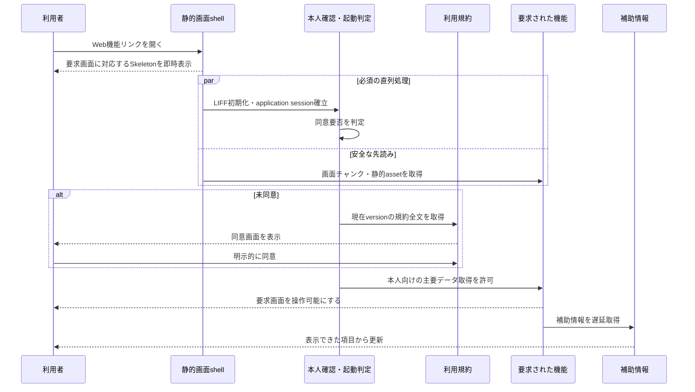

# Web初回起動体験設計

## 1. 目的と所有範囲

この文書は、利用者がLIFFまたは外部ブラウザでWebの機能リンクを開いてから、要求した画面または利用規約を操作できるまでの段階表示、通信の優先順位、失敗時の縮退を定義します。

この文書が所有しないもの:

- LINEとWebをまたぐ入口、要求画面への復帰、主ナビゲーションは[全体画面遷移設計](screen-navigation.md)を正とします
- 本人確認とapplication sessionの安全性は[Web認証・アプリケーションセッション設計](../architecture/web-authentication-design.md)を正とします
- 利用規約を要求する時点、同意記録、同意前に利用できる操作は[サービス利用規約・同意体験設計](service-terms-consent-experience.md)を正とします
- 各画面の内容と、その画面で必要な本人データは各機能の体験設計を正とします
- APIのpathと具体的なschemaは各API契約を正とします

## 2. 結論

初回起動では、すべての通信が終わるまで共通の読み込み画面を出し続けません。最初の静的resourceを評価できた時点で、要求画面に対応する見出しと配置のSkeletonを表示します。その裏で、本人確認と同意要否の判定、および要求画面の画面チャンク・静的assetの取得を進めます。

本人データを取得または作成するAPIは、現在の利用規約への同意を確認できるまで開始しません。画面チャンク、フォント、画像などAccountに依存しない静的resourceは同意前にも取得できますが、取得した画面チャンクをmountして本人向けAPIを発火させてはいけません。

未同意の場合だけ規約全文を取得して同意画面を表示します。同意済みの再訪では、起動のたびに規約全文を取得せず、本人確認の成立と同じ起動判定で同意済みであることを確認して要求画面へ進みます。

LINEのリッチメニューや診断通知からWebを開いた場合、そのタップを本人向け機能を使う意図とみなします。通信時間を隠すためだけの「はじめる」画面を追加しません。未ログインのサービス紹介サイトでは本人向けCTAを押すまで本人確認を開始せず、CTAからWeb機能へ入った後に同じ起動フローを使います。

## 3. 段階表示と通信の優先順位

通信は次の優先順位に分けます。

| 優先度 | 対象 | 表示との関係 |
| --- | --- | --- |
| 1 | 初期HTML、最小CSS、保存済みテーマ、要求画面のSkeleton | APIを待たずに表示する |
| 2 | LIFF初期化、application session確立、同意要否の判定 | 本人向けAPIを開始するために完了を待つ |
| 2 | 要求画面の画面チャンクと表示に必要な静的asset | 本人確認と並行して取得するが、同意確認前はmountしない |
| 3 | 規約全文 | 未同意、重要改定への再同意、本人による規約閲覧時だけ取得する |
| 3 | 要求画面の主要データ | 同意確認後すぐ取得し、画面固有のSkeletonから置き換える |
| 4 | アバター差し替え、Plan表示、レベル表示など、要求画面の主目的でない補助情報 | 主要内容の表示を妨げず、必要な画面を開くか通信に余裕がある時に取得する |
| 5 | 隣接画面の画面チャンク | 主要内容の表示後にidleで先読みし、`Save-Data`または低速回線では省略する |

画面遷移や利用者の操作により優先度4または5の情報が必要になった場合は、その時点で優先度を上げます。idle待ちを理由に、利用者が選んだ画面の表示を遅らせません。

## 4. 同意確認の通信

起動時の判定に必要なのは、本人確認の成否、要求画面への復帰に必要な状態、現在の規約へ同意済みかどうかです。同意済みの利用者へ規約の全sectionを毎回返しません。

本人確認でAccountを解決した処理は、同じ起動判定として同意要否まで返します。LIFF交換後に同じAccountを使って同意状態だけを問い合わせる直列往復を増やしません。外部ブラウザで既存sessionを確認する場合も、同じ判定結果へ収束させます。

未同意または本人が規約を開いた時は、判定されたversionの本文を取得します。本文はversionと本文hashで不変に識別できるresourceとして再利用できますが、同意を保存する時はサーバーが現在の同意必須versionを再確認し、古い画面のversionを受理しません。

## 5. 要求画面ごとの主要内容

最初に表示する内容は、画面全体で一律にそろえず、要求画面の目的から決めます。

| 要求画面 | 最初に必要な主要内容 | 後回しにする内容の例 |
| --- | --- | --- |
| 診断一覧 | 診断カードと本人の回答状態 | ヘッダーのアバター差し替え、Plan、うつしレベル |
| 診断の直接リンク | 対象診断の受付・回答状態と遷移先の内容 | 他の診断一覧、隣接画面 |
| わたしのまとめ | 最新の保存済みまとめ、または生成状態 | 履歴の追加詳細、他機能の補助カード |
| 相性招待 | 招待の有効性と確認に必要な内容 | 相性一覧、隣接画面 |
| プロフィール | プロフィール画面の基本設定 | 開かれていない下位画面のデータ |

主要内容と補助情報のどちらか一方が失敗しても、もう一方の成功結果を捨てません。たとえばPlan表示の取得失敗を、診断一覧全体のエラーへ昇格させません。

## 6. 読み込み・失敗時のUI

- 最初のSkeletonは要求画面と同じ見出し、カード数の目安、画像比率、主ナビゲーションの配置を持ち、表示切り替え時の大きなレイアウト変化を避ける
- 本人確認中、同意確認中、主要データ取得中を同じ文言で隠さず、長引いた段階だけを短い文言で伝える
- 画面チャンクの先読みが失敗しても本人確認を失敗扱いにせず、要求画面を表示する時に再試行する
- 本人確認または同意要否の判定に失敗した場合は、静的な画面shellを残したままその段階だけを再試行できるようにする
- 補助情報の失敗は該当箇所だけで再試行し、主要内容と主操作を利用不能にしない
- ページ遷移時の画面チャンク取得中も、遷移先に対応するSkeletonを表示する
- 診断の直接リンクでは一覧取得だけを主要内容の完了とみなさず、対象の導入・回答・結果または案内を表示してから補助通信と隣接画面の自動先読みを開始する
- 再取得時は表示済みの主要内容を維持し、操作箇所の近くで更新中であることを示す
- Skeletonと進行状態のアクセシビリティ、および`prefers-reduced-motion`は[開発運用ルール](../../.agents/rules/development.md)に従う

## 7. 計測と受け入れ条件

実端末では、静的画面shellの表示、本人確認完了、同意要否の判定、主要データの表示、操作可能になった時点を別々に計測します。通信数だけでなく、利用者が待ち時間を理解できるかと、主要操作が可能になるまでの時間を確認します。計測へAccount ID、LINE user ID、token、診断回答などの本人情報を含めません。

初期実装の受け入れ条件:

- 初回表示はAPI応答を待たず、要求画面に対応する安定したSkeletonを表示する
- 本人確認と同意要否判定の間に、同意状態だけを得る追加の直列往復を置かない
- 同意済みの通常起動では、規約全文を取得しない
- 未同意の利用者には規約全文とversionを表示し、同意完了まで本人向けAPIを開始しない
- 同意前の安全な先読みは静的resourceに限り、画面チャンクをmountして副作用を発火させない
- 同意後は要求画面の主要データを最優先し、アバター、Plan、レベル、隣接画面の取得完了を待たない
- 補助情報の失敗だけで、表示済みの主要内容と主操作を失わない
- `Save-Data`または低速回線では、要求されていない画面と大型画像の自動先読みを行わない
- LIFF実端末で各計測点と起動時requestを記録し、改善前の基準値を取ってから数値目標を決める

## 8. 実装順序

1. 起動時requestと各計測点の基準値を、未同意の初回、同意済みの再訪、重要改定への未同意に分けて取得する
2. 共通の読み込み表示を要求画面ごとの静的な画面shellへ置き換える
3. 本人確認と同意要否を同じ起動判定へまとめ、同意済みの通常起動から規約全文取得を外す
4. 本人確認中に要求画面の画面チャンクを先読みし、同意確認後にmountする
5. 各画面の主要内容と補助情報を分離し、診断画面ではプロフィール、Plan、レベルを主要内容の完了条件から外す
6. PreviewのLIFF実端末で表示順、request数、失敗時の独立性を確認し、計測結果から次の改善対象を決める

この順序では、まず待ち時間を見える状態にし、その後に直列通信を減らします。計測前に固定の時間目標を置かず、実端末の基準値と変更後の差を同じ条件で比較します。
