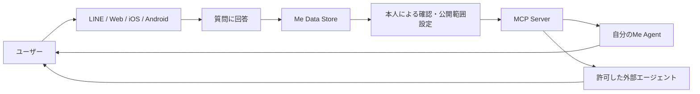

# me-builder プロジェクト概要

## 1. プロジェクトの目的

me-builderは、誰でも自分自身の価値観、経験、好み、考え方をデータとして蓄積し、その人らしく応答する「自分の分身（Me Agent）」を作成できるサービスです。

単なるプロフィール作成ではなく、継続的な質問への回答を通じて「その人が何を知っているか」「何を好むか」「どのように判断するか」を少しずつ表現できる状態を目指します。蓄積した情報は、本人の許可に基づき、MCP（Model Context Protocol）を介してさまざまなAIエージェントから利用できるようにします。

## 2. 解決したい課題

現在のAIサービスでは、サービスごとにプロフィールや好みを入力し直す必要があります。また、一般的なプロフィール項目だけでは、その人らしい判断やニュアンスを十分に表現できません。

me-builderは次の状態を実現します。

- ユーザーが、日常の中で無理なく自分に関する情報を蓄積できる
- 文章だけでなく、選択肢、画像、動画、音声などで自分を表現できる
- 一度蓄積した情報を、複数のAIエージェントで安全に再利用できる
- どの情報を、どのエージェントへ、何の目的で渡すかを本人が制御できる

## 3. 中核となる要件

### 3.1 多様な質問に回答する

ユーザーは多数の質問に回答し、自分を表すデータを蓄積します。質問と回答は、単一の形式に限定しません。

#### 質問の表現形式

- テキスト
- 選択肢
- 写真・イラスト
- 動画
- 音声
- 複数の形式を組み合わせた質問

例：「休日に近い過ごし方を、次の写真から選んでください」「この音楽を聴いてどう感じますか」「大切にしている価値観を文章で教えてください」

#### 回答の入力形式

- 自由記述
- 単一選択・複数選択
- 数値・尺度・ランキング
- 写真・画像のアップロードまたは選択
- 動画のアップロードまたは選択
- 音声の録音または選択
- 質問のスキップ、あとで回答

質問には、カテゴリ、対象年齢、回答時間の目安、公開範囲、機微情報の有無、バージョンを持たせます。回答には、回答時点、入力元、同意状態、元データとの関係を記録します。回答内容が時間とともに変化することを前提とし、履歴を保持します。

### 3.2 MCPでエージェントへ提供する

蓄積した情報をMCPサーバーとして公開し、本人が許可したAIエージェントから利用できるようにします。

初期のMCP機能候補は次のとおりです。

| 機能 | 用途 |
| --- | --- |
| `get_profile` | 基本プロフィールと利用可能な情報カテゴリを取得する |
| `search_answers` | 目的やキーワードに関連する回答を検索する |
| `get_preferences` | 好み、価値観、避けたいことを取得する |
| `ask_me` | 蓄積情報を根拠に、本人らしい回答候補を生成する |
| `get_evidence` | 生成内容の根拠となった回答を確認する |

MCPの利用では、次を必須とします。

- ユーザー本人による接続許可
- エージェントごとの権限スコープ
- 目的に必要な最小限の情報だけを返す仕組み
- 接続解除と権限変更
- いつ、どのエージェントが、何を取得したかを確認できる監査ログ
- センシティブな情報やメディア原本に対する追加確認

MCPへは、可能な限り写真や音声などの原本ではなく、本人が確認できる要約・特徴・回答を提供します。原本が必要な場合だけ、用途と有効期限を限定したアクセスを許可します。

## 4. 想定する利用体験



1. ユーザーがLINE、Web、iOS、Androidなどからサービスを利用する
2. 短い質問やテーマ別の質問セットに回答する
3. 回答からプロフィール、好み、価値観などが整理される
4. ユーザーが内容と公開範囲を確認・修正する
5. 許可したエージェントがMCP経由で必要な情報を取得する
6. エージェントが本人らしい回答や提案を返す

## 5. アカウントと本人識別

iOS、Android、Web、LINEは利用チャネルであり、サービス内のアカウントそのものとは分離します。サービス内部では変更されないユーザーIDを発行し、複数のログイン手段を紐づけます。

```text
User（サービス内の本人）
├── Login Identity: LINE
├── Login Identity: Sign in with Apple
├── Login Identity: Google
├── Login Identity: メールアドレス / パスキー
├── Me Profile
├── Answers
└── Agent Connections
```

この方式により、LINEで利用を始めたユーザーが、後からiOSアプリやWebでも同じ分身を利用できます。

アカウント設計では次を考慮します。

- 複数ログイン手段の追加・解除
- 同一人物の誤った重複登録を解消するアカウント統合
- 端末紛失や外部アカウント停止時の復旧
- 認証情報とプロフィール・回答データの分離
- データのエクスポート、退会、削除
- 将来的な家族・組織・代理管理への拡張

初期段階では、実在人物であることの厳格な本人確認は必須とせず、「ログイン主体」と「分身の対象人物」を区別できるデータ構造にします。ただし、第三者になりすます分身の公開は禁止し、公開範囲が広い機能では追加の本人確認を検討します。

## 6. データの基本構造

主要な概念は次のとおりです。

| 概念 | 説明 |
| --- | --- |
| User | 認証、契約、同意、データ所有を担う利用者 |
| Identity | LINE、Apple、Googleなどのログイン手段 |
| Me Profile | 分身の名前、説明、対象人物、公開状態 |
| Question | 質問内容、表示形式、回答形式、カテゴリ、バージョン |
| Answer | 回答内容、回答日時、回答元、公開範囲 |
| Media Asset | 画像、動画、音声と、その派生データ・利用同意 |
| Derived Insight | 回答から推定した好み、性格傾向、要約。推定であることを明示する |
| Agent Connection | 接続先エージェント、権限、有効期限、接続状態 |
| Access Log | MCPを通じた情報利用の記録 |

回答そのものとAIによる推定結果は分離します。推定結果には、根拠となる回答、生成モデル、生成日時、信頼度、ユーザーによる確認状態を持たせます。

## 7. 付加機能

中核機能の上に、次の体験を構築できます。

### 自分とのチャット

蓄積した回答を根拠に、自分の分身と対話します。回答には「本人が実際に答えた内容」と「AIが推定した内容」の区別を表示し、根拠を確認できるようにします。

### 性格分析

質問への回答から性格傾向や価値観を整理します。医療的な診断として扱わず、分析手法、根拠、限界を明示します。ユーザー自身が分析結果を訂正・非表示にできます。

### 相性・マッチング

価値観、関心、コミュニケーション傾向などを使い、相性がよい可能性のある人物像や相手を提示します。単一のスコアだけで断定せず、「共通点」「補完関係」「注意が必要な違い」を説明します。実在ユーザー同士を紹介する場合は、双方の明示的な同意を必要とします。

### 写真への本人らしい回答

ユーザーが写真を送ると、写真の内容と蓄積された回答を組み合わせて、その人らしい感想、選択、提案を返します。顔、位置情報、周囲の人物などが含まれる可能性を考慮し、保存期間と二次利用を明示します。

## 8. プライバシーと安全性

本サービスは、本人の嗜好、思想、声、顔、交友関係などの機微な情報を扱う可能性があります。そのため、プライバシーは付加機能ではなく中核要件として扱います。

- 回答単位・カテゴリ単位で公開範囲を設定できる
- 初期状態は非公開とし、外部提供は明示的な同意を必要とする
- 利用目的、保存期間、二次利用の有無を説明する
- 通信時・保存時にデータを暗号化する
- 管理者を含めたアクセスを記録し、必要最小限に制限する
- ユーザーが回答の訂正、削除、エクスポートを行える
- AI学習への利用はサービス利用と分離して同意を得る
- 第三者の顔や声を含むメディアに配慮する
- 未成年者の利用には年齢に応じた同意・保護を設ける
- 分身による応答であることを相手に明示し、なりすましを防止する

## 9. MVPの範囲

最初のリリースでは、価値検証に必要な範囲へ絞ります。

### 含めるもの

- WebまたはLINEのいずれかを起点としたアカウント作成
- 複数形式の質問定義（テキスト、選択肢、画像）
- 回答入力（自由記述、選択、画像）
- 回答履歴、修正、削除
- ユーザー向けプロフィール要約
- MCPによるプロフィール・回答検索
- エージェント接続の許可、解除、アクセス履歴
- 自分の分身との基本的なチャット

### 後続リリースで検討するもの

- 動画・音声による質問と回答
- iOS・Androidネイティブアプリ
- 高度な性格分析
- ユーザー同士のマッチング
- 写真を入力とするマルチモーダル対話
- 分身の共有・公開
- 外部サービス向け開発者API

## 10. 成功指標の例

- 登録後に最初の回答を完了したユーザーの割合
- 1週間・1か月後にも回答を続けているユーザーの割合
- ユーザー1人あたりの有効回答数と回答形式の広がり
- プロフィール要約に対する本人の納得度
- MCP接続を1つ以上有効化したユーザーの割合
- 分身の回答に対する「自分らしい」という評価
- 権限設定やデータ削除を迷わず完了できる割合
- 意図しない情報開示や不正アクセスの件数

## 11. 段階的な進め方

### Phase 1: 回答を集める

質問・回答モデルを確立し、回答を続けたくなる体験を検証します。

### Phase 2: 分身として使う

回答の検索、要約、根拠表示を実装し、自分とのチャットで「自分らしさ」を検証します。

### Phase 3: 外部と接続する

MCPサーバー、認可、監査ログを提供し、複数のエージェントから安全に利用できることを検証します。

### Phase 4: 分析と関係性へ広げる

性格分析、相性の説明、写真を使った対話などを追加します。

## 12. 今後決めること

- 最初に対応する利用チャネル（LINE、Web、iOS、Android）
- 最初のログイン手段とアカウント復旧方法
- 主な対象ユーザーと、最初に解決する具体的な利用場面
- 質問を誰が作成・審査・更新するか
- 回答をどこまで構造化し、どこからAIで解釈するか
- MCPの認証方式、権限スコープ、接続フロー
- 分身の回答品質と「本人らしさ」の評価方法
- メディアデータの保存期間と処理方法
- 公開・共有機能に必要な本人確認と不正利用対策
- 対象地域に応じた個人情報保護・AI関連法令への対応

## 13. 現時点のプロダクト原則

1. データの主導権はユーザー本人が持つ
2. 本人の回答とAIの推定を混同しない
3. 情報は目的に必要な最小限だけを共有する
4. 分身であることと、回答の根拠・不確かさを明示する
5. 質問に答えるほど価値が増え、いつでも修正・削除できる

