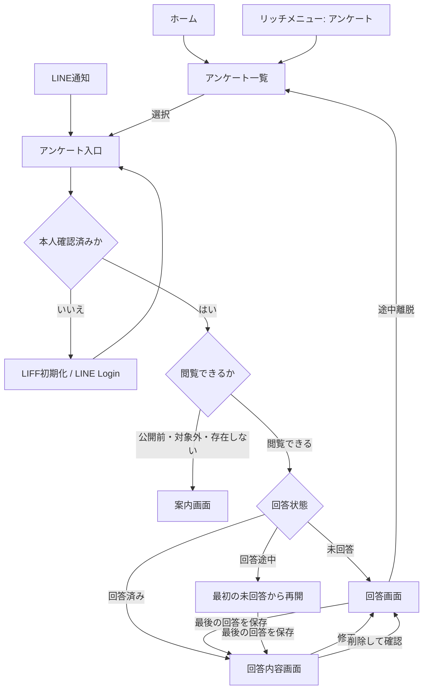

# Phase 1 アンケート体験設計

## 1. この文書の目的

この文書は、Phase 1でユーザーがLINEからアンケートを見つけ、LIFF上で回答し、回答内容を確認できるまでのUIと画面遷移を定義します。アンケート一覧、LINE通知、リッチメニューからの導線、および回答時の例外状態を所有します。

質問の作成主体と版管理、LINEとWebの役割、本人識別の原則は[プロジェクト概要](project-overview.md#4-想定する利用体験)を正とします。Question、Survey、SurveyResponseの集約と状態は[Phase 1 アンケートドメイン設計](questionnaire-domain-design.md)を正とします。データベース、APIスキーマ、配信基盤の実装方式はこの文書では定義しません。

## 2. 結論

一覧、通知、リッチメニューの3導線に加え、実際に回答できる状態には次のUIが必要です。

- ホーム
- アンケート一覧
- 1問1画面の回答画面
- 回答内容画面
- 対象外・公開前・受付終了を示す案内画面
- 認証中、読み込み中、通信失敗、データなしの各状態
- 回答の修正・削除への導線

「結果画面」という名称は、集計結果やAI分析が表示されると誤解されるため、Phase 1では「回答内容」と呼びます。表示するのは本人が回答した質問、選択肢、回答日時です。

スワイプは回答操作の演出として利用できますが、スワイプだけを入力手段にはしません。選択肢をタップできる操作を必ず用意し、誤操作とアクセシビリティ上の問題を避けます。

## 3. 画面と責務

| 画面 | 主な表示 | 主な操作 |
| --- | --- | --- |
| ホーム | 今日のアンケート、未回答件数、直近の回答 | 今日のアンケートを開く、一覧へ移動する |
| アンケート一覧 | タイトル、回答状態、回答期限 | アンケートを選択する |
| 回答 | 質問、選択肢、進捗、あとで回答 | 選択する、次へ進む、回答を完了する |
| 回答内容 | 回答時点の質問文と選択肢、回答日時 | 回答を修正する、回答を削除する、一覧へ戻る |
| 案内 | 開けない理由と次の行動 | 一覧またはホームへ戻る、再読み込みする |

ホームはリッチメニューの「ホーム」の遷移先を曖昧にしないために必要です。Phase 1では今日のアンケートへの最短導線に絞り、プロフィール分析などを置きません。

一覧は少なくとも次の状態を区別します。

| 状態 | 一覧での表示 | 選択後 |
| --- | --- | --- |
| 未回答 | 「未回答」 | 回答画面 |
| 回答途中 | 「回答途中」および進捗 | 最初の未回答の質問 |
| 回答済み | 「回答済み」 | 回答内容画面 |
| 受付終了 | 「受付終了」 | 回答済みなら回答内容、未回答なら案内画面 |

公開前や対象外のアンケートは一覧へ表示しません。通知などの古い直接リンクから開かれた場合だけ、理由を過度に詳しく明かさない案内画面を表示します。

## 4. 入口を共通化した遷移

一覧とLINE通知は、どちらもアンケートを識別する同じ入口へ遷移させます。入口で本人の回答状態と受付状態を確認し、表示先を決めます。リンク自体に本人性を示す情報は含めません。

受付終了後も、回答済みのユーザーは自分の回答内容を確認できます。未回答のユーザーには新しい回答を許可しません。回答修正を受付終了後も許可するかは運営方針に依存するため、Phase 1では受付期間内だけ許可します。

## 5. 回答画面の振る舞い

- 質問は1問ずつ表示する
- 現在位置と全体の問数を表示する
- 選択肢はタップ可能なボタンとして表示し、スワイプ操作も同じ選択処理へ接続する
- 選択後に次の質問へ進み、各問の保存成功後に進捗を更新する
- 直前の質問へ戻って選択を変更できるようにする
- 通信失敗時は選択内容を画面に残し、再試行できるようにする
- 「あとで回答」で一覧へ戻り、次回は最初の未回答から再開する
- 最後の回答が保存された後だけ「回答済み」とし、回答内容画面へ移動する
- 二重タップや再送で同じ回答が重複しないようにする

回答を修正する場合は、回答時点の質問の版を表示します。公開後に質問が改訂されても、既存回答の意味を別の質問文へ付け替えません。

回答を削除する操作には確認を挟み、削除した質問を未回答として扱います。他の回答が残っていればアンケート全体は回答途中、残っていなければ未回答へ戻ります。回答状態とSource Recordとの関係は[Phase 1 アンケートドメイン設計](questionnaire-domain-design.md#7-surveyresponse-aggregate)、回答の修正・削除で原本と履歴をどう扱うかは[Source Recordのライフサイクル設計](source-record-lifecycle-design.md)を正とします。

## 6. LINE通知

通知は「アンケートへ来てもらう」役割だけを持ち、トーク上で回答を取得しません。

- アンケート名または短いテーマを表示する
- 回答期限がある場合は表示する
- CTAは「アンケートに答える」とする
- CTAは対象アンケートのLIFF URLへ遷移する
- URLにはアンケートを識別する情報だけを含め、Account IDや認証トークンを含めない
- 配信後に回答済みとなった場合でも、クリック時の入口判定により回答内容画面を表示する
- 公開停止や期限切れとなった場合は案内画面を表示する

未回答者だけへの絞り込みは通知量を減らすために有効ですが、配信判定とクリックの間で状態は変わり得ます。最終判断は必ずクリック後の入口で行います。

## 7. リッチメニュー

Phase 1のリッチメニューは次の2項目で開始します。

| 項目 | 遷移先 | 役割 |
| --- | --- | --- |
| ホーム | LIFFのホーム | 今日やることを確認する |
| アンケート | LIFFのアンケート一覧 | 過去・現在のアンケートを探す |

「アンケート」を今日のアンケートへ直接遷移させると、回答済みの内容や過去の回答を探せません。そのためリッチメニューは一覧へ遷移させ、ホーム上のCTAとLINE通知を今日のアンケートへの最短導線にします。

## 8. 共通状態と復帰先

| 状態 | 表示と復帰方法 |
| --- | --- |
| LIFF初期化・本人確認中 | ローディングを表示し、完了後に元のURLの判定を再開する |
| 友だち追加が必要 | 必要性を説明し、追加後に再試行できるようにする |
| 通信失敗 | エラー内容を簡潔に示し、同じ操作を再試行できるようにする |
| 一覧が空 | 「回答できるアンケートはありません」とホームへの導線を表示する |
| 直接リンクの対象が無効 | 回答できない旨を示し、一覧への導線を表示する |
| 保存中 | 操作を一時的に無効化し、重複送信を防ぐ |
| 保存失敗 | 選択を保持し、再試行または一覧へ戻る操作を表示する |

端末の戻る操作でも、回答途中の保存済み進捗を失わず一覧へ戻れるようにします。未保存の選択がある場合は、破棄されることを確認します。

## 9. 実際にアンケートできる状態の完了条件

UIを表示できるだけでは完了としません。Phase 1の縦切りは次を満たした状態です。

- 運営が審査済みの質問と選択肢を公開できる
- 本人確認済みのユーザーごとに一覧と回答状態を取得できる
- 一覧・通知のどちらからでも同じアンケート入口を開ける
- 1問以上へ回答し、再読み込み後も回答内容を確認できる
- 途中離脱後に続きから再開できる
- 回答を修正・削除できる
- 未回答、回答途中、回答済み、受付終了の遷移を確認できる
- LINEへ対象アンケートの通知を配信できる
- リッチメニューのホームとアンケートが正しいLIFF URLを開く
- 認証失敗、保存失敗、無効な直接リンクで白画面にならない

質問を作るための管理画面は、この完了条件には必須としません。Phase 1では安全な設定ファイルや運営用スクリプトでも構いませんが、公開前の審査と公開済み質問の版を保つ手順は必要です。

## 10. この設計で決めないこと

- Question、Survey、SurveyResponseの物理データモデル
- APIのパス、リクエスト、レスポンスの具体形
- LINE通知の配信時刻と頻度の最適化
- 回答の集計結果を他ユーザーと比較する機能
- 回答から生成する性格分析やプロフィール要約
- 複数選択、自由記述、画像回答の個別UI

最後の項目はMVP全体の要件には含まれますが、まず選択式アンケートを実際に回答できる縦切りを完成させた後に、入力形式ごとの設計として追加します。
