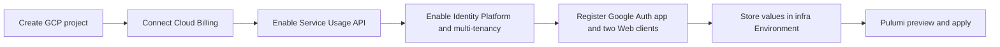

# GCP platform infrastructure

This Pulumi project creates the Google Cloud resources used by me-builder authentication and Vertex AI inside one existing shared application project. It is intentionally separate from the Cloudflare Pulumi project. The `development` and `production` Stacks isolate environment resources while the Development Stack owns project-wide resources once.

## Managed resources

- validation of the same existing GCP project and its preconfigured Cloud Billing connection, without managing the project itself
- project-wide API activation owned only by the Development Stack
- a separate Identity Platform Tenant for each Stack, with email/password and email-link sign-in disabled
- Google as the enabled provider inside each Tenant
- rotatable API key slots restricted to Identity Platform `SignInWithIdp`
- Vertex AI API
- a dedicated Vertex AI service account with a custom inference-only role and Service Usage Consumer
- rotatable service-account-bound authorization key slots restricted to `GenerateContent` and `EmbedContent`
- one gross-cost monthly shared-project budget, owned by the Development Stack, with alerts at 50%, 80%, and 100%
- a fail-closed gate that keeps Vertex runtime credentials absent until its service spend cap is confirmed

Google Auth Platform registration, two Web OAuth clients, Identity Platform activation, and multi-tenancy are one-time manual prerequisites. The detailed boundary and environment-specific values are defined under [State backend and first deployment](#state-backend-and-first-deployment).

## GCP deploy authentication

The manual `Deploy / GCP Platform` GitHub Actions workflow authenticates with GitHub OIDC and Direct Workload Identity Federation. It uses short-lived credentials and does not impersonate a service account or accept a service-account JSON key. Local Pulumi operations use Google Application Default Credentials (ADC) from `gcloud auth application-default login`; this is separate from the runtime API keys created by the Stack.

## State backend and first deployment

The existing state project, `gs://kagami-infra/` bucket, required bucket controls, and local ADC are defined by the parent [infrastructure state backend guide](../README.md#one-time-state-backend-bootstrap). This project uses the dedicated `kagami/gcp-platform/` managed folder and does not share a passphrase or IAM access with the Cloudflare project. The repository wrapper and Pulumi program require a non-empty `PULUMI_CONFIG_PASSPHRASE` before evaluating resources and reject any runtime backend override that differs from `Pulumi.yaml`. This prevents the OAuth Client Secret from entering local state or state encrypted with an empty passphrase.

### One-time manual prerequisites for the shared application project

Complete the following bootstrap once in the shared application project before the Development Stack's first Pulumi operation. These resources require human ownership or must exist before the GCP provider can evaluate the Stack, so they intentionally remain outside Pulumi. Run the Production Stack only after Development has applied the project-wide resources.



1. Create the application project. For a personal standalone project, do not set an Organization or Folder parent. Development and Production use this same project ID.
2. Connect the intended Cloud Billing Account to the project. Pulumi validates this association but never creates, changes, unlinks, or deletes it.
3. Enable only Service Usage API (`serviceusage.googleapis.com`) manually. The provider must call this API before it can read or create any `gcp.projects.Service`, so the Pulumi resource cannot bootstrap the API that it depends on.
4. Enable Identity Platform for the project, enable multi-tenancy, and set the project-level authorized domains to the exact union `localhost`, `api.stg.kagami.kyosuke.dev`, and `api.kagami.kyosuke.dev`. Pulumi deliberately does not manage this singleton root configuration because the Direct WIF principal cannot reliably perform the first Identity Platform initialization.
5. Register the project in Google Auth Platform and create the Development and Production Web OAuth clients using the environment-specific settings below.
6. Complete the [Direct WIF and state backend setup](../README.md#one-time-state-backend-bootstrap), then configure the approval-protected `infra` GitHub Environment as described under [GitHub Actions deployment](#github-actions-deployment).

The equivalent `gcloud` commands for steps 1 through 3 are:

```bash
GCP_APPLICATION_PROJECT_ID="replace-with-application-project-id"
GCP_APPLICATION_PROJECT_NAME="replace-with-application-project-name"
GCP_BILLING_ACCOUNT_ID="replace-with-billing-account-id"

gcloud projects create "${GCP_APPLICATION_PROJECT_ID}" \
  --name="${GCP_APPLICATION_PROJECT_NAME}"
gcloud billing projects link "${GCP_APPLICATION_PROJECT_ID}" \
  --billing-account="${GCP_BILLING_ACCOUNT_ID}"
gcloud services enable serviceusage.googleapis.com \
  --project="${GCP_APPLICATION_PROJECT_ID}"
```

Skip project creation when the intended project already exists. Running the Service Usage command again is safe; it converges on the enabled state. Identity Platform activation and multi-tenancy remain Console-owned prerequisites; Pulumi starts at Tenant creation.

#### Google Auth Platform and Web OAuth client

In Google Cloud Console, select the shared application project and open Google Auth Platform. Register the app before creating clients. The app can remain in testing while access is limited to explicitly registered test users. The requested scopes and the reason email is excluded are defined by the [Web authentication design](../../docs/architecture/web-authentication-design.md#92-transactionとtoken検証).

Create two clients with application type **Web application**. This server-side flow does not require an Authorized JavaScript origin. Register the callback values from [`Pulumi.development.yaml`](./Pulumi.development.yaml) on the Development client and [`Pulumi.production.yaml`](./Pulumi.production.yaml) on the Production client, with exact matching and without wildcards. Their environment ownership is defined by the [Web authentication design](../../docs/architecture/web-authentication-design.md#93-環境とurl).

Save each Client Secret when the creation dialog displays it. Store the IDs as `GOOGLE_OAUTH_CLIENT_ID_DEVELOPMENT` and `GOOGLE_OAUTH_CLIENT_ID_PRODUCTION`, and the secrets as `GOOGLE_OAUTH_CLIENT_SECRET_DEVELOPMENT` and `GOOGLE_OAUTH_CLIENT_SECRET_PRODUCTION`, in the shared `infra` GitHub Environment. Pulumi then creates the Google provider inside the matching Identity Platform Tenant; it does not own either Google Auth Platform client.

#### API activation boundary

Service Usage API and Identity Platform activation are manual prerequisites. Identity Platform activation enables the Identity Toolkit API as part of the Console-owned root configuration. The Development Stack declares all APIs, including those already enabled, so its first successful Apply records them in Pulumi state. The Production Stack only reads these services and must run after Development.

| Owner | API | Service name |
| --- | --- | --- |
| Manual bootstrap, then Development Stack | Service Usage API | `serviceusage.googleapis.com` |
| Identity Platform activation, then Development Stack | Identity Toolkit API | `identitytoolkit.googleapis.com` |
| Development Stack | Cloud Billing API | `cloudbilling.googleapis.com` |
| Development Stack | Cloud Billing Budget API | `billingbudgets.googleapis.com` |
| Development Stack | API Keys API | `apikeys.googleapis.com` |
| Development Stack | Identity and Access Management API | `iam.googleapis.com` |
| Development Stack | Organization Policy API | `orgpolicy.googleapis.com` |
| Development Stack | Vertex AI API | `aiplatform.googleapis.com` |

Pulumi reads and validates the existing project but never creates, imports, updates, moves, unlinks, or deletes it. Project name, labels, network configuration, Cloud Billing connection, Identity Platform root configuration, and authorized domains therefore remain outside these Stacks. The Development Stack enables the Cloud Billing API before reading and validating the manual billing connection; a first preview keeps the deferred billing read unknown until Apply. Configure the same project ID and Billing Account in both Stacks.

Google does not support changing the policy required for service-account-bound authorization keys on a project without an organization. A standalone project can deploy Identity Platform, its restricted API key, the budget, Vertex AI API, and the Vertex runtime service account, but `vertexRuntimeCredentialsEnabled` must remain `false`. This is a fail-closed limitation: do not replace it with an unbound Vertex API key without a separate security review.

### GitHub Actions deployment

Configure one approval-protected GitHub Environment named `infra`. It owns the shared project settings and both Stacks' OAuth inputs so either target passes through the same approval boundary.

| Kind | Name | Requirement |
| --- | --- | --- |
| Variable | `GCP_STATE_PROJECT_ID` | Existing project that owns `gs://kagami-infra/` |
| Variable | `GCP_PLATFORM_PROJECT_ID` | Existing shared application project ID used by both Stacks |
| Variable | `GCP_BILLING_ACCOUNT` | Billing Account ID attached to the application project |
| Variable | `GCP_ORGANIZATION_ID` | Optional Organization parent; do not combine with `GCP_FOLDER_ID` |
| Variable | `GCP_FOLDER_ID` | Optional Folder parent; do not combine with `GCP_ORGANIZATION_ID` |
| Variable | `GOOGLE_OAUTH_CLIENT_ID_DEVELOPMENT` | Development Web OAuth Client ID |
| Variable | `GOOGLE_OAUTH_CLIENT_ID_PRODUCTION` | Production Web OAuth Client ID |
| Secret | `GCP_WORKLOAD_IDENTITY_PROVIDER` | Full Workload Identity Provider resource name |
| Secret | `PULUMI_CONFIG_PASSPHRASE` | Non-empty state encryption passphrase |
| Secret | `GOOGLE_OAUTH_CLIENT_SECRET_DEVELOPMENT` | Development Web OAuth Client Secret |
| Secret | `GOOGLE_OAUTH_CLIENT_SECRET_PRODUCTION` | Production Web OAuth Client Secret |

The `infra` WIF principal needs object administration only on the `kagami/gcp-platform/` managed folder for state. On the existing application project, grant Browser, Service Usage Admin, API Keys Admin, Identity Platform Admin, Service Account Admin, Role Admin, and Project IAM Admin. Grant Billing Account Costs Manager on the configured Billing Account so the Development Stack can manage the shared budget. Project Creator, Project Mover, Project Billing Manager, and Billing Account User are not required because the Stacks do not mutate the project or its billing association. Organization Policy Administrator and Service Account API Key Binding Admin are required only for the authorization-key path available to Organization or Folder projects.

Use the mapped `infra` Environment principal for both the application-project roles and the Billing Account role. Billing Account Costs Manager must be granted on the **Billing Account resource**, not on the application project. The latter does not authorize `billingAccounts.get` or budget operations against the Billing Account.

```bash
GCP_INFRA_PRINCIPAL="principalSet://iam.googleapis.com/projects/719104396651/locations/global/workloadIdentityPools/github-actions/attribute.environment/infra"

gcloud billing accounts add-iam-policy-binding 0169CD-74F0D2-7C9777 \
  --member="${GCP_INFRA_PRINCIPAL}" \
  --role=roles/billing.costsManager
```

The workflow checks project and Billing Account readability immediately after Direct WIF authentication and before installing Pulumi. A failure at this point means the IAM binding scope or member is incorrect; recreating the Pulumi Stack does not repair it.

| Scope | Role ID | Purpose |
| --- | --- | --- |
| application project | `roles/browser` | read the existing project, number, billing association, and parent |
| application project | `roles/serviceusage.serviceUsageAdmin` | enable and inspect declared APIs |
| application project | `roles/serviceusage.apiKeysAdmin` | manage restricted Identity Platform API keys |
| application project | `roles/identityplatform.admin` | manage Identity Platform configuration and Google provider |
| application project | `roles/iam.serviceAccountAdmin` | manage the dedicated Vertex runtime service account |
| application project | `roles/iam.roleAdmin` | manage the inference-only custom role |
| application project | `roles/resourcemanager.projectIamAdmin` | bind the custom role and Service Usage Consumer to the runtime service account |
| Billing Account (not application project) | `roles/billing.costsManager` | read the Billing Account and manage the Pulumi-declared project budget |
| Organization or Folder project only | `roles/orgpolicy.policyAdmin` | manage the service-account-bound authorization-key policy |
| Organization or Folder project only | `roles/iam.serviceAccountApiKeyBindingAdmin` | bind a Vertex authorization key to the runtime service account |

Run [`deploy-gcp-platform.yml`](../../.github/workflows/deploy-gcp-platform.yml) from reviewed `main`. Choose `preview` or `apply`, choose the Stack, and enter the exact confirmation shown by the workflow. `apply` calls the repository's guarded `gcp-platform:up` command only after the matching GitHub Environment approval.

The workflow creates the Pulumi Stack when it does not exist and reconstructs its environment-specific configuration before every operation. It selects the target-specific OAuth values from the shared `infra` Environment. OAuth client ID and secret are required from the first operation so a successful first Apply always includes the Tenant's Google provider.

### Local deployment

```bash
export PULUMI_CONFIG_PASSPHRASE=<gcp-platform-value-from-password-manager>
pulumi login gs://kagami-infra/kagami/gcp-platform

pulumi -C infra/gcp-platform stack init development
pulumi -C infra/gcp-platform config set projectId <shared-project-id> --stack development
pulumi -C infra/gcp-platform config set billingAccount <billing-account-id> --stack development
pulumi -C infra/gcp-platform config set googleOAuthClientId <development-web-client-id> --stack development
pulumi -C infra/gcp-platform config set --secret googleOAuthClientSecret <development-web-client-secret> --stack development
task infra:gcp-platform:preview:development
ALLOW_GCP_PLATFORM_UP=development task infra:gcp-platform:up:development

pulumi -C infra/gcp-platform stack init production
pulumi -C infra/gcp-platform config set projectId <shared-project-id> --stack production
pulumi -C infra/gcp-platform config set billingAccount <billing-account-id> --stack production
pulumi -C infra/gcp-platform config set googleOAuthClientId <production-web-client-id> --stack production
pulumi -C infra/gcp-platform config set --secret googleOAuthClientSecret <production-web-client-secret> --stack production
task infra:gcp-platform:preview:production
ALLOW_GCP_PLATFORM_UP=production task infra:gcp-platform:up:production
```

These commands require the shared project, its Cloud Billing connection, Identity Platform activation, and multi-tenancy to exist before they run. Apply Development before Production. For a project under an Organization or Folder, set its existing `organizationId` or `folderId` in both Stacks before preview. Pulumi verifies that the configured project, billing account, and parent match GCP and fails without changing them when they differ.

The checked-in shared-project monthly budget and Vertex AI service spend cap are both JPY 10,000, owned by the Development Stack. `budgetCurrencyCode` must match the Billing Account currency exactly; Pulumi reports both values before attempting budget creation when they differ. Change it together with `monthlyBudgetAmount` and `vertexSpendCapAmount` in the reviewed Development Stack YAML when these are no longer the intended limits. Production has no separate project budget because Identity Platform Tenant does not partition Cloud Billing or Vertex AI usage.

The first update intentionally leaves Vertex runtime authorization keys absent. After it, complete this additional manual Google Cloud control once in the shared project:

1. Open Cloud Billing Budgets & alerts, create a service spend cap for Vertex AI on this project, and set it to exactly the Development Stack's `vertexSpendCapAmount` in `budgetCurrencyCode`. A normal Pulumi-managed budget only sends alerts; it does not stop usage. Google's spend cap is currently Preview and is not exposed by the public Cloud Billing Budget API or the Pulumi GCP provider.

The spend-cap confirmation is an operator attestation; it must not be set before the Cloud Console spend cap exists. Record it in each Stack that will issue Vertex credentials after creating the one shared cap. Enable Vertex runtime credentials only for an Organization or Folder project.

```bash
pulumi -C infra/gcp-platform config set vertexSpendCapConfirmed true --stack development
task infra:gcp-platform:preview:development
ALLOW_GCP_PLATFORM_UP=development task infra:gcp-platform:up:development

pulumi -C infra/gcp-platform config set vertexSpendCapConfirmed true --stack production
task infra:gcp-platform:preview:production
ALLOW_GCP_PLATFORM_UP=production task infra:gcp-platform:up:production
```

For an Organization or Folder project only, set `vertexRuntimeCredentialsEnabled` to `true` after the spend cap is confirmed and apply again. The deploy principal also needs permission to manage project organization policies and service-account API key bindings. Pulumi explicitly enforces Google's block on service-account-bound API keys while runtime credentials are disabled. When enabled, the constraint remains enforced and its `allowedServices` parameter permits only `aiplatform.googleapis.com`; it does not open authorization-key creation for other services and leaves the parent policy unchanged.

The `identityPlatformTenantId` Stack output is non-secret. Copy it to `GOOGLE_IDENTITY_PLATFORM_TENANT_ID` in Cloudflare GitHub Environment `dev` for Development and `prd` for Production. The `platform` output contains the active keys as Pulumi secrets. Copy `identityPlatformApiKey` to `GOOGLE_IDENTITY_PLATFORM_API_KEY`, copy `vertexAiApiKey` to `GOOGLE_VERTEX_AI_API_KEY`, copy the selected client ID to `GOOGLE_OAUTH_CLIENT_ID`, and distribute the matching original client secret as `GOOGLE_OAUTH_CLIENT_SECRET` in `dev` or `prd`. Never print secret outputs in CI logs. `vertexAiApiKey` remains absent in a Stack until its spend-cap confirmation and runtime-credential flags are both true.

The Vertex AI key is bound to the Stack's dedicated service account, not an unbound standard API key. The Worker continues to keep the value only in its server-side secret binding. API method restrictions limit the key to generation and embedding, while the custom IAM role grants only `aiplatform.endpoints.predict`. Cloudflare Workers do not have stable outbound IP addresses, so this Stack cannot add the only supported application restriction for authorization keys, an IP allowlist.

## Credential rotation

Keys use `primary` and `secondary` slots, but only the active slot exists during normal operation. To rotate without downtime:

1. Change the inactive slot under `credentialGenerations` from `null` to a new generation (for example, `v2`) and apply the Stack.
2. Retrieve that inactive slot locally from the secret `identityPlatformApiKeys` or `vertexAiApiKeys` output. Do not expose it in CI logs.
3. Test the new Development key, distribute it to the matching `dev` or `prd` GitHub Environment, and verify text generation and embedding.
4. Change `activeCredentialSlot` to the new slot and apply.
5. After a short rollback window, set the old slot's generation to `null` and apply to delete that key. Rotate Production separately after the Development gate; the Tenant IDs do not change during key rotation.

## Updates

Use the manual `Deploy / GCP Platform` workflow for normal reviewed updates. For local break-glass operations, use the scripts exposed by the parent infrastructure package:

```bash
task infra:gcp-platform:preview:development
ALLOW_GCP_PLATFORM_UP=development task infra:gcp-platform:up:development
task infra:gcp-platform:preview:production
ALLOW_GCP_PLATFORM_UP=production task infra:gcp-platform:up:production
```

Identity Platform, IAM, optional organization policy, and budget configuration are protected from Pulumi deletion. The application projects remain outside Pulumi for their full lifecycle. Rotatable API keys deliberately are not protected. An intentional foundation teardown requires a separate reviewed change that removes both Pulumi `protect` and the GCP `PREVENT` deletion policies from Stack-owned resources.
