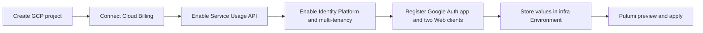

# GCP platform infrastructure

This is the operational runbook for the GCP platform Pulumi project. Resource ownership, environment isolation, secret flow, and cost-control policy are defined only in [Infrastructure Architecture §6.2](../../docs/architecture/infrastructure-architecture.md#62-gcp共通リソースの宣言境界).

## Scope

The project assumes one existing application project and its Cloud Billing connection. This runbook covers the one-time manual prerequisites, required IAM, Pulumi execution, runtime secret registration, and credential rotation; it does not provide an alternate project-creation path.

## GCP deploy authentication

The manual `Deploy / GCP Platform` GitHub Actions workflow authenticates with GitHub OIDC and Direct Workload Identity Federation. It uses short-lived credentials and does not impersonate a service account or accept a service-account JSON key. Local Pulumi operations use Google Application Default Credentials (ADC) from `gcloud auth application-default login`; this is separate from application runtime credentials.

## State backend and first deployment

The existing state project, `gs://kagami-infra/` bucket, required bucket controls, and local ADC are defined by the parent [infrastructure state backend guide](../README.md#one-time-state-backend-bootstrap). This project uses the dedicated `kagami/gcp-platform/` managed folder and does not share a passphrase or IAM access with the Cloudflare project. The repository wrapper and Pulumi program require a non-empty `PULUMI_CONFIG_PASSPHRASE` before evaluating resources and reject any runtime backend override that differs from `Pulumi.yaml`. This prevents the OAuth Client Secret from entering local state or state encrypted with an empty passphrase.

### One-time manual prerequisites for the shared application project

Complete the following bootstrap once in the shared application project before the Development Stack's first Pulumi operation. These resources require human ownership or must exist before the GCP provider can evaluate the Stack, so they intentionally remain outside Pulumi. Run the Production Stack only after Development has applied the project-wide resources.



1. Select the existing application project. Development and Production use this same project ID; Pulumi does not create or manage the project.
2. Connect the intended Cloud Billing Account to the project. Pulumi validates this association but never creates, changes, unlinks, or deletes it.
3. Enable only Service Usage API (`serviceusage.googleapis.com`) manually. The provider must call this API before it can read or create any `gcp.projects.Service`, so the Pulumi resource cannot bootstrap the API that it depends on.
4. Enable Identity Platform for the project, enable multi-tenancy, and set the project-level authorized domains to the exact union `localhost`, `api.stg.kagami.kyosuke.dev`, and `api.kagami.kyosuke.dev`. Pulumi deliberately does not manage this singleton root configuration because the Direct WIF principal cannot reliably perform the first Identity Platform initialization.
5. Register the project in Google Auth Platform and create the Development and Production Web OAuth clients using the environment-specific settings below.
6. Complete the [Direct WIF and state backend setup](../README.md#one-time-state-backend-bootstrap), then configure the approval-protected `infra` GitHub Environment as described under [GitHub Actions deployment](#github-actions-deployment).

Identity Platform activation and multi-tenancy remain Console-owned prerequisites; Pulumi starts at Tenant creation.

#### Google Auth Platform and Web OAuth client

In Google Cloud Console, select the shared application project and open Google Auth Platform. Register the app before creating clients. The app can remain in testing while access is limited to explicitly registered test users. The requested scopes and the reason email is excluded are defined by the [Web authentication design](../../docs/architecture/web-authentication-design.md#92-transactionとtoken検証).

Create two clients with application type **Web application**. This server-side flow does not require an Authorized JavaScript origin. Register the callback values defined by the [Web authentication design](../../docs/architecture/web-authentication-design.md#93-環境とurl), with exact matching and without wildcards. The Pulumi Stack consumes the resulting client credentials but does not duplicate or validate the Console-owned callback list.

Save each Client Secret when the creation dialog displays it. Store the IDs as `GOOGLE_OAUTH_CLIENT_ID_DEVELOPMENT` and `GOOGLE_OAUTH_CLIENT_ID_PRODUCTION`, and the secrets as `GOOGLE_OAUTH_CLIENT_SECRET_DEVELOPMENT` and `GOOGLE_OAUTH_CLIENT_SECRET_PRODUCTION`, in the shared `infra` GitHub Environment. Pulumi then creates the Google provider inside the matching Identity Platform Tenant; it does not own either Google Auth Platform client.

#### API activation boundary

Service Usage API and Identity Platform activation are manual prerequisites. Identity Platform activation enables the Identity Toolkit API as part of the Console-owned root configuration. The Development Stack declares all APIs, including those already enabled, so its first successful Apply records them in Pulumi state. The Production Stack only reads these services and must run after Development.

| Owner | API | Service name |
| --- | --- | --- |
| Manual bootstrap, then Development Stack | Service Usage API | `serviceusage.googleapis.com` |
| Identity Platform activation, then Development Stack | Identity Toolkit API | `identitytoolkit.googleapis.com` |
| Development Stack | Cloud Billing API | `cloudbilling.googleapis.com` |
| Development Stack | Cloud Billing Budget API | `billingbudgets.googleapis.com` |
| Development Stack | API Keys API | `apikeys.googleapis.com` |
| Development Stack | Vertex AI API | `aiplatform.googleapis.com` |
| Development Stack | Secret Manager API | `secretmanager.googleapis.com` |

Pulumi reads and validates the existing project but never creates, imports, updates, moves, unlinks, or deletes it. Project name, labels, network configuration, Cloud Billing connection, Identity Platform root configuration, and authorized domains therefore remain outside these Stacks. The Development Stack enables the Cloud Billing API before reading and validating the manual billing connection; a first preview keeps the deferred billing read unknown until Apply. Configure the same project ID and Billing Account in both Stacks.

The Vertex AI API key is outside Pulumi ownership and is registered manually in the Stack's Secret Manager container. Pulumi does not create a Vertex service account, custom role, project IAM binding, organization policy, or Vertex API key.

### GitHub Actions deployment

Configure one approval-protected GitHub Environment named `infra`. It owns the shared project settings and both Stacks' OAuth inputs so either target passes through the same approval boundary.

| Kind | Name | Requirement |
| --- | --- | --- |
| Variable | `GCP_STATE_PROJECT_ID` | Existing project that owns `gs://kagami-infra/` |
| Variable | `GCP_PLATFORM_PROJECT_ID` | Existing shared application project ID used by both Stacks |
| Variable | `GCP_BILLING_ACCOUNT` | Billing Account ID attached to the application project |
| Variable | `GOOGLE_OAUTH_CLIENT_ID_DEVELOPMENT` | Development Web OAuth Client ID |
| Variable | `GOOGLE_OAUTH_CLIENT_ID_PRODUCTION` | Production Web OAuth Client ID |
| Secret | `GCP_WORKLOAD_IDENTITY_PROVIDER` | Full Workload Identity Provider resource name |
| Secret | `PULUMI_CONFIG_PASSPHRASE` | Non-empty state encryption passphrase |
| Secret | `GOOGLE_OAUTH_CLIENT_SECRET_DEVELOPMENT` | Development Web OAuth Client Secret |
| Secret | `GOOGLE_OAUTH_CLIENT_SECRET_PRODUCTION` | Production Web OAuth Client Secret |

The `infra` WIF principal needs object administration only on the `kagami/gcp-platform/` managed folder for state. On the existing application project, grant Browser, Service Usage Admin, API Keys Admin, Identity Platform Admin, and Secret Manager Admin. Grant Billing Account Costs Manager on the configured Billing Account so the Development Stack can manage the shared budget. Project Creator, Project Mover, Project Billing Manager, Billing Account User, Service Account API Key Binding Admin, Service Account Admin, Role Admin, Project IAM Admin, and Organization Policy Administrator are not required.

Use the mapped `infra` Environment principal for both the application-project roles and the Billing Account role. Billing Account Costs Manager must be granted on the **Billing Account resource**, not on the application project. The latter does not authorize `billingAccounts.get` or budget operations against the Billing Account.

```bash
GCP_INFRA_PRINCIPAL="principalSet://iam.googleapis.com/projects/719104396651/locations/global/workloadIdentityPools/github-actions/attribute.environment/infra"

gcloud billing accounts add-iam-policy-binding 0169CD-74F0D2-7C9777 \
  --member="${GCP_INFRA_PRINCIPAL}" \
  --role=roles/billing.costsManager
```

The workflow checks project and Billing Account readability immediately after Direct WIF authentication and before installing Pulumi. A failure at this point means the IAM binding scope or member is incorrect; recreating the Pulumi Stack does not repair it.

| Scope | Role ID | Purpose |
| --- | --- | --- |
| application project | `roles/browser` | read the existing project, number, billing association, and parent |
| application project | `roles/serviceusage.serviceUsageAdmin` | enable and inspect declared APIs |
| application project | `roles/serviceusage.apiKeysAdmin` | manage restricted Identity Platform API keys |
| application project | `roles/identityplatform.admin` | manage Identity Platform configuration and Google provider |
| application project | `roles/secretmanager.admin` | create runtime Secret containers, versions, and per-secret CD access |
| Billing Account (not application project) | `roles/billing.costsManager` | read the Billing Account and manage the Pulumi-declared project budget |

Run [`deploy-gcp-platform.yml`](../../.github/workflows/deploy-gcp-platform.yml) from reviewed `main`. Choose `preview` or `apply`, choose the Stack, and enter the exact confirmation shown by the workflow. `apply` calls the repository's guarded `gcp-platform:up` command only after the matching GitHub Environment approval.

The workflow creates the Pulumi Stack when it does not exist and reconstructs its environment-specific configuration before every operation. It selects the target-specific OAuth values from the shared `infra` Environment. OAuth client ID and secret are required from the first operation so a successful first Apply always includes the Tenant's Google provider.

### Local deployment

```bash
export PULUMI_CONFIG_PASSPHRASE=<gcp-platform-value-from-password-manager>
pulumi login gs://kagami-infra/kagami/gcp-platform

pulumi -C infra/gcp-platform stack init development
pulumi -C infra/gcp-platform config set projectId <shared-project-id> --stack development
pulumi -C infra/gcp-platform config set billingAccount <billing-account-id> --stack development
pulumi -C infra/gcp-platform config set googleOAuthClientId <development-web-client-id> --stack development
pulumi -C infra/gcp-platform config set --secret googleOAuthClientSecret <development-web-client-secret> --stack development
task infra:gcp-platform:preview:development
ALLOW_GCP_PLATFORM_UP=development task infra:gcp-platform:up:development

pulumi -C infra/gcp-platform stack init production
pulumi -C infra/gcp-platform config set projectId <shared-project-id> --stack production
pulumi -C infra/gcp-platform config set billingAccount <billing-account-id> --stack production
pulumi -C infra/gcp-platform config set googleOAuthClientId <production-web-client-id> --stack production
pulumi -C infra/gcp-platform config set --secret googleOAuthClientSecret <production-web-client-secret> --stack production
task infra:gcp-platform:preview:production
ALLOW_GCP_PLATFORM_UP=production task infra:gcp-platform:up:production
```

These commands require the shared project, its Cloud Billing connection, Identity Platform activation, and multi-tenancy to exist before they run. Apply Development before Production. Pulumi verifies that the configured project and billing account match GCP and fails without changing them when they differ.

The reviewed Development Stack YAML configures the Pulumi-managed shared-project monthly budget. `budgetCurrencyCode` must match the Billing Account currency exactly; Pulumi reports both values before attempting budget creation when they differ. The intended budget and Vertex AI spend-cap amounts, their ownership, and the reason Production has no separate project budget are defined in [Infrastructure Architecture §6.2](../../docs/architecture/infrastructure-architecture.md#62-gcp共通リソースの宣言境界).

The first update intentionally leaves the Vertex runtime Secret container empty. Complete this additional manual Google Cloud control once in the shared project:

1. Open Cloud Billing Budgets & alerts and create the Vertex AI service spend cap specified by [Infrastructure Architecture §6.2](../../docs/architecture/infrastructure-architecture.md#62-gcp共通リソースの宣言境界) on this project. A normal Pulumi-managed budget only sends alerts; it does not stop usage.

The spend cap remains a Console-owned control. Pulumi manages the project budget alerts, but it does not attest to the spend cap or issue Vertex credentials.

### Runtime secret distribution to Cloudflare CD

Cloudflare CD does not read or decrypt the GCS Pulumi state. Each Stack owns two environment-specific Secret Manager containers, and grants `roles/secretmanager.secretAccessor` only to the matching GitHub Environment principal. CD authenticates with Direct WIF, reads only the active runtime values, masks them, and passes them to `wrangler deploy --secrets-file` with the application version.

GCP Platformのpreviewとapplyは、保存済みstateだけでなくGCP上の実体を毎回refreshしてから差分を計画します。管理対象resourceが実体側で欠落している場合は、次のapplyで再作成対象として扱い、state上だけ存在する状態をCDへ持ち越しません。

apply時に旧Vertex authorization key実装のservice account、custom role、IAM binding、organization policy、関連API service recordがStackへ残っている場合は、Pulumi project、resource type、logical nameが完全一致するstateだけの削除保護を解除します。現行resource、external resource、類似名は変更せず、想定外のprovider削除policyでは停止します。対象は続く同じapplyで削除し、API service recordはAPIを無効化せずstate ownershipだけを外します。移行後のapplyでは処理しません。

| Stack | Secret Manager ID | CD destination |
| --- | --- | --- |
| Development | `me-builder-development-identity-platform-api-key` | API `GOOGLE_IDENTITY_PLATFORM_API_KEY` |
| Development | `me-builder-development-vertex-ai-api-key` | Worker / MCP `GOOGLE_VERTEX_AI_API_KEY` |
| Production | `me-builder-production-identity-platform-api-key` | API `GOOGLE_IDENTITY_PLATFORM_API_KEY` |
| Production | `me-builder-production-vertex-ai-api-key` | Worker / MCP `GOOGLE_VERTEX_AI_API_KEY` |

Configure `GCP_PLATFORM_PROJECT_ID` as a variable and `GCP_WORKLOAD_IDENTITY_PROVIDER` as a secret in both GitHub Environments `dev` and `prd`. Remove the former `GOOGLE_IDENTITY_PLATFORM_API_KEY` and `GOOGLE_VERTEX_AI_API_KEY` GitHub Secrets only after each CD workflow has read its matching Secret Manager values successfully. Keep `GOOGLE_IDENTITY_PLATFORM_TENANT_ID` and `GOOGLE_OAUTH_CLIENT_ID` as environment variables and keep the manually issued `GOOGLE_OAUTH_CLIENT_SECRET` as an environment secret.

Preview CDは移行期間に限り、DevelopmentのVertex Secretを正常に参照でき、かつ有効なversionが0件の場合だけ`dev` Environmentの既存`GOOGLE_VERTEX_AI_API_KEY`へフォールバックします。WIF、権限、API、version取得の失敗ではfallbackせずCDを停止します。Secret Managerへ登録してCDが有効なversionを読み取ったことを確認後、このfallbackと旧GitHub Secretを同じreview済み変更で削除してください。Identity Platform keyとProductionにはfallbackを設けません。

The Identity Platform API key version is written automatically by Pulumi. Add the existing working Vertex AI key once after the Stack has created its empty Vertex Secret container:

```bash
read -rs GOOGLE_VERTEX_AI_API_KEY
printf '%s' "${GOOGLE_VERTEX_AI_API_KEY}" | \
  gcloud secrets versions add me-builder-development-vertex-ai-api-key \
    --project=gen-lang-client-0647422425 \
    --data-file=-
unset GOOGLE_VERTEX_AI_API_KEY
```

Repeat with `me-builder-production-vertex-ai-api-key` only when preparing Production. Do not pass the value as a command argument or print it.

The non-secret `identityPlatformTenantId` Stack output must still be copied to `GOOGLE_IDENTITY_PLATFORM_TENANT_ID` in `dev` for Development and `prd` for Production. Never print secret Pulumi outputs in CI logs.

The Vertex AI key remains externally owned: Pulumi manages its Secret container and CD access but does not claim or alter the key or its API restrictions. Verify it with the existing Vertex connectivity check after every replacement.

## Credential rotation

Keys use `primary` and `secondary` slots, but only the active slot exists during normal operation. To rotate without downtime:

1. Change the inactive slot under `identityPlatformCredentialGenerations` from `null` to a new generation (for example, `v2`) and apply the Stack.
2. Retrieve the newly created inactive key from Google Cloud API Keys locally. Pulumi does not export credential values; do not expose the key in CI logs.
3. Test the inactive Development key locally without replacing the Secret Manager `latest` version.
4. Change `identityPlatformActiveCredentialSlot` to the new slot and apply. Pulumi writes the selected key as a new Secret Manager version; no GitHub Secret update is required.
5. Run the matching CD workflow and verify Identity Platform. Roll back by restoring the former active slot and applying again if needed.
6. After a short rollback window, set the old slot's generation to `null` and apply to delete that key. Rotate Production separately after the Development gate; the Tenant IDs do not change during key rotation.

For a Vertex key rotation, create the replacement outside Pulumi, add it as a new version of the same environment Secret, verify CD, then disable the former Secret Version and revoke the former key. Do not change the Secret ID.

## Updates

Use the manual `Deploy / GCP Platform` workflow for normal reviewed updates. For local break-glass operations, use the scripts exposed by the parent infrastructure package:

```bash
task infra:gcp-platform:preview:development
ALLOW_GCP_PLATFORM_UP=development task infra:gcp-platform:up:development
task infra:gcp-platform:preview:production
ALLOW_GCP_PLATFORM_UP=production task infra:gcp-platform:up:production
```

Identity Platform, Secret Manager, and budget configuration are protected from Pulumi deletion. The application project remains outside Pulumi for its full lifecycle. Rotatable Identity Platform API keys deliberately are not protected. An intentional foundation teardown requires a separate reviewed change that removes both Pulumi `protect` and the GCP `PREVENT` deletion policies from Stack-owned resources.
